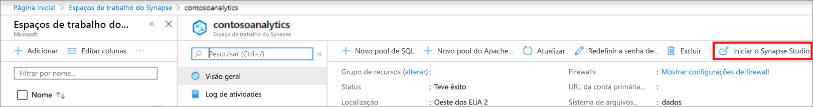
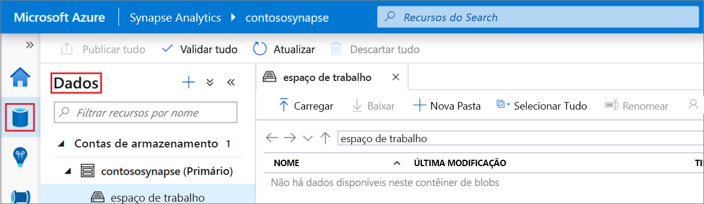
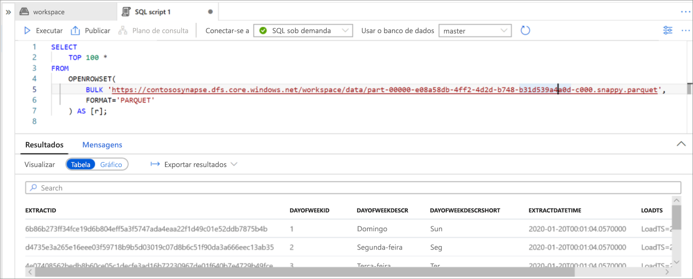

# Início Rápido: Usando o Synapse Studio (versão prévia)

Neste guia de início rápido, você aprenderá a consultar arquivos usando o Synapse Studio.

Se você não tiver uma assinatura do Azure, crie uma conta [gratuita](https://azure.microsoft.com/free/) antes de começar.

## Entre no Portal do Azure

Entre no [portal do Azure](https://portal.azure.com/).

## Pré-requisitos

[Criar um workspace do Azure Synapse e a conta de armazenamento associada](quickstart-create-workspace.md).

## Iniciar o Synapse Studio

No workspace do Azure Synapse, no portal do Azure, clique em **Iniciar o Synapse Studio**.

Como alternativa, você pode iniciar o Synapse Studio clicando em [Azure Synapse Analytics](https://web.azuresynapse.net) e fornecendo os valores corretos de locatário, assinatura e workspace.

## Procurar contas de armazenamento

Depois de abrir o Synapse Studio, navegue até **Dados** e, em seguida, expanda **Contas de armazenamento** para ver a conta de armazenamento no workspace.

Você pode criar pastas e carregar arquivos usando os links na barra de ferramentas para organizar seus arquivos.

## Consultar arquivos na conta de armazenamento

> [!IMPORTANT]
> Você precisa ser um membro da função `Storage Blob Reader` no armazenamento subjacente para poder consultar os arquivos. Saiba como [atribuir as permissões RBAC **Leitor de Dados do Blob de Armazenamento** ou **Colaborador de Dados do Blob de Armazenamento** no Armazenamento do Azure](../storage/common/storage-auth-aad-rbac-portal.md?toc=/azure/synapse-analytics/toc.json&bc=/azure/synapse-analytics/breadcrumb/toc.json#assign-a-built-in-rbac-role).

1. Carregue alguns arquivos `PARQUET`.
2. Selecione um ou mais arquivos e, em seguida, crie um script SQL ou um notebook Spark para ver o conteúdo dos arquivos. Se você quiser criar um notebook, precisará criar um [Pool do Apache Spark no workspace](spark/apache-spark-notebook-create-spark-use-sql.md).

   

3. Execute a consulta ou o notebook gerado para ver o conteúdo do arquivo:

   

4. Você pode alterar a consulta para filtrar e classificar os resultados. Encontre os recursos de linguagem que estão disponíveis no SQL sob demanda em [Visão geral dos recursos do SQL](sql/overview-features.md).

## Próximas etapas

- Permitir que os usuários do Azure AD consultem arquivos [atribuindo as permissões RBAC **Leitor de Dados do Blob de Armazenamento** ou **Colaborador de Dados do Blob de Armazenamento** no Armazenamento do Azure](../storage/common/storage-auth-aad-rbac-portal.md?toc=/azure/synapse-analytics/toc.json&bc=/azure/synapse-analytics/breadcrumb/toc.json#assign-a-built-in-rbac-role)
- [Consultar arquivos no Armazenamento do Azure usando o SQL sob demanda](sql/on-demand-workspace-overview.md)
- [Criar Pool do Apache Spark](spark/apache-spark-notebook-create-spark-use-sql.md)
- [Criar relatório do Power BI em arquivos armazenados no armazenamento do Azure](sql/tutorial-connect-power-bi-desktop.md)
