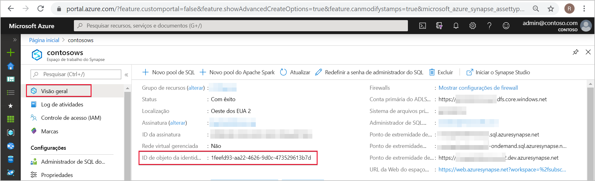
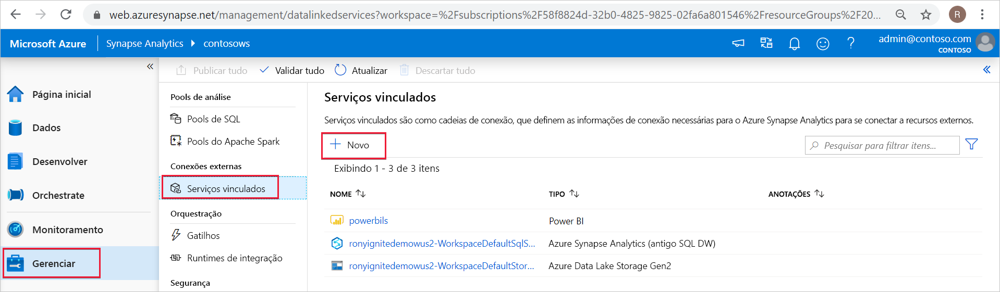
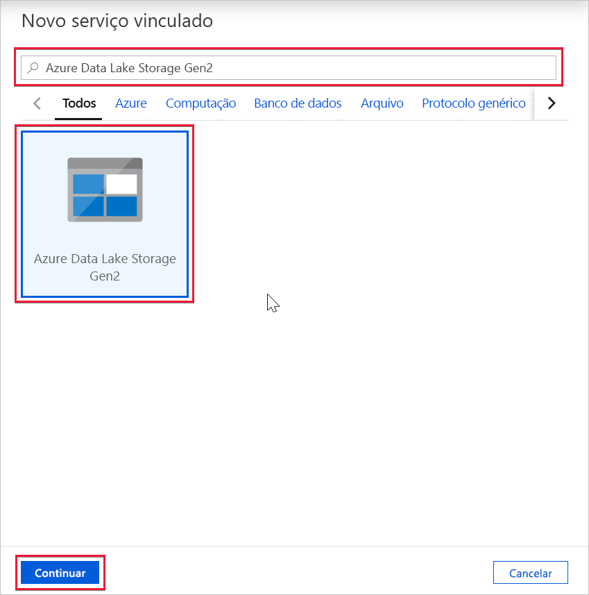
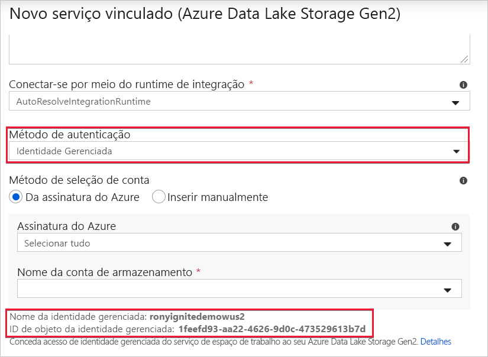

# Identidade gerenciada do workspace do Azure Synapse

Neste artigo, você aprenderá sobre a identidade gerenciada no workspace do Azure Synapse.

## Identidades gerenciadas

Identidade gerenciada para recursos do Azure é um recurso do Azure Active Directory. O recurso oferece aos serviços do Azure uma identidade gerenciada automaticamente no Azure AD. Você pode usar a funcionalidade de identidade gerenciada para autenticar em qualquer serviço que dê suporte à autenticação do Azure AD.

Identidades gerenciadas para recursos do Azure é o novo nome para o serviço anteriormente conhecido como MSI (Identidade de Serviço Gerenciada). Confira [Identidades gerenciadas](../../active-directory/managed-identities-azure-resources/overview.md) para saber mais.

## Identidade gerenciada do workspace do Azure Synapse

Uma identidade gerenciada atribuída pelo sistema é criada para seu workspace do Azure Synapse quando você cria o workspace.

>[!NOTE]
>Essa identidade gerenciada do workspace será referida como identidade gerenciada no restante deste documento.

O Azure Synapse usa a identidade gerenciada para integrar pipelines. Azure SynapseO ciclo de vida de identidade gerenciada está diretamente vinculado ao workspace do Azure Synapse. Se você excluir o workspace do Azure Synapse, a identidade gerenciada também será limpa.

A identidade gerenciada do workspace precisa de permissões para executar operações nos pipelines. Você pode usar a ID do objeto ou o nome do workspace do Azure Synapse para localizar a identidade gerenciada ao conceder permissões.

## Recuperar a identidade gerenciada no portal do Azure

Você pode recuperar a identidade gerenciada no portal do Azure. Abra o workspace do Azure Synapse no portal do Azure e selecione **Visão geral** no painel de navegação esquerdo. A ID de objeto da identidade gerenciada é exibida na tela principal.

As informações de identidade gerenciada também serão exibidas quando você criar um serviço vinculado que dê suporte à autenticação de identidade gerenciada do Azure Synapse Studio.

Inicie o **Azure Synapse Studio** e selecione a guia **Gerenciar** no painel de navegação esquerdo. Em seguida, selecione **Serviços vinculados** e escolha a opção **+ Novo** para criar um serviço vinculado.

Na janela **Novo serviço vinculado**, digite *Azure Data Lake Storage Gen2*. Selecione o tipo de recurso **Azure Data Lake Storage Gen2** na lista abaixo e escolha **Continuar**.

Na próxima janela, escolha **Identidade Gerenciada** para **Método de autenticação**. Você verá o **Nome** e a **ID do Objeto** da identidade gerenciada.

## Próximas etapas

Saiba mais sobre [Como conceder permissões para a identidade gerenciada do workspace do Azure Synapse](./how-to-grant-workspace-managed-identity-permissions.md)
