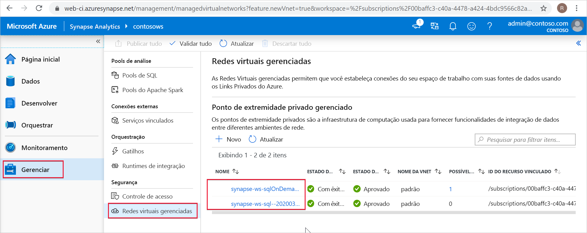

# Pontos de extremidade privados gerenciados do Azure Synapse

Este artigo explicará os Pontos de extremidade privados gerenciados no Azure Synapse Analytics.

## Pontos de extremidade privados gerenciados

Pontos de extremidade privados gerenciados são pontos de extremidade privados criados em uma rede virtual gerenciada associada ao seu workspace do Azure Synapse. Pontos de extremidade privados gerenciados estabelecem um link privado para recursos do Azure. O Azure Synapse gerencia para você esses pontos de extremidade privados. Você pode criar pontos de extremidade privados gerenciados de seu workspace do Azure Synapse para acessar os serviços do Azure (como o Armazenamento do Azure ou o Azure Cosmos DB) e os serviços hospedados de cliente/parceiro do Azure.

Quando você usa pontos de extremidade privados gerenciados, o tráfego entre o workspace do Azure Synapse e outros recursos do Azure cruzam totalmente a rede de backbone da Microsoft. Os pontos de extremidade privados gerenciados protegem contra exfiltração dos dados. Um ponto de extremidade privado gerenciado usa o endereço IP privado de sua rede virtual gerenciada para efetivamente levar para sua rede virtual o serviço do Azure que seu workspace do Azure Synapse está comunicando. Os pontos de extremidade privados gerenciados são mapeados para um recurso específico no Azure e não para todo o serviço. Os clientes podem limitar a conectividade a um recurso específico aprovado por sua organização. 

Saiba mais sobre [links privados e pontos de extremidade privados](../../private-link/index.yml).

>[!IMPORTANT]
>Os Pontos de extremidade privados gerenciados só são compatíveis com workspaces do Azure Synapse com uma Rede Virtual de workspace gerenciada.

>[!NOTE]
>Ao criar um workspace do Azure Synapse, você pode optar por associar uma rede virtual gerenciada a ele. Se você optar por associar uma Rede Virtual Gerenciada ao seu workspace, também poderá optar por limitar o tráfego de saída do workspace a apenas os destinos aprovados. Você deve criar pontos de extremidade privados gerenciados para esses destinos. 

Uma conexão de ponto de extremidade privado é criada em um estado "Pendente" quando você cria um Ponto de extremidade privado gerenciado no Azure Synapse. Um fluxo de trabalho de aprovação é iniciado. O proprietário do recurso de link privado é responsável por aprovar ou rejeitar a conexão. Se o proprietário aprova a conexão, o link privado é estabelecido. No entanto, se o proprietário não aprovar a conexão, o link privado não será estabelecido. Em ambos os casos, o Ponto de extremidade privado gerenciado será atualizado com o status da conexão. Somente um ponto de extremidade privado gerenciado em um estado aprovado pode ser usado para enviar tráfego para o recurso de link privado vinculado ao ponto de extremidade privado gerenciado.

## Pontos de extremidade privados gerenciados do pool de SQL dedicado e do pool de SQL sem servidor

O pool de SQL dedicado e o pool de SQL sem servidor são funcionalidades analíticas no workspace do Azure Synapse. Esses recursos usam a infraestrutura multilocatário que não é implantada na [Rede Virtual de workspace gerenciada](./synapse-workspace-managed-vnet.md).

Quando um workspace é criado, o Azure Synapse cria dois Pontos de extremidade privados gerenciados no workspace, um para o pool de SQL dedicado e um para o pool de SQL sem servidor. 

Esses dois Pontos de extremidade privados gerenciados são listados no Synapse Studio. Selecione **Gerenciar** no painel de navegação esquerdo e escolha **Pontos de extremidade privados gerenciados** para vê-los no Studio.

O Ponto de extremidade privado gerenciado que tem como destino o pool de SQL é chamado de *synapse-ws-sql--\<workspacename\>* e aquele que se destina ao pool de SQL sem servidor é chamado de *synapse-ws-sqlOnDemand--\<workspacename\>* .

Esses dois Pontos de extremidade privados gerenciados são criados automaticamente para você quando você cria seu workspace do Azure Synapse. Você não é cobrado por esses dois Pontos de extremidade privados gerenciados.

## Próximas etapas

Para saber mais, confira o artigo [Criar pontos de extremidade privados gerenciados para suas fontes de dados](./how-to-create-managed-private-endpoints.md).