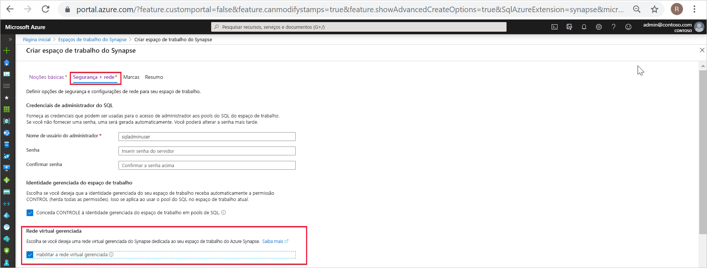
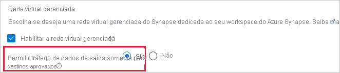
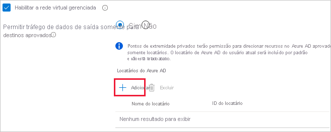
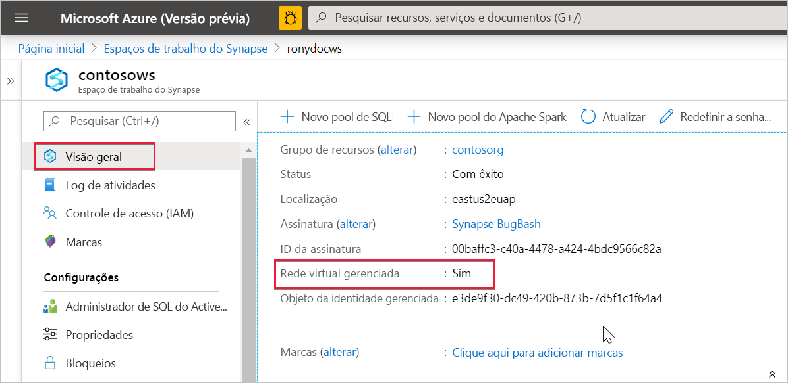

# Rede virtual gerenciada do Azure Synapse Analytics

Este artigo explicará a Rede Virtual Gerenciada no Azure Synapse Analytics.

## Rede Virtual do workspace gerenciada

Ao criar seu workspace do Azure Synapse, você pode optar por associá-lo a uma Rede Virtual do Microsoft Azure. A Rede Virtual associada ao seu workspace é gerenciada pelo Azure Synapse. Essa Rede Virtual é chamada de *Rede Virtual do workspace gerenciada*.

A Rede Virtual de workspace gerenciada oferece vantagens de quatro maneiras:

- Com uma Rede Virtual de workspace gerenciada, você pode facilitar o gerenciamento da Rede Virtual para o Azure Synapse.
- Você não precisa configurar regras de NSG de entrada em suas Redes Virtuais para permitir que o tráfego de gerenciamento do Azure Synapse entre em sua Rede Virtual. A configuração incorreta dessas regras de NSG causa a interrupção do serviço para os clientes.
- Você não precisa criar uma sub-rede para seus clusters Spark com base na carga de pico.
- A Rede Virtual de workspace gerenciada juntamente com Pontos de extremidade privados gerenciados protege contra exfiltração dos dados. Você só pode criar Pontos de extremidade privados gerenciados em um workspace que tenha uma Rede Virtual de workspace gerenciada associada a ele.

A criação de um workspace com uma Rede Virtual de workspace gerenciada associada a ele garante que seu workspace seja isolado de outros na rede. O Azure Synapse oferece vários recursos de análise em um workspace: Integração de dados, Pool do Apache Spark sem servidor, pool de SQL dedicado e pool de SQL sem servidor.

Se o workspace tiver uma Rede Virtual de workspace gerenciada, a Integração de dados e os recursos do Spark serão implantados nele. Uma Rede Virtual de workspace gerenciada também fornece isolamento de nível de usuário para atividades do Spark porque cada cluster Spark fica em uma sub-rede própria.

O pool de SQL dedicado e o pool de SQL sem servidor são funcionalidades multilocatários e, portanto, residem fora da Rede Virtual de workspace gerenciada. Comunicação entre workspaces com o pool de SQL dedicado e o pool de SQL sem servidor usam links privados do Azure. Esses links privados são criados automaticamente para você quando você cria um workspace com uma Rede Virtual de workspace gerenciada associada a ele.

>[!IMPORTANT]
>Você não pode alterar essa configuração do workspace depois que ele é criado. Por exemplo, você não pode reconfigurar um workspace que não tenha uma Rede Virtual de workspace gerenciada associada a ela e associar uma Rede Virtual a ele. Da mesma forma, você não pode reconfigurar um workspace com uma Rede Virtual de workspace gerenciada associada a ele e desassociar a Rede Virtual dele.

## Criar um workspace do Azure Synapse com uma Rede Virtual de workspace gerenciada

Registre o provedor de recursos de rede, caso ainda não tenha feito isso. O registro de um provedor de recursos configura sua assinatura para trabalhar com o provedor de recursos. Escolha *Microsoft.Network* na lista de provedores de recursos ao se [registrar](../../azure-resource-manager/management/resource-providers-and-types.md).

Para criar um workspace do Azure Synapse que tenha uma Rede Virtual de workspace gerenciada associada a ele, selecione a guia **Rede** no portal do Azure e marque a caixa de seleção **Habilitar rede virtual gerenciada**.

Se você deixar a caixa de seleção desmarcada, o workspace não terá uma Rede Virtual associada a ela.

>[!IMPORTANT]
>Você só pode usar links privados em um workspace que tenha uma Rede Virtual de workspace gerenciada.

Depois de optar por associar uma Rede Virtual do workspace gerenciado ao seu workspace, você pote fornecer proteção contra a exfiltração dos dados permitindo a conectividade de saída da Rede Virtual do workspace gerenciado somente para destinos aprovados usando os [Pontos de extremidade privados gerenciados](./synapse-workspace-managed-private-endpoints.md). Selecione **Sim** para limitar o tráfego de saída da Rede Virtual do workspace gerenciado a destinos por meio de pontos de extremidade privados gerenciados. 

>[!IMPORTANT]
>O metastore está desabilitado em workspaces do Azure Synapse que têm uma Rede Virtual Gerenciada com proteção contra a exfiltração dos dados habilitada. Você não poderá usar o SQL Spark nesses workspaces.

Selecione **Não** para permitir o tráfego de saída do workspace para qualquer destino.

Você também pode controlar os destinos para os quais os pontos de extremidade privados gerenciados são criados no workspace do Azure Synapse. Por padrão, são permitidos os pontos de extremidade privados gerenciados para recursos no mesmo locatário do AAD ao qual sua assinatura pertence. Se desejar criar um ponto de extremidade privado gerenciado para um recurso em um locatário do AAD diferente daquele ao qual sua assinatura pertence, poderá adicionar esse locatário do AAD selecionando **+ Adicionar**. Você pode selecionar o locatário do AAD na lista suspensa ou inserir manualmente a ID do locatário do AAD.

Depois que o workspace é criado, você pode verificar se o workspace do Azure Synapse está associado a uma Rede Virtual de workspace gerenciada selecionando **Visão geral** no portal do Azure.

## Próximas etapas

Criar um [Workspace do Azure Synapse](../quickstart-create-workspace.md)

Saiba mais sobre [Pontos de extremidade privados gerenciados](./synapse-workspace-managed-private-endpoints.md)

[Criar Pontos de extremidade privados gerenciados para suas fontes de dados](./how-to-create-managed-private-endpoints.md)
