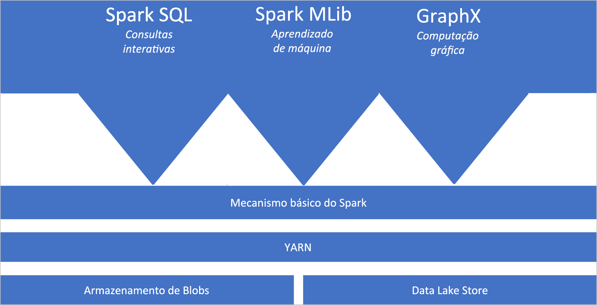
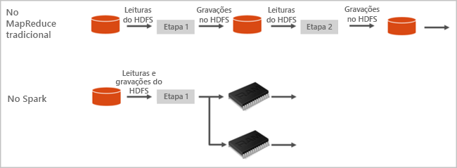

# Apache Spark no Azure Synapse Analytics

O Apache Spark é uma estrutura de processamento paralelo que dá suporte ao processamento na memória para melhorar o desempenho de aplicativos de análise de Big Data. O Apache Spark no Azure Synapse Analytics é uma das implementações da Microsoft do Apache Spark na nuvem. O Azure Synapse facilita a criação e a configuração de um Pool do Apache Spark sem servidor no Azure. Os Pools do Spark no Azure Synapse são compatíveis com o Armazenamento do Azure e o Azure Data Lake Generation 2 Storage. Portanto, você pode usar Pools do Spark para processar os dados armazenados no Azure.

## O que é o Apache Spark

O Apache Spark oferece primitivos para computação de cluster na memória. Um trabalho do Spark pode carregar e armazenar dados em cache na memória e consultá-los várias vezes. A computação na memória é muito mais rápida do que os aplicativos baseados em disco. O Spark também se integra a diversas linguagens de programação para permitir a manipulação de conjuntos de dados distribuídos como coleções locais. Não é necessário para estruturar tudo como operações de mapeamento e redução.

Os Pools do Spark no Azure Synapse oferecem um serviço do Spark totalmente gerenciado. Os benefícios da criação de um Pool do Spark no Azure Synapse Analytics estão listados aqui.

| Recurso | Descrição |
| --- | --- |
| Velocidade e eficiência |As instâncias do Spark se iniciam em aproximadamente 2 minutos para menos de 60 nós e em aproximadamente 5 minutos para mais de 60 nós. A instância é desligada, por padrão, 5 minutos após a última execução de trabalho, a menos que seja mantida ativa por uma conexão de notebook. |
| Fácil de criar |Você pode criar um Pool do Spark no Azure Synapse em minutos usando o portal do Azure, o Azure PowerShell ou o SDK do .NET do Synapse Analytics. Confira [Introdução aos pools do Spark no Azure Synapse Analytics](../quickstart-create-apache-spark-pool-studio.md). |
| Fácil de uso |O Synapse Analytics inclui um notebook personalizado derivado do [Nteract](https://nteract.io/). Você pode usar esses blocos de anotações para processar e visualizar dados interativamente.|
| APIs REST |O Spark no Azure Synapse Analytics inclui o [Apache Livy](https://github.com/cloudera/hue/tree/master/apps/spark/java#welcome-to-livy-the-rest-spark-server), um servidor de trabalho do Spark baseado em API REST para enviar e monitorar trabalhos remotamente. |
| Suporte ao Azure Data Lake Storage Generation 2| Os Pools do Spark no Azure Synapse podem usar o Azure Data Lake Storage Generation 2, bem como o Armazenamento de Blobs. Para obter mais informações sobre o Data Lake Storage, confira [Visão geral do Azure Data Lake Storage](../../data-lake-store/data-lake-store-overview.md). |
| Integração com IDEs de terceiros | O Azure Synapse fornece um plug-in de IDE para o [JetBrains' IntelliJ IDEA](https://www.jetbrains.com/idea/) que é útil para criar e enviar aplicativos para um Pool do Spark. |
| Bibliotecas Anaconda pré-carregadas |Os Pools do Spark no Azure Synapse vêm com bibliotecas Anaconda pré-instaladas. [Anaconda](https://docs.continuum.io/anaconda/) fornece quase 200 bibliotecas de aprendizado de máquina, análise de dados, visualização, etc. |
| Escalabilidade | O Apache Spark nos pools do Azure Synapse pode ter o dimensionamento automático habilitado, de modo que os pools sejam escalados pela adição ou pela remoção de nós, conforme necessário. Além disso, os Pools do Spark podem ser desligados sem perda de dados, pois todos os dados ficam armazenados no Armazenamento do Azure ou no Data Lake Storage. |

Os Pools do Spark no Azure Synapse incluem os componentes a seguir que estão disponíveis nos pools por padrão.

- [Núcleo do Spark](https://spark.apache.org/docs/2.4.5/). Inclui Spark Core, Spark SQL, GraphX e MLlib.
- [Anaconda](https://docs.continuum.io/anaconda/)
- [Apache Livy](https://github.com/cloudera/hue/tree/master/apps/spark/java#welcome-to-livy-the-rest-spark-server)
- [Notebook Nteract](https://nteract.io/)

## Arquitetura do Pool do Spark

É fácil entender os componentes do Spark compreendendo como o Spark funciona no Azure Synapse Analytics.

Os aplicativos Spark são executados como conjuntos independentes de processos em um pool, coordenados pelo objeto SparkContext em seu programa principal (chamado de programa de driver).

O SparkContext pode se conectar ao gerenciador de cluster, que aloca recursos entre aplicativos. O gerenciador de cluster é o [YARN do Apache Hadoop](https://hadoop.apache.org/docs/current/hadoop-yarn/hadoop-yarn-site/YARN.html). Após a conexão, o Spark adquire executores em nós no pool, que são processos que executam cálculos e armazenam dados para o seu aplicativo. Em seguida, ele envia o código do seu aplicativo (definido pelos arquivos JAR ou Python passados ao SparkContext) para os executores. Por fim, o SparkContext envia tarefas para serem realizadas pelos executores.

O SparkContext executa a função principal do usuário e as várias operações paralelas nos nós. Em seguida, o SparkContext coleta os resultados das operações. Os nós leem e gravam dados do sistema de arquivos. Os nós também armazenam dados transformados na memória em cache como RDDs (Conjuntos de Dados Distribuídos Resilientes).

O SparkContext se conecta ao Pool do Spark e é responsável por converter um aplicativo em um DAG (grafo direcionado acíclico). O grafo consiste em tarefas individuais que são executadas dentro de um processo de executor nos nós. Cada aplicativo obtém seus próprios processos de executor, que se mantêm pela duração do aplicativo e executa tarefas em vários threads.

## Casos de uso do Apache Spark no Azure Synapse Analytics

Os pools do Spark no Azure Synapse Analytics permitem os seguintes cenários principais:

### Engenharia de Dados/Preparação de Dados

O Apache Spark inclui muitos recursos de linguagem para dar suporte à preparação e ao processamento de grandes volumes de dados, tornando-os mais valiosos e para serem consumidos por outros serviços no Azure Synapse Analytics. Isso é possibilitado por meio das várias linguagens (C#, Scala, PySpark, Spark SQL) e bibliotecas fornecidas para processamento e conectividade.

### Machine Learning

O Apache Spark vem com a [MLlib](https://spark.apache.org/mllib/), uma biblioteca de machine learning criada com base no Spark que pode ser usada em um Pool do Spark no Azure Synapse Analytics. Os pools do Spark no Azure Synapse Analytics também incluem o Anaconda, uma distribuição do Python com uma variedade de pacotes para ciência de dados, incluindo machine learning. Quando combinado com o suporte interno para notebooks, você tem um ambiente para criação de aplicativos de aprendizado de máquina.

## Por onde começar

Use os seguintes artigos para saber mais sobre o Apache Spark no Azure Synapse Analytics:

- [Início Rápido: Criar um Pool do Spark no Azure Synapse](../quickstart-create-apache-spark-pool-portal.md)
- [Início Rápido: Criar um notebook do Apache Spark](../quickstart-apache-spark-notebook.md)
- [Tutorial: Aprendizado de máquina usando Apache Spark](./apache-spark-machine-learning-mllib-notebook.md)
- [Documentação oficial do Apache Spark](https://spark.apache.org/docs/2.4.5/)

> [!NOTE]
> Algumas das documentações oficiais do Apache Spark dependem do uso do console do Spark, que não está disponível no Spark do Azure Synapse; portanto, use as experiências do notebook ou do IntelliJ

## Próximas etapas

Nesta visão geral, você obtém uma noção básica do Apache no Azure Synapse Analytics. Avance para o próximo artigo para saber como criar um Pool do Spark no Azure Synapse Analytics:

- [Criar um Pool do Spark no Azure Synapse](../quickstart-create-apache-spark-pool-portal.md)
