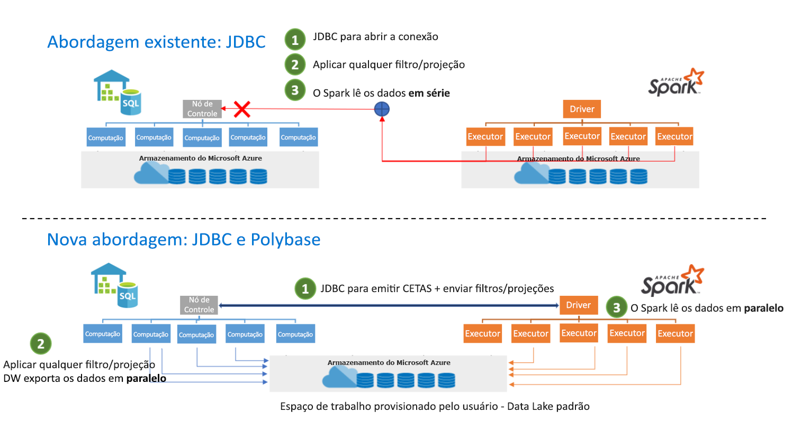

# <a name="introduction"></a>Introdução

O conector do Apache Spark para SQL do Synapse do Azure Synapse foi projetado para transferir dados de maneira eficiente entre os pools do Apache Spark sem servidor e os pools de SQL dedicados no Azure Synapse. O conector do Apache Spark para SQL do Synapse do Azure Synapse funciona somente em pools de SQL dedicados – e não funciona com o pool de SQL sem servidor.

> [!WARNING]
> O nome da função **sqlanalytics()** foi alterado para **synapsesql()** . A função sqlanalytics continuará a funcionar, mas será preterida.  Altere qualquer referência de **sqlanalytics()** para **synapsesql()** para evitar qualquer interrupção no futuro.

## <a name="design"></a>Design

A transferência de dados entre pools do Spark e pools de SQL pode ser feita usando o JDBC. No entanto, considerando dois sistemas distribuídos, como os pools do Spark e de SQL, o JDBC tende a ser um gargalo com a transferência de dados seriais.

O conector do pool do Apache Spark para SQL do Synapse do Azure Synapse é uma implementação de fonte de dados para o Apache Spark. Ele usa o Azure Data Lake Storage Gen2 e o PolyBase em pools de SQL dedicados para transferir dados com eficiência entre o cluster do Spark e a instância SQL dedicada do Azure Synapse.



## <a name="authentication-in-azure-synapse-analytics"></a>Autenticação no Azure Synapse Analytics

A autenticação entre sistemas é simplificada no Azure Synapse Analytics. O Serviço de Token se conecta ao Azure Active Directory a fim de obter tokens de segurança para uso ao acessar a conta de armazenamento ou o servidor de data warehouse.

Por esse motivo, não há necessidade de criar nem de especificar credenciais na API do conector, contanto que a Autenticação do Azure AD esteja configurada na conta de armazenamento e no servidor de data warehouse. Caso contrário, a Autenticação SQL poderá ser especificada. Encontre mais detalhes na seção [Uso](#usage).

## <a name="constraints"></a>Restrições

- Esse conector funciona apenas no Scala.
- Para pySpark, confira os detalhes na seção [Usar o Python](#use-pyspark-with-the-connector).
- Este Conector não dá suporte à consulta de Exibições do SQL.

## <a name="prerequisites"></a>Pré-requisitos

- Deve ser um membro da função **db_exporter** no banco de dados/no pool de SQL no qual você deseja transferir os dados.
- Deve ser um membro da função de Colaborador de Dados de Blob de Armazenamento na conta de armazenamento padrão.

Para criar usuários, conecte-se ao banco de dados do pool de SQL e siga estes exemplos:

```sql
--SQL User
CREATE USER Mary FROM LOGIN Mary;

--Azure Active Directory User
CREATE USER [mike@contoso.com] FROM EXTERNAL PROVIDER;
```

Para atribuir uma função:

```sql
--SQL User
EXEC sp_addrolemember 'db_exporter', 'Mary';

--Azure Active Directory User
EXEC sp_addrolemember 'db_exporter',[mike@contoso.com]
```

## <a name="usage"></a>Uso

As instruções de importação não são obrigatórias, elas são pré-importadas para a experiência de notebook.

### <a name="transfer-data-to-or-from-a-dedicated-sql-pool-attached-within-the-workspace"></a>Transferir dados de/para um pool de SQL dedicado anexado dentro do workspace

> [!NOTE]
> **Importações não necessárias na experiência do notebook**

```scala
 import com.microsoft.spark.sqlanalytics.utils.Constants
 import org.apache.spark.sql.SqlAnalyticsConnector._
```

#### <a name="read-api"></a>API de leitura

```scala
val df = spark.read.synapsesql("<DBName>.<Schema>.<TableName>")
```

A API acima funcionará em tabelas internas (gerenciadas) e externas no pool de SQL.

#### <a name="write-api"></a>API de gravação

```scala
df.write.synapsesql("<DBName>.<Schema>.<TableName>", <TableType>)
```

A API de gravação cria a tabela no pool de SQL dedicado e invoca o Polybase para carregar os dados.  A tabela não deve existir no pool de SQL dedicado ou será retornado um erro informando que "Já existe um objeto chamado…"

Valores de TableType

- Constants.INTERNAL – Tabela gerenciada no pool de SQL dedicado
- Constants.EXTERNAL – Tabela externa no pool de SQL dedicado

Tabela gerenciada pelo pool de SQL

```scala
df.write.synapsesql("<DBName>.<Schema>.<TableName>", Constants.INTERNAL)
```

Tabela externa do pool de SQL

Para gravar em uma tabela externa do pool de SQL dedicado, uma FONTE DE DADOS EXTERNA e um FORMATO DE ARQUIVO EXTERNO devem existir no pool de SQL dedicado.  Para obter mais informações, leia [Como criar uma fonte de dados externa](/sql/t-sql/statements/create-external-data-source-transact-sql?view=azure-sqldw-latest&preserve-view=true) e [Formatos de arquivo externos](/sql/t-sql/statements/create-external-file-format-transact-sql?view=azure-sqldw-latest&preserve-view=true) no pool de SQL dedicado.  Veja abaixo exemplos de como criar uma fonte de dados externa e formatos de arquivo externos no pool de SQL dedicado.

```sql
--For an external table, you need to pre-create the data source and file format in dedicated SQL pool using SQL queries:
CREATE EXTERNAL DATA SOURCE <DataSourceName>
WITH
  ( LOCATION = 'abfss://...' ,
    TYPE = HADOOP
  ) ;

CREATE EXTERNAL FILE FORMAT <FileFormatName>
WITH (  
    FORMAT_TYPE = PARQUET,  
    DATA_COMPRESSION = 'org.apache.hadoop.io.compress.SnappyCodec'  
);
```

Não é necessário um objeto EXTERNAL CREDENTIAL ao usar a autenticação de passagem do Azure Active Directory para a conta de armazenamento.  Você deve ser um membro da função "Colaborador de dados de blobs de armazenamento" na conta de armazenamento.

```scala

df.write.
    option(Constants.DATA_SOURCE, <DataSourceName>).
    option(Constants.FILE_FORMAT, <FileFormatName>).
    synapsesql("<DBName>.<Schema>.<TableName>", Constants.EXTERNAL)

```

### <a name="transfer-data-to-or-from-a-dedicated-sql-pool-or-database-outside-the-workspace"></a>Transferir dados de/para um pool de SQL dedicado ou um banco de dados fora do workspace

> [!NOTE]
> Importações não necessárias na experiência do notebook

```scala
 import com.microsoft.spark.sqlanalytics.utils.Constants
 import org.apache.spark.sql.SqlAnalyticsConnector._
```

#### <a name="read-api"></a>API de leitura

```scala
val df = spark.read.
option(Constants.SERVER, "samplews.database.windows.net").
synapsesql("<DBName>.<Schema>.<TableName>")
```

#### <a name="write-api"></a>API de gravação

```scala
df.write.
option(Constants.SERVER, "samplews.database.windows.net").
synapsesql("<DBName>.<Schema>.<TableName>", <TableType>)
```

### <a name="use-sql-auth-instead-of-azure-ad"></a>Usar a Autenticação do SQL em vez do Azure AD

#### <a name="read-api"></a>API de leitura

Atualmente, o conector não é compatível com a autenticação baseada em token em um pool de SQL dedicado que esteja fora do workspace. Você precisará usar a Autenticação SQL.

```scala
val df = spark.read.
option(Constants.SERVER, "samplews.database.windows.net").
option(Constants.USER, <SQLServer Login UserName>).
option(Constants.PASSWORD, <SQLServer Login Password>).
synapsesql("<DBName>.<Schema>.<TableName>")
```

#### <a name="write-api"></a>API de gravação

```scala
df.write.
option(Constants.SERVER, "samplews.database.windows.net").
option(Constants.USER, <SQLServer Login UserName>).
option(Constants.PASSWORD, <SQLServer Login Password>).
synapsesql("<DBName>.<Schema>.<TableName>", <TableType>)
```

### <a name="use-pyspark-with-the-connector"></a>Usar o PySpark com o conector

> [!NOTE]
> Este exemplo é fornecido apenas com a experiência de notebook mantida em mente.

Suponha que você tenha um dataframe "pyspark_df" que deseje gravar no DW.

Crie uma tabela temporária usando o dataframe no PySpark:

```py
pyspark_df.createOrReplaceTempView("pysparkdftemptable")
```

Execute uma célula do Scala no notebook do PySpark usando magics:

```scala
%%spark
val scala_df = spark.sqlContext.sql ("select * from pysparkdftemptable")

scala_df.write.synapsesql("sqlpool.dbo.PySparkTable", Constants.INTERNAL)
```

Da mesma forma, no cenário de leitura, leia os dados usando o Scala, grave-os em uma tabela temporária e use o SQL do Spark no PySpark para consultar a tabela temporária em um dataframe.

## <a name="allow-other-users-to-use-the-azure-synapse-apache-spark-to-synapse-sql-connector-in-your-workspace"></a>Permitir que outros usuários usem o conector do Apache Spark para SQL do Synapse do Azure Synapse em seu workspace

Você precisa ser Proprietário de Dados do Blob de Armazenamento na conta de armazenamento do ADLS Gen2 conectada ao workspace para alterar permissões ausentes para outras pessoas. Verifique se o usuário tem acesso ao workspace e às permissões para executar notebooks.

### <a name="option-1"></a>Opção 1

- Tornar o usuário um Colaborador/Proprietário de Dados do Blob de Armazenamento

### <a name="option-2"></a>Opção 2

- Especificar as seguintes ACLs na estrutura de pastas:

| Pasta | / | synapse | workspaces  | \<workspacename> | sparkpools | \<sparkpoolname>  | sparkpoolinstances  |
|--|--|--|--|--|--|--|--|
| Permissões de acesso | --X | --X | --X | --X | --X | --X | -WX |
| Permissões padrão | ---| ---| ---| ---| ---| ---| ---|

- Você deve ser capaz de usar a ACL em todas as pastas de "synapse" para baixo no portal do Azure. Para usar a ACL na pasta raiz "/", siga as instruções abaixo.

- Conectar-se à conta de armazenamento conectada ao workspace do Gerenciador de Armazenamento usando o Azure AD
- Selecione sua Conta e forneça a URL do ADLS Gen2 e o sistema de arquivos padrão para o workspace
- Quando vir a conta de armazenamento listada, clique com o botão direito do mouse no workspace da lista e selecione "Gerenciar Acesso"
- Adicione o Usuário à pasta / com a permissão de acesso "Executar". Selecione "Ok"

> [!IMPORTANT]
> Não selecione "Padrão" se não pretende fazer isso.


## <a name="next-steps"></a>Próximas etapas

- [Criar um pool de SQL dedicado usando o portal do Azure](../../synapse-analytics/quickstart-create-apache-spark-pool-portal.md)
- [Criar um pool do Apache Spark usando o portal do Azure](../../synapse-analytics/quickstart-create-apache-spark-pool-portal.md) 
