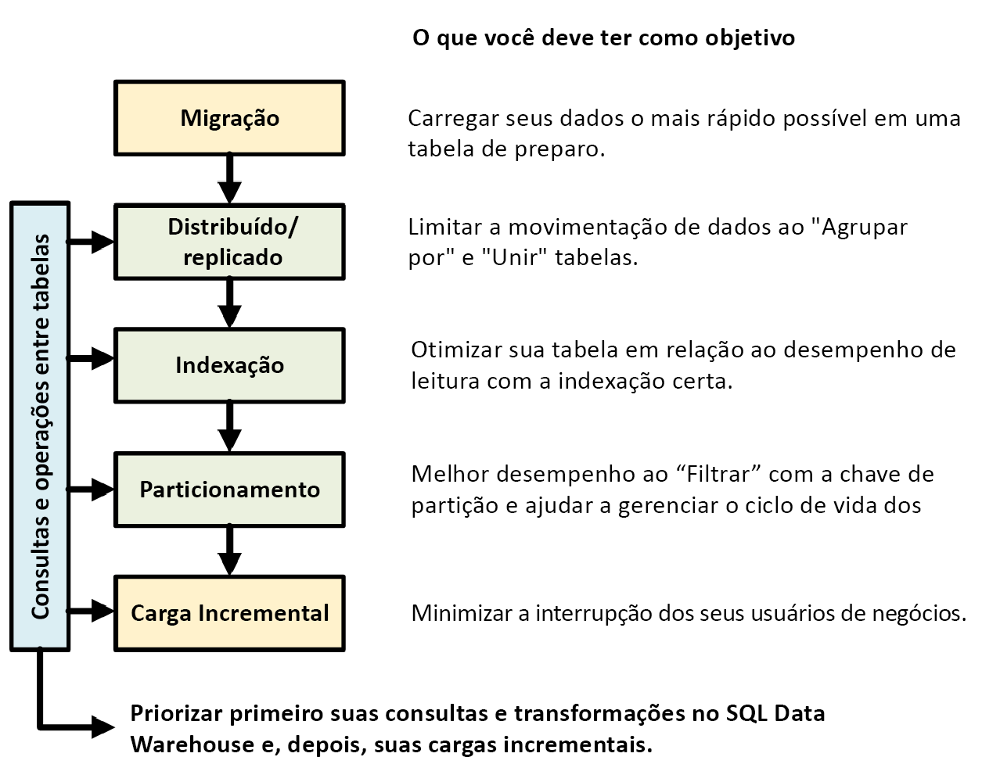

# Roteiro para o pool de SQL dedicado (antigo SQL DW) no Azure Synapse Analytics

Este roteiro fornece dicas úteis e melhores práticas para a criação de soluções de pool de SQL dedicado (antigo SQL DW).

O seguinte gráfico mostra o processo de criação de um data warehouse com um pool de SQL dedicado (antigo SQL DW):

## Consultas e operações entre tabelas

Ao conhecer antecipadamente as principais operações e consultas a serem executadas no seu data warehouse, você poderá priorizar sua arquitetura de data warehouse para essas operações. Essas consultas e operações podem incluir:

* Junção de uma ou duas tabelas de fatos com tabelas de dimensão, filtragem de tabela combinada e, em seguida, acrescentar os resultados em um data mart.
* Fazer atualizações grandes ou pequenas em suas vendas de fato.
* Acrescentar apenas os dados às tabelas.

Saber os tipos de operações antecipadamente ajuda-o a otimizar o design de suas tabelas.

## Migração de dados

Primeiro, carregue seus dados no [Azure Data Lake Storage](../../data-factory/connector-azure-data-lake-store.md?toc=/azure/synapse-analytics/sql-data-warehouse/toc.json&bc=/azure/synapse-analytics/sql-data-warehouse/breadcrumb/toc.json) ou no Armazenamento de Blobs do Azure. Em seguida, use a [instrução COPY](/sql/t-sql/statements/copy-into-transact-sql?toc=/azure/synapse-analytics/sql-data-warehouse/toc.json&bc=/azure/synapse-analytics/sql-data-warehouse/breadcrumb/toc.json&view=azure-sqldw-latest&preserve-view=true) para carregar os dados em tabelas de preparo. Use a seguinte configuração:

| Design | Recomendação |
|:--- |:--- |
| Distribuição | Round Robin |
| Indexação | Pilha |
| Particionamento | Nenhum |
| Classe de recurso | largerc ou xlargerc |

Saiba mais sobre [migração de dados](/archive/blogs/sqlcat/migrating-data-to-azure-sql-data-warehouse-in-practice), [carregamento de dados](design-elt-data-loading.md) e o [processo ELT (Extrair, Carregar e Transformar)](design-elt-data-loading.md).

## Tabelas replicadas ou distribuídas

Use as seguintes estratégias, dependendo das propriedades da tabela:

| Type | Ideal para...| Fique atento se...|
|:--- |:--- |:--- |
| Replicada | * Tabelas de dimensões pequenas em um esquema em estrela com menos de 2 GB de armazenamento após a compactação (compactação de ~5x) |* Muitas transações de gravação estão na tabela (como inserir, upsert, excluir, atualizar)  * Você altera o provisionamento de DWUs (Unidades de Data Warehouse) com frequência  * Você usa apenas 2-3 colunas, mas a tabela tem muitas colunas  * Você indexa uma tabela replicada |
| Round Robin (padrão) | * Tabela de preparo/temporária   * Nenhuma chave de junção óbvia ou coluna que seja boa candidata |* Desempenho lento devido à movimentação de dados |
| Hash | * Tabelas de fatos  * Tabelas de dimensões grandes |* A chave de distribuição não pode ser atualizada |

**Dicas:**

* Comece com Round Robin, mas almeje uma estratégia de distribuição hash para aproveitar uma arquitetura paralela massiva.
* Certifique-se de que as chaves de hash comuns tenham o mesmo formato de dados.
* Não distribua no formato varchar.
* As tabelas de dimensão com chave de hash comum para uma tabela de fatos com operações join frequentes podem ser distribuídas por hash.
* Use *[sys.dm_pdw_nodes_db_partition_stats](/sql/relational-databases/system-dynamic-management-views/sys-dm-db-partition-stats-transact-sql?toc=/azure/synapse-analytics/sql-data-warehouse/toc.json&bc=/azure/synapse-analytics/sql-data-warehouse/breadcrumb/toc.json&view=azure-sqldw-latest&preserve-view=true)* para analisar qualquer distorção nos dados.
* Use *[sys.dm_pdw_request_steps](/sql/relational-databases/system-dynamic-management-views/sys-dm-pdw-request-steps-transact-sql?toc=/azure/synapse-analytics/sql-data-warehouse/toc.json&bc=/azure/synapse-analytics/sql-data-warehouse/breadcrumb/toc.json&view=azure-sqldw-latest&preserve-view=true)* para analisar as movimentações de dados por trás das consultas, monitorar o tempo que as operações de difusão e organização em ordem aleatória levam. Isso é útil para examinar a estratégia de distribuição.

Saiba mais sobre [tabelas replicadas](design-guidance-for-replicated-tables.md) e [tabelas distribuídas](sql-data-warehouse-tables-distribute.md).

## Indexar a tabela

A indexação é útil para a ler as tabelas rapidamente. Há um conjunto único de tecnologias que você pode usar com base nas suas necessidades:

| Type | Ideal para... | Fique atento se...|
|:--- |:--- |:--- |
| Pilha | * Tabela de preparo/temporária  * Pequenas tabelas com pequenas consultas |* Qualquer pesquisa examina a tabela inteira |
| Índice clusterizado | * Tabelas com até 100 milhões de linhas  * Tabelas grandes (mais de 100 milhões de linhas) com apenas de 1 a 2 colunas muito utilizadas |* Usado em uma tabela replicada  * Você tem consultas complexas envolvendo várias operações Join e Group By  * Você faz atualizações nas colunas indexadas: isso consome memória |
| CCI (Índice Columnstore Clusterizado) (Padrão) | * Tabelas grandes (mais de 100 milhões de linhas) | * Usado em uma tabela replicada  * Você faz operações de atualização enormes na tabela  * Você particiona a tabela em excesso: os grupos de linhas não se estendem entre diferentes partições e nós de distribuição |

**Dicas:**

* Na parte superior de um índice clusterizado, convém adicionar o índice não clusterizado a uma coluna usada para o filtro.
* Tenha cuidado com como gerenciar a memória em uma tabela com um CCI. Quando você carrega dados, deseja que o usuário (ou a consulta) se beneficie de uma classe de recursos grande. Certifique-se de evitar corte e criação de muitos pequenos grupos de linhas compactadas.
* Na Gen2, as tabelas CCI são armazenadas em cache local nos nós de computação para maximizar o desempenho.
* Para CCI, o desempenho lento pode acontecer devido à compressão ruim dos grupos de linhas. Se isso ocorrer, recompile ou reorganize o CCI. Você deseja pelo menos 100.000 linhas por grupos de linhas compactadas. O ideal é 1 milhão de linhas em um grupo de linhas.
* Com base na frequência de carregamento incremental e no tamanho, você deseja automatizar quando reorganiza ou recria os índices. A limpeza é sempre útil.
* Seja estratégico quando quiser cortar um grupo de linhas. Qual o tamanho dos grupos de linhas abertas? Qual é a quantidade de dados que você espera carregar nos próximos dias?

Saiba mais sobre [Índices](sql-data-warehouse-tables-index.md).

## Particionamento

Você pode particionar a tabela quando tiver uma tabela de fatos grande (maior que 1 bilhão de linhas). Em 99% dos casos, a chave de partição deve ser baseada na data. Tenha cuidado para não particionar excessivamente, especialmente quando você tiver um índice columnstore clusterizado.

Com tabelas de preparo que exigem ELT, você pode se beneficiar do particionamento. Ele facilita o gerenciamento de ciclo de vida de dados.
Tenha cuidado para não particionar excessivamente os dados, especialmente em um índice columnstore clusterizado.

Saiba mais sobre [partições](sql-data-warehouse-tables-partition.md).

## Carga incremental

Se você for carregar incrementalmente os dados, primeiro certifique-se de alocar classes de recursos maiores para carregar os dados.  Isso é particularmente importante ao carregar em tabelas com índices columnstore clusterizados.  Confira [classes de recursos](resource-classes-for-workload-management.md) para obter detalhes.  

É recomendável usar o PolyBase e o ADF V2 para automatizar os pipelines ELT dentro do data warehouse.

Para obter um grande lote de atualizações em seus dados históricos, considere usar um [CTAS](sql-data-warehouse-develop-ctas.md) para escrever os dados que você deseja manter em uma tabela, em vez de usar INSERT, UPDATE e DELETE.

## Manter as estatísticas

É importante atualizar as estatísticas quando ocorrem alterações *significativas* em seus dados. Confira [atualização de estatísticas](sql-data-warehouse-tables-statistics.md#update-statistics) para determinar se ocorreram alterações *significativas*. A atualização de estatísticas otimiza seus planos de consulta. Se você achar que demora demais para manter todas as estatísticas, seja mais seletivo sobre quais colunas têm estatísticas.

Você também pode definir a frequência das atualizações. Por exemplo, convém atualizar as colunas de data, onde novos valores podem ser adicionados, diariamente. Você obterá mais benefícios se tiver estatísticas em colunas envolvidas em junções, colunas usadas na cláusula WHERE e colunas encontradas em GROUP BY.

Saiba mais sobre [estatísticas](sql-data-warehouse-tables-statistics.md).

## classe de recurso

Os grupos de recursos são usados como uma maneira de alocar memória para as consultas. Se você precisar de mais memória para melhorar a consulta ou a velocidade de carregamento, aloque classes de recursos superiores. Por outro lado, usar classes de recursos maiores afeta a simultaneidade. Você deseja considerar isso antes de mover todos os seus usuários para classes de recursos maiores.

Se você notar que as consultas demoram muito, verifique se seus usuários não são executados em classes de recursos grandes. Classes de recursos grandes consomem vários slots de simultaneidade. Eles podem fazer com que outras consultas sejam colocadas em fila.

Por fim, usando a Gen2 do [pool de SQL dedicado (antigo SQL DW)](sql-data-warehouse-overview-what-is.md), cada classe de recursos tem 2,5 vezes mais memória do que a Gen1.

Saiba mais sobre como trabalhar com [classes de recursos e simultaneidade](resource-classes-for-workload-management.md).

## Reduzir seu custo

Um recurso-chave do Azure Synapse é a capacidade de [gerenciar recursos de computação](sql-data-warehouse-manage-compute-overview.md). Você poderá pausar o pool de SQL dedicado (antigo SQL DW) quando ele não estiver em uso e isso interromperá a cobrança dos recursos de computação. Você pode dimensionar os recursos para atender às suas exigências de desempenho. Para pausar, use o [portal do Azure](pause-and-resume-compute-portal.md) ou [PowerShell](pause-and-resume-compute-powershell.md). Para escalar, use o [portal do Azure](quickstart-scale-compute-portal.md), o [PowerShell](quickstart-scale-compute-powershell.md), o [T-SQL](quickstart-scale-compute-tsql.md) ou uma [API REST](sql-data-warehouse-manage-compute-rest-api.md#scale-compute).

Dimensione automaticamente no momento que desejar com o Azure Functions:

## Otimizar a arquitetura para desempenho

É recomendável considerar o Banco de Dados SQL e o Azure Analysis Services em uma arquitetura de Hub e Spoke. Essa solução pode fornecer isolamento de carga de trabalho entre diferentes grupos de usuários, além de usar recursos de segurança avançados do Banco de Dados SQL e do Azure Analysis Services. Essa também é uma maneira de fornecer simultaneidade ilimitada para seus usuários.

Saiba mais sobre [arquiteturas típicas que aproveitam o pool de SQL dedicado (antigo SQL DW) no Azure Synapse Analytics](/archive/blogs/sqlcat/common-isv-application-patterns-using-azure-sql-data-warehouse).

Implante com um clique seus spokes em bancos de dados SQL do pool de SQL dedicado (antigo SQL DW):

