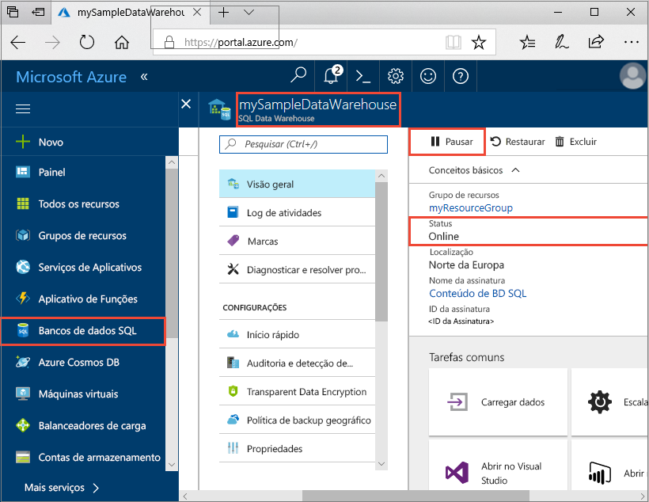
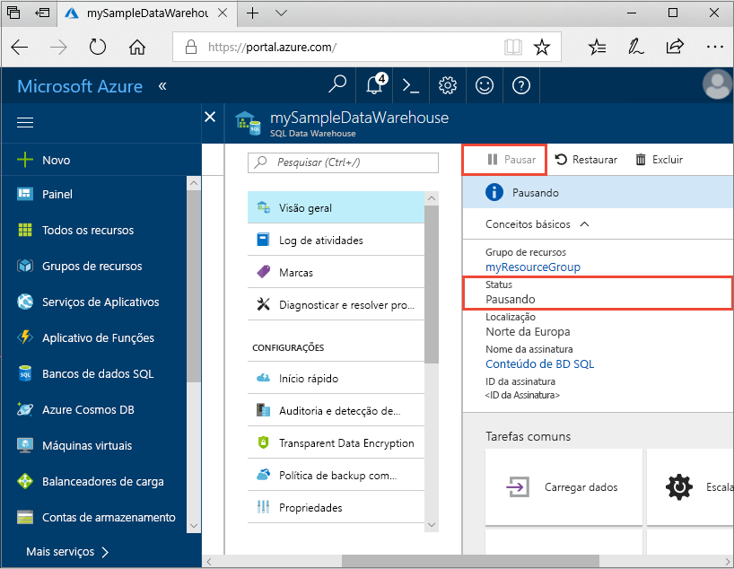
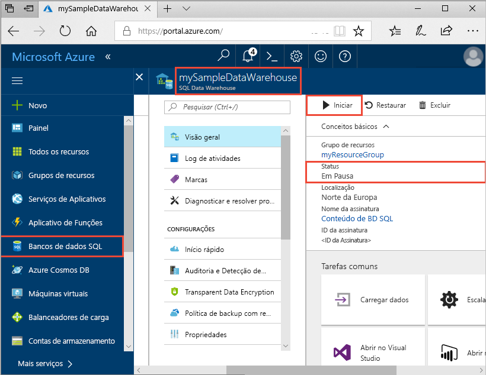
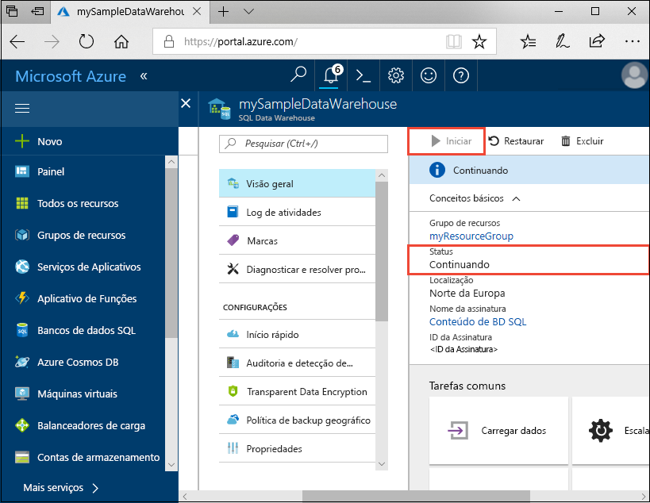
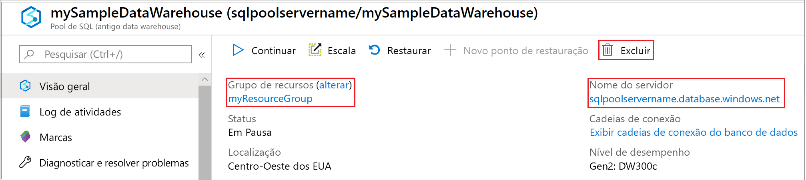

# Início Rápido: Pausar e retomar a computação no pool de SQL dedicado por meio do portal do Azure

Você pode usar o portal do Azure para pausar e retomar os recursos de computação do pool de SQL dedicado. Se você não tiver uma assinatura do Azure, crie uma conta [gratuita](https://azure.microsoft.com/free/) antes de começar.

## Entre no Portal do Azure

Entre no [portal do Azure](https://portal.azure.com/).

## Antes de começar

Use [Criar e conectar – portal](../quickstart-create-sql-pool-portal.md) para criar um pool de SQL dedicado chamado **mySampleDataWarehouse**. 

## Pausar computação

Para reduzir custos, você pode pausar e retomar os recursos de computação sob demanda. Por exemplo, se você não usar banco de dados durante a noite e nos finais de semana, você poderá pausá-lo durante esses períodos e retomá-lo durante o dia.
 
>[!NOTE]
>Você não será cobrado por recursos de computação enquanto o banco de dados estiver em pausa. No entanto, você continuará sendo cobrado pelo armazenamento. 

Siga estas etapas para pausar um pool de SQL dedicado:

1. Entre no [portal do Azure](https://portal.azure.com/).
2. Navegue até você é a página **Pool de SQL dedicado** para abrir o pool de SQL. 
3. Verifique se **Status** é **Online**.

    

4. Para pausar o pool de SQL dedicado, clique no botão **Pausar**. 
5. Uma pergunta de confirmação será exibida perguntando se deseja continuar. Clique em **Sim**.
6. Aguarde alguns minutos e, em seguida, observe se **Status** indica **Pausando**.

    

7. Quando a operação de pausa for concluída, o status indica **Em Pausa** e o botão de opção é **Retomar**.
8. Os recursos de computação do pool de SQL dedicado agora estão offline. Você não será cobrado por computação até você reiniciar o serviço.

    

## Retomar a computação

Siga estas etapas para retomar um pool de SQL dedicado.

1. Navegue até você é a página **Pool de SQL dedicado** para abrir o pool de SQL.
3. Na página **mySampleDataWarehouse**, observe se **Status** indica **Pausado**.

    

1. Para retomar o pool de SQL, clique em **Retomar**. 
1. Uma pergunta de confirmação será exibida perguntando se deseja continuar. Clique em **Sim**.
1. Observe se o **Status** indica **Continuando**.

    

1. Quando o pool de SQL estiver novamente online, o status indicará **Online** e o botão de opção será **Pausar**.
1. Os recursos de computação para o pool de SQL estão online e você pode usar o serviço. Encargos de computação foram retomados.

    

## Limpar os recursos

Você está sendo cobrado por unidades de data warehouse e pelos dados armazenados em seu pool de SQL dedicado. Esses recursos de computação e armazenamento são cobrados separadamente. 

- Se você quiser manter os dados no armazenamento, pause a computação.
- Se você quiser remover encargos futuros, poderá excluir o pool de SQL dedicado. 

Siga estas etapas para limpar os recursos conforme desejado.

1. Entre no [portal do Azure](https://portal.azure.com) e selecione seu pool de SQL dedicado.

    

1. Para pausar a computação, clique no botão **Pausar**. 

1. Para remover o pool de SQL dedicado para que não seja cobrado pela computação ou pelo armazenamento, clique em **Excluir**.

## Próximas etapas

Agora você pausou e retomou a computação para o pool de SQL dedicado. Passe para o próximo artigo para saber mais sobre como [Carregar dados para o pool de SQL dedicado](./load-data-from-azure-blob-storage-using-copy.md). Para obter informações adicionais sobre como gerenciar funcionalidades de computação, confira o artigo [Gerenciar visão geral de computação](sql-data-warehouse-manage-compute-overview.md).