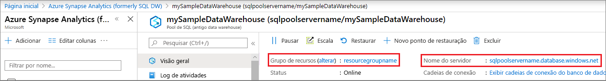

# <a name="quickstart-pause-and-resume-compute-in-dedicated-sql-pool-formerly-sql-dw-with-azure-powershell"></a>Guia de Início Rápido: Pausar e retomar a computação no pool de SQL dedicado (antigo SQL DW) com o Azure PowerShell

Use o Azure PowerShell para pausar e retomar os recursos de computação do pool de SQL dedicado (antigo SQL DW).
Se você não tiver uma assinatura do Azure, crie uma conta [gratuita](https://azure.microsoft.com/free/) antes de começar.

## <a name="before-you-begin"></a>Antes de começar

[!INCLUDE [updated-for-az](../../../includes/updated-for-az.md)]

Este guia de início rápido pressupõe que você já tenha um pool de SQL dedicado (antigo SQL DW) que possa ser colocado em pausa e retomado. Caso precise criar um, use [Criar e conectar – portal](create-data-warehouse-portal.md) para criar um pool de SQL dedicado (antigo SQL DW) chamado **mySampleDataWarehouse**.

## <a name="log-in-to-azure"></a>Fazer logon no Azure

Faça logon em sua assinatura do Azure usando o comando [Connect-AzAccount](/powershell/module/az.accounts/connect-azaccount?toc=/azure/synapse-analytics/sql-data-warehouse/toc.json&bc=/azure/synapse-analytics/sql-data-warehouse/breadcrumb/toc.json) e siga as instruções na tela.

```powershell
Connect-AzAccount
```

Para ver qual assinatura você está usando, execute [Get-AzSubscription](/powershell/module/az.accounts/get-azsubscription?toc=/azure/synapse-analytics/sql-data-warehouse/toc.json&bc=/azure/synapse-analytics/sql-data-warehouse/breadcrumb/toc.json).

```powershell
Get-AzSubscription
```

Se você precisar usar uma assinatura diferente da padrão, execute [Set-AzContext](/powershell/module/az.accounts/set-azcontext?toc=/azure/synapse-analytics/sql-data-warehouse/toc.json&bc=/azure/synapse-analytics/sql-data-warehouse/breadcrumb/toc.json).

```powershell
Set-AzContext -SubscriptionName "MySubscription"
```

## <a name="look-up-dedicated-sql-pool-formerly-sql-dw-information"></a>Pesquisar informações do pool de SQL dedicado (antigo SQL DW)

Localize o nome do banco de dados, o nome do servidor e o grupo de recursos do pool de SQL dedicado (antigo SQL DW) que pretende pausar e retomar.

Siga estas etapas para encontrar informações de localização do seu pool de SQL dedicado (antigo SQL DW):

1. Entre no [portal do Azure](https://portal.azure.com/).
1. Clique em **Azure Synapse Analytics (antigo SQL DW)** na página à esquerda do portal do Azure.
1. Selecione **mySampleDataWarehouse** na página **Azure Synapse Analytics (antigo SQL DW)** . O pool de SQL é aberto.

    

1. Anote o nome do pool de SQL dedicado (antigo SQL DW), que é o nome do banco de dados. Anote também o nome do servidor e o grupo de recursos.
1. Use apenas a primeira parte do nome do servidor nos cmdlets do PowerShell. Na imagem anterior, o nome completo do servidor é sqlpoolservername.database.windows.net. Usamos **sqlpoolservername** como o nome do servidor no cmdlet do PowerShell.

## <a name="pause-compute"></a>Pausar computação

Para economizar custos, é possível pausar e retomar os recursos de computação sob demanda. Por exemplo, se você não está usando o banco de dados durante a noite e nos finais de semana, é possível pausá-lo durante esses períodos e retomá-lo durante o dia.

>[!NOTE]
>Não há cobranças de recursos de computação enquanto o banco de dados está em pausa. No entanto, você continua sendo cobrado pelo armazenamento.

Para pausar um banco de dados, use o cmdlet [Suspend-AzSqlDatabase](/powershell/module/az.sql/suspend-azsqldatabase?toc.json&bc=/azure/synapse-analytics/sql-data-warehouse/breadcrumb/toc.json). O exemplo a seguir pausa um pool de SQL denominado **mySampleDataWarehouse** hospedado em um servidor chamado **sqlpoolservername**. O servidor está em um grupo de recursos do Azure chamado **myResourceGroup**.

```Powershell
Suspend-AzSqlDatabase –ResourceGroupName "myResourceGroup" `
–ServerName "sqlpoolservername" –DatabaseName "mySampleDataWarehouse"
```

O exemplo a seguir recupera o banco de dados para o objeto $database. Ele redireciona o objeto para [Suspend-AzSqlDatabase](/powershell/module/az.sql/suspend-azsqldatabase?toc.json&bc=/azure/synapse-analytics/sql-data-warehouse/breadcrumb/toc.json). Os resultados são armazenados no objeto resultDatabase. O comando final mostra os resultados.

```Powershell
$database = Get-AzSqlDatabase –ResourceGroupName "myResourceGroup" `
–ServerName "sqlpoolservername" –DatabaseName "mySampleDataWarehouse"
$resultDatabase = $database | Suspend-AzSqlDatabase
$resultDatabase
```

## <a name="resume-compute"></a>Retomar a computação

Para pausar um banco de dados, use o cmdlet [Resume-AzSqlDatabase](/powershell/module/az.sql/resume-azsqldatabase?toc.json&bc=/azure/synapse-analytics/sql-data-warehouse/breadcrumb/toc.json). O exemplo a seguir inicia um banco de dados denominado **mySampleDataWarehouse** hospedado em um servidor chamado **sqlpoolservername**. O servidor está em um grupo de recursos do Azure chamado **myResourceGroup**.

```Powershell
Resume-AzSqlDatabase –ResourceGroupName "myResourceGroup" `
–ServerName "sqlpoolservername" -DatabaseName "mySampleDataWarehouse"
```

O próximo exemplo recupera o banco de dados para o objeto $database. Ele redireciona o objeto para [Resume-AzSqlDatabase](/powershell/module/az.sql/resume-azsqldatabase?toc=/azure/synapse-analytics/sql-data-warehouse/toc.json&bc=/azure/synapse-analytics/sql-data-warehouse/breadcrumb/toc.json) e armazena os resultados em $resultDatabase. O comando final mostra os resultados.

```Powershell
$database = Get-AzSqlDatabase –ResourceGroupName "myResourceGroup" `
–ServerName "sqlpoolservername" –DatabaseName "mySampleDataWarehouse"
$resultDatabase = $database | Resume-AzSqlDatabase
$resultDatabase
```

## <a name="check-status-of-your-sql-pool-operation"></a>Verificar o status da operação do pool de SQL

Para verificar o status do pool de SQL dedicado (antigo SQL DW), use o cmdlet [Get-AzSqlDatabaseActivity](/powershell/module/az.sql/Get-AzSqlDatabaseActivity?toc.json&bc=/azure/synapse-analytics/sql-data-warehouse/breadcrumb/toc.json).

```Powershell
Get-AzSqlDatabaseActivity -ResourceGroupName "myResourceGroup" -ServerName "sqlpoolservername" -DatabaseName "mySampleDataWarehouse"
```

## <a name="clean-up-resources"></a>Limpar recursos

Você está sendo cobrado por unidades de data warehouse e pelos dados armazenados no seu pool de SQL dedicado (antigo SQL DW). Esses recursos de computação e armazenamento são cobrados separadamente.

- Se você quiser manter os dados no armazenamento, pause a computação.
- Se você quiser remover encargos futuros, poderá excluir o pool de SQL.

Siga estas etapas para limpar os recursos conforme desejado.

1. Entre no [portal do Azure](https://portal.azure.com) e clique no seu pool de SQL.

    

2. Para pausar a computação, clique no botão **Pausar**. Quando o pool de SQL estiver em pausa, você verá um botão **Iniciar**.  Para retomar a computação, clique **Iniciar**.

3. Para remover o pool de SQL para que não seja cobrado pela computação ou pelo armazenamento, clique em **Excluir**.

4. Para remover o SQL Server criado, clique em **sqlpoolservername.database.windows.net** e, em seguida, clique em **Excluir**.  Tenha cuidado com essa exclusão, uma vez que a exclusão do servidor também exclui todos os bancos de dados atribuídos ao servidor.

5. Para remover o grupo de recursos, clique em **meuGrupoDeRecursos** e, em seguida, clique em **Excluir grupo de recursos**.

## <a name="next-steps"></a>Próximas etapas

Para saber mais sobre o pool de SQL, prossiga para o artigo [Carregar dados no pool de SQL dedicado (antigo SQL DW)](./load-data-from-azure-blob-storage-using-copy.md). Para obter informações adicionais sobre como gerenciar funcionalidades de computação, confira o artigo [Gerenciar visão geral de computação](sql-data-warehouse-manage-compute-overview.md).