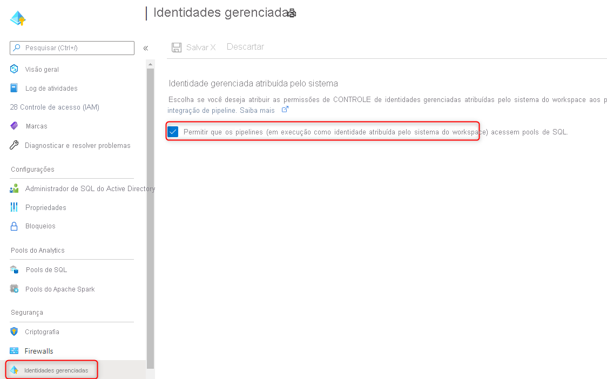

# <a name="securely-load-data-using-synapse-sql"></a>Carregar dados com segurança usando o SQL do Synapse

Este artigo realça e fornece exemplos sobre os mecanismos de autenticação segura para a [Instrução COPY](/sql/t-sql/statements/copy-into-transact-sql?view=azure-sqldw-latest&preserve-view=true). A instrução COPY é a maneira mais flexível e segura de carregar dados em massa no SQL do Synapse.
## <a name="supported-authentication-mechanisms"></a>Mecanismos de autenticação compatíveis

A matriz a seguir descreve os métodos de autenticação compatíveis com cada tipo de arquivo e conta de armazenamento. Isso se aplica ao local de armazenamento de origem e ao local do arquivo de erros.

|                          |                CSV                |                      Parquet                       |                        ORC                         |
| :----------------------: | :-------------------------------: | :------------------------------------------------: | :------------------------------------------------: |
|  **Armazenamento de Blobs do Azure**  | SAS/MSI/SERVICE PRINCIPAL/KEY/AAD |                      SAS/KEY                       |                      SAS/KEY                       |
| **Azure Data Lake Gen2** | SAS/MSI/SERVICE PRINCIPAL/KEY/AAD | SAS (blob<sup>1</sup>)/MSI (dfs<sup>2</sup>)/SERVICE PRINCIPAL/KEY/AAD | SAS (blob<sup>1</sup>)/MSI (dfs<sup>2</sup>)/SERVICE PRINCIPAL/KEY/AAD |

1: O ponto de extremidade .blob ( **.blob**.core.windows.net) no seu caminho de localização externa é necessário nesse método de autenticação.

2: O ponto de extremidade .dfs ( **.dfs**.core.windows.net) no seu caminho de localização externa é necessário nesse método de autenticação.

## <a name="a-storage-account-key-with-lf-as-the-row-terminator-unix-style-new-line"></a>a. Chave de conta de armazenamento com LF como terminador de linha (nova linha em estilo UNIX)


```sql
--Note when specifying the column list, input field numbers start from 1
COPY INTO target_table (Col_one default 'myStringDefault' 1, Col_two default 1 3)
FROM 'https://adlsgen2account.dfs.core.windows.net/myblobcontainer/folder1/'
WITH (
    FILE_TYPE = 'CSV'
    ,CREDENTIAL=(IDENTITY= 'Storage Account Key', SECRET='<Your_Account_Key>')
    --CREDENTIAL should look something like this:
    --CREDENTIAL=(IDENTITY= 'Storage Account Key', SECRET='x6RWv4It5F2msnjelv3H4DA80n0QW0daPdw43jM0nyetx4c6CpDkdj3986DX5AHFMIf/YN4y6kkCnU8lb+Wx0Pj+6MDw=='),
    ,ROWTERMINATOR='0x0A' --0x0A specifies to use the Line Feed character (Unix based systems)
)
```
> [!IMPORTANT]
>
> - Use o valor hexadecimal (0x0A) para especificar o caractere de alimentação de linha/nova linha. Observe que a instrução COPY interpretará a cadeia de caracteres ' \n ' como ' \r\n ' (retorno de carro para nova linha).

## <a name="b-shared-access-signatures-sas-with-crlf-as-the-row-terminator-windows-style-new-line"></a>B. SAS (Assinaturas de Acesso Compartilhado) com o CRLF como término de linha (nova linha no estilo do Windows)
```sql
COPY INTO target_table
FROM 'https://adlsgen2account.dfs.core.windows.net/myblobcontainer/folder1/'
WITH (
    FILE_TYPE = 'CSV'
    ,CREDENTIAL=(IDENTITY= 'Shared Access Signature', SECRET='<Your_SAS_Token>')
    --CREDENTIAL should look something like this:
    --CREDENTIAL=(IDENTITY= 'Shared Access Signature', SECRET='?sv=2018-03-28&ss=bfqt&srt=sco&sp=rl&st=2016-10-17T20%3A14%3A55Z&se=2021-10-18T20%3A19%3A00Z&sig=IEoOdmeYnE9%2FKiJDSFSYsz4AkNa%2F%2BTx61FuQ%2FfKHefqoBE%3D'),
    ,ROWTERMINATOR='\n'-- COPY command automatically prefixes the \r character when \n (newline) is specified. This results in carriage return newline (\r\n) for Windows based systems.
)
```

> [!IMPORTANT]
>
> - Não especifique o ROWTERMINATOR como ' \r\n ', pois será interpretado como ' \r\r\n ' e poderá resultar em problema de análise

## <a name="c-managed-identity"></a>C. Identidade Gerenciada

A autenticação de identidade gerenciada é obrigatória quando sua conta de armazenamento é anexada a uma VNet. 

### <a name="prerequisites"></a>Pré-requisitos

1. Instalar o Azure PowerShell usando este [guia](/powershell/azure/install-az-ps?toc=/azure/synapse-analytics/sql-data-warehouse/toc.json&bc=/azure/synapse-analytics/sql-data-warehouse/breadcrumb/toc.json).
2. Se você tiver uma conta de armazenamento de blobs ou de uso geral v1, será necessário primeiro atualizar para uso geral v2 usando este [guia](../../storage/common/storage-account-upgrade.md?toc=/azure/synapse-analytics/sql-data-warehouse/toc.json&bc=/azure/synapse-analytics/sql-data-warehouse/breadcrumb/toc.json).
3. É necessário ativar **Permitir que os serviços confiáveis da Microsoft acessem essa conta de armazenamento** no menu de configurações **Firewalls e redes virtuais** da conta do Armazenamento do Azure. Confira este [guia](../../storage/common/storage-network-security.md?toc=/azure/synapse-analytics/sql-data-warehouse/toc.json&bc=/azure/synapse-analytics/sql-data-warehouse/breadcrumb/toc.json#exceptions) para saber mais.

#### <a name="steps"></a>Etapas

1. Se você tem um pool de SQL dedicado autônomo, registre o SQL Server com o AAD (Azure Active Directory) usando o PowerShell: 

   ```powershell
   Connect-AzAccount
   Select-AzSubscription -SubscriptionId <subscriptionId>
   Set-AzSqlServer -ResourceGroupName your-database-server-resourceGroup -ServerName your-SQL-servername -AssignIdentity
   ```

   Esta etapa não é necessária para pools de SQL dedicados em um workspace do Azure Synapse.

1. Se você tem um workspace do Azure Synapse, registre a identidade gerenciada pelo sistema do workspace:

   1. Vá até o workspace do Azure Synapse no portal do Azure
   2. Vá até a folha Identidades gerenciadas 
   3. Verificar se a opção "Permitir Pipelines" está habilitada
   
   

1. Crie uma **Conta de armazenamento de uso geral v2** usando este [guia](../../storage/common/storage-account-create.md).

   > [!NOTE]
   >
   > - Se você tiver uma conta de armazenamento de blobs ou de uso geral v1, será necessário **primeiro atualizar para v2** usando este [guia](../../storage/common/storage-account-upgrade.md).
   > - Para problemas conhecidos com o Azure Data Lake Storage Gen2, confira este [guia](../../storage/blobs/data-lake-storage-known-issues.md).

1. Na conta de armazenamento, navegue até o **Controle de Acesso (IAM)** e selecione **Adicionar atribuição de função**. Atribua a função do Azure **Colaborador de Dados do Blob de Armazenamento** ao servidor ou workspace que hospeda seu pool de SQL dedicado que você registrou com o AAD (Azure Active Directory).

   > [!NOTE]
   > Somente membros com o privilégio Proprietário podem executar essa etapa. Para obter várias funções internas do Azure, confira este [guia](../../role-based-access-control/built-in-roles.md?toc=/azure/synapse-analytics/sql-data-warehouse/toc.json&bc=/azure/synapse-analytics/sql-data-warehouse/breadcrumb/toc.json).
   
    > [!IMPORTANT]
    > Especifique a função do Azure de Proprietário, Colaborador ou Leitor de **Dados de Blob** de **Armazenamento**. Essas funções são diferentes das funções internas do Azure de Proprietário, Colaborador e Leitor. 

    

4. Agora você pode executar a instrução COPY especificando "Identidade Gerenciada":

    ```sql
    COPY INTO dbo.target_table
    FROM 'https://myaccount.blob.core.windows.net/myblobcontainer/folder1/*.txt'
    WITH (
        FILE_TYPE = 'CSV',
        CREDENTIAL = (IDENTITY = 'Managed Identity'),
    )
    ```

## <a name="d-azure-active-directory-authentication"></a>D. Autenticação do Azure Active Directory
#### <a name="steps"></a>Etapas

1. Na conta de armazenamento, navegue até o **Controle de Acesso (IAM)** e selecione **Adicionar atribuição de função**. Atribua uma função do Azure de **Leitor, Colaborador ou Proprietário de Dados de Blob de Armazenamento** ao seu usuário do Azure AD. 

    > [!IMPORTANT]
    > Especifique a função do Azure de Proprietário, Colaborador ou Leitor de **Dados de Blob** de **Armazenamento**. Essas funções são diferentes das funções internas do Azure de Proprietário, Colaborador e Leitor.

    

2. Configure a autenticação do Azure AD examinando a [documentação](../../azure-sql/database/authentication-aad-configure.md?tabs=azure-powershell) a seguir. 

3. Conecte-se ao seu pool de SQL usando o Active Directory, em que agora você pode executar a instrução COPY sem especificar nenhuma credencial:

    ```sql
    COPY INTO dbo.target_table
    FROM 'https://myaccount.blob.core.windows.net/myblobcontainer/folder1/*.txt'
    WITH (
        FILE_TYPE = 'CSV'
    )
    ```


## <a name="e-service-principal-authentication"></a>E. Autenticação de entidade de serviço
#### <a name="steps"></a>Etapas

1. [Criar um aplicativo do Azure Active Directory](../..//active-directory/develop/howto-create-service-principal-portal.md#register-an-application-with-azure-ad-and-create-a-service-principal)
2. [Obter ID do aplicativo](../..//active-directory/develop/howto-create-service-principal-portal.md#get-tenant-and-app-id-values-for-signing-in)
3. [Obter a chave de autenticação](../../active-directory/develop/howto-create-service-principal-portal.md#authentication-two-options)
4. [Obter o ponto de extremidade do token OAuth 2.0 V1](../../data-lake-store/data-lake-store-service-to-service-authenticate-using-active-directory.md?bc=%2fazure%2fsynapse-analytics%2fsql-data-warehouse%2fbreadcrumb%2ftoc.json&toc=%2fazure%2fsynapse-analytics%2fsql-data-warehouse%2ftoc.json#step-4-get-the-oauth-20-token-endpoint-only-for-java-based-applications)
5. [Atribuir permissões de leitura, gravação e execução ao aplicativo do Azure AD](../../data-lake-store/data-lake-store-service-to-service-authenticate-using-active-directory.md?bc=%2fazure%2fsynapse-analytics%2fsql-data-warehouse%2fbreadcrumb%2ftoc.json&toc=%2fazure%2fsynapse-analytics%2fsql-data-warehouse%2ftoc.json#step-3-assign-the-azure-ad-application-to-the-azure-data-lake-storage-gen1-account-file-or-folder) da sua conta de armazenamento
6. Agora você pode executar a instrução COPY:

    ```sql
    COPY INTO dbo.target_table
    FROM 'https://myaccount.blob.core.windows.net/myblobcontainer/folder0/*.txt'
    WITH (
        FILE_TYPE = 'CSV'
        ,CREDENTIAL=(IDENTITY= '<application_ID>@<OAuth_2.0_Token_EndPoint>' , SECRET= '<authentication_key>')
        --CREDENTIAL should look something like this:
        --,CREDENTIAL=(IDENTITY= '92761aac-12a9-4ec3-89b8-7149aef4c35b@https://login.microsoftonline.com/72f714bf-86f1-41af-91ab-2d7cd011db47/oauth2/token', SECRET='juXi12sZ6gse]woKQNgqwSywYv]7A.M')
    )
    ```

> [!IMPORTANT]
>
> - Use a versão **V1** do ponto de extremidade do token OAuth 2.0

## <a name="next-steps"></a>Próximas etapas

- Conferir o artigo [Instrução COPY](/sql/t-sql/statements/copy-into-transact-sql?view=azure-sqldw-latest&preserve-view=true#syntax) para ver a sintaxe detalhada
- Conferir o artigo [Visão geral de carregamento de dados](./design-elt-data-loading.md#what-is-elt) para ver as melhores práticas de carregamento
