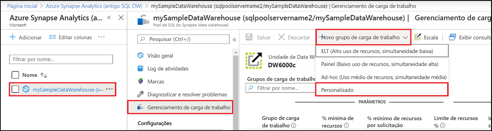
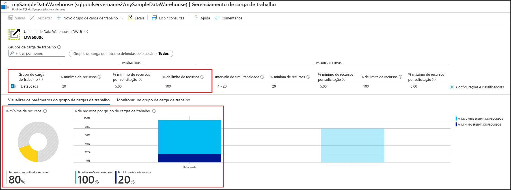
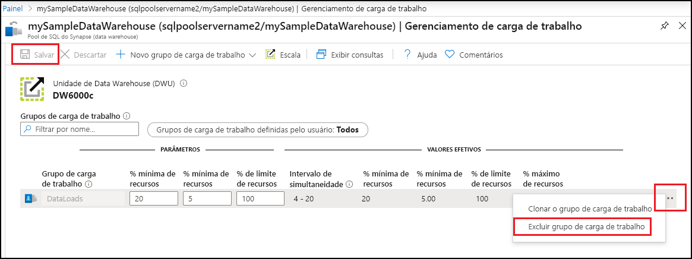

# Início rápido: Configurar o isolamento da carga de trabalho do pool de SQL dedicado usando um grupo de carga de trabalho no portal do Azure

Neste guia de início rápido, você vai configurar o [isolamento da carga de trabalho](sql-data-warehouse-workload-isolation.md) criando um grupo de carga de trabalho para reservar recursos.  Para fins deste tutorial, criaremos um grupo de carga de trabalho para o carregamento de dados chamado `DataLoads`. O grupo de carga de trabalho reservará 20% dos recursos do sistema.  Com isolamento de 20% para carregamentos de dados, há uma garantia de recursos que permitirão manter a conformidade com os SLAs.  Depois de criar o grupo de carga de trabalho, [crie um classificador de cargas de trabalho](quickstart-create-a-workload-classifier-portal.md) para atribuir consultas a esse grupo.

Se você não tiver uma assinatura do Azure, crie uma conta [gratuita](https://azure.microsoft.com/free/) antes de começar.

## Entre no Portal do Azure

Entre no [portal do Azure](https://portal.azure.com/).

> [!NOTE]
> A criação de uma instância de pool de SQL dedicado no Azure Synapse Analytics pode resultar em um novo serviço faturável.  Para obter mais informações, confira [Preços do Azure Synapse Analytics](https://azure.microsoft.com/pricing/details/sql-data-warehouse/).

## Pré-requisitos

Este início rápido pressupõe que você já tem uma instância de pool de SQL dedicado no SQL do Synapse e que você tem permissões do tipo CONTROL DATABASE. Se você precisar criar um, confira [Início rápido: Criar pool de SQL dedicado – portal](../quickstart-create-sql-pool-portal.md) para criar um data warehouse chamado **mySampleDataWarehouse**.

>[!IMPORTANT] 
>Seu pool de SQL dedicado precisa estar online para configurar o gerenciamento de carga de trabalho. 

## Configurar isolamento da carga de trabalho

Os recursos do pool de SQL dedicado podem ser isolados e reservados para cargas de trabalho específicas criando grupos de carga de trabalho.  Confira a documentação do conceito de [Isolamento de Carga de Trabalho](sql-data-warehouse-workload-isolation.md) para obter mais detalhes sobre como os grupos de carga de trabalho ajudam a gerenciar essas cargas.  O início rápido [Criar e conectar – portal](create-data-warehouse-portal.md) criou **mySampleDataWarehouse** e o inicializou em DW100c. As etapas a seguir criam um grupo de carga de trabalho em **mySampleDataWarehouse**.

Para criar um grupo de carga de trabalho com isolamento de 20%:
1.  Navegue até a página do pool de SQL dedicado **mySampleDataWarehouse**.
1.  Selecione **Gerenciamento de carga de trabalho**.
1.  Selecione **Novo grupo de carga de trabalho**.
1.  selecione **Personalizado**.

    

6.  Insira `DataLoads` como o **Grupo de carga de trabalho**.
7.  Insira `20` como o **% mínimo de recursos**.
8.  Insira `5` como o **% mínimo de recursos por solicitação**.
9.  Insira `100` como o **% de limite de recursos**.
10. Insira **Salvar**.

   

Uma notificação do portal é exibida quando o grupo de carga de trabalho é criado.  Os recursos do grupo de carga de trabalho são exibidos nos gráficos abaixo dos valores configurados.

   

## Limpar os recursos

Para excluir o grupo de carga de trabalho `DataLoads` criado neste tutorial:
1. Clique no **`...`** à direita do grupo de carga de trabalho `DataLoads`.
2. Clique em **Excluir grupo de carga de trabalho**.
3. Clique em **Sim** quando solicitado a confirmar a exclusão do grupo de carga de trabalho.
4. Clique em **Save**.

   

Você está sendo cobrado por unidades de data warehouse e pelos dados armazenados em seu data warehouse. Esses recursos de computação e armazenamento são cobrados separadamente.

- Se desejar manter os dados no armazenamento, será possível pausar a computação quando você não estiver usando o data warehouse. Ao pausar a computação, você será cobrado apenas pelo armazenamento de dados. Quando você estiver pronto para trabalhar com os dados, retome a computação.
- Se desejar remover encargos futuros, será possível excluir o data warehouse.

Siga estas etapas para limpar os recursos.

1. Entre no [portal do Azure](https://portal.azure.com), selecione seu pool de SQL dedicado.

    

2. Para pausar a computação, selecione o botão **Pausar**. Quando o data warehouse for pausado, você verá um botão **Iniciar**.  Para retomar a computação, selecione **Iniciar**.

3. Para remover o data warehouse para não ser cobrado pela computação ou pelo armazenamento, selecione **Excluir**.

## Próximas etapas

Para usar o grupo de carga de trabalho `DataLoads`, um [classificador de carga de trabalho](/sql/t-sql/statements/create-workload-classifier-transact-sql?toc=/azure/synapse-analytics/sql-data-warehouse/toc.json&bc=/azure/synapse-analytics/sql-data-warehouse/breadcrumb/toc.json&view=azure-sqldw-latest&preserve-view=true) precisa ser criado para encaminhar as solicitações para esse grupo.  Prossiga para o tutorial [criar classificador de carga de trabalho](quickstart-create-a-workload-classifier-portal.md) para criar um classificador de carga de trabalho para `DataLoads`.

## Confira também
Confira o artigo de instruções [Gerenciar e monitorar o gerenciamento de cargas de trabalho](sql-data-warehouse-how-to-manage-and-monitor-workload-importance.md) para obter detalhes sobre como monitorar cargas de trabalho para gerenciá-las.
