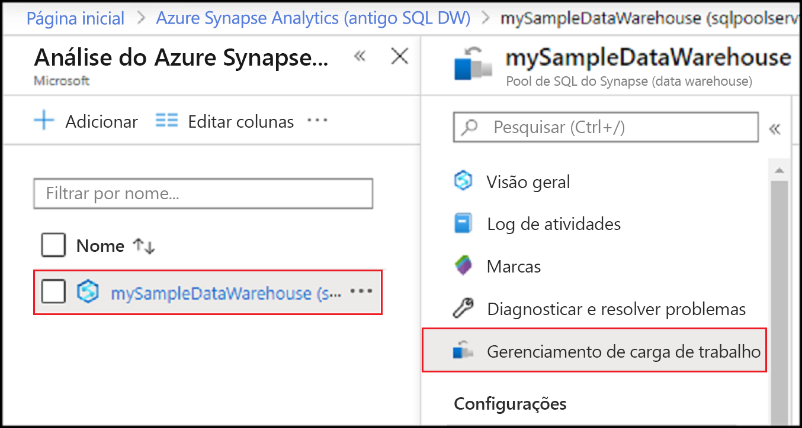
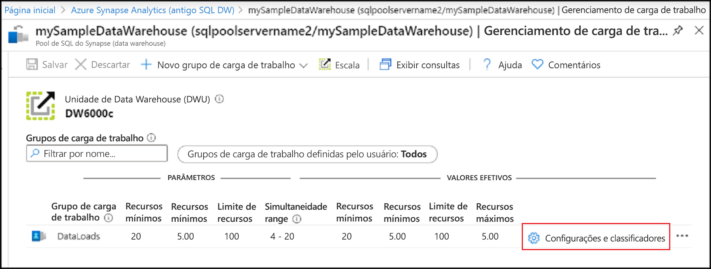
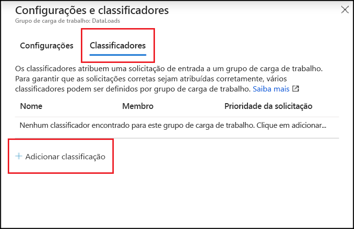
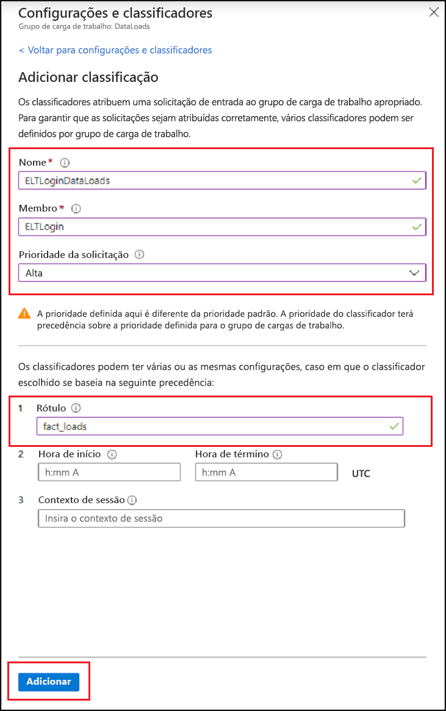
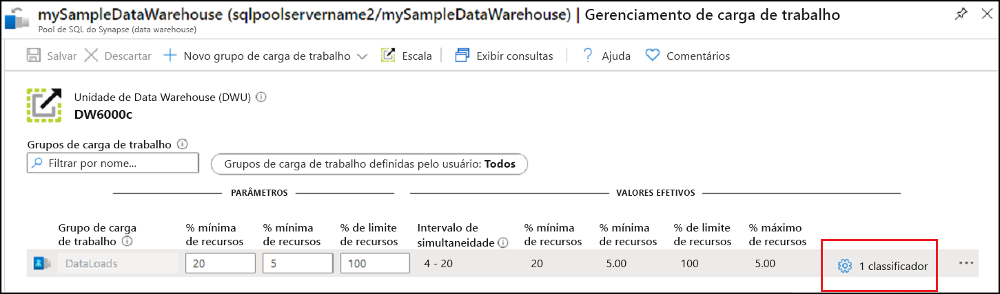
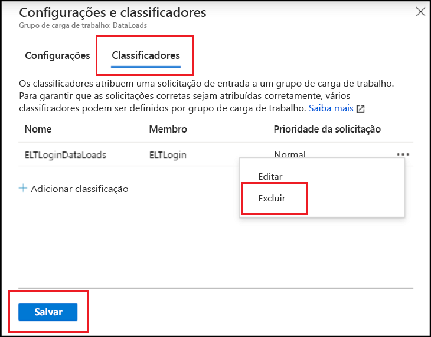
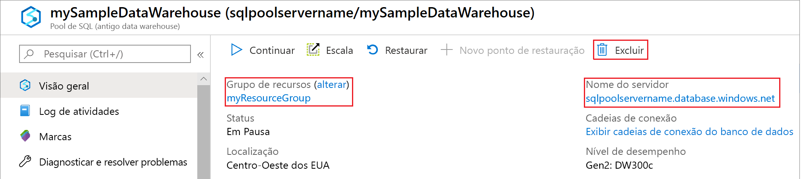

# <a name="quickstart-create-a-dedicated-sql-pool-workload-classifier-using-the-azure-portal"></a>Início rápido: Criar um classificador de carga de trabalho do pool de SQL dedicado usando o portal do Azure

Neste início rápido, você criará um [classificador de carga de trabalho](sql-data-warehouse-workload-classification.md) para atribuir consultas a um grupo de carga de trabalho.  O classificador atribuirá solicitações do usuário SQL `ELTLogin` ao grupo de carga de trabalho `DataLoads`.   Siga o tutorial [Início rápido: Configurar o isolamento de carga de trabalho](quickstart-configure-workload-isolation-portal.md) para criar o grupo de carga de trabalho `DataLoads`.  Este tutorial criará um classificador de carga de trabalho com a opção WLM_LABEL para ajudar a classificar as solicitações mais corretamente.  O classificador atribuirá a [prioridade de carga de trabalho](sql-data-warehouse-workload-importance.md) `HIGH` a essas solicitações também.


Se você não tiver uma assinatura do Azure, crie uma conta [gratuita](https://azure.microsoft.com/free/) antes de começar.


## <a name="sign-in-to-the-azure-portal"></a>Entre no Portal do Azure

Entre no [portal do Azure](https://portal.azure.com/).

> [!NOTE]
> A criação de uma instância de pool de SQL dedicado no Azure Synapse Analytics pode resultar em um novo serviço faturável.  Para obter mais informações, confira [Preços do Azure Synapse Analytics](https://azure.microsoft.com/pricing/details/sql-data-warehouse/).

## <a name="prerequisites"></a>Pré-requisitos

Este início rápido pressupõe que você já tem uma instância de pool de SQL dedicado e que você tem permissões do tipo CONTROL DATABASE. Se precisar criar, use [Criar e conectar – portal](create-data-warehouse-portal.md) para criar um pool de SQL dedicado chamado **mySampleDataWarehouse**.
<br><br>
Há um grupo de carga de trabalho `DataLoads`.  Confira o [Início rápido: Configurar o isolamento de carga de trabalho](quickstart-configure-workload-isolation-portal.md) para criar o grupo de carga de trabalho.
<br><br>
>[!IMPORTANT] 
>Seu pool de SQL dedicado precisa estar online para configurar o gerenciamento de carga de trabalho. 


## <a name="create-a-login-for-eltlogin"></a>Criar um logon para ELTLogin

Crie um logon de autenticação do SQL Server no banco de dados `master` usando [CREATE LOGIN](/sql/t-sql/statements/create-login-transact-sql?toc=/azure/synapse-analytics/sql-data-warehouse/toc.json&bc=/azure/synapse-analytics/sql-data-warehouse/breadcrumb/toc.json&view=azure-sqldw-latest&preserve-view=true) para `ELTLogin`.

```sql
IF NOT EXISTS (SELECT * FROM sys.sql_logins WHERE name = 'ELTLogin')
BEGIN
CREATE LOGIN [ELTLogin] WITH PASSWORD='<strongpassword>'
END
;
```

## <a name="create-user-and-grant-permissions"></a>Criar usuário e conceder permissões

Após o logon ser criado, é necessário criar um usuário no banco de dados.  Use [CREATE USER](/sql/t-sql/statements/create-user-transact-sql?toc=/azure/synapse-analytics/sql-data-warehouse/toc.json&bc=/azure/synapse-analytics/sql-data-warehouse/breadcrumb/toc.json&view=azure-sqldw-latest&preserve-view=true) para criar o usuário SQL `ELTRole` em **mySampleDataWarehouse**.  Como vamos testar a classificação durante este tutorial, conceda permissões `ELTLogin` para **mySampleDataWarehouse**. 

```sql
IF NOT EXISTS (SELECT * FROM sys.database_principals WHERE name = 'ELTLogin')
BEGIN
CREATE USER [ELTLogin] FOR LOGIN [ELTLogin]
GRANT CONTROL ON DATABASE::mySampleDataWarehouse TO ELTLogin 
END
;
```

## <a name="configure-workload-classification"></a>Configurar a classificação de carga de trabalho
A classificação permite que você encaminhe solicitações, com base em um conjunto de regras, para um grupo de carga de trabalho.  No tutorial [Início rápido: Configurar o isolamento de carga de trabalho](quickstart-configure-workload-isolation-portal.md), criamos o grupo de carga de trabalho `DataLoads`.  Agora, você criará um classificador de carga de trabalho para encaminhar consultas para o grupo de carga de trabalho `DataLoads`.


1.  Navegue até a página do pool de SQL dedicado **mySampleDataWarehouse**.
3.  Selecione **Gerenciamento de carga de trabalho**.

    

4.  Selecione **Configurações e classificadores** no lado direito do grupo de carga de trabalho `DataLoads`.

    

5. Selecione **Não configurado** na coluna Classificadores.
6. Selecione **+ Adicionar classificador**.

    

7.  Insira `ELTLoginDataLoads` para **Nome**.
8.  Insira `ELTLogin` para **Membro**.
9.  Escolha `High` para **Prioridade da solicitação**.  *Opcional*, a prioridade normal é o padrão.
10. Insira `fact_loads` para **Rótulo**.
11. Selecione **Adicionar**.
12. Clique em **Salvar**.

    

## <a name="verify-and-test-classification"></a>Verificar e testar a classificação
Verifique a exibição de catálogo [sys.workload_management_workload_classifiers](/sql/relational-databases/system-catalog-views/sys-workload-management-workload-classifiers-transact-sql?view=azure-sqldw-latest&preserve-view=true) para confirmar a existência do classificador `ELTLoginDataLoads`.

```sql
SELECT * FROM sys.workload_management_workload_classifiers WHERE name = 'ELTLoginDataLoads'
```

Verifique a exibição de catálogo [sys.workload_management_workload_classifier_details](/sql/relational-databases/system-catalog-views/sys-workload-management-workload-classifier-details-transact-sql?view=azure-sqldw-latest&preserve-view=true) para confirmar os detalhes do classificador.

```sql
SELECT c.[name], c.group_name, c.importance, cd.classifier_type, cd.classifier_value
  FROM sys.workload_management_workload_classifiers c
  JOIN sys.workload_management_workload_classifier_details cd
    ON cd.classifier_id = c.classifier_id
  WHERE c.name = 'ELTLoginDataLoads'
```

Execute as instruções a seguir para testar a classificação.  Verifique se você está conectado como ``ELTLogin`` e se ``Label`` é usado na consulta.
```sql
CREATE TABLE factstaging (ColA int)
INSERT INTO factstaging VALUES(0)
INSERT INTO factstaging VALUES(1)
INSERT INTO factstaging VALUES(2)
GO

CREATE TABLE testclassifierfact WITH (DISTRIBUTION = ROUND_ROBIN)
AS
SELECT * FROM factstaging
OPTION (LABEL='fact_loads')
```

Verifique a instrução `CREATE TABLE` classificada no grupo de carga de trabalho `DataLoads` usando o classificador de carga de trabalho `ELTLoginDataLoads`.
```sql 
SELECT TOP 1 request_id, classifier_name, group_name, resource_allocation_percentage, submit_time, [status], [label], command 
FROM sys.dm_pdw_exec_requests 
WHERE [label] = 'fact_loads'
ORDER BY submit_time DESC
```

## <a name="clean-up-resources"></a>Limpar os recursos

Para excluir o classificador de carga de trabalho `ELTLoginDataLoads` neste tutorial:

1. Clique em **1 Classificador** no lado direito do grupo de carga de trabalho `DataLoads`.

    

2. Clique em **Classificadores**.
3. Clique no **`...`** à direita do classificador da carga de trabalho `ELTLoginDataLoads`.
4. Clique em **Excluir**.
5. Clique em **Save**.

    

Você está sendo cobrado por unidades de data warehouse e pelos dados armazenados em seu pool de SQL dedicado. Esses recursos de computação e armazenamento são cobrados separadamente.

- Se desejar manter os dados no armazenamento, será possível pausar a computação quando você não estiver usando o pool de SQL dedicado. Ao pausar a computação, você será cobrado apenas pelo armazenamento de dados. Quando você estiver pronto para trabalhar com os dados, retome a computação.
- Se você quiser remover encargos futuros, poderá excluir o pool de SQL dedicado.

Siga estas etapas para limpar os recursos.

1. Entre no [portal do Azure](https://portal.azure.com), selecione seu pool de SQL dedicado.

    

2. Para pausar a computação, selecione o botão **Pausar**. Quando o pool de SQL dedicado estiver em pausa, você verá um botão **Iniciar**.  Para retomar a computação, selecione **Iniciar**.

3. Para remover o pool de SQL dedicado para que não seja cobrado pela computação ou pelo armazenamento, selecione **Excluir**.

## <a name="next-steps"></a>Próximas etapas

Monitore sua carga de trabalho usando as métricas de monitoramento do portal do Azure.  Confira [Gerenciar e monitorar o Gerenciamento de Carga de Trabalho](sql-data-warehouse-how-to-manage-and-monitor-workload-importance.md) para obter detalhes.
