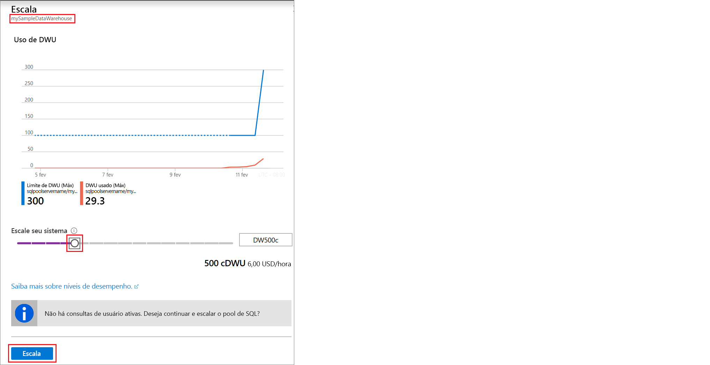

# Início Rápido: Dimensionar a computação para o pool de SQL do Synapse com o portal do Azure

Você pode dimensionar a computação para o pool de SQL do Synapse (data warehouse) usando o portal do Azure. [Escale horizontalmente a computação](sql-data-warehouse-manage-compute-overview.md) para melhorar o desempenho ou reduza a escala da computação para economizar custos. 

Se você não tiver uma assinatura do Azure, crie uma conta [gratuita](https://azure.microsoft.com/free/) antes de começar.

## Entre no Portal do Azure

Entre no [portal do Azure](https://portal.azure.com/).

## Antes de começar

Você pode escalar um pool de SQL que você já tem ou usar o [Início Rápido: criar e conectar – portal](create-data-warehouse-portal.md) para criar um pool de SQL chamado **mySampleDataWarehouse**. Este início rápido dimensiona o **mySampleDataWarehouse**.

>[!IMPORTANT] 
>Seu pool de SQL deve estar online para ser dimensionado. 

## Computação de escala

Os recursos de computação do pool de SQL podem ser dimensionados com o aumento ou a diminuição das unidades de data warehouse. O [Início rápido: criar e conectar – portal](create-data-warehouse-portal.md) criou **mySampleDataWarehouse** e o inicializou com 400 DWUs. As seguintes etapas ajustam as DWUs do **mySampleDataWarehouse**.

Para alterar unidades de data warehouse:

1. Clique em **Azure Synapse Analytics (antigo SQL DW)** na página à esquerda do portal do Azure.
2. Selecione **mySampleDataWarehouse** na página **Azure Synapse Analytics (antigo SQL DW)** . O pool de SQL é aberto.
3. Clique em **Escala**.

    

2. No painel Escala, mova o controle deslizante para a esquerda ou direita para alterar a configuração de DWU. Em seguida, selecione Escalar.

    

## Próximas etapas
Para saber mais sobre o pool de SQL, prossiga para o tutorial [Carregar dados para o pool de SQL](./load-data-from-azure-blob-storage-using-copy.md).
