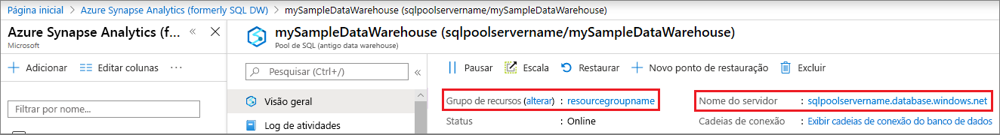

# <a name="quickstart-scale-compute-for-dedicated-sql-pool-formerly-sql-dw-with-azure-powershell"></a>Início rápido: Escalar a computação para o pool de SQL dedicado (antigo SQL DW) com o Azure PowerShell

Escale a computação para o pool de SQL dedicado (antigo SQL DW) usando o Azure PowerShell. [Escale horizontalmente a computação](sql-data-warehouse-manage-compute-overview.md) para melhorar o desempenho ou reduza a escala da computação para economizar custos.

Se você não tiver uma assinatura do Azure, crie uma conta [gratuita](https://azure.microsoft.com/free/) antes de começar.

## <a name="before-you-begin"></a>Antes de começar

[!INCLUDE [updated-for-az](../../../includes/updated-for-az.md)]

Este guia de início rápido pressupõe que você já tenha um pool de SQL dedicado (antigo SQL DW) que possa ser dimensionado. Caso precise criar um, use [Criar e conectar – portal](create-data-warehouse-portal.md) para criar um pool de SQL dedicado (antigo SQL DW) chamado **mySampleDataWarehouse**.

## <a name="log-in-to-azure"></a>Fazer logon no Azure

Faça logon em sua assinatura do Azure usando o comando [Connect-AzAccount](/powershell/module/az.accounts/connect-azaccount?toc=/azure/synapse-analytics/sql-data-warehouse/toc.json&bc=/azure/synapse-analytics/sql-data-warehouse/breadcrumb/toc.json) e siga as instruções na tela.

```powershell
Connect-AzAccount
```

Para ver qual assinatura você está usando, execute [Get-AzSubscription](/powershell/module/az.accounts/get-azsubscription?toc=/azure/synapse-analytics/sql-data-warehouse/toc.json&bc=/azure/synapse-analytics/sql-data-warehouse/breadcrumb/toc.json).

```powershell
Get-AzSubscription
```

Se você precisar usar uma assinatura diferente da padrão, execute [Set-AzContext](/powershell/module/az.accounts/set-azcontext?toc=/azure/synapse-analytics/sql-data-warehouse/toc.json&bc=/azure/synapse-analytics/sql-data-warehouse/breadcrumb/toc.json).

```powershell
Set-AzContext -SubscriptionName "MySubscription"
```

## <a name="look-up-data-warehouse-information"></a>Pesquisar informações de Data Warehouse

Localize o nome do banco de dados, o nome do servidor e o grupo de recursos para o Data Warehouse que você planeja pausar e continuar.

Siga estas etapas para localizar informações de local de seu Data Warehouse.

1. Entre no [portal do Azure](https://portal.azure.com/).
2. Clique em **Azure Synapse Analytics (antigo SQL DW)** na página de navegação à esquerda do portal do Azure.
3. Selecione **mySampleDataWarehouse** na página **Azure Synapse Analytics (antigo SQL DW)** para abrir o data warehouse.

    

4. Anote o nome do Data Warehouse que será usado como o nome do banco de dados. Lembre-se de que um data warehouse é um tipo de banco de dados. Anote também o nome do servidor e o grupo de recursos. Você usará o nome do servidor e o nome do grupo de recursos nos comandos de pausar e retomar.
5. Use apenas a primeira parte do nome do servidor nos cmdlets do PowerShell. Na imagem anterior, o nome completo do servidor é sqlpoolservername.database.windows.net. Usamos **sqlpoolservername** como o nome do servidor no cmdlet do PowerShell.

## <a name="scale-compute"></a>Computação de escala

No pool de SQL dedicado (antigo SQL DW), você pode aumentar ou diminuir recursos de computação ajustando as unidades de data warehouse. O [Criar e conectar – portal](create-data-warehouse-portal.md) criou o **mySampleDataWarehouse** e o inicializou com 400 DWUs. As seguintes etapas ajustam as DWUs do **mySampleDataWarehouse**.

Para alterar as unidades de data warehouse, use o cmdlet [Set-AzSqlDatabase](/powershell/module/az.sql/set-azsqldatabase?toc=/azure/synapse-analytics/sql-data-warehouse/toc.json&bc=/azure/synapse-analytics/sql-data-warehouse/breadcrumb/toc.json) do PowerShell. O exemplo a seguir define as unidades de data warehouse como DW300c para o banco de dados **mySampleDataWarehouse**, que é hospedado no Grupo de recursos **resourcegroupname** no servidor **sqlpoolservername**.

```Powershell
Set-AzSqlDatabase -ResourceGroupName "resourcegroupname" -DatabaseName "mySampleDataWarehouse" -ServerName "sqlpoolservername" -RequestedServiceObjectiveName "DW300c"
```

## <a name="check-data-warehouse-state"></a>Verifique o estado do data warehouse

Para ver o estado atual do data warehouse, use o cmdlet [Get-AzSqlDatabase](/powershell/module/az.sql/get-azsqldatabase?toc=/azure/synapse-analytics/sql-data-warehouse/toc.json&bc=/azure/synapse-analytics/sql-data-warehouse/breadcrumb/toc.json) do PowerShell. Esse cmdlet mostra o estado do banco de dados **mySampleDataWarehouse** no ResourceGroup **resourcegroupname** e no servidor **sqlpoolservername.database.windows.net**.

```powershell
$database = Get-AzSqlDatabase -ResourceGroupName resourcegroupname -ServerName sqlpoolservername -DatabaseName mySampleDataWarehouse
```

O resultado será em algo parecido com isto:

```powershell
ResourceGroupName             : resourcegroupname
ServerName                    : sqlpoolservername
DatabaseName                  : mySampleDataWarehouse
Location                      : North Europe
DatabaseId                    : 34d2ffb8-b70a-40b2-b4f9-b0a39833c974
Edition                       : DataWarehouse
CollationName                 : SQL_Latin1_General_CP1_CI_AS
CatalogCollation              :
MaxSizeBytes                  : 263882790666240
Status                        : Online
CreationDate                  : 11/20/2017 9:18:12 PM
CurrentServiceObjectiveId     : 284f1aff-fee7-4d3b-a211-5b8ebdd28fea
CurrentServiceObjectiveName   : DW300c
RequestedServiceObjectiveId   : 284f1aff-fee7-4d3b-a211-5b8ebdd28fea
RequestedServiceObjectiveName :
ElasticPoolName               :
EarliestRestoreDate           :
Tags                          :
ResourceId                    : /subscriptions/xxxxxxxx-xxxx-xxxx-xxxx-xxxxxxxxxxxx/
                                resourceGroups/resourcegroupname/providers/Microsoft.Sql/servers/sqlpoolservername/databases/mySampleDataWarehouse
CreateMode                    :
ReadScale                     : Disabled
ZoneRedundant                 : False
```

Você pode ver o **Status** do banco de dados na saída. Nesse caso, é possível ver que esse banco de dados está online.  Ao executar esse comando, você deverá receber um valor de Status Online, Pausando, Retomando, Dimensionando ou Em pausa.

Para ver o status, use o seguinte comando:

```powershell
$database | Select-Object DatabaseName,Status
```

## <a name="next-steps"></a>Próximas etapas

Você acabou de aprender a escalar a computação para o pool de SQL dedicado (antigo SQL DW). Para saber mais sobre o pool de SQL dedicado (antigo SQL DW), continue no tutorial para carregar os dados.

> [!div class="nextstepaction"]
>[Carregar dados em um pool de SQL dedicado](load-data-from-azure-blob-storage-using-copy.md)
