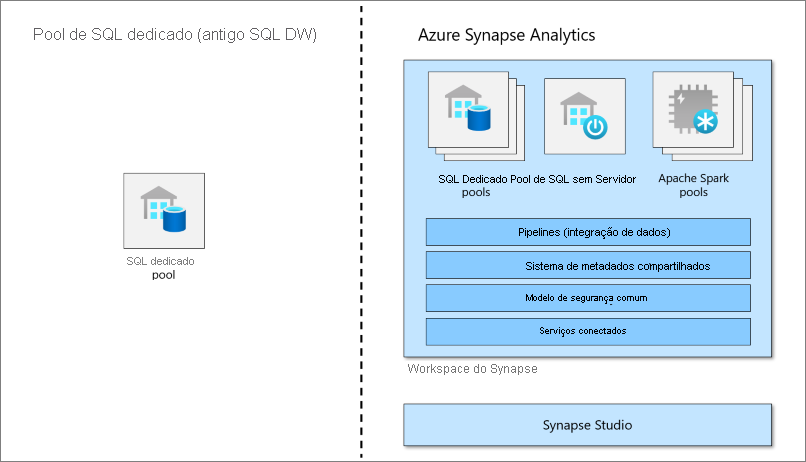
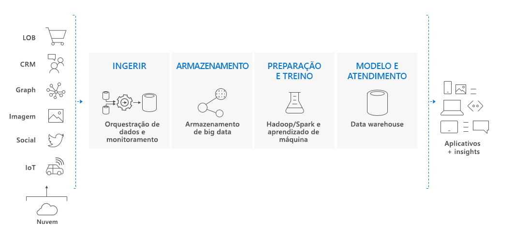

# O que é o pool de SQL dedicado (antigo SQL DW) no Azure Synapse Analytics?

O Azure Synapse Analytics é um serviço de análise que reúne data warehouse corporativo e análise de Big Data. O pool de SQL dedicado (antigo SQL DW) refere-se aos recursos de data warehouse empresariais que estão disponíveis no Azure Synapse Analytics.

O pool de SQL dedicado (antigo SQL DW) representa uma coleção de recursos de análise provisionados durante o uso do SQL do Synapse. O tamanho do pool de SQL dedicado (antigo SQL DW) é determinado pelas DWU (unidades de data warehouse).

Depois que seu pool de SQL dedicado for criado, importe Big Data com consultas T-SQL simples do [PolyBase](/sql/relational-databases/polybase/polybase-guide?toc=/azure/synapse-analytics/sql-data-warehouse/toc.json&bc=/azure/synapse-analytics/sql-data-warehouse/breadcrumb/toc.json&view=azure-sqldw-latest&preserve-view=true) e use a eficácia do mecanismo de consulta distribuída para executar a análise de alto desempenho. À medida que você integrar e analisar os dados, o pool de SQL dedicado (antigo SQL DW) se tornará a única versão da verdade com que sua empresa poderá contar para obter insights mais rápidos e robustos.

> [!NOTE]
>Explore a [documentação do Azure Synapse Analytics](../overview-what-is.md).
> 

## Componente fundamental de uma solução de big data

Data warehouse é um componente fundamental de uma solução completa de big data baseada na nuvem.

Em uma solução de dados de nuvem, os dados são incluídos nos repositórios de big data de uma variedade de fontes. Uma vez em um repositório de big data, os algoritmos do Hadoop, do Spark e de machine learning preparam e treinam os dados. Quando os dados estiverem prontos para análises complexas, o pool de SQL dedicado usará o PolyBase para consultar os armazenamentos de Big Data. O PolyBase usa consultas T-SQL padrão para trazer os dados para as tabelas do pool de SQL dedicado (antigo SQL DW).

O pool de SQL dedicado (antigo SQL DW) armazena dados em tabelas relacionais com armazenamento em colunas. Esse formato reduz significativamente os custos de armazenamento de dados e aprimora o desempenho da consulta. Depois que os dados forem armazenados, você poderá executar análises em grande escala. Em comparação aos tradicionais sistemas de banco de dados, as consultas de análise são concluídas em segundos em vez de minutos, ou em horas em vez de dias.

Os resultados da análise podem ir para aplicativos ou bancos de dados em todo o mundo. Os analistas de negócios podem então obter informações para tomar decisões de negócios bem informadas.

## Próximas etapas

- Explorar a [arquitetura do Azure Synapse](massively-parallel-processing-mpp-architecture.md)
- Rapidamente [criar um pool de SQL dedicado](create-data-warehouse-portal.md)
- [Carregue dados de exemplo](./load-data-from-azure-blob-storage-using-copy.md).
- Explore os [Vídeos](https://azure.microsoft.com/documentation/videos/index/?services=sql-data-warehouse)

Ou, dê uma olhada em alguns desses outros recursos do Azure Synapse.

- Pesquisar em [Blogs](https://azure.microsoft.com/blog/tag/azure-sql-data-warehouse/)
- Enviar [Solicitações de recurso](https://feedback.azure.com/forums/307516-sql-data-warehouse)
- [Criar um tíquete de suporte](sql-data-warehouse-get-started-create-support-ticket.md)
- Pesquisar [Página de P e R da Microsoft](/answers/topics/azure-synapse-analytics.html)
- Pesquisar no [Fórum Stack Overflow](https://stackoverflow.com/questions/tagged/azure-sqldw)