# Integração do controle do código-fonte para o pool de SQL dedicado no Azure Synapse Analytics

Este tutorial descreve como integrar seu projeto de banco de dados SSDT (SQL Server Data Tools) com controle do código-fonte.  A integração do controle do código-fonte é a primeira etapa na criação do seu pipeline de implantação e integração contínua com o recurso de pool de SQL dedicado no Azure Synapse Analytics.

## Antes de começar

- Inscreva-se para obter uma [organização do Azure DevOps](https://azure.microsoft.com/services/devops/)
- Percorra o tutorial [Criar e Conectar](create-data-warehouse-portal.md)
- [Instale o Visual Studio 2019](https://visualstudio.microsoft.com/vs/older-downloads/)

## Configurar e conectar ao Azure DevOps

1. Em sua Organização do Azure DevOps, crie um projeto que hospedará seu projeto de banco de dados do SSDT por meio de um Repositório do Azure.

   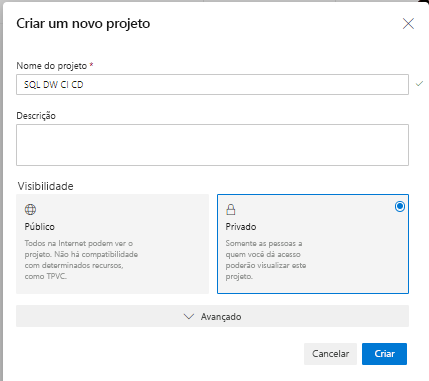

2. Abra o Visual Studio e conecte-se à sua organização e projeto do Azure DevOps da etapa um selecionando **Gerenciar Conexão**.

   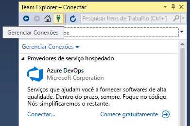

3. Conecte-se ao seu projeto selecionando **Gerenciar Conexões** e **Conectar-se a um projeto**.
 
    

4. Localize o projeto que você criou na etapa um e selecione **Conectar**.
 
    

3. Clone seu repositório do Azure DevOps de seu projeto para o computador local.

   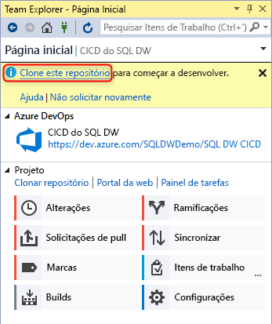

Para obter mais informações sobre como conectar projetos usando o Visual Studio, confira [Conectar-se a projetos no Team Explorer](/visualstudio/ide/connect-team-project?view=vs-2019&preserve-view=true). Para obter diretrizes sobre como clonar um repositório usando o Visual Studio, examine o artigo [Clonar um repositório Git de saída](/azure/devops/repos/git/clone?tabs=visual-studio). 

## Criar e conectar o projeto

1. No Visual Studio, crie um novo Projeto de Banco de Dados do SQL Server com um diretório e um repositório Git local em seu **repositório clonado local**.

   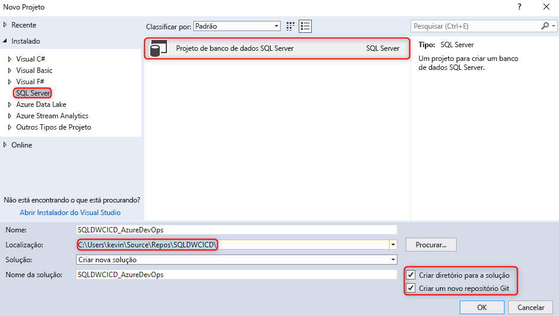  

2. Clique com o botão direito do mouse em seu sqlproject vazio e importe seu data warehouse para o projeto de banco de dados.

   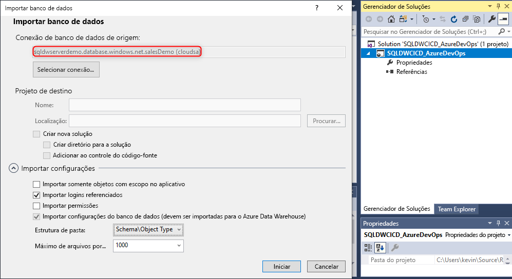  

3. No Team Explorer no Visual Studio, confirme suas alterações no repositório Git local.

   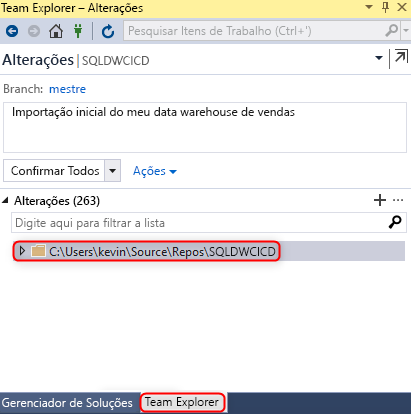  

4. Agora que você tem as alterações confirmadas localmente no repositório clonado, sincronize e envie por push suas alterações para o repositório Azure Repo em seu projeto do Azure DevOps.

   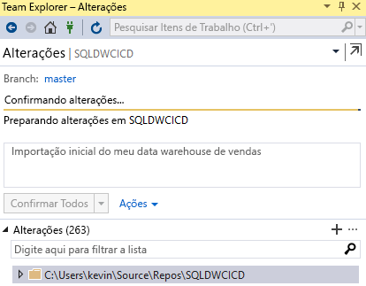

   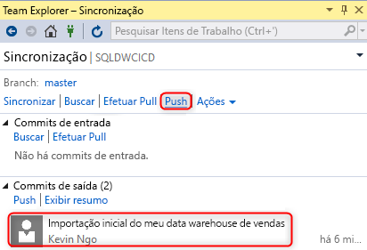  

## Validação

1. Verifique se as alterações foram enviadas por push para o Repositório do Azure atualizando uma coluna de tabela em seu projeto de banco de dados no SSDT (SQL Server Data Tools) do Visual Studio.

   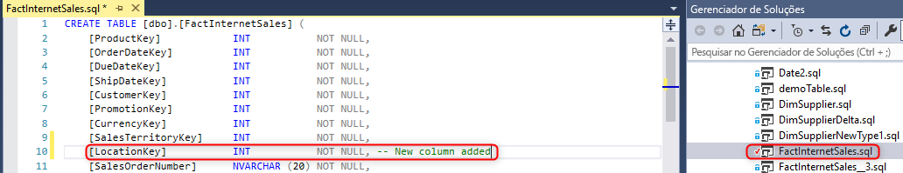

2. Confirme e envie por push a alteração do repositório local para seu Azure Repo.

   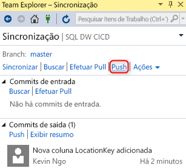

3. Verifique se a alteração foi enviada por push em seu repositório Azure Repo.

   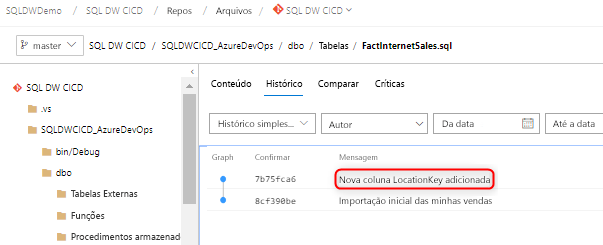

4. (**Opcional**) Use a Comparação de Esquemas e atualize as alterações no pool de SQL dedicado de destino usando o SSDT, para garantir que as definições de objeto no repositório do Azure e no repositório local reflitam o pool de SQL dedicado.

## Próximas etapas

- [Desenvolvimento do pool de SQL dedicado](sql-data-warehouse-overview-develop.md)