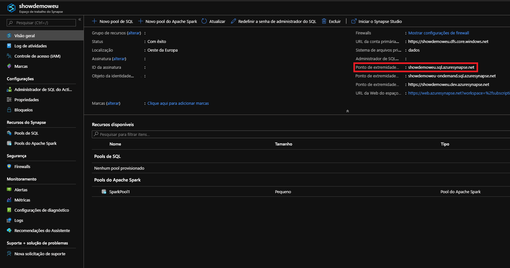

# <a name="connect-to-synapse-sql"></a>Conectar-se ao Synapse SQL
Conecte-se à funcionalidade Synapse SQL no Azure Synapse Analytics.

## <a name="supported-tools-for-sql-on-demand-preview"></a>Ferramentas compatíveis com o SQL sob demanda (versão prévia)

A ferramenta totalmente compatível é o Azure Data Studio (versão prévia).

Há suporte parcial para o SQL Server Management Studio na versão 18.4 em diante. Há recursos limitados, como conexão e consulta.

## <a name="find-your-server-name"></a>Localizar o nome do servidor

O nome do servidor para o pool de SQL no seguinte exemplo é: showdemoweu.sql.azuresynapse.net.
O nome do servidor para o SQL sob demanda no seguinte exemplo é: showdemoweu-ondemand.sql.azuresynapse.net.

Para localizar o nome de servidor totalmente qualificado:

1. Vá para o [Portal do Azure](https://portal.azure.com).
2. Clique em **Workspaces do Synapse**.
3. Clique no workspace ao qual deseja se conectar.
4. Acesse a visão geral.
5. Localize o nome completo do servidor.

## <a name="sql-pool"></a>**Pool de SQL**



## <a name="sql-on-demand"></a>**SQL sob demanda**


## <a name="supported-drivers-and-connection-strings"></a>Drivers suportados e cadeias de conexão
O Synapse SQL dá suporte a [ADO.NET](https://msdn.microsoft.com/library/e80y5yhx(v=vs.110).aspx), [ODBC](https://msdn.microsoft.com/library/jj730314.aspx), [PHP](https://msdn.microsoft.com/library/cc296172.aspx?f=255&MSPPError=-2147217396) e [JDBC](https://msdn.microsoft.com/library/mt484311(v=sql.110).aspx). Para encontrar a versão e a documentação mais recentes, clique em um dos drivers anteriores. Para gerar automaticamente a cadeia de conexão para o driver que você está usando no Portal do Azure, clique em **Mostrar cadeias de conexão de banco de dados** no exemplo anterior. A seguir também há alguns exemplos da aparência de uma cadeia de conexão para cada driver.

> [!NOTE]
> Considere definir o tempo limite de conexão para 300 segundos a fim de permitir que a conexão perdure em curtos períodos de indisponibilidade.

### <a name="adonet-connection-string-example"></a>Exemplo de cadeia de conexão do ADO.NET

```csharp
Server=tcp:{your_server}.sql.azuresynapse.net,1433;Database={your_database};User ID={your_user_name};Password={your_password_here};Encrypt=True;TrustServerCertificate=False;Connection Timeout=30;
```

### <a name="odbc-connection-string-example"></a>Exemplo de cadeia de conexão do ODBC

```csharp
Driver={SQL Server Native Client 11.0};Server=tcp:{your_server}.sql.azuresynapse.net,1433;Database={your_database};Uid={your_user_name};Pwd={your_password_here};Encrypt=yes;TrustServerCertificate=no;Connection Timeout=30;
```

### <a name="php-connection-string-example"></a>Exemplo de cadeia de conexão do PHP

```PHP
Server: {your_server}.sql.azuresynapse.net,1433 \r\nSQL Database: {your_database}\r\nUser Name: {your_user_name}\r\n\r\nPHP Data Objects(PDO) Sample Code:\r\n\r\ntry {\r\n   $conn = new PDO ( \"sqlsrv:server = tcp:{your_server}.sql.azuresynapse.net,1433; Database = {your_database}\", \"{your_user_name}\", \"{your_password_here}\");\r\n    $conn->setAttribute( PDO::ATTR_ERRMODE, PDO::ERRMODE_EXCEPTION );\r\n}\r\ncatch ( PDOException $e ) {\r\n   print( \"Error connecting to SQL Server.\" );\r\n   die(print_r($e));\r\n}\r\n\rSQL Server Extension Sample Code:\r\n\r\n$connectionInfo = array(\"UID\" => \"{your_user_name}\", \"pwd\" => \"{your_password_here}\", \"Database\" => \"{your_database}\", \"LoginTimeout\" => 30, \"Encrypt\" => 1, \"TrustServerCertificate\" => 0);\r\n$serverName = \"tcp:{your_server}.sql.azuresynapse.net,1433\";\r\n$conn = sqlsrv_connect($serverName, $connectionInfo);
```

### <a name="jdbc-connection-string-example"></a>Exemplo de cadeia de conexão do JDBC

```Java
jdbc:sqlserver://yourserver.sql.azuresynapse.net:1433;database=yourdatabase;user={your_user_name};password={your_password_here};encrypt=true;trustServerCertificate=false;hostNameInCertificate=*.sql.azuresynapse.net;loginTimeout=30;
```

## <a name="connection-settings"></a>Configurações de conexão
O Synapse SQL padroniza algumas configurações durante a conexão e a criação do objeto. Essas configurações não podem ser substituídas e incluem:

| Configuração de banco de dados | Valor |
|:--- |:--- |
| [ANSI_NULLS](/sql/t-sql/statements/set-ansi-nulls-transact-sql?toc=/azure/synapse-analytics/toc.json&bc=/azure/synapse-analytics/breadcrumb/toc.json&view=azure-sqldw-latest) |ATIVADO |
| [QUOTED_IDENTIFIERS](/sql/t-sql/statements/set-quoted-identifier-transact-sql?toc=/azure/synapse-analytics/toc.json&bc=/azure/synapse-analytics/breadcrumb/toc.json&view=azure-sqldw-latest) |ATIVADO |
| [DATEFORMAT](/sql/t-sql/statements/set-dateformat-transact-sql?toc=/azure/synapse-analytics/toc.json&bc=/azure/synapse-analytics/breadcrumb/toc.json&view=azure-sqldw-latest) |mda |
| [DATEFIRST](/sql/t-sql/statements/set-datefirst-transact-sql?toc=/azure/synapse-analytics/toc.json&bc=/azure/synapse-analytics/breadcrumb/toc.json&view=azure-sqldw-latest) |7 |

## <a name="recommendations"></a>Recomendações

Para executar consultas do **SQL sob demanda**, as ferramentas recomendadas são o [Azure Data Studio](get-started-azure-data-studio.md) e o Azure Synapse Studio.

## <a name="next-steps"></a>Próximas etapas
Para se conectar e consultar com o Visual Studio, veja [Consultar com o Visual Studio](../sql-data-warehouse/sql-data-warehouse-query-visual-studio.md?toc=/azure/synapse-analytics/toc.json&bc=/azure/synapse-analytics/breadcrumb/toc.json). Para saber mais sobre as opções de autenticação, confira [Autenticação no Synapse SQL](../sql-data-warehouse/sql-data-warehouse-authentication.md?toc=/azure/synapse-analytics/toc.json&bc=/azure/synapse-analytics/breadcrumb/toc.json).