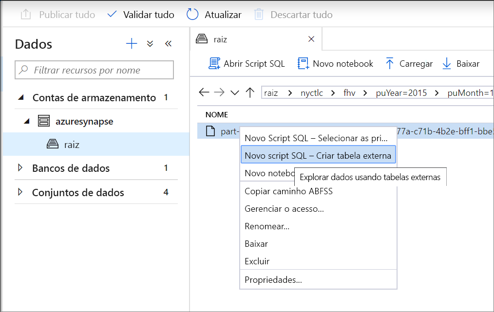
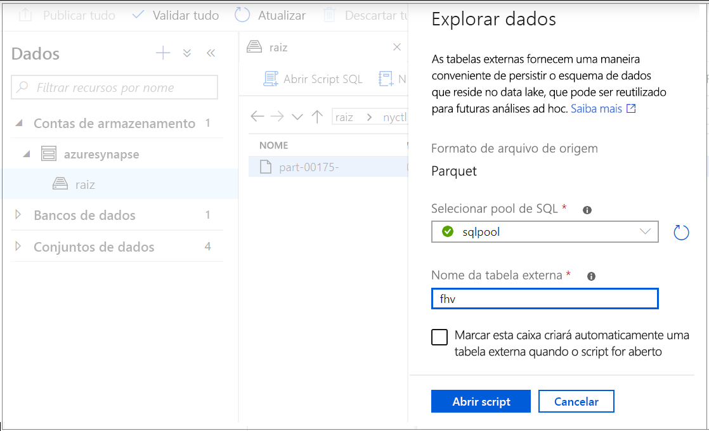
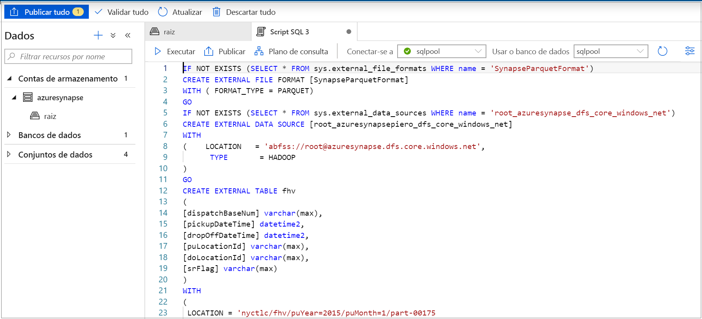
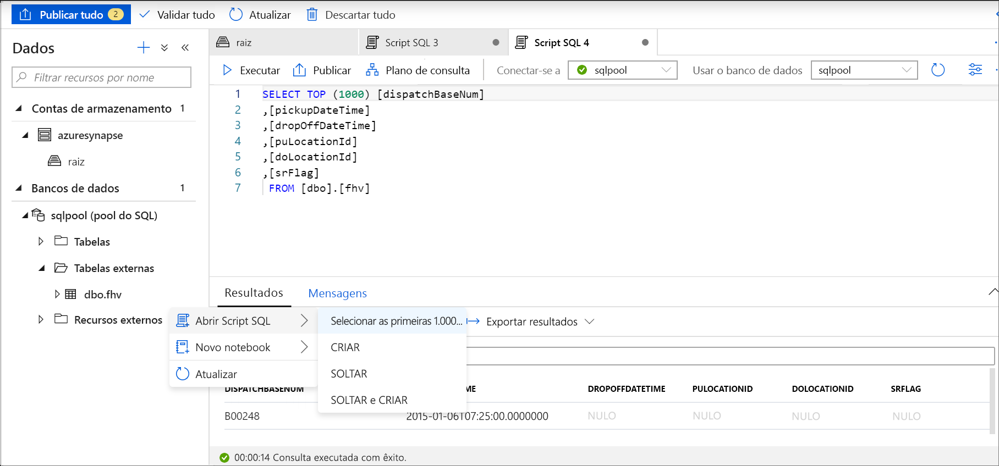

# <a name="use-external-tables-with-synapse-sql"></a>Usar tabelas externas com Synapse SQL

Uma tabela externa aponta para dados localizados no Hadoop, no Azure Storage Blob ou no Azure Data Lake Storage. As tabelas externas são usadas para ler dados de arquivos ou gravar dados em arquivos no Armazenamento do Azure. Com o SQL do Synapse, você pode usar tabelas externas para ler e gravar dados no pool de SQL dedicado ou no pool de SQL sem servidor.

## <a name="external-tables-in-dedicated-sql-pool-and-serverless-sql-pool"></a>Tabelas externas no pool de SQL dedicado e no pool de SQL sem servidor

### <a name="dedicated-sql-pool"></a>[Pool de SQL dedicado](#tab/sql-pool) 

No pool de SQL dedicado, você pode usar uma tabela externa para:

- Consultar o Armazenamento de Blobs do Azure e o Azure Data Lake Gen2 com instruções Transact-SQL.
- Importar e armazenar dados do Armazenamento de Blobs do Azure e do Azure Data Lake Storage no pool de SQL dedicado.

Quando usada em conjunto com a instrução [CREATE TABLE AS SELECT](../sql-data-warehouse/sql-data-warehouse-develop-ctas.md?toc=/azure/synapse-analytics/toc.json&bc=/azure/synapse-analytics/breadcrumb/toc.json), a seleção em uma tabela externa importa dados para uma tabela no pool de SQL. Além da [instrução COPY](/sql/t-sql/statements/copy-into-transact-sql?view=azure-sqldw-latest&preserve-view=true), as tabelas externas são úteis para carregar dados. 

Para ver um tutorial de carregamento, confira [Usar o PolyBase para carregar dados do Armazenamento de Blobs do Azure](../sql-data-warehouse/load-data-from-azure-blob-storage-using-copy.md?bc=%2fazure%2fsynapse-analytics%2fbreadcrumb%2ftoc.json&toc=%2fazure%2fsynapse-analytics%2ftoc.json).

### <a name="serverless-sql-pool"></a>[Pool de SQL sem servidor](#tab/sql-on-demand)

No pool de SQL sem servidor, você poderá usar uma tabela externa para:

- Consultar dados no Armazenamento de Blobs do Azure ou no Azure Data Lake Storage com instruções Transact-SQL
- Armazenar resultados da consulta do pool de SQL sem servidor em arquivos no Armazenamento de Blobs do Azure ou no Azure Data Lake Storage usando [CETAS](develop-tables-cetas.md)

Você pode criar tabelas externas usando o pool de SQL sem servidor por meio das seguintes etapas:

1. CREATE EXTERNAL DATA SOURCE
2. CREATE EXTERNAL FILE FORMAT
3. CREATE EXTERNAL TABLE

---

### <a name="security"></a>Segurança

O usuário deve ter a permissão `SELECT` na tabela externa para ler os dados.
Acesso à tabela externa subjacente ao Armazenamento do Azure usando a credencial com escopo do banco de dados definida na fonte de dados usando as seguintes regras:
- Uma fonte de dados sem credencial habilita as tabelas externas a acessarem arquivos publicamente disponíveis no Armazenamento do Azure.
- A fonte de dados pode ter uma credencial que habilita as tabelas externas a acessarem somente os arquivos no Armazenamento do Azure usando o token SAS ou a Identidade Gerenciada do workspace – para ver exemplos, consulte o artigo [Desenvolver o controle de acesso ao armazenamento de arquivos](develop-storage-files-storage-access-control.md#examples).

> [!IMPORTANT]
> No pool de SQL dedicado, a fonte de dados criada sem uma credencial permite que os usuários do Azure AD acessem os arquivos de armazenamento usando a identidade do Azure AD. No pool de SQL sem servidor, você precisa criar uma fonte de dados com a credencial com escopo do banco de dados que tem a propriedade `IDENTITY='User Identity'`. Confira [exemplos aqui](develop-storage-files-storage-access-control.md#examples).

## <a name="create-external-data-source"></a>CREATE EXTERNAL DATA SOURCE

Fontes de dados externas são usadas para se conectar a contas de armazenamento. A documentação completa está delineada [aqui](/sql/t-sql/statements/create-external-data-source-transact-sql?view=azure-sqldw-latest&preserve-view=true).

### <a name="syntax-for-create-external-data-source"></a>Sintaxe de CREATE EXTERNAL DATA SOURCE

#### <a name="dedicated-sql-pool"></a>[Pool de SQL dedicado](#tab/sql-pool)

```syntaxsql
CREATE EXTERNAL DATA SOURCE <data_source_name>
WITH
(    LOCATION         = '<prefix>://<path>'
     [, CREDENTIAL = <database scoped credential> ]
     , TYPE = HADOOP
)
[;]
```

#### <a name="serverless-sql-pool"></a>[Pool de SQL sem servidor](#tab/sql-on-demand)

```syntaxsql
CREATE EXTERNAL DATA SOURCE <data_source_name>
WITH
(    LOCATION         = '<prefix>://<path>'
     [, CREDENTIAL = <database scoped credential> ]
)
[;]
```

---

### <a name="arguments-for-create-external-data-source"></a>Argumentos de CREATE EXTERNAL DATA SOURCE

data_source_name

Especifica o nome da fonte de dados definido pelo usuário. O nome deve ser exclusivo no banco de dados.

#### <a name="location"></a>Location
LOCATION = `'<prefix>://<path>'` – Fornece o protocolo de conectividade e o caminho para a fonte de dados externa. Os seguintes padrões podem ser usados na localização:

| Fonte de dados externa        | Prefixo de local | Caminho de local                                         |
| --------------------------- | --------------- | ----------------------------------------------------- |
| Armazenamento do Blobs do Azure          | `wasb[s]`       | `<container>@<storage_account>.blob.core.windows.net` |
| Armazenamento do Blobs do Azure          | `http[s]`       | `<storage_account>.blob.core.windows.net/<container>/subfolders` |
| Azure Data Lake Storage Gen 1 | `http[s]`       | `<storage_account>.azuredatalakestore.net/webhdfs/v1` |
| Azure Data Lake Storage Gen 2 | `http[s]`       | `<storage_account>.dfs.core.windows.net/<container>/subfolders`  |

O prefixo `https:` permite que você use subpasta no caminho.

#### <a name="credential"></a>Credencial
CREDENTIAL = `<database scoped credential>` é uma credencial opcional que será usada para autenticar no Armazenamento do Azure. A fonte de dados externa sem credencial pode acessar a conta do armazenamento público. 

As fontes de dados externas sem uma credencial no pool de SQL dedicado também usarão a identidade dos chamadores do Azure AD para acessar arquivos no armazenamento. Uma fonte de dados externa para o pool de SQL sem servidor com as credenciais `IDENTITY='User Identity'` usará a identidade do Azure AD do chamador para acessar arquivos.
- No pool de SQL dedicado, a credencial com escopo do banco de dados pode especificar a identidade do aplicativo personalizada, a Identidade Gerenciada do workspace ou a chave SAK. 
- No pool de SQL sem servidor, a credencial com escopo do banco de dados pode especificar a identidade do Azure AD do chamador, a Identidade Gerenciada do workspace ou a chave SAS. 

#### <a name="type"></a>TYPE
TYPE = `HADOOP` é a opção obrigatória no pool de SQL dedicado e especifica que a tecnologia do Polybase é usada para acessar arquivos subjacentes. Esse parâmetro não pode ser usado no pool de SQL sem servidor que usa o leitor nativo interno.

### <a name="example-for-create-external-data-source"></a>Exemplo de CREATE EXTERNAL DATA SOURCE

#### <a name="dedicated-sql-pool"></a>[Pool de SQL dedicado](#tab/sql-pool)

O seguinte exemplo cria uma fonte de dados externa para o Azure Data Lake Gen2 apontando para o conjunto de dados de Nova York:

```sql
CREATE EXTERNAL DATA SOURCE AzureDataLakeStore
WITH
  -- Please note the abfss endpoint when your account has secure transfer enabled
  ( LOCATION = 'abfss://data@newyorktaxidataset.dfs.core.windows.net' ,
    CREDENTIAL = ADLS_credential ,
    TYPE = HADOOP
  ) ;
```

#### <a name="serverless-sql-pool"></a>[Pool de SQL sem servidor](#tab/sql-on-demand)

O seguinte exemplo cria uma fonte de dados externa para o Azure Data Lake Gen2 que pode ser acessada usando a credencial SAS:

```sql
CREATE DATABASE SCOPED CREDENTIAL [sqlondemand]
WITH IDENTITY='SHARED ACCESS SIGNATURE',  
SECRET = 'sv=2018-03-28&ss=bf&srt=sco&sp=rl&st=2019-10-14T12%3A10%3A25Z&se=2061-12-31T12%3A10%3A00Z&sig=KlSU2ullCscyTS0An0nozEpo4tO5JAgGBvw%2FJX2lguw%3D'
GO

CREATE EXTERNAL DATA SOURCE SqlOnDemandDemo WITH (
    LOCATION = 'https://sqlondemandstorage.blob.core.windows.net',
    CREDENTIAL = sqlondemand
);
```

O seguinte exemplo cria uma fonte de dados externa para o Azure Data Lake Gen2 apontando para o conjunto de dados de Nova York disponível publicamente:

```sql
CREATE EXTERNAL DATA SOURCE YellowTaxi
WITH ( LOCATION = 'https://azureopendatastorage.blob.core.windows.net/nyctlc/yellow/')
```
---

## <a name="create-external-file-format"></a>CREATE EXTERNAL FILE FORMAT

Cria um objeto com formato de arquivo externo que define dados externos armazenados no Armazenamento de Blobs do Azure ou no Azure Data Lake Storage. Criar um formato de arquivo externo é um pré-requisito para criar uma tabela externa. A documentação completa está [aqui](/sql/t-sql/statements/create-external-file-format-transact-sql?view=azure-sqldw-latest&preserve-view=true).

Ao criar um formato de arquivo externo, você especificará o layout real dos dados referenciados por uma tabela externa.

### <a name="syntax-for-create-external-file-format"></a>Sintaxe de CREATE EXTERNAL FILE FORMAT

#### <a name="sql-pool"></a>[Pool de SQL](#tab/sql-pool)

```syntaxsql
-- Create an external file format for PARQUET files.  
CREATE EXTERNAL FILE FORMAT file_format_name  
WITH (  
    FORMAT_TYPE = PARQUET  
    [ , DATA_COMPRESSION = {  
        'org.apache.hadoop.io.compress.SnappyCodec'  
      | 'org.apache.hadoop.io.compress.GzipCodec'      }  
    ]);  

--Create an external file format for DELIMITED TEXT files
CREATE EXTERNAL FILE FORMAT file_format_name  
WITH (  
    FORMAT_TYPE = DELIMITEDTEXT  
    [ , DATA_COMPRESSION = 'org.apache.hadoop.io.compress.GzipCodec' ]
    [ , FORMAT_OPTIONS ( <format_options> [ ,...n  ] ) ]  
    );  

<format_options> ::=  
{  
    FIELD_TERMINATOR = field_terminator  
    | STRING_DELIMITER = string_delimiter
    | First_Row = integer
    | USE_TYPE_DEFAULT = { TRUE | FALSE }
    | Encoding = {'UTF8' | 'UTF16'}
}
```

#### <a name="serverless-sql-pool"></a>[Pool de SQL sem servidor](#tab/sql-on-demand)

```syntaxsql
-- Create an external file format for PARQUET files.  
CREATE EXTERNAL FILE FORMAT file_format_name  
WITH (  
    FORMAT_TYPE = PARQUET  
    [ , DATA_COMPRESSION = {  
        'org.apache.hadoop.io.compress.SnappyCodec'  
      | 'org.apache.hadoop.io.compress.GzipCodec'      }  
    ]);  

--Create an external file format for DELIMITED TEXT files
CREATE EXTERNAL FILE FORMAT file_format_name  
WITH (  
    FORMAT_TYPE = DELIMITEDTEXT  
    [ , DATA_COMPRESSION = 'org.apache.hadoop.io.compress.GzipCodec' ]
    [ , FORMAT_OPTIONS ( <format_options> [ ,...n  ] ) ]  
    );  

<format_options> ::=  
{  
    FIELD_TERMINATOR = field_terminator  
    | STRING_DELIMITER = string_delimiter
    | First_Row = integer
    | USE_TYPE_DEFAULT = { TRUE | FALSE }
    | Encoding = {'UTF8' | 'UTF16'}
    | PARSER_VERSION = {'parser_version'}
}
```

---


### <a name="arguments-for-create-external-file-format"></a>Argumentos de CREATE EXTERNAL FILE FORMAT

file_format_name – Especifica um nome para o formato de arquivo externo.

FORMAT_TYPE = [ PARQUET | DELIMITEDTEXT] – Especifica o formato dos dados externos.

- PARQUET – Especifica um formato Parquet.
- DELIMITEDTEXT – Especifica um formato de texto com delimitadores de coluna, também chamado de terminadores de campo.

FIELD_TERMINATOR = *field_terminator* – Aplica-se somente a arquivos de texto delimitados. O terminador de campo especifica um ou mais caracteres que marcam o final de cada campo (coluna) no arquivo de texto delimitado. O padrão é o caractere barra vertical ('|').

Exemplos:

- FIELD_TERMINATOR = '|'
- FIELD_TERMINATOR = ' '
- FIELD_TERMINATOR = ꞌ\tꞌ

STRING_DELIMITER = *string_delimiter* – Especifica o terminador de campo dos dados da cadeia de caracteres de tipo no arquivo de texto delimitado. O delimitador de cadeia de caracteres tem um ou mais caracteres de comprimento e está entre aspas simples. O padrão é a cadeia de caracteres vazia ("").

Exemplos:

- STRING_DELIMITER = '"'
- STRING_DELIMITER = '*'
- STRING_DELIMITER = ꞌ,ꞌ

FIRST_ROW = *First_row_int* – Especifica o número da linha que é lido primeiro e se aplica a todos os arquivos. A definição do valor como dois faz com que a primeira linha em todos os arquivos (linha de cabeçalho) seja ignorada quando os dados forem carregados. As linhas são ignoradas com base na existência de terminadores de linhas (/r/n, /r, /n).

USE_TYPE_DEFAULT = { TRUE | **FALSE** } – Especifica como tratar valores ausentes em arquivos de texto delimitados ao recuperar dados do arquivo de texto.

TRUE – Se estiver recuperando dados do arquivo de texto, armazene cada valor ausente, usando o tipo de dados do valor padrão da coluna correspondente na definição da tabela externa. Por exemplo, substitua um valor ausente por:

- 0 se a coluna for definida como uma coluna numérica. Colunas decimais não são compatíveis e causarão um erro.
- Cadeia de caracteres vazia ("") se a coluna for uma coluna de cadeia de caracteres.
- 1900-01-01 se a coluna for uma coluna de data.

FALSE – Armazene todos os valores ausentes como NULL. Todos os valores NULL que estão armazenados usando a palavra NULL no arquivo de texto delimitado são importados como a cadeia de caracteres 'NULL'.

Encoding = {'UTF8' | 'UTF16'} – O pool de SQL sem servidor pode ler arquivos de texto delimitados de codificação UTF8 e UTF16.

DATA_COMPRESSION = *data_compression_method* – Esse argumento especifica o método de compactação de dados para os dados externos. 

O tipo de formato de arquivo PARQUET é compatível com este método de compactação:

- DATA_COMPRESSION = 'org.apache.hadoop.io.compress.GzipCodec'
- DATA_COMPRESSION = 'org.apache.hadoop.io.compress.SnappyCodec'

Ao ler de tabelas externas PARQUET, esse argumento é ignorado, mas é usado ao gravar em tabelas externas usando [CETAS](develop-tables-cetas.md).

O tipo de formato de arquivo DELIMITEDTEXT é compatível com este método de compactação:

- DATA_COMPRESSION = 'org.apache.hadoop.io.compress.GzipCodec'

PARSER_VERSION = 'parser_version' Especifica a versão do analisador a ser usada durante a leitura de arquivos. Verifique o argumento PARSER_VERSION nos argumentos [OPENROWSET](develop-openrowset.md#arguments) para obter detalhes.

### <a name="example-for-create-external-file-format"></a>Exemplo de CREATE EXTERNAL FILE FORMAT

O seguinte exemplo cria um formato de arquivo externo para arquivos de censo:

```sql
CREATE EXTERNAL FILE FORMAT census_file_format
WITH
(  
    FORMAT_TYPE = PARQUET,
    DATA_COMPRESSION = 'org.apache.hadoop.io.compress.SnappyCodec'
)
```

## <a name="create-external-table"></a>CREATE EXTERNAL TABLE

O comando CREATE EXTERNAL TABLE cria uma tabela externa para o Synapse SQL acessar os dados armazenados no Armazenamento de Blobs do Azure ou no Azure Data Lake Storage. 

### <a name="syntax-for-create-external-table"></a>Sintaxe de CREATE EXTERNAL TABLE

```sql
CREATE EXTERNAL TABLE { database_name.schema_name.table_name | schema_name.table_name | table_name }
    ( <column_definition> [ ,...n ] )  
    WITH (
        LOCATION = 'folder_or_filepath',  
        DATA_SOURCE = external_data_source_name,  
        FILE_FORMAT = external_file_format_name
    )  
[;]  

<column_definition> ::=
column_name <data_type>
    [ COLLATE collation_name ]
```

### <a name="arguments-create-external-table"></a>Argumentos de CREATE EXTERNAL TABLE

*{ database_name.schema_name.table_name | schema_name.table_name | table_name }*

O nome de uma a três partes da tabela a ser criada. Para uma tabela externa, o pool de SQL sem servidor armazena apenas os metadados da tabela. Nenhum dado real é movido ou armazenado no pool de SQL sem servidor.

<column_definition>, ...*n* ]

CREATE EXTERNAL TABLE é compatível com a configuração de nome de coluna, tipo de dados e ordenação. Não é possível usar a DEFAULT CONSTRAINT em tabelas externas.

>[!IMPORTANT]
>As definições de coluna, incluindo os tipos de dados e o número de colunas, devem corresponder aos dados nos arquivos externos. Se houver uma incompatibilidade, as linhas do arquivo serão rejeitadas ao consultar os dados propriamente ditos.

Ao ler em arquivos Parquet, você pode especificar apenas as colunas que deseja ler e ignorar o restante.

LOCATION = '*folder_or_filepath*'

Especifica a pasta ou o caminho do arquivo e o nome de arquivo para os dados reais no Armazenamento de Blobs do Azure. O local inicia da pasta raiz. A pasta raiz é o local de dados especificado na fonte de dados externa.

Se você especifica a LOCATION da pasta, uma consulta do pool de SQL sem servidor é selecionada na tabela externa e recupera os arquivos da pasta.

> [!NOTE]
> Ao contrário do Hadoop e do PolyBase, o pool de SQL sem servidor não retorna subpastas. Ele retorna arquivos cujos nomes de arquivo começam com um sublinhado (_) ou um ponto final (.).

Neste exemplo, se 'LOCATION='/webdata/', uma consulta do pool de SQL sem servidor retornará linhas de mydata.txt e _hidden.txt. Ele não retornará mydata2.txt e mydata3.txt porque eles estão localizados em uma subpasta.


DATA_SOURCE = *external_data_source_name* – Especifica o nome da fonte de dados externa que contém a localização dos dados externos. Para criar uma fonte de dados externa, use [CREATE EXTERNAL DATA SOURCE](#create-external-data-source).

FILE_FORMAT = *external_file_format_name* – Especifica o nome do objeto com formato de arquivo externo que armazena o tipo de arquivo e o método de compactação dos dados externos. Para criar um formato de arquivo externo, use [CREATE EXTERNAL FILE FORMAT](#create-external-file-format).

### <a name="permissions-create-external-table"></a>Permissões CREATE EXTERNAL TABLE

Para selecionar em uma tabela externa, você precisa de credenciais adequadas com permissões de lista e leitura.

### <a name="example-create-external-table"></a>Exemplo de CREATE EXTERNAL TABLE

O exemplo a seguir cria uma tabela externa. Ele retorna a primeira linha:

```sql
CREATE EXTERNAL TABLE census_external_table
(
    decennialTime varchar(20),
    stateName varchar(100),
    countyName varchar(100),
    population int,
    race varchar(50),
    sex    varchar(10),
    minAge int,
    maxAge int
)  
WITH (
    LOCATION = '/parquet/',
    DATA_SOURCE = population_ds,  
    FILE_FORMAT = census_file_format
)
GO

SELECT TOP 1 * FROM census_external_table
```

## <a name="create-and-query-external-tables-from-a-file-in-azure-data-lake"></a>Criar e consultar tabelas externas de um arquivo no Azure Data Lake

Usando as funcionalidades de exploração do Data Lake, agora você pode criar e consultar uma tabela externa usando o pool de SQL dedicado ou o pool de SQL sem servidor com um simples clique com o botão direito do mouse no arquivo. Só há suporte para o gesto de único clique para criar tabelas externas da conta de armazenamento do ADLS Gen2 para arquivos Parquet. 

### <a name="prerequisites"></a>Pré-requisitos

- Você deve ter acesso ao workspace com, pelo menos, a função de acesso de Colaborador de Dados do Blob de Armazenamento do ARM na conta do ADLS Gen2

- Você deve ter pelo menos [permissões para criar](/sql/t-sql/statements/create-external-table-transact-sql?view=azure-sqldw-latest#permissions-2&preserve-view=true) e consultar tabelas externas no pool de SQL ou no SQL OD (SQL sob demanda)

No painel Dados, selecione o arquivo do qual você gostaria de criar a tabela externa:
> [!div class="mx-imgBorder"]
>

Uma janela de diálogo será aberta. Selecione o pool de SQL dedicado ou o pool de SQL sem servidor, dê um nome à tabela e selecione abrir script:

> [!div class="mx-imgBorder"]
>

O Script do SQL é gerado automaticamente inferindo o esquema do arquivo:
> [!div class="mx-imgBorder"]
>

Execute o script. O script executará automaticamente Select Top 100 *:
> [!div class="mx-imgBorder"]
>

Agora a tabela externa está criada; para exploração futura do conteúdo dessa tabela externa, o usuário poderá consultá-la diretamente no painel Dados:
> [!div class="mx-imgBorder"]
>

## <a name="next-steps"></a>Próximas etapas

Confira o artigo [CETAS](develop-tables-cetas.md) para saber como salvar os resultados da consulta em uma tabela externa no Armazenamento do Azure. Ou você pode tentar consultar as [Tabelas externas do Apache Spark para o Azure Synapse](develop-storage-files-spark-tables.md).
