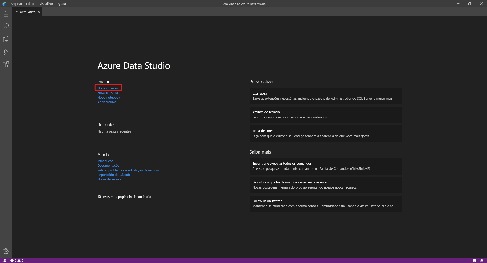
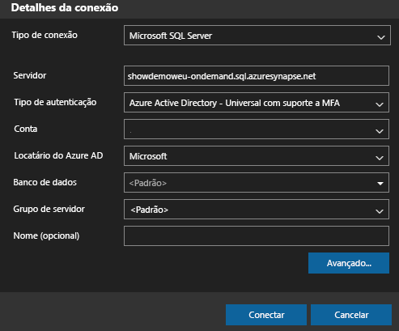
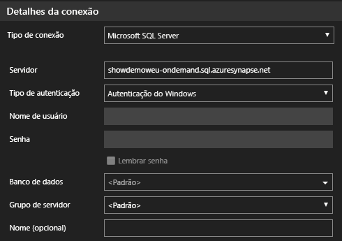
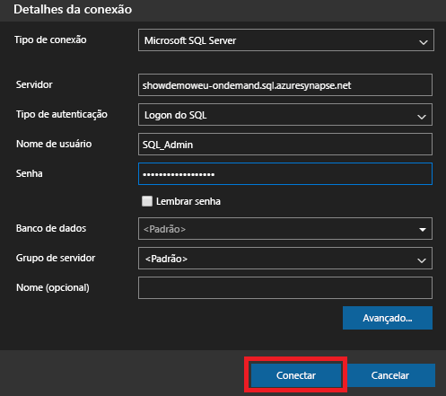
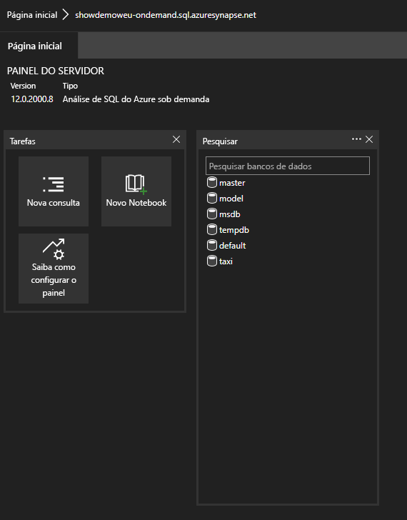
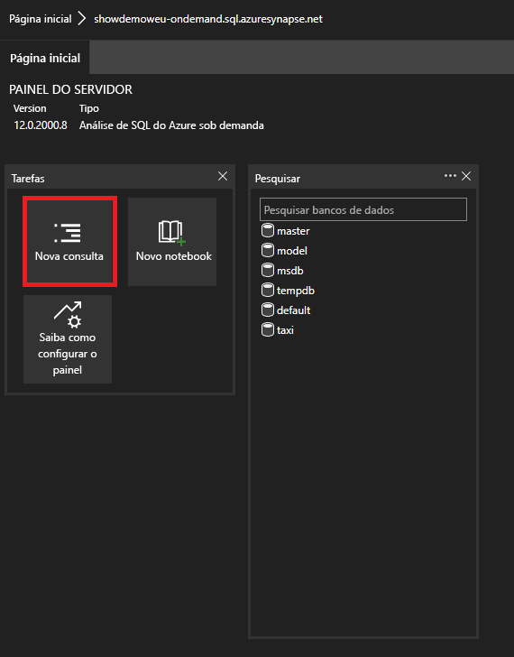

# <a name="connect-to-synapse-sql-with-azure-data-studio-preview"></a>Conectar-se ao Synapse SQL com o Azure Data Studio (versão prévia)

> [!div class="op_single_selector"]
>
> * [Azure Data Studio](get-started-azure-data-studio.md)
> * [Power BI](get-started-power-bi-professional.md)
> * [Visual Studio](../sql-data-warehouse/sql-data-warehouse-query-visual-studio.md?toc=/azure/synapse-analytics/toc.json&bc=/azure/synapse-analytics/breadcrumb/toc.json)
> * [sqlcmd](get-started-connect-sqlcmd.md)
> * [SSMS](get-started-ssms.md)

Você pode usar o [Azure Data Studio (versão prévia)](/sql/azure-data-studio/download-azure-data-studio?toc=/azure/synapse-analytics/toc.json&bc=/azure/synapse-analytics/breadcrumb/toc.json&view=azure-sqldw-latest) para se conectar e consultar o Synapse SQL no Azure Synapse Analytics. 

## <a name="connect"></a>Conectar

Para se conectar ao Synapse SQL, abra o Azure Data Studio e selecione **Nova Conexão**.



Escolha **Microsoft SQL Server** como o **Tipo de conexão**.

A conexão precisará dos seguintes parâmetros:

* **Servidor:** Servidor no formato `<Azure Synapse workspace name>`-ondemand.sql.azuresynapse.net
* **Banco de dados:** Nome do banco de dados

> [!NOTE]
> Se você quiser usar o **pool de SQL sem servidor (versão prévia)** , a URL deverá ser semelhante a:
>
> - `<Azure Synapse workspace name>`-ondemand.sql.azuresynapse.net.
>
> Se você quiser usar o **pool de SQL dedicado**, a URL deverá ser semelhante a:
>
> - `<Azure Synapse workspace name>`.sql.azuresynapse.net

Escolha **Autenticação do Windows**, **Azure Active Directory** ou **Logon do SQL** como o **Tipo de Autenticação**.

Para usar **Logon do SQL** como o tipo de autenticação, adicione os parâmetros nome de usuário/senha:

* **Usuário:** Usuário do servidor no formato `<User>`
* **Senha:** Senha associada ao usuário

Para usar o Azure Active Directory, você precisa escolher o tipo de autenticação necessário.



A seguinte captura de tela mostra os **Detalhes da Conexão** da **Autenticação do Windows**:



A seguinte captura de tela mostra os **Detalhes da Conexão** usando o **Logon do SQL**:



Após o logon bem-sucedido, você deverá ver um painel como este: 

## <a name="query"></a>Consulta

Uma vez conectado, você pode consultar o Synapse SQL usando instruções [T-SQL (Transact-SQL)](/sql/t-sql/language-reference?toc=/azure/synapse-analytics/toc.json&bc=/azure/synapse-analytics/breadcrumb/toc.json&view=azure-sqldw-latest) compatíveis com a instância. Selecione **Nova consulta** na exibição do painel para começar.



Por exemplo, você pode usar a seguinte instrução Transact-SQL para [consultar arquivos Parquet](query-parquet-files.md) usando o pool de SQL sem servidor:

```sql
SELECT COUNT(*)
FROM  
OPENROWSET(
    BULK 'https://azureopendatastorage.blob.core.windows.net/censusdatacontainer/release/us_population_county/year=20*/*.parquet',
    FORMAT='PARQUET'
)
```
## <a name="next-steps"></a>Próximas etapas 
Explore outras maneiras de se conectar ao Synapse SQL: 

- [SSMS](get-started-ssms.md)
- [Power BI](get-started-power-bi-professional.md)
- [Visual Studio](../sql-data-warehouse/sql-data-warehouse-query-visual-studio.md?toc=/azure/synapse-analytics/toc.json&bc=/azure/synapse-analytics/breadcrumb/toc.json)
- [sqlcmd](get-started-connect-sqlcmd.md)

Acesse [Usar o Azure Data Studio para se conectar e consultar dados usando um pool de SQL dedicado no Azure Synapse Analytics](https://docs.microsoft.com/sql/azure-data-studio/quickstart-sql-dw) para obter mais informações. 
