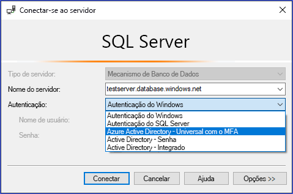
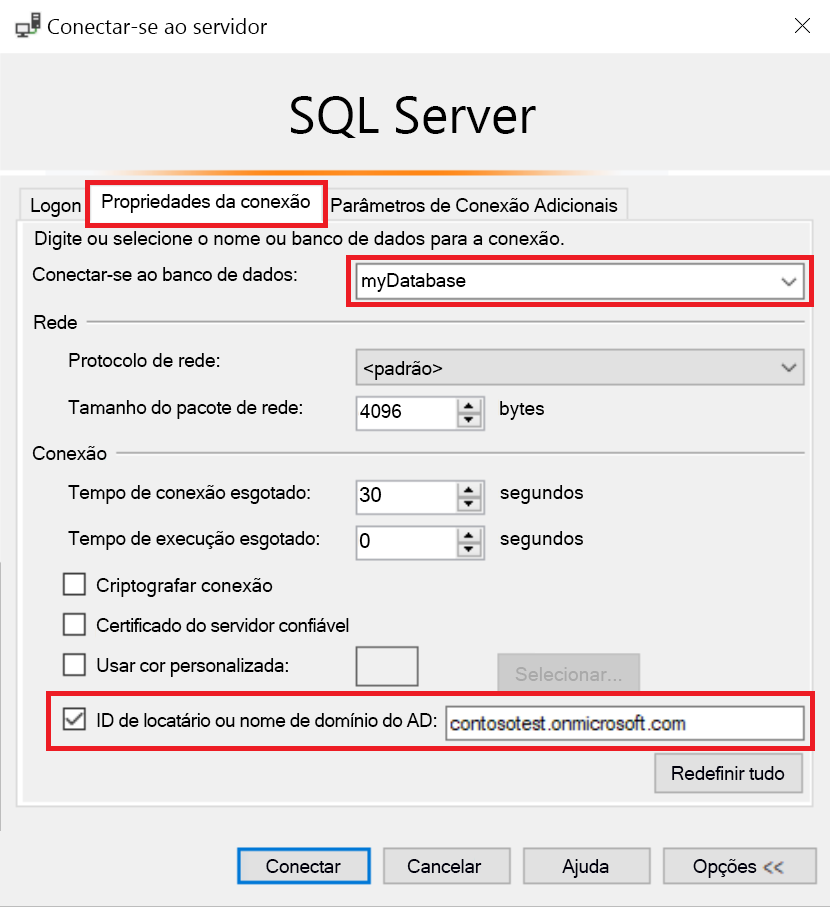
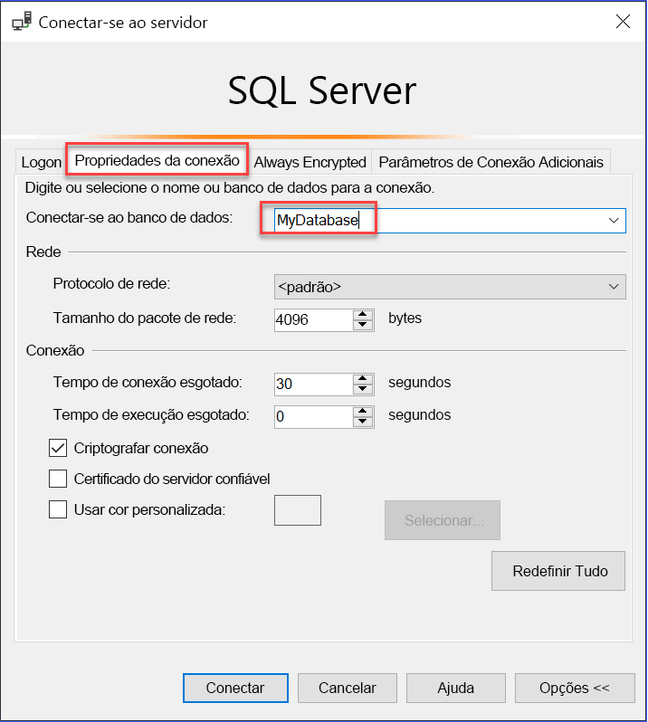

# Usar a Autenticação multifator do AAD com o SQL do Synapse (suporte do SSMS à MFA)

O SQL do Synapse dá suporte a conexões do SSMS (SQL Server Management Studio) usando a *Autenticação Universal do Active Directory*. 

Este artigo discute as diferenças entre as várias opções de autenticação e também as limitações associadas ao uso da autenticação universal. 

**Baixar a última versão do SSMS** - No computador cliente, baixe a última versão do SSMS em [Baixar o SQL Server Management Studio (SSMS)](/sql/ssms/download-sql-server-management-studio-ssms?view=azure-sqldw-latest&preserve-view=true).

Para todos os recursos neste artigo, use a versão 17.2 de julho de 2017 ou posterior.  A caixa de diálogo de conexão mais recente deve ser semelhante à seguinte imagem:

  

## As cinco opções de autenticação  

A Autenticação Universal do Active Directory dá suporte aos dois métodos de autenticação não interativos:
    - autenticação `Active Directory - Password`
    - autenticação `Active Directory - Integrated`

Também há dois modelos de autenticação não interativos, que podem ser usados em vários aplicativos diferentes (ADO.NET, JDCB, ODC etc.). Esses dois métodos nunca resultam em caixas de diálogo pop-up:

- `Active Directory - Password`
- `Active Directory - Integrated`

O método interativo que também é compatível com a MFA (Autenticação Multifator) do Azure AD é:

- `Active Directory - Universal with MFA`

A MFA do Azure AD ajuda a proteger o acesso a dados e aplicativos, ao mesmo tempo em que atende à demanda dos usuários por um processo de entrada simples. Ele fornece autenticação eficiente com uma variedade de opções de verificação fáceis, como chamada telefônica, mensagem de texto, cartões inteligentes com PIN ou notificação por aplicativos móveis, os quais permitem que os usuários escolham seu método de preferência. O MFA interativo com o Azure AD pode resultar em uma caixa de diálogo pop-up para validação.

Para encontrar uma descrição da Autenticação Multifator, consulte [Autenticação Multifator](../../active-directory/authentication//concept-mfa-howitworks.md).

### Parâmetro de ID do locatário ou nome de domínio do Azure AD

Começando com o [SSMS versão 17](/sql/ssms/download-sql-server-management-studio-ssms?view=azure-sqldw-latest&preserve-view=true), os usuários que são importados para o Active Directory atual de outros Azure Active Directories como usuários convidados, podem fornecer a ID de locatário ou nome de domínio do Azure AD quando eles se conectam. 

Usuários convidados incluem usuários convidados de outros Azure ADs e contas Microsoft como outlook.com, hotmail.com, live.com ou outras contas como gmail.com. Essa informação, permite que o **Active Directory Universal com Autenticação MFA** identifique a autoridade de autenticação correta. Essa opção também é necessária para dar suporte a contas da Microsoft (MSA), como outlook.com, hotmail.com, live.com ou contas que não são MSA. 

Todos esses usuários que desejam ser autenticados usando a autenticação Universal devem inserir sua ID de locatário ou nome de domínio do Azure AD. Esse parâmetro representa a ID de locatário/nome de domínio do Azure AD atual a que o Servidor do Azure está vinculado. 

Por exemplo, se o servidor do Azure está associado com o domínio do Azure AD `contosotest.onmicrosoft.com` em que o usuário `joe@contosodev.onmicrosoft.com` está hospedado como um usuário importado do domínio do Azure AD `contosodev.onmicrosoft.com`, o nome de domínio necessário para autenticar esse usuário é `contosotest.onmicrosoft.com`. 

Quando o usuário é um usuário nativo do Azure AD vinculado ao Servidor do Azure e não é uma conta MSA, nenhuma ID de locatário nem nome de domínio é necessário. 

Para inserir o parâmetro (começando com o SSMS versão 17.2), na caixa de diálogo **Conectar-se ao Banco de Dados**, preencha a caixa de diálogo selecionando a autenticação **Active Directory – Universal com MFA**, escolha **Opções**, preencha a caixa **Nome de usuário** e selecione a guia **Propriedades da Conexão**. 

Marque a caixa **ID de locatário ou nome de domínio do AD** e forneça a autoridade de autenticação, como o nome de domínio (**contosotest.onmicrosoft.com**) ou o GUID da ID do locatário.  

   

Se você estiver executando o SSMS 18.x ou posterior, o nome de domínio do AD ou a ID do locatário não será mais necessário para usuários convidados, pois a versão 18.x ou posterior o reconhecerá automaticamente.

   

### Suporte entre empresas do Azure AD   
Os usuários do Azure AD compatíveis com cenários de B2B do Azure AD como usuários convidados (confira [O que é colaboração B2B do Azure](../../active-directory/external-identities/what-is-b2b.md?bc=%2fazure%2fsynapse-analytics%2fbreadcrumb%2ftoc.json&toc=%2fazure%2fsynapse-analytics%2ftoc.json)) podem se conectar ao SQL do Synapse apenas como parte dos membros de um grupo criado no Azure AD atual e mapeados manualmente usando a instrução `CREATE USER` do Transact-SQL em um determinado banco de dados. 

Por exemplo, se `steve@gmail.com` é convidado para o Azure AD `contosotest` (com o domínio do Azure Ad `contosotest.onmicrosoft.com`), um grupo do Azure AD, como `usergroup` deve ser criado no Azure AD que contém o membro `steve@gmail.com`. Em seguida, esse grupo deve ser criado para um banco de dados específico (ou seja, MyDatabase) pelo administrador do SQL do Azure AD ou DBO do Azure AD, executando uma instrução `CREATE USER [usergroup] FROM EXTERNAL PROVIDER` do Transact-SQL. 

Depois que o usuário de banco de dados for criado, o usuário `steve@gmail.com` poderá fazer logon em `MyDatabase` usando a opção de autenticação de SSMS `Active Directory – Universal with MFA support`. 

O grupo de usuários, por padrão, possui somente a permissão de conexão e qualquer acesso a dados adicional precisará ser concedido da maneira normal. 

Como usuário convidado, `steve@gmail.com` precisa marcar a caixa e adicionar o nome de domínio do AD `contosotest.onmicrosoft.com` na caixa de diálogo **Propriedade da Conexão** do SSMS. A opção **ID de locatário ou nome de domínio do AD** tem suporte apenas para opções de conexão Universal com MFA, caso contrário, ela fica acinzentada.

## Limitações de autenticação universal para o SQL do Synapse

- O SSMS e o SqlPackage.exe são as únicas ferramentas atualmente habilitadas para MFA por meio da Autenticação Universal do Active Directory.
- O SSMS versão 17.2, dá suporte a acesso simultâneo de vários usuário usando a Autenticação Universal com MFA. As versões 17.0 e 17.1 restringiram o logon para uma instância do SSMS usando Autenticação Universal a uma única conta do Azure Active Directory. Para fazer logon como outra conta do Azure AD, você deve usar outra instância do SSMS. (Essa restrição é limitada à Autenticação Universal do Active Directory, você pode fazer logon em diferentes servidores usando a Autenticação de Senha do Active Directory, a Autenticação Integrada do Active Directory ou a Autenticação do SQL Server).
- O SSMS dá suporte à Autenticação Universal do Active Directory para a visualização do Pesquisador de Objetos, do Editor de Consultas e do Repositório de Consultas.
- O SSMS versão 17.2 fornece suporte ao Assistente de DacFx para Eportação/Extração/Implantação de Dados de banco de dados. Depois que um usuário específico é autenticado por meio da caixa de diálogo de autenticação inicial usando a Autenticação Universal, o Assistente de DacFx funciona da mesma maneira que faz para todos os outros métodos de autenticação.
- O Designer de Tabela do SSMS não dá suporte à Autenticação Universal.
- Não há nenhum requisito de software adicional para a Autenticação Universal do Active Directory, exceto que você deve usar uma versão do SSMS com suporte.  
- A versão da Biblioteca de Autenticação do Active Directory (ADAL) para autenticação Universal foi atualizada para a última versão lançada disponível de ADAL.dll 3.13.9. Consulte [Biblioteca de Autenticação do Active Directory 3.14.1](https://www.nuget.org/packages/Microsoft.IdentityModel.Clients.ActiveDirectory/).  

## Próximas etapas
Para obter mais informações, confira o artigo [Conectar-se ao SQL do Synapse com o SQL Server Management Studio](get-started-ssms.md).