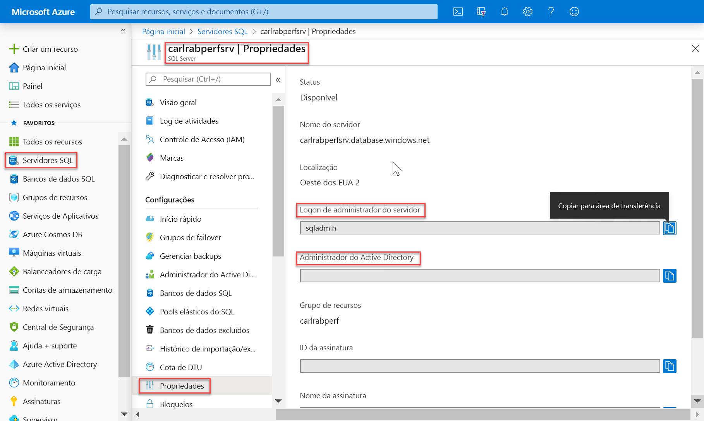
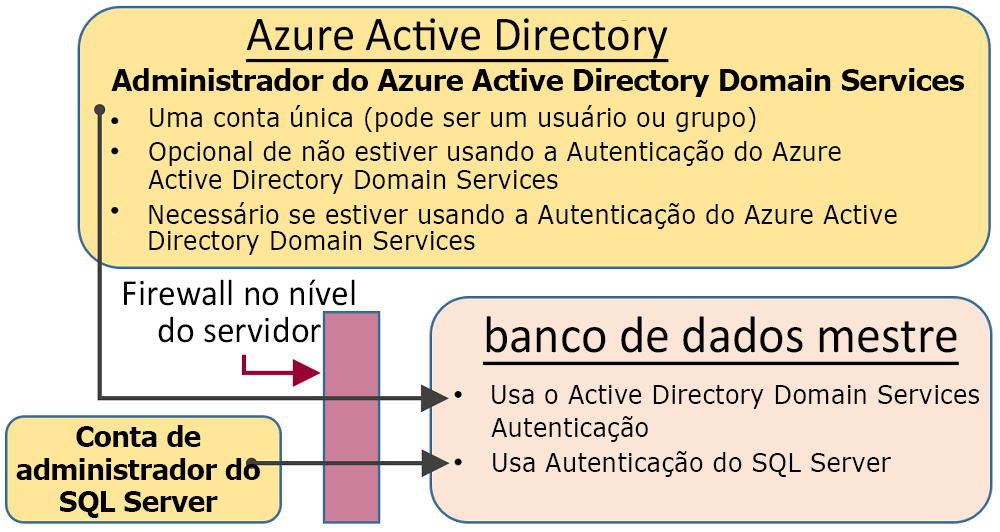
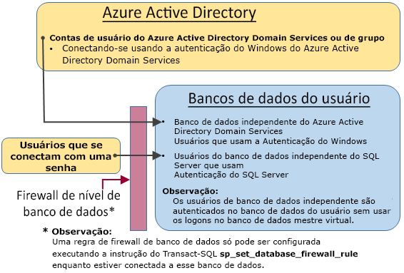

# <a name="sql-authentication"></a>Autenticação SQL

O Azure Synapse Analytics tem dois fatores forma do SQL que permitem controlar o consumo de recursos. Este artigo explicará como os dois fatores forma controlam a autenticação do usuário.

Para a autorização do Synapse SQL, você pode usar dois tipos de autorização:

- Autorização do Azure Active Directory
- Autorização SQL

O Azure Active Directory permite que você tenha um só lugar para o gerenciamento de usuários. A autorização SQL permite que os aplicativos herdados usem o Synapse SQL de maneira bem conhecida.

## <a name="administrative-accounts"></a>Contas administrativas

Há duas contas administrativas (**Administrador do servidor** e **Administrador do Active Directory**) que agem como administradores. Para identificar essas contas de administrador do SQL Server, abra o portal do Azure e navegue até a guia Propriedades do Synapse SQL.



- **Administrador do servidor**

  Ao criar um Azure Synapse Analytics, você precisará nomear um **Logon de administrador do servidor**. O servidor SQL cria essa conta como um logon no banco de dados mestre. Essa conta é conectada usando a autenticação do SQL Server (nome de usuário e senha). Só pode existir uma dessas contas.

- **Administrador do Azure Active Directory**

  Uma conta do Azure Active Directory, seja ela individual ou de grupo de segurança, também pode ser configurada como um administrador. A configuração de um administrador do Azure AD é opcional, mas é **necessário** configurar um administrador do Azure AD a fim de usar as contas do Azure AD para se conectar ao SQL do Synapse.

As contas do **Administrador do servidor** e do **Administrador do Azure AD** têm as seguintes características:

- São as únicas contas que podem se conectar automaticamente a qualquer Banco de Dados SQL no servidor. (Para se conectar a um banco de dados do usuário, outras contas devem ser o proprietário do banco de dados, ou ter uma conta de usuário do banco de dados do usuário.)
- Essas contas inserem bancos de dados de usuário, pois o usuário `dbo` e elas têm todas as permissões nos bancos de dados do usuário. (O proprietário de um banco de dados do usuário também insere o banco de dados como o usuário `dbo`.)
- Não insira o banco de dados `master` como o usuário `dbo` e tenha permissões limitadas no mestre.
- **Não** são membros da função de servidor fixa `sysadmin` padrão do SQL Server, que não está disponível no Banco de Dados SQL.  
- É possível criar, alterar e remover bancos de dados, logons, usuários nas regras de firewall de IP mestre e de nível de servidor.
- Podem adicionar e remover membros das funções `dbmanager` e `loginmanager`.
- Podem exibir a tabela do sistema `sys.sql_logins`.

## <a name="serverless-sql-pool"></a>[Pool de SQL sem servidor](#tab/serverless)

Para gerenciar o acesso dos usuários ao pool de SQL sem servidor, use as instruções abaixo.

Para criar um logon para o pool de SQL sem servidor, use a seguinte sintaxe:

```sql
CREATE LOGIN Mary WITH PASSWORD = '<strong_password>';
-- or
CREATE LOGIN Mary@domainname.net FROM EXTERNAL PROVIDER;
```
Depois que o logon for criado, crie usuários nos bancos de dados individuais dentro do ponto de extremidade do pool de SQL sem servidor e conceda as permissões necessárias a esses usuários. Para criar um uso, use a seguinte sintaxe:
```sql
CREATE USER Mary FROM LOGIN Mary;
-- or
CREATE USER Mary FROM LOGIN Mary@domainname.net;
-- or
CREATE USER [mike@contoso.com] FROM EXTERNAL PROVIDER;
```

Depois que o logon e o usuário forem criados, use a sintaxe convencional do SQL Server para conceder direitos.

## <a name="sql-pool"></a>[Pool de SQL](#tab/provisioned)

### <a name="administrator-access-path"></a>Caminho de acesso do administrador

Quando o firewall no nível de servidor é configurado corretamente, o **Administrador do servidor SQL** e o **Administrador do Azure Active Directory** podem se conectar usando ferramentas de cliente, como o SQL Server Management Studio ou o SQL Server Data Tools. Somente as ferramentas mais recentes fornecem todos os recursos e capacidades. 

O seguinte diagrama mostra uma configuração típica para as duas contas de administrador:
 


Ao usar uma porta aberta no firewall no nível do servidor, os administradores podem se conectar a qualquer Banco de Dados SQL.

### <a name="database-creators"></a>Criadores de banco de dados

Uma dessas funções administrativas é a função **dbmanager**. Os membros dessa função podem criar novos bancos de dados. Para usar essa função, você cria um usuário no banco de dados `master` e, em seguida, adiciona o usuário à função de banco de dados **dbmanager**. 

Para criar um banco de dados, o usuário deve ser um usuário baseado em um logon do SQL Server no banco de dados `master` ou um usuário de banco de dados baseado em um usuário do Azure Active Directory independente.

1. Com uma conta de administrador, conecte-se ao banco de dados `master`.
2. Crie um logon de autenticação do SQL Server usando a instrução [CRIAR LOGIN](/sql/t-sql/statements/create-login-transact-sql?view=azure-sqldw-latest&preserve-view=true). Exemplo de instrução:

   ```sql
   CREATE LOGIN Mary WITH PASSWORD = '<strong_password>';
   ```

   > [!NOTE]
   > Você deve usar uma senha forte ao criar um logon ou um usuário de banco de dados independente. Para saber mais, confira [Strong Passwords](/sql/relational-databases/security/strong-passwords?view=azure-sqldw-latest&preserve-view=true).

   Para melhorar o desempenho, logons (entidades de nível de servidor) são temporariamente armazenados em cache no nível do banco de dados. Para atualizar o cache de autenticação, veja [DBCC FLUSHAUTHCACHE](/sql/t-sql/database-console-commands/dbcc-flushauthcache-transact-sql?view=azure-sqldw-latest&preserve-view=true).

3. Crie o usuário de banco de dados usando a instrução [CREATE USER](/sql/t-sql/statements/create-user-transact-sql?view=azure-sqldw-latest&preserve-view=true). O usuário pode ser usuário de banco de dados independente de autenticação no Azure Active Directory (se você tiver configurado o ambiente para autenticação do Azure AD), um usuário de banco de dados independente de autenticação do SQL Server ou um usuário de autenticação do SQL Server com base em um logon de autenticação do SQL Server (criado na etapa anterior). Exemplo de instruções:

   ```sql
   CREATE USER [mike@contoso.com] FROM EXTERNAL PROVIDER; -- To create a user with Azure Active Directory
   CREATE USER Ann WITH PASSWORD = '<strong_password>'; -- To create a SQL Database contained database user
   CREATE USER Mary FROM LOGIN Mary;  -- To create a SQL Server user based on a SQL Server authentication login
   ```

4. Adicione o novo usuário à função de banco de dados **dbmanager** no `master` usando o procedimento [sp_addrolemember](/sql/relational-databases/system-stored-procedures/sp-addrolemember-transact-sql?view=azure-sqldw-latest&preserve-view=true) (observe que instrução [ALTER ROLE](/sql/t-sql/statements/alter-role-transact-sql?view=azure-sqldw-latest&preserve-view=true) não tem suporte no SQL provisionado). Exemplo de instruções:

   ```sql
   EXEC sp_addrolemember 'dbmanager', 'Mary'; 
   EXEC sp_addrolemember 'dbmanager', 'mike@contoso.com]'; 
   ```

   > [!NOTE]
   > O dbmanager é uma função de banco de dados no banco de dados mestre, portanto, você só pode adicionar um usuário de banco de dados à função dbmanager. Não é possível adicionar um logon no nível do servidor à função no nível do banco de dados.

5. Se for necessário, configure uma regra de firewall para permitir que o novo usuário se conecte. (O novo usuário poderá ser coberto por uma regra de firewall existente.)

Agora, o usuário pode se conectar ao banco de dados `master` e criar novos bancos de dados. A conta de criação do banco de dados se torna o proprietário do banco de dados.

### <a name="login-managers"></a>Gerentes de logon

A outra função administrativa é a função de gerente de logon. Os membros dessa função podem criar novos logons no banco de dados mestre. Se quiser, você poderá concluir as mesmas etapas (criar um logon e usuário, e adicionar um usuário à função **loginmanager**) para permitir que um usuário crie novos logons no mestre. Normalmente, os logons não são necessários, pois a Microsoft recomenda o uso de usuários de banco de dados independentes, que são autenticados no nível do banco de dados em vez de usar os usuários baseados em logons. Para obter mais informações, consulte [Usuários de bancos de dados independentes – Tornando seu banco de dados portátil](/sql/relational-databases/security/contained-database-users-making-your-database-portable?view=azure-sqldw-latest&preserve-view=true).

---

## <a name="non-administrator-users"></a>Usuários não administradores

Em geral, contas que não são de administrador não precisam de acesso ao banco de dados mestre. Crie usuários do banco de dados independente no nível do banco de dados usando a instrução [CREATE USER (Transact-SQL)](/sql/t-sql/statements/create-user-transact-sql) . 

O usuário pode ser usuário de banco de dados independente de autenticação no Azure Active Directory (se você tiver configurado o ambiente para autenticação do Azure AD), ou um usuário de banco de dados independente de autenticação do SQL Server, ou um usuário de autenticação do SQL Server com base em um logon de autenticação do SQL Server (criado na etapa anterior).  

Para criar usuários, conectar-se ao banco de dados e executar instruções semelhantes aos exemplos a seguir:

```sql
CREATE USER Mary FROM LOGIN Mary;
CREATE USER [mike@contoso.com] FROM EXTERNAL PROVIDER;
```

Inicialmente, apenas um dos administradores ou o proprietário do banco de dados pode criar usuários. Para autorizar que outros usuários criem novos usuários, conceda ao usuário selecionado a permissão `ALTER ANY USER` usando uma instrução como:

```sql
GRANT ALTER ANY USER TO Mary;
```

Para conceder a outros usuários o controle total do banco de dados, torne-os membros da função do banco de dados fixa **db_owner**.

No Banco de Dados SQL do Azure ou no Azure Synapse sem servidor, use a instrução `ALTER ROLE`.

```sql
ALTER ROLE db_owner ADD MEMBER Mary;
```

No pool de SQL dedicado, use [EXEC sp_addrolemember](/sql/relational-databases/system-stored-procedures/sp-addrolemember-transact-sql?view=azure-sqldw-latest&preserve-view=true).

```sql
EXEC sp_addrolemember 'db_owner', 'Mary';
```

> [!NOTE]
> Um motivo comum para criar um usuário de banco de dados com base em um logon de servidor é destiná-lo aos usuários que precisam ter acesso a vários bancos de dados. Como os usuários de banco de dados contidos são entidades individuais, cada banco de dados mantém seu próprio usuário e sua própria senha. Isso pode causar sobrecarga, já que o usuário deve lembrar-se de cada senha para cada banco de dados e isso poderá tornar-se insustentável quando for necessário alterar várias senhas para muitos bancos de dados. No entanto, ao usar Logons do SQL Server e alta disponibilidade (grupos de replicação geográfica ativa e failover), os logons do SQL Server deverão ser definidos manualmente em cada servidor. Caso contrário, o usuário de banco de dados não será mais mapeado para o logon do servidor após a ocorrência de um failover e não poderá acessar o failover de postagem do banco de dados. 

Para obter mais informações sobre a configuração de logons para a replicação geográfica, confira [Configurar e gerenciar a segurança do Banco de Dados SQL do Azure para restauração geográfica ou failover](../../azure-sql/database/active-geo-replication-security-configure.md).

### <a name="configuring-the-database-level-firewall"></a>Configuração do firewall no nível do banco de dados

Como prática recomendada, os usuários não administradores só devem ter acesso por meio do firewall aos bancos de dados que eles usam. Em vez de autorizar seus endereços IP pelo firewall no nível do servidor e conceder acesso a todos os bancos de dados, use a instrução [sp_set_database_firewall_rule](/sql/relational-databases/system-stored-procedures/sp-set-database-firewall-rule-azure-sql-database?view=azure-sqldw-latest&preserve-view=true) para configurar o firewall no nível do banco de dados. O firewall no nível de banco de dados não pode ser configurado usando o portal.

### <a name="non-administrator-access-path"></a>Caminho de acesso do não administrador

Quando o firewall no nível do banco de dados está configurado corretamente, os usuários do banco de dados podem se conectar usando as ferramentas de cliente como o SQL Server Management Studio ou o SQL Server Data Tools. Somente as ferramentas mais recentes fornecem todos os recursos e capacidades. O diagrama a seguir mostra um caminho de acesso não do administrador típico.



## <a name="groups-and-roles"></a>Grupos e funções

O gerenciamento de acesso eficiente usa as permissões atribuídas a grupos e funções, em vez de usuários individuais.

- Ao usar a autenticação do Azure Active Directory, coloque os usuários do Azure Active Directory em um grupo do Azure Active Directory. Crie um usuário de banco de dados independente para o grupo. Coloque um ou mais usuários de banco de dados em uma [função de banco de dados](/sql/relational-databases/security/authentication-access/database-level-roles?view=azure-sqldw-latest&preserve-view=true) e então atribua [permissões](/sql/relational-databases/security/permissions-database-engine?view=azure-sqldw-latest&preserve-view=true) à função de banco de dados.

- Ao usar a autenticação do SQL Server, crie usuários de banco de dados independentes no banco de dados. Coloque um ou mais usuários de banco de dados em uma [função de banco de dados](/sql/relational-databases/security/authentication-access/database-level-roles?view=azure-sqldw-latest&preserve-view=true) e então atribua [permissões](/sql/relational-databases/security/permissions-database-engine?view=azure-sqldw-latest&preserve-view=true) à função de banco de dados.

As funções do banco de dados podem ser funções internas, como **db_owner**, **db_ddladmin**, **db_datawriter**, **db_datareader**, **db_denydatawriter** e **db_denydatareader**. **db_owner** é usada normalmente para conceder permissão total a apenas alguns usuários. As outras funções fixas de banco de dados são úteis para mover rapidamente um banco de dados simples para desenvolvimento, mas não são recomendadas para a maioria dos bancos de dados de produção. 

Por exemplo, a função do banco de dados fixa **db_datareader** concede acesso de leitura a todas as tabelas no banco de dados, sendo, em geral, mais do que é estritamente necessário. 

É muito melhor usar a instrução [CREATE ROLE](/sql/t-sql/statements/create-role-transact-sql) para criar suas funções do banco de dados definidas pelo usuário e conceder cuidadosamente a cada função as permissões mínimas necessárias para o negócio. Quando um usuário for membro de várias funções, ele agregará as permissões de todas elas.

## <a name="permissions"></a>Permissões

Há mais de 100 permissões que podem ser concedidas ou negadas individualmente no Banco de Dados SQL. Muitas dessas permissões são aninhadas. Por exemplo, a permissão `UPDATE` em um esquema inclui a permissão `UPDATE` em cada tabela dentro desse esquema. Assim como ocorre na maioria dos sistemas de permissão, a negação de uma permissão substitui uma concessão. 

Devido à natureza aninhada e ao número de permissões, talvez seja necessário realizar um estudo cuidadoso para criar um sistema de permissões apropriado a fim de proteger corretamente o banco de dados. 

Comece com a lista de permissões em [Permissões (Mecanismo do Banco de Dados)](/sql/relational-databases/security/permissions-database-engine) e examine o [gráfico com tamanho de pôster](/sql/relational-databases/security/media/database-engine-permissions.png) das permissões.

### <a name="considerations-and-restrictions"></a>Considerações e restrições

Ao gerenciar logons e usuários no Banco de Dados SQL, considere os seguintes pontos:

- É necessário estar conectado ao banco de dados **mestre** ao executar as instruções `CREATE/ALTER/DROP DATABASE`.
- O usuário de banco de dados correspondente para o logon do **Administrador do servidor** não pode ser alterado nem descartado.
- O inglês (EUA) é o idioma padrão do logon do **Administrador do servidor**.
- Somente os administradores (Logon do **Administrador do servidor** ou do administrador do Azure AD) e os membros da função **dbmanager** de banco de dados no banco de dados **mestre** têm permissão para executar as instruções `CREATE DATABASE` e `DROP DATABASE`.
- Você deve estar conectado ao banco de dados mestre ao executar as instruções `CREATE/ALTER/DROP LOGIN` . No entanto, não é recomendado usar logons. Utilize os usuários de bancos de dados independentes.
- Para se conectar a um banco de dados do usuário, é necessário fornecer o nome do banco de dados na cadeia de conexão.
- Somente o logon da entidade de segurança no nível do servidor e os membros da função **loginmanager** do banco de dados no banco de dados **mestre** têm permissão para executar as instruções `CREATE LOGIN`, `ALTER LOGIN` e `DROP LOGIN`.
- Ao executar as instruções `CREATE/ALTER/DROP LOGIN` e `CREATE/ALTER/DROP DATABASE` em um aplicativo do ADO.NET, o uso de comandos parametrizados não é permitido. Para obter mais informações, veja [Comandos e parâmetros](/dotnet/framework/data/adonet/commands-and-parameters).
- Ao executar as instruções `CREATE/ALTER/DROP DATABASE` e `CREATE/ALTER/DROP LOGIN`, cada uma dessas instruções deve ser a única instrução em um lote do Transact-SQL. Caso contrário, ocorrerá um erro. Por exemplo, o Transact-SQL a seguir verifica se o banco de dados existe. Se ele existir, uma instrução `DROP DATABASE` é chamada para remover o banco de dados. Como a instrução `DROP DATABASE` não é a única instrução no lote, a execução da seguinte instrução Transact-SQL resulta em um erro.

  ```sql
  IF EXISTS (SELECT [name]
           FROM   [sys].[databases]
           WHERE  [name] = N'database_name')
  DROP DATABASE [database_name];
  GO
  ```
  
  Use a seguinte instrução Transact-SQL:
  
  ```sql
  DROP DATABASE IF EXISTS [database_name]
  ```

- Ao executar a instrução `CREATE USER` com a opção `FOR/FROM LOGIN`, ela deve ser a única instrução em um lote do Transact-SQL.
- Ao executar a instrução `ALTER USER` com a opção `WITH LOGIN`, ela deve ser a única instrução em um lote do Transact-SQL.
- Para o `CREATE/ALTER/DROP`, um usuário requer a permissão `ALTER ANY USER` no banco de dados.
- Quando o proprietário de uma função de banco de dados tenta adicionar ou remover outro usuário de banco de dados de ou para essa função de banco de dados, pode ocorrer o seguinte erro: **Usuário ou função 'Nome' não existe neste banco de dados.** Esse erro ocorre porque o usuário não está visível para o proprietário. Para resolver esse problema, conceda ao proprietário da função a permissão `VIEW DEFINITION` no usuário. 

## <a name="next-steps"></a>Próximas etapas

Para obter mais informações, consulte [Usuários de bancos de dados independentes – Tornando seu banco de dados portátil](/sql/relational-databases/security/contained-database-users-making-your-database-portable).
