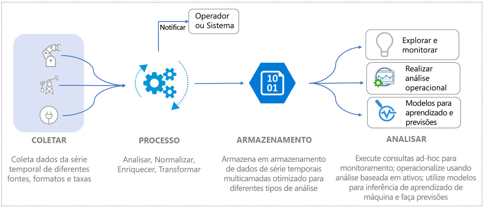
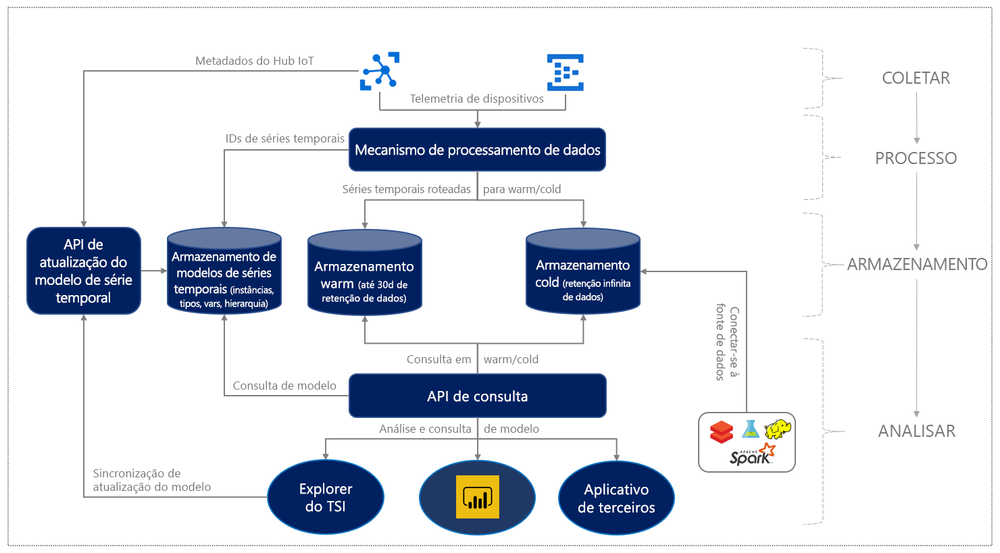

# O que é o Azure Time Series Insights Gen2

O Azure Time Series Insights Gen2 é um serviço de análise de IoT de ponta a ponta aberto e escalonável, que apresenta as melhores experiências do usuário e APIs avançadas para integrar funcionalidades avançadas ao seu fluxo de trabalho ou seu aplicativo existente.

Você pode usá-lo para coletar, processar, armazenar, consultar e visualizar dados na escala da IoT (Internet das Coisas), dados altamente contextualizados e otimizados para séries temporais.

O Azure Time Series Insights Gen2 foi projetado para exploração de dados ad hoc e análise operacional, permitindo que você descubra tendências ocultas, identifique anomalias e realize análises de causa raiz. É uma oferta aberta e flexível que atende às amplas necessidades de implantações de IoT industrial.

## Vídeo

Saiba mais sobre o Azure Time Series Insights Gen2.

> [!VIDEO https://channel9.msdn.com/Shows/Internet-of-Things-Show/Using-Azure-Time-Series-Insights-to-create-an-Industrial-IoT-analytics-platform/player]

## Definição de dados de IoT

Os dados industriais de IoT em organizações com uso intensivo de ativos geralmente carecem de consistência estrutural, devido à natureza variada de dispositivos e sensores em um ambiente industrial. Os dados desses fluxos são caracterizados por lacunas significativas e, às vezes, mensagens corrompidas e leituras falsas. Os dados da IoT geralmente são significativos no contexto de entradas de dados adicionais provenientes de fontes primárias ou de terceiros, como CRM ou ERP, que adicionam contexto para fluxos de trabalho de ponta a ponta. As entradas de fontes de dados de terceiros, como dados climáticos, podem ajudar a aumentar os fluxos de telemetria em uma determinada instalação.

Tudo isso implica que apenas uma fração dos dados é usada para fins operacionais e comerciais, e a análise requer contextualização. Os dados industriais costumam ser históricos, para gerar análises detalhadas em períodos de tempo mais longos, de modo a entender e correlacionar tendências. Transformar dados de IoT coletados em insights acionáveis requer:

* Processamento de dados para limpar, filtrar, interpolar, transformar e preparar dados para análise.
* Uma estrutura para navegar e entender os dados, ou seja, para normalizar e contextualizá-los.
* Armazenamento econômico para retenção longa ou infinita de dados processados (ou derivados) e dados brutos.

Esses dados fornecem informações consistentes, abrangentes, atuais e corretas para análises e relatórios de negócios.

A imagem a seguir mostra um fluxo de dados de IoT típico.

## Azure Time Series Insights Gen2 para IoT industrial

O cenário de IoT é diversificado, com clientes em vários segmentos da indústria, incluindo os setores manufatureiros, automotivos, energéticos, de serviços públicos, edifícios inteligentes e consultoria. Em toda essa ampla gama de mercado de IoT industrial, as soluções nativas da nuvem que fornecem análises abrangentes direcionadas a dados de IoT em larga escala ainda estão evoluindo.

O Azure Time Series Insights Gen2 atende a essa necessidade do mercado, fornecendo uma solução de análise de IoT de ponta a ponta completa, com modelagem semântica avançada para contextualização de dados de série temporal, insights baseados em ativos e uma melhor experiência do usuário para descoberta, tendências, detecção de anomalias e inteligência operacional.

Com uma plataforma de análise operacional avançada e combinada com nossas funcionalidades interativas de exploração de dados, você pode usar o Azure Time Series Insights Gen2 para obter mais valor dos dados coletados dos ativos da IoT. A oferta do Gen2 dá suporte a:

* solução de armazenamento em várias camadas com suporte a análises de categorização de dados mornos e frios, oferecendo aos clientes a opção de rotear os dados entre a categorização morna e fria para análise interativa de dados mornos, assim como gerar inteligência operacional sobre décadas de dados históricos.

  * Uma solução de análise de dados mornos altamente interativa para executar um número grande e frequente de consultas em dados coletados em um período mais curto
  * Um data lake de série temporal escalonável, de alto desempenho e otimizado para custo com base no Armazenamento do Azure que permite que os clientes criem tendências de anos de dados de série temporal em segundos.

* Suporte ao modelo semântico que descreve o domínio e os metadados associados aos sinais derivados e brutos de ativos e dispositivos.

* A plataforma flexível de análise para armazenar dados históricos de séries temporais na conta de Armazenamento do Microsoft Azure de propriedade dos clientes, permitindo que eles sejam proprietários de seus dados de IoT. Os dados são armazenados no formato Apache Parquet de software livre, que permite conectividade e interoperabilidade em uma variedade de cenários de dados, incluindo análise preditiva, machine learning e outros cálculos personalizados feitos com tecnologias conhecidas, como o Spark e o Databricks.

* Análise avançada com APIs de consulta aprimoradas, e uma experiência do usuário que combina insights de dados baseados em ativos com análises de dados avançadas e ad hoc com suporte para interpolação, funções escalares e agregadas, variáveis categóricas, gráficos de dispersão e sinais de séries temporais de mudança de tempo para análises detalhadas.

* Plataforma de nível empresarial para dar suporte a necessidades de escala, desempenho, segurança e confiabilidade de nossos clientes de IoT empresariais.

* Suporte de extensibilidade e integração para análises de ponta a ponta. O Azure Time Series Insights Gen2 fornece uma plataforma de análise extensível para uma variedade de cenários de dados. O conector do Power BI permite que os clientes tragam as consultas feitas no Azure Time Series Insights Gen2 diretamente para o Power BI, de modo a obter uma exibição unificada das análises de BI e de série temporal em um só painel de controle.

O diagrama a seguir mostra o fluxo de dados de alto nível.

  

O Azure Time Series Insights Gen2 fornece um modelo de preço escalonável pago conforme o uso para processamento de dados, armazenamento (dados e metadados) e consulta, permitindo que os clientes ajustem o uso de acordo com as respectivas demandas de negócios.

Com a introdução dessas funcionalidades básicas de IoT industrial, o Azure Time Series Insights Gen2 também oferece os seguintes benefícios essenciais:  

| Recurso | Benefício |
| ---| ---|
| Armazenamento em várias camadas para dados de série temporal em escala de IoT | Com um pipeline de processamento de dados compartilhado para ingestão de dados, é possível ingerir os dados em lojas categorizados como frios e mornos. Use o armazenamento morno para consultas interativas e o armazenamento frio para armazenar grandes volumes de dados. Para saber mais sobre como aproveitar as consultas baseadas em ativos de alto desempenho, confira [consultas](./concepts-query-overview.md). |
| Modelo de série temporal para contextualizar dados telemétricos brutos e derivar insights baseados em ativos | Você pode usar o modelo de série temporal para criar instâncias, hierarquias, tipos e variáveis para seus dados de série temporal. Para saber mais sobre o modelo de série temporal, confira [Modelo de série temporal](./concepts-model-overview.md).  |
| Integração perfeita e contínua com outras soluções de dados | Os dados do armazenamento frio do Azure Time Series Insights Gen2 são [armazenados](./concepts-storage.md) em arquivos Apache Parquet de software livre. Isso permite a integração de dados com outras soluções de dados, de fontes primárias ou de terceiros, para cenários que incluem inteligência comercial, aprendizado de máquina avançado e análise preditiva. |
| Exploração de dados quase em tempo real | A experiência do usuário do [Azure Time Series Insights Gen2 Explorer](./concepts-ux-panels.md) fornece uma visualização de todos os dados transmitidos por meio do pipeline de ingestão. Depois de conectar uma fonte de eventos, é possível exibir, explorar e consultar dados de eventos. Dessa forma, você pode validar se um dispositivo emite os dados conforme o esperado. Você também pode monitorar um ativo de IoT em relação à integridade, à produtividade e à eficiência geral. |
| Extensibilidade e integração | A integração do Conector do Power BI está disponível diretamente na experiência do usuário do Time Series Explorer por meio da opção **Exportar**, permitindo que os clientes exportem as consultas de série temporal criadas com a nossa experiência do usuário diretamente para o Power BI Desktop e vejam os gráficos de série temporal juntamente com outras análises de BI. Isso abre a porta para uma nova classe de cenários para empresas de IoT industriais que investiram no Power BI, fornecendo um único painel de controle sobre análises de várias fontes de dados, incluindo séries temporais da IoT. |
| Criação de aplicativos personalizados na plataforma Azure Time Series Insights Gen2 | O Azure Time Series Insights Gen2 dá suporte ao [SDK do JavaScript](https://github.com/microsoft/tsiclient/blob/master/docs/API.md). O SDK fornece controles avançados e acesso simplificado às consultas. Use o SDK para criar aplicativos IoT personalizados no Azure Time Series Insights Gen2 de acordo com suas necessidades de negócios. Use também as [APIs de Consulta](./concepts-query-overview.md) do Azure Time Series Insights Gen2 diretamente para levar os dados a aplicativos de IoT personalizados. |

## Próximas etapas

Introdução ao Azure Time Series Insights Gen2:

> [!div class="nextstepaction"]
> [Guia de Início Rápido](./quickstart-explore-tsi.md)

Saiba mais sobre os casos de uso:

> [!div class="nextstepaction"]
> [Casos de uso do Azure Time Series Insights Gen2](./overview-use-cases.md)
