# Início Rápido: Explorar o ambiente de demonstração do Azure Time Series Insights Gen2

Este guia de início rápido ajudará você a começar a usar o ambiente do Azure Time Series Insights Gen2. Na demonstração gratuita, você conhecerá os principais recursos que foram adicionados ao Azure Time Series Insights Gen2.

O ambiente de demonstração do Azure Time Series Insights Gen2 contém uma empresa de exemplo, a Contoso, que opera dois parques eólicos. Cada parque tem 10 turbinas. Cada turbina tem 20 sensores que relatam dados a cada minuto para o Hub IoT do Azure. Os sensores coletam informações sobre as condições climáticas, o passo das pás e a posição da rotação sobre o eixo y. Também registram informações do desempenho do gerador, do comportamento das engrenagens e dos monitores de segurança.

Neste guia de início rápido, você aprenderá a usar o Azure Time Series Insights Gen2 para descobrir insights práticos nos dados da Contoso. Você também realizará uma análise de causa raiz breve para prever melhor falhas críticas e realizar a manutenção.

> [!IMPORTANT]
> Crie uma [conta gratuita do Azure](https://azure.microsoft.com/free/?ref=microsoft.com&utm_source=microsoft.com&utm_medium=docs&utm_campaign=visualstudio) se você não tiver uma.

## Explorar o Azure Time Series Insights Gen2 Explorer em um ambiente de demonstração

O Azure Time Series Insights Gen2 Explorer demonstra a análise de causa raiz e dados históricos. Introdução:

1. Acesse o ambiente de  [demonstração da Contoso Wind Farm](https://insights.timeseries.azure.com/preview/samples).  

1. Se precisar, entre no Azure Time Series Insights Gen2 Explorer usando suas credenciais da conta do Azure.

## Trabalhar com os dados históricos

1. Selecione **Hierarquia da Contoso WindFarm**.

   [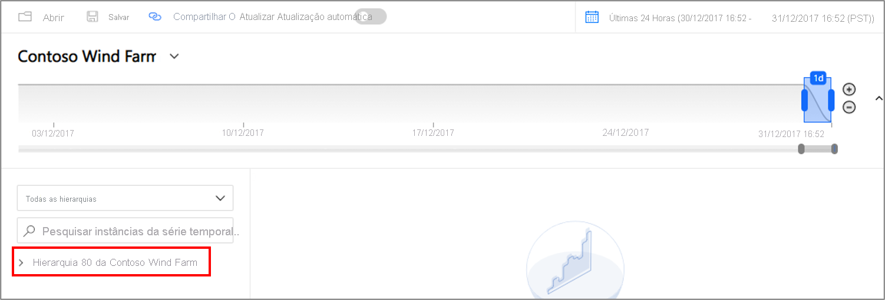](media/quickstart-explore/quick-start-contoso-1.png#lightbox)

1. Na **Usina 1 da Contoso**, observe a turbina eólica **W7**.

   [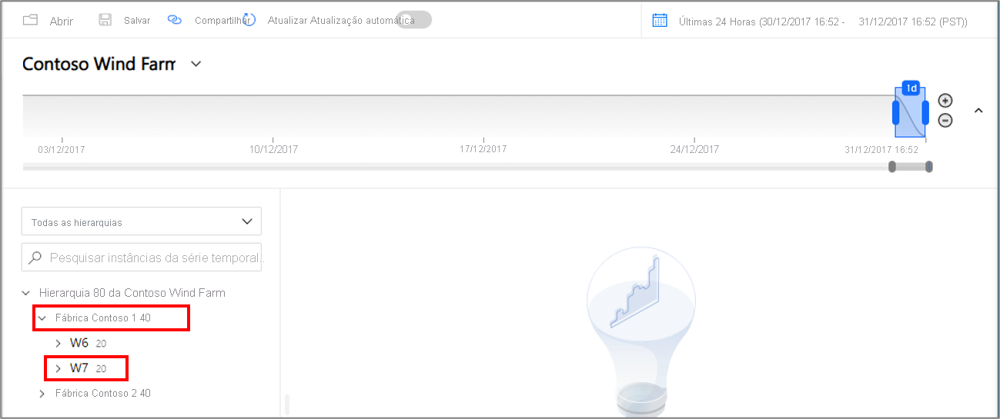](media/quickstart-explore/quick-start-contoso-2.png#lightbox)

   1. Altere o intervalo de exibição para **1/1/17 20h a 10/3/17 20h (UTC)** .

      

      

   1. Ajuste o modo de exibição de intervalo usando ampliar **(+)** e reduzir **(-)** e movendo a barra deslizante.

      

   1. Para selecionar um sensor, selecione **Usina 1 da Contoso** > **W7** > **Sistema de Gerador** > **GeneratorSpeed**. Depois, examine os valores mostrados.

      [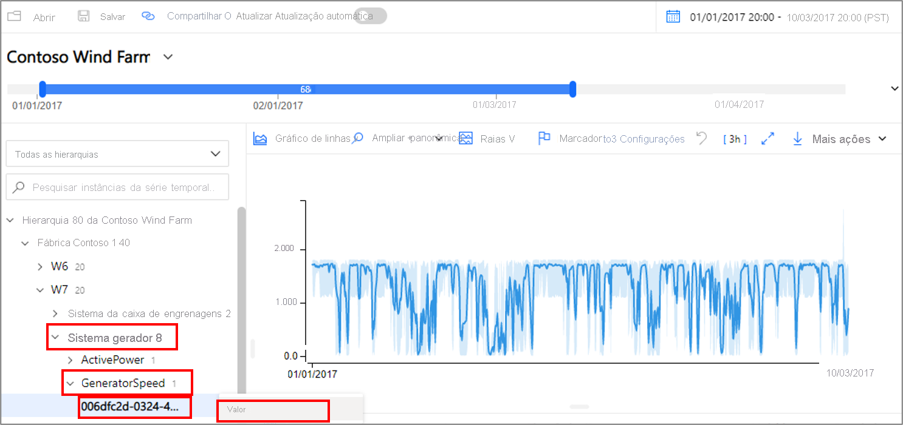](media/quickstart-explore/quick-start-generator-speed-1.png#lightbox)

1. Recentemente, a Contoso descobriu um incêndio em turbina eólica **W7**. As opiniões sobre o que causou o incêndio variam. No Azure Time Series Insights Gen2, o sensor de alerta de incêndio ativado durante o incêndio é exibido.

   1. Altere o intervalo de exibição para **9/3/17 20h a 10/3/17 20h (UTC)** .
   1. Selecione **Sistema de Segurança** > **FireAlert**.

      [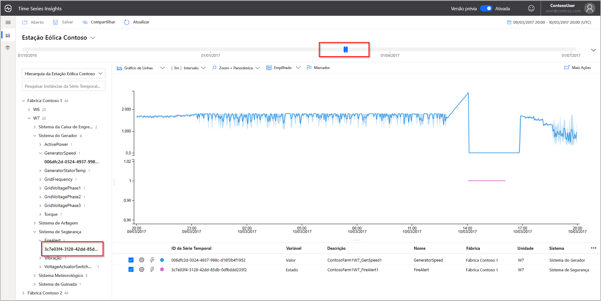](media/v2-update-quickstart/quick-start-fire-alert.png#lightbox)

1. Examine outros eventos próximos à hora do incêndio para entender o que ocorreu. A pressão do óleo e os avisos ativos aumentaram repentinamente logo antes do incêndio.

   1. Selecione **Sistema de Regulagem do Passo** > **HydraulicOilPressure**.
   1. Selecione **Sistema de Regulagem do Passo** > **ActiveWarning**.

      [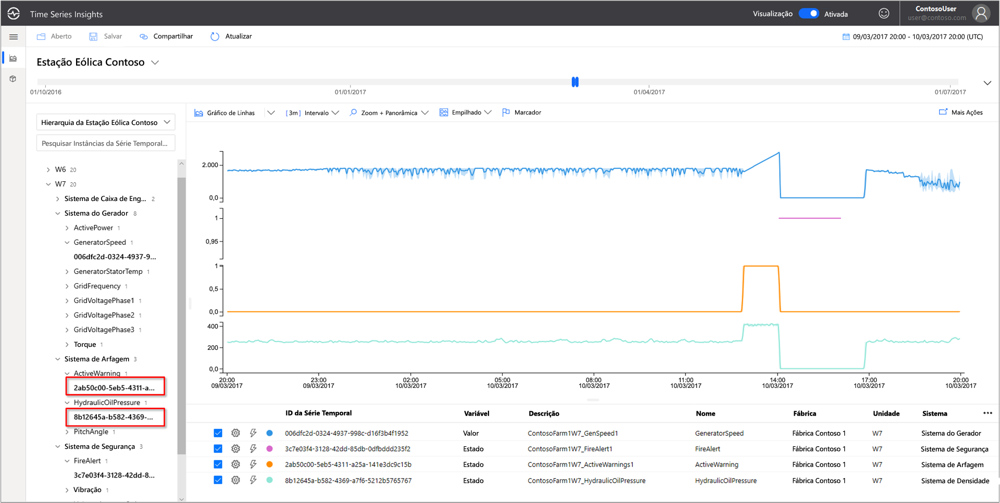](media/v2-update-quickstart/quick-start-active-warning.png#lightbox)

1. Os sensores de pressão do óleo e de avisos ativos aumentaram repentinamente logo antes do incêndio. Expanda a série temporal exibida para examinar outros sinais evidentes que levaram ao incêndio. Os dois sensores flutuaram de forma consistente ao longo do tempo. As flutuações indicam um padrão persistente e preocupante.

    * Altere o intervalo de exibição para **24/2/17 20h a 10/3/17 20h (UTC)** .

      [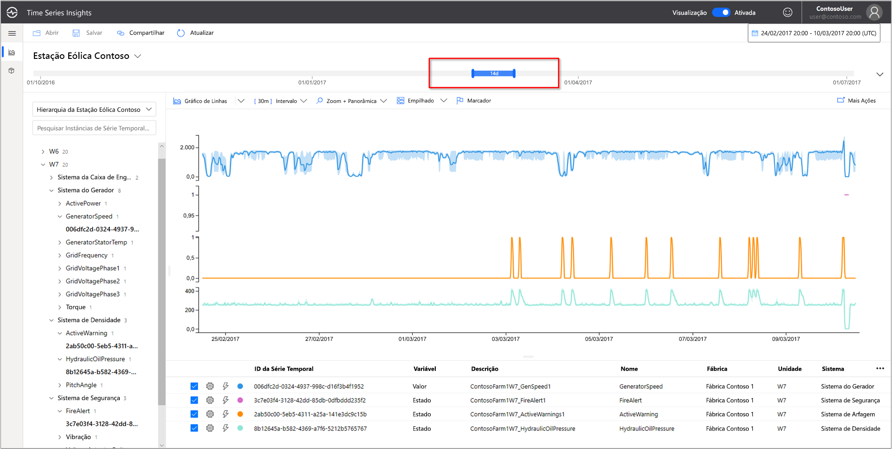](media/v2-update-quickstart/quick-start-view-range.png#lightbox)

1. Uma análise de dois anos de dados históricos revela outro evento de incêndio com as mesmas flutuações de sensor.

    * Altere o intervalo de exibição para **1/1/16 a 31/12/17** (todos os dados).

      [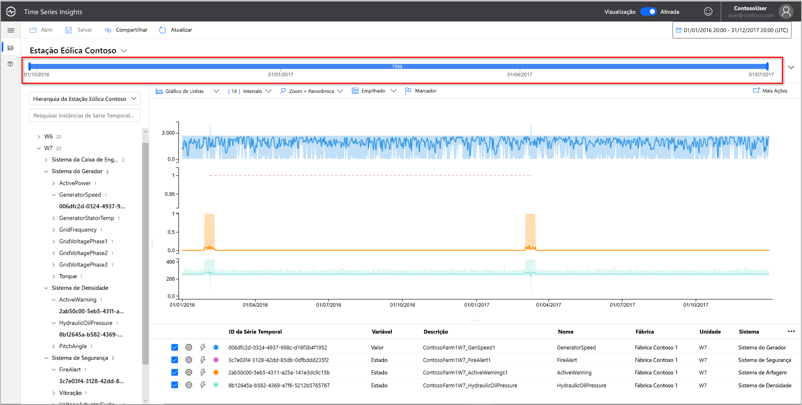](media/v2-update-quickstart/quick-start-expand-view-range.png#lightbox)

Usando o Azure Time Series Insights Gen2 e a telemetria de sensor, descobrimos uma tendência de longo prazo ocultada nos dados históricos. Com esses novos insights, podemos:

* Explicar o que realmente ocorreu.
* Corrigir o problema.
* Instale melhores sistemas de notificação de alerta.

## Análise da causa raiz

1. Alguns cenários exigem uma análise sofisticada para revelar indicações nos dados. Selecione o moinho de vento **W6** na data **25/6**.

    1. Altere o intervalo de exibição para **1/6/17 20h a 1/7/17 20h (UTC)** .
    1. Selecione o **Usina 1 da Contoso** > **W6** > **Sistema de Segurança** > **VoltageActuatorSwitchWarning**.

       [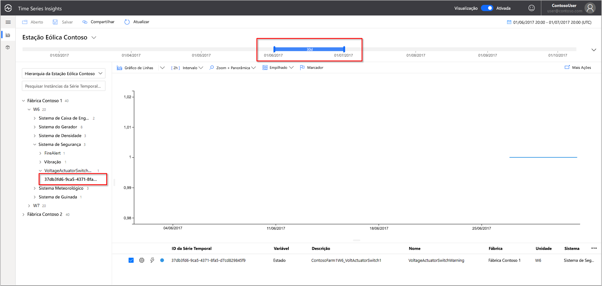](media/v2-update-quickstart/quick-start-voltage-switch-warning.png#lightbox)

1. O aviso indica um problema com a tensão do gerador. A saída de energia geral do gerador está dentro dos parâmetros normais no intervalo atual. Aumentando nosso intervalo, outro padrão surge. Uma queda é evidente.

    1. Remova o sensor **VoltageActuatorSwitchWarning**.
    1. Selecione **Sistema de Gerador** > **ActivePower**.
    1. Altere o intervalo para **3d**.

       [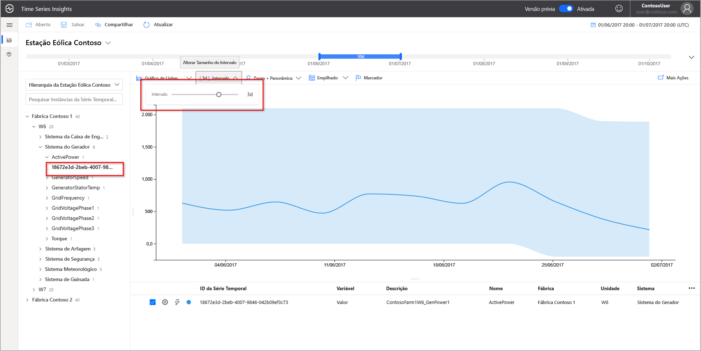](media/v2-update-quickstart/quick-start-interval-change.png#lightbox)

1. Expandindo o intervalo de tempo, podemos determinar se o problema foi resolvido ou se ele continua.

    * Estenda o período de tempo para 60 dias.

      [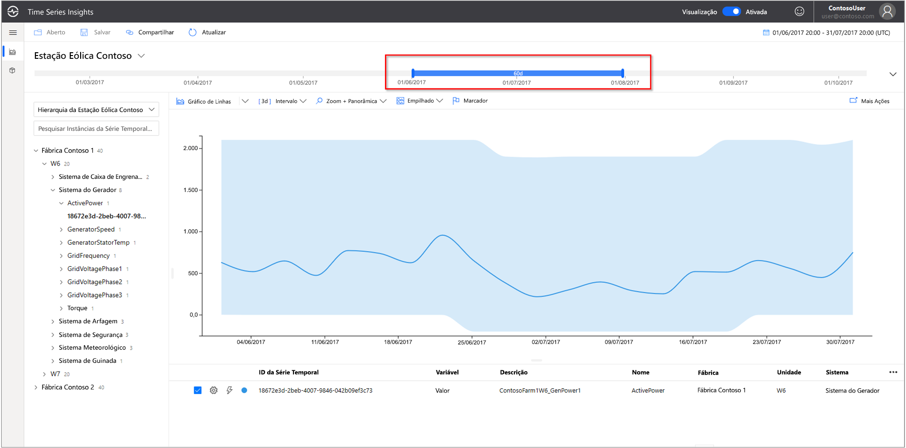](media/v2-update-quickstart/quick-start-expand-interval-range.png#lightbox)

1. Outros pontos de dados de sensor podem ser adicionados para fornecer um contexto superior. Quanto mais sensores vemos, maior é nossa compreensão do problema. Vamos adicionar um marcador para exibir os valores reais.

    1. Selecione **Sistema Gerador** e selecione três sensores: **GridVoltagePhase1**, **GridVoltagePhase2** e **GridVoltagePhase3**.
    1. Crie um marcador no último ponto de dados na área visível.

       [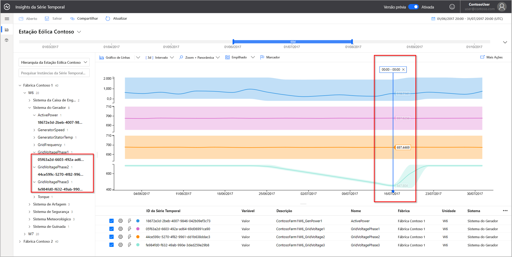](media/v2-update-quickstart/quick-start-drop-marker.png#lightbox)

    Dois dos sensores de tensão estão funcionando comparativamente e dentro dos parâmetros normais. Parece que o sensor **GridVoltagePhase3** é o culpado.

1. Com a adição de dados altamente contextuais, parece ainda mais que a queda da fase 3 é o problema. Agora, temos uma boa pista sobre a causa do aviso. Estamos prontos para indicar o problema à nossa equipe de manutenção.  

    * Altere a exibição para sobrepor todos os sensores do **Sistema Gerador** na mesma escala de gráfico.

      [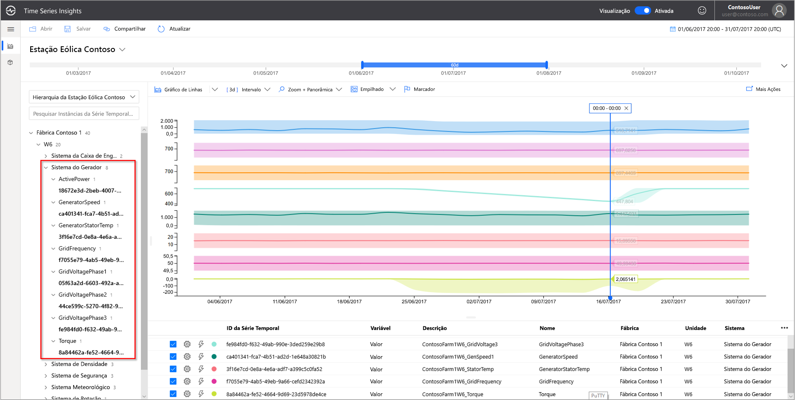](media/v2-update-quickstart/quick-start-generator-system.png#lightbox)

## Próximas etapas

Você está pronto para criar o próprio ambiente do Azure Time Series Insights Gen2. Para iniciar:

> [!div class="nextstepaction"]
> [Planejar o ambiente do Azure Time Series Insights Gen2](./how-to-plan-your-environment.md)

Saiba como usar a demonstração e seus recursos:

> [!div class="nextstepaction"]
> [O Azure Time Series Insights Gen2 Explorer](./concepts-ux-panels.md)
