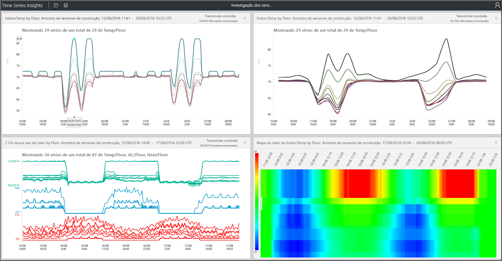

# O que é o Azure Time Series Insights Gen1?

> [!CAUTION]
> Esse é um artigo do Gen1.

O Azure Time Series Insights é compilado para armazenar, visualizar e consultar grandes quantidades de dados de série temporal, como aqueles gerados por dispositivos IoT. Se você deseja armazenar, gerenciar, consultar ou visualizar os dados de série temporal na nuvem, Azure Time Series Insights é provavelmente certa para você.

O Azure Time Series Insights tem quatro trabalhos principais:

- Ele é totalmente integrado com gateways de nuvem, como o Hub IoT e Hubs de Eventos do Azure. Ele se conecta facilmente a essas fontes de eventos e analisa JSON de mensagens e estruturas que têm dados em colunas e linhas limpas. Ele une metadados à telemetria e indexa seus dados em um repositório de colunas.
- O Azure Time Series Insights gerencia o armazenamento dos seus dados. Para garantir que os dados estejam sempre facilmente acessíveis, ele armazena seus dados na memória e SSDs por até 400 dias. Interativamente, você pode consultar bilhões de eventos em segundos – sob demanda.
- O Azure Time Series Insights fornece uma visualização pronta para uso por meio do Gerenciador do Azure Time Series Insights.
- O Azure Time Series Insights fornece um serviço de consulta no Gerenciador do Azure Time Series Insights e pelas APIs que são fáceis de integrar para inserir dados de séries temporais em aplicativos personalizados.

Se você estiver criando um aplicativo para consumo interno ou para a utilização de clientes externos, o Azure Time Series Insights poderá ser usado como um back-end. Você pode usá-lo para indexação, armazenamento e agregação de dados de série temporal. Para compilar uma visualização personalizada e uma experiência do usuário na parte superior usando o [SDK Cliente](https://github.com/microsoft/tsiclient/blob/master/docs/API.md). O Azure Time Series Insights também está equipado com várias [APIs de Consulta](./concepts-json-flattening-escaping-rules.md) para habilitar esses cenários personalizados.

Dados de série temporal representam como um processo ou um ativo é alterado ao longo do tempo. Os dados de série temporal são indexados por carimbos de data/hora e o tempo é o eixo mais significativo ao longo do qual esses dados são organizados. Normalmente, os dados de série temporal chegam em ordem sequencial e são tratados como uma inserção em vez de uma atualização do banco de dados.

Armazenar, indexar, consultar, analisar e visualizar os dados de série temporal em grandes volumes pode ser um desafio.
O Time Series Insights captura e armazena todos os novos eventos como uma linha e a alteração é uma medida eficiente ao longo do tempo. Consequentemente, você pode olhar para trás para ter insights do passado para ajudar a prever a alteração futura.

## Vídeo

### Saiba mais sobre o Azure Time Series Insights, a plataforma de análise de IoT baseada em nuvem. 

## Principais cenários

- Armazene dados de série temporal de maneira escalonável.

   Essencialmente, o Azure Time Series Insights tem um banco de dados criado usando os dados de série temporal. Como ele é totalmente gerenciado e escalonável, o Azure Time Series Insights manipula o trabalho de armazenamento e gerenciamento de eventos.

- Explore dados quase em tempo real.

   O Azure Time Series Insights fornece um Explorer que visualiza todos os dados que fazem streaming para um ambiente. Logo após se conectar a uma fonte de evento, você poderá ver, explorar e consultar dados de evento no Azure Time Series Insights. Os dados ajudam a validar se um dispositivo emite dados conforme esperado e monitorar um ativo de IoT para verificar a integridade, produtividade e eficiência geral.

- Realize a análise da causa raiz e detecte anomalias.

   O Azure Time Series Insights tem ferramentas como padrões e as exibições de perspectiva para conduzir e salvar a análise da causa raiz de várias etapas. Além disso, o Azure Time Series Insights funciona com alertas de serviços, como o Azure Stream Analytics, e permite que você veja alertas e detecte anomalias quase em tempo real no Gerenciador do Azure Time Series Insights.

- Tenha uma exibição global dos dados de série temporal que fazem streaming de dados de locais diferentes para comparação de vários ativos/sites.

   Você pode conectar várias fontes de evento a um ambiente do Azure Time Series Insights. Dessa forma, você pode visualizar dados que chegam de vários locais distintos juntos quase em tempo real. Os usuários podem aproveitar essa visibilidade para compartilhar dados com líderes empresariais. Eles podem colaborar melhor com especialistas de domínio que podem aplicar seu conhecimento para ajudar a resolver problemas, aplicar práticas recomendadas e compartilhar conhecimentos.

- Crie um aplicativo cliente sobre o Azure Time Series Insights.

   O Azure Time Series Insights expõe as APIs REST de Consulta para que você possa usá-la para compilar aplicativos que usam dados de série temporal.

## Funcionalidades

- **Introdução rápida**: O Azure Time Series Insights não exige uma preparação inicial de dados, portanto, você pode conectar-se rapidamente a milhões de eventos em seu hub IoT ou hub de eventos. Uma vez conectado, visualize e interaja com os dados do sensor para validar rapidamente suas soluções de IoT. Você pode interagir com os dados sem gravar código e não há novas linguagens a aprender. O Azure Time Series Insights fornece uma superfície de consulta de texto livre e granular para usuários avançados e uma exploração do tipo apontar e clicar.

- **Insights praticamente em tempo real**: O Azure Time Series Insights pode ingerir milhões de eventos de sensor por dia, com latência de um minuto. O Azure Time Series Insights ajuda você a obter insights sobre seus dados de sensor. Use-o para identificar tendências e anomalias, realizar análises de causa raiz e evitar períodos de inatividade dispendiosos. A correlação cruzada entre dados de histórico e em tempo real ajuda você a desbloquear tendências ocultas nos dados.

- **Crie soluções personalizadas**: Insira dados do Azure Time Series Insights em seus aplicativos existentes. Você também pode criar soluções personalizadas com as APIs REST do Azure Time Series Insights. Criar e compartilhar exibições personalizadas que você pode compartilhar para que outras pessoas explorem suas descobertas.

- **Escalabilidade**: O Azure Time Series Insights foi projetado para dar suporte à IoT em escala. É possível inserir de 1 milhão a 100 milhões de eventos por dia, com um período de tempo de retenção padrão de 31 dias. Você pode visualizar e analisar os fluxos de dados ativos quase em tempo real, juntamente com dados de histórico.

## Introdução

Siga estas etapas para começar.

1. Provisione um ambiente do Azure Time Series Insights no portal do Azure.
1. Conecte-se a uma fonte de eventos como um hub IoT ou um hub de eventos.
1. Carregue dados de referência. Isso não é um serviço adicional.
1. Examine e exiba seus dados em minutos com o Gerenciador do Azure Time Series Insights.

## Explorer

Veja, analise e descubra tendências em seus dados usando o Gerenciador do Azure Time Series Insights.

Saiba como usar o [Gerenciador do Azure Time Series Insights](time-series-insights-explorer.md) e extraia insights dos seus dados.

## Próximas etapas

- Explorar o [ambiente de demonstração](./time-series-quickstart.md) do Azure Time Series Insights Gen1.

- Saiba mais sobre como [planejar seu ambiente do Azure Time Series Insights](time-series-insights-environment-planning.md).