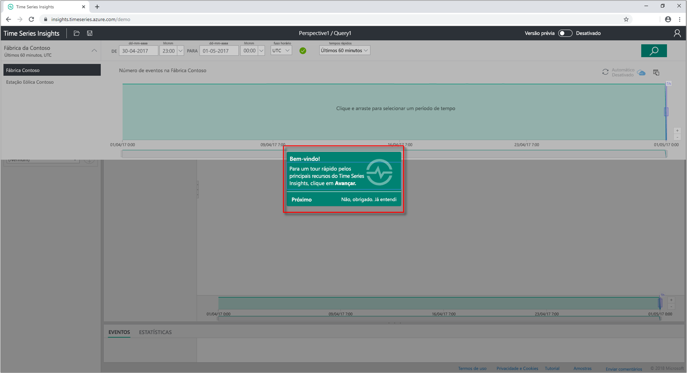
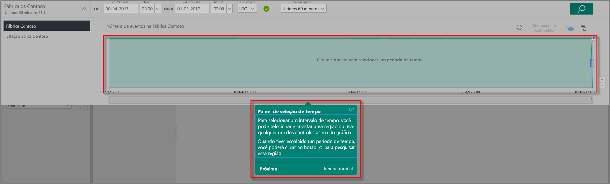
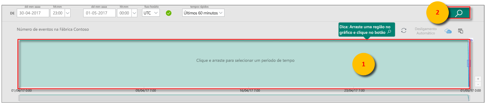
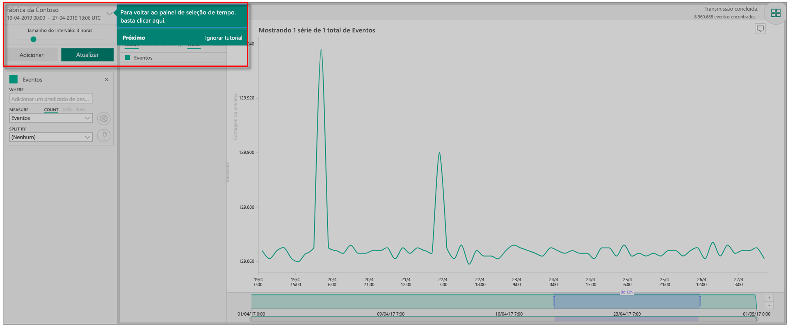
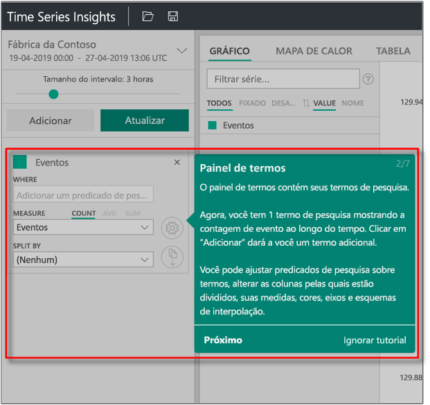
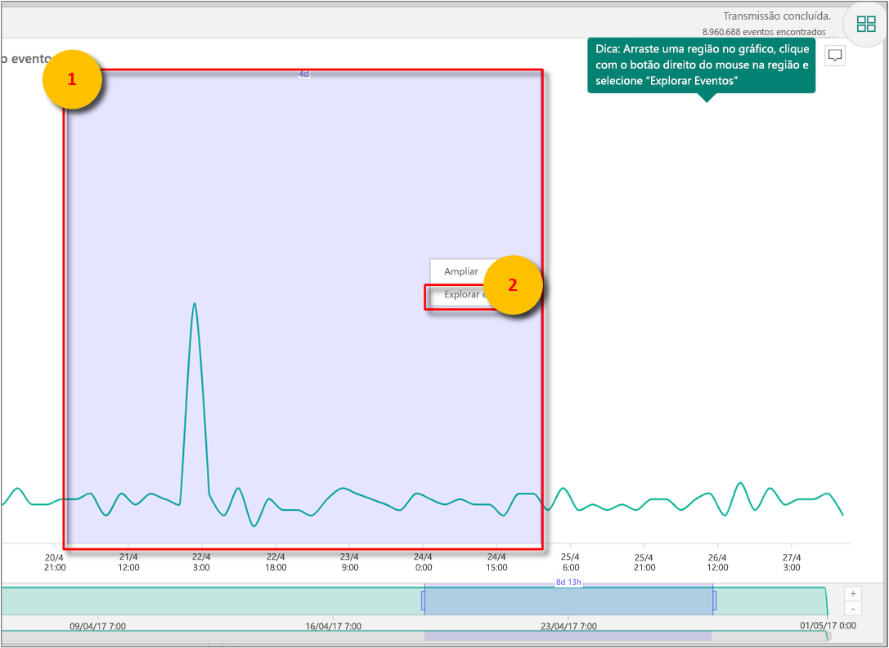
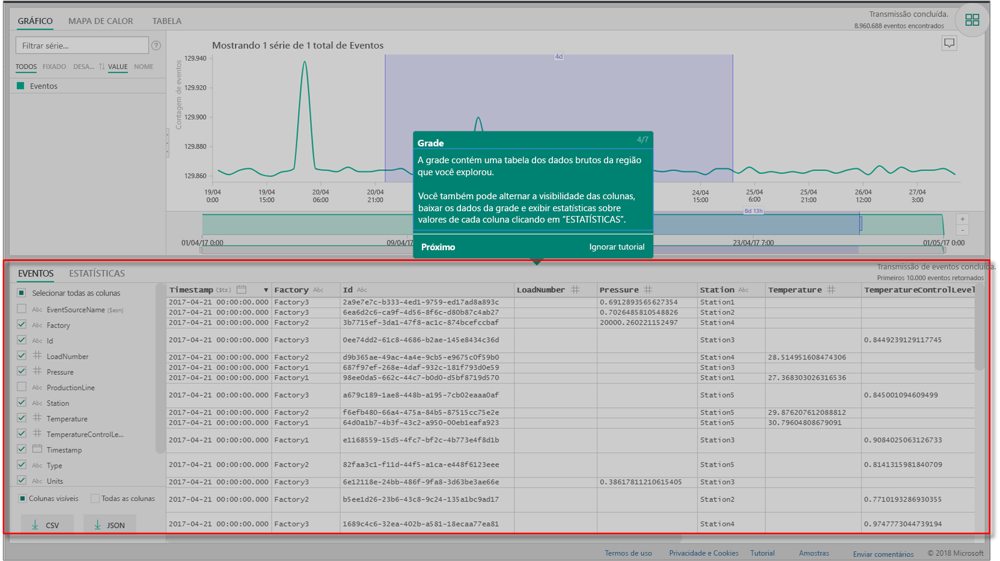
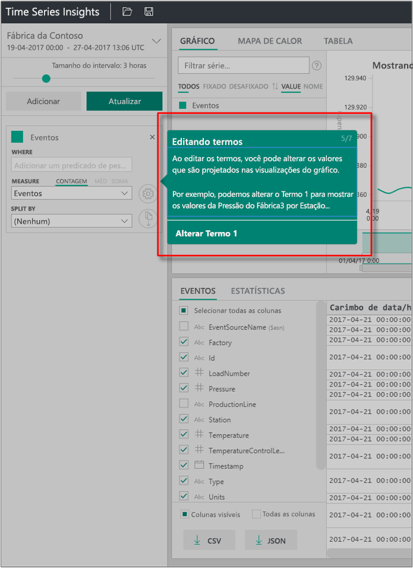
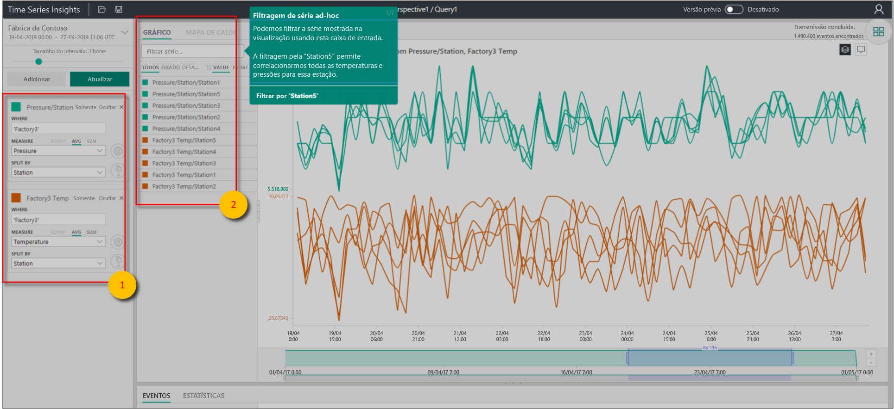

# Início Rápido: Explorar o Azure Time Series Insights Gen1

> [!CAUTION]
> Esse é um artigo do Gen1.

Este guia de início rápido do Gerenciador do Azure Time Series Insights ajuda você a começar a usar o Azure Time Series Insights Explorer em um ambiente de demonstração gratuito. Neste início rápido, você aprenderá a usar o navegador da Web para visualizar grandes volumes de dados de IoT e conhecerá os principais recursos atualmente em disponibilidade geral.

O Azure Time Series Insights é um serviço totalmente gerenciado de análise, armazenamento e visualização que facilita a exploração e análise de bilhões de eventos de IoT simultaneamente. Ele fornece uma exibição global dos dados, o que permite validar rapidamente sua solução de IoT e evitar um tempo de inatividade dispendioso de dispositivos críticos. O Azure Time Series Insights ajuda você a descobrir tendências ocultas, detectar anomalias e realizar análises de causa raiz quase em tempo real.

Para obter flexibilidade adicional, adicione o Azure Time Series Insights a um aplicativo já existente por meio de suas poderosas [APIs REST](./concepts-query-overview.md) e [SDK do cliente](https://github.com/microsoft/tsiclient). Você pode usar as APIs para armazenar, consultar e consumir dados de série temporal em um aplicativo cliente de sua escolha. Você também pode usar o SDK do cliente para adicionar componentes de interface do usuário ao aplicativo atual.

Este início rápido do Gerenciador do Azure Time Series Insights oferece um tour guiado de recursos.

> [!IMPORTANT]
> Criar uma [conta gratuita do Azure](https://azure.microsoft.com/free/?ref=microsoft.com&utm_source=microsoft.com&utm_medium=docs&utm_campaign=visualstudio) se ainda não tiver criado uma.

## Preparar o ambiente de demonstração

1. No navegador, acesse a [Demonstração Gen1](https://insights.timeseries.azure.com/demo).

1. Se solicitado, entre no Gerenciador do Azure Time Series Insights usando suas credenciais da conta do Azure.

1. A página de tour rápido do Azure Time Series Insights será exibida. Escolha **Avançar** para iniciar o tour rápido.

   

## Explorar o ambiente de demonstração

1. O **Painel de seleção de tempo** é exibido. Use esse painel para selecionar um período a ser visualizado.

   

1. Escolha um período de tempo e arraste-o na região. Em seguida, escolha **Pesquisar**.

   

   O Azure Time Series Insights exibe uma visualização de gráfico para o período especificado. Você pode realizar várias ações dentro do gráfico de linha. Por exemplo, você pode filtrar, fixar, classificar e empilhar.

   Para retornar ao **Painel de seleção de tempo**, escolha a seta para baixo, conforme mostrado:

   

1. Escolha **Adicionar** no **Painel de termos** para adicionar um novo termo de pesquisa.

   

1. No gráfico, você pode selecionar uma região, clicar com o botão direito do mouse na região e selecionar **Explorar Eventos**.

   

   Uma grade dos dados brutos é exibida na região que está sendo explorada.

   

## Seleciona e filtra conjuntos de dados

1. Edite seus termos para alterar os valores no gráfico. Adicione outro termo para fazer uma correlação cruzada entre diferentes tipos de valores.

   

1. Deixe a caixa **Filtrar série** em branco para exibir todos os termos de pesquisa selecionados ou insira um termo de filtro na caixa **Filtrar série** para a filtragem improvisada da série.

   

   Para o guia de início rápido, insira **Station5** para fazer uma correlação cruzada entre a temperatura e a pressão dessa estação.

Depois de concluir o guia de início rápido, faça experiências com o conjunto de dados de exemplo para criar visualizações diferentes.

## Limpar os recursos

Agora que concluiu o tutorial, limpe os recursos que você criou:

1. No menu à esquerda no [portal do Azure](https://portal.azure.com), selecione **Todos os recursos** e localize o grupo de recursos do Azure Time Series Insights.
1. Exclua todo o grupo de recursos (e todos os recursos contidos nele) selecionando **Excluir** ou remova cada recurso individualmente.

## Próximas etapas

* Você está pronto para criar seu ambiente do Azure Time Series Insights. Leia [Planejar o ambiente do Azure Time Series Insights](time-series-insights-environment-planning.md).
