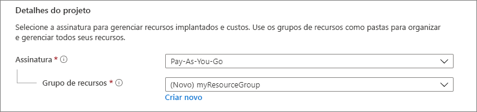
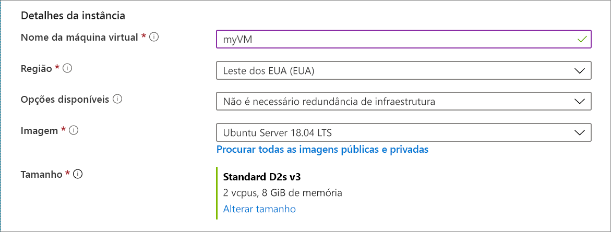
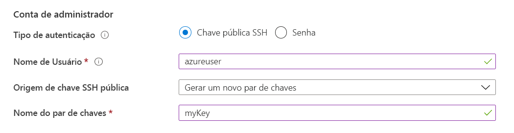
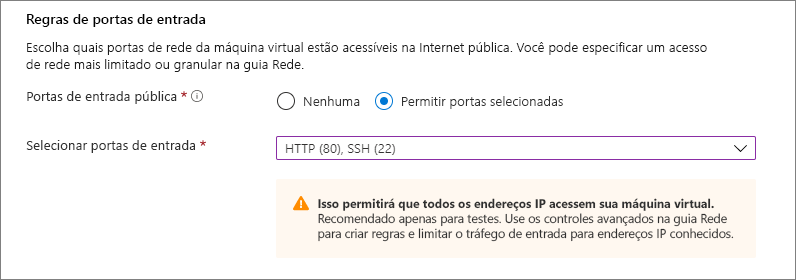
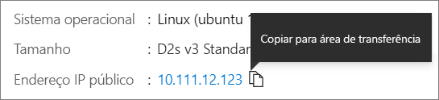

# <a name="quickstart-create-a-linux-virtual-machine-in-the-azure-portal"></a>Início Rápido: Criar uma máquina virtual do Linux no portal do Azure

As máquinas virtuais (VM) do Azure podem ser criadas por meio do Portal do Azure. O portal do Azure é uma interface de usuário baseada em navegador para criar recursos do Azure. Este início rápido mostra como usar o portal do Azure para implantar uma máquina virtual (VM) Linux que executa o Ubuntu 18.04 LTS. Para ver a VM em ação, você também habilita o SSH na VM e instala o servidor Web do NGINX.

Se você não tiver uma assinatura do Azure, crie uma [conta gratuita](https://azure.microsoft.com/free/?WT.mc_id=A261C142F) antes de começar.

## <a name="sign-in-to-azure"></a>Entrar no Azure

Entre no [portal do Azure](https://portal.azure.com), se você ainda não fez isso.

## <a name="create-virtual-machine"></a>Criar máquina virtual

1. Digite **máquinas virtuais** na pesquisa.
1. Em **Serviços**, selecione **Máquinas virtuais**.
1. Na página **Máquinas Virtuais**, selecione **Adicionar**. A página **Criar uma máquina virtual** é aberta.
1. Na guia **Básico**, em **Detalhes do projeto**, verifique se a assinatura correta está selecionada e, em seguida, escolha **Criar** grupo de recursos. Digite *myResourceGroup* no nome*. 

    

1. Em **Detalhes da instância**, digite *myVM* para o **Nome da máquina virtual**, escolha *Leste dos EUA* para **Região** e escolha *Ubuntu 18.04 LTS* para sua **Imagem**. Deixe os outros padrões.

    

1. Em **Conta do administrador**, selecione **Chave pública SSH**.

1. Em **Nome de usuário**, digite *azureuser*.

1. Em **Origem de chave pública SSH**, mantenha o padrão de **Gerar novo par de chaves** e digite *myKey* como o **Nome do par de chaves**.

    

1. Em **Regras de porta de entrada** > **Portas de entrada públicas**, escolha **Permitir portas selecionadas** e, em seguida, selecione **SSH (22)** e **HTTP (80)** na lista suspensa. 

    

1. Deixe os padrões restantes e, em seguida, selecione o botão **Examinar + criar** na parte inferior da página.

1. Na página **Criar uma máquina virtual**, você pode ver os detalhes sobre a VM que você está prestes a criar. Quando estiver pronto, selecione **Criar**.

1. Quando a janela **Gerar novo par de chaves** for aberta, selecione **Baixar chave privada e criar recurso**. O arquivo de chave será baixado como **myKey.pem**. Verifique se você sabe o local de download do arquivo `.pem`, pois precisará do caminho para ele na próxima etapa.

1. Depois que a implantação for concluída, selecione **Ir para o recurso**.

1. Na página da nova VM, selecione o endereço IP público e copie-o para a área de transferência.


    

## <a name="connect-to-virtual-machine"></a>Conectar-se à máquina virtual

Crie uma conexão SSH com a VM.

1. Se estiver usando um computador Mac ou Linux, abra um prompt do Bash. Se estiver usando um computador Windows, abra um prompt do PowerShell. 

1. No prompt, abra uma conexão SSH com a máquina virtual. Substitua o endereço IP por aquele da VM e substitua o caminho para o `.pem` pelo caminho para o local de download do arquivo de chave.

```console
ssh -i .\Downloads\myKey1.pem azureuser@10.111.12.123
```

> [!TIP]
> A chave SSH criada pode ser usada na próxima vez que você criar uma VM no Azure. Basta selecionar **Usar uma chave armazenada no Azure** em **Origem de chave pública SSH** na próxima vez que criar uma VM. Você já tem a chave privada no computador e, portanto, não precisará baixar nada.

## <a name="install-web-server"></a>Instalar servidor Web

Para ver a VM em ação, instale o servidor Web do NGINX. Na sua sessão de SSH, atualize suas fontes de pacote e, em seguida, instale o pacote mais recente do NGINX.

```bash
sudo apt-get -y update
sudo apt-get -y install nginx
```

Quando terminar, digite `exit` para sair da sessão SSH.


## <a name="view-the-web-server-in-action"></a>Ver o servidor Web em ação

Use um navegador da Web de sua escolha para exibir a página inicial padrão do NGINX. Digite o endereço IP público da VM como o endereço Web. O endereço IP público pode ser encontrado na página de visão geral de VM ou como parte da cadeia de conexão SSH usada anteriormente.


## <a name="clean-up-resources"></a>Limpar os recursos

Quando o grupo de recursos, a máquina virtual e todos os recursos relacionados não forem mais necessários, exclua-os. Para fazer isso, selecione o grupo de recursos da máquina virtual, selecione **Excluir**, em seguida, confirme o nome do grupo de recursos para excluir.

## <a name="next-steps"></a>Próximas etapas

Neste início rápido, você implantou uma máquina virtual simples, criou um Grupo de Segurança de Rede e uma regra e instalou um servidor Web básico. Para saber mais sobre máquinas virtuais do Azure, continue o tutorial para VMs do Linux.

> [!div class="nextstepaction"]
> [Tutoriais de máquina virtual do Linux Azure](./tutorial-manage-vm.md)
