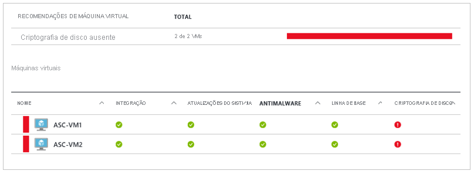

# Azure Disk Encryption para VMs do Windows

O Azure Disk Encryption ajuda a proteger seus dados e a atender aos compromissos de conformidade e segurança de sua organização. Ele usa o recurso [BitLocker](https://en.wikipedia.org/wiki/BitLocker) do Windows para fornecer criptografia de volume para o sistema operacional e os discos de dados das VMs (máquinas virtuais) do Azure e é integrado com o [Azure Key Vault](../../key-vault/index.yml) para ajudá-lo a controlar e gerenciar as chaves e os segredos de criptografia de disco.

Azure Disk Encryption é resiliente de zona, da mesma forma que as máquinas virtuais. Para obter detalhes, consulte [Serviços do Azure que dão suporte a zonas de disponibilidade](../../availability-zones/az-region.md).

Se você usar a [Central de Segurança do Azure](../../security-center/index.yml), receberá um alerta se tiver VMs não criptografadas. Esses alertas são mostrados como Alta Gravidade e a recomendação é criptografar essas VMs.

> [!WARNING]
> - Se você já tiver usado o Azure Disk Encryption com o Azure AD anteriormente para criptografar uma VM, deverá continuar usando essa opção para criptografar a VM. Confira [Azure Disk Encryption com o Azure AD (versão anterior)](disk-encryption-overview-aad.md) para detalhes. 
> - Determinadas recomendações podem aumentar o uso de recursos de dados, rede ou computação, resultando em custos adicionais de licença ou inscrição. Você deve ter uma assinatura ativa válida do Azure para criar recursos no Azure nas regiões com suporte.

Você pode aprender os conceitos básicos do Azure Disk Encryption para Windows em apenas alguns minutos com a [criação e a criptografia de uma VM do Windows com CLI do Azure início rápido](disk-encryption-cli-quickstart.md) ou a [criação e a criptografia de uma VM do Windows com o guia de início rápido do Azure PowerShell](disk-encryption-powershell-quickstart.md).

## Sistemas operacionais e VMs com suporte

### VMs com suporte

As VMs do Windows estão disponíveis em [vários tamanhos](../sizes-general.md). Azure Disk Encryption tem suporte em VMs de geração 1 e geração 2. O Azure Disk Encryption também está disponível para VMs com armazenamento premium.

O Azure Disk Encryption não está disponível em [VMs básicas da série A](https://azure.microsoft.com/pricing/details/virtual-machines/series/)ou em máquinas virtuais com menos de 2 GB de memória.  O Azure Disk Encryption também não está disponível em imagens de VM sem discos temporários (DV4, Dsv4, Ev4 e Esv4).  Confira [tamanhos de VM do Azure sem disco temporário local](../azure-vms-no-temp-disk.md).  Para obter mais exceções, consulte [Azure Disk Encryption: Cenários sem suporte](disk-encryption-windows.md#unsupported-scenarios).

### Sistemas operacionais compatíveis

- Cliente Windows: Windows 8 e posterior.
- Windows Server: Windows Server 2008 R2 e posterior.  
 
> [!NOTE]
> O Windows Server 2008 R2 requer que o .NET Framework 4,5 seja instalado para criptografia; Instale-o de Windows Update com a atualização opcional Microsoft .NET Framework 4.5.2 para sistemas baseados em Windows Server 2008 R2 x64 ([KB2901983](https://www.catalog.update.microsoft.com/Search.aspx?q=KB2901983)).  
>  
> O Windows Server 2012 R2 Core e o Windows Server 2016 Core exigem que o componente BdeHdCfg seja instalado na VM para criptografia.

## Requisitos de rede
Para habilitar Azure Disk Encryption, as VMs devem atender aos seguintes requisitos de configuração de ponto de extremidade de rede:
  - Para obter um token para se conectar ao cofre de chaves, a VM do Windows deve ser capaz de se conectar a um ponto de extremidade Azure Active Directory, \[ login.microsoftonline.com \] .
  - Para gravar as chaves de criptografia no cofre de chaves, a VM do Windows deve ser capaz de se conectar ao ponto de extremidade do cofre de chaves.
  - A VM do Windows deve ser capaz de se conectar a um ponto de extremidade de armazenamento do Azure que hospeda o repositório de extensões do Azure e uma conta de armazenamento do Azure que hospeda os arquivos VHD.
  -  Se a política de segurança limita o acesso de VMs do Azure à Internet, você pode resolver o URI anterior e configurar uma regra específica para permitir a conectividade de saída para os IPs. Para obter mais informações, consulte [Azure Key Vault por trás de um firewall](../../key-vault/general/access-behind-firewall.md).    

## Requisitos de Política de Grupo

Azure Disk Encryption usa o protetor de chave externa do BitLocker para VMs do Windows. Para VMs ingressado no domínio, não envie por push todas as políticas de grupo que imponham protetores TPM. Para obter informações sobre a política de grupo para "permitir BitLocker sem um TPM compatível", consulte [referência do bitlocker política de grupo](/windows/security/information-protection/bitlocker/bitlocker-group-policy-settings#bkmk-unlockpol1).

A política do BitLocker em máquinas virtuais ingressadas no domínio com a política de grupo personalizada deve incluir a seguinte configuração: [Configurar o armazenamento do usuário das informações de recuperação do BitLocker-> permitir chave de recuperação de 256 bits](/windows/security/information-protection/bitlocker/bitlocker-group-policy-settings). O Azure Disk Encryption falha quando as configurações da política de grupo personalizada para o BitLocker são incompatíveis. Em computadores que não tinham a configuração de política correta, aplique a nova política, force a atualização da nova política (gpupdate.exe /force) e, em seguida, pode ser necessário reiniciar.

Azure Disk Encryption falhará se a diretiva de grupo no nível de domínio bloquear o algoritmo AES-CBC, que é usado pelo BitLocker.

## Requisitos de armazenamento de chave de criptografia  

O Azure Disk Encryption requer um Azure Key Vault para ajudar você a controlar e gerenciar os segredos e chaves de criptografia de disco. Seu cofre de chaves e as VMs devem residir na mesma região e assinatura do Azure.

Para saber detalhes, confira [Criar e configurar um cofre de chaves para Azure Disk Encryption](disk-encryption-key-vault.md).

## Terminologia
A tabela a seguir define alguns dos termos comuns usados na documentação de criptografia de disco do Azure:

| Terminologia | Definição |
| --- | --- |
| Cofre de Chave do Azure | Key Vault é um serviço de gerenciamento de chaves criptográfico baseado em módulos de segurança de hardware validados pelo FIPS (Federal Information Processing Standards). Esses padrões ajudam a proteger as chaves criptográficas e os segredos confidenciais. Para obter mais informações, consulte a documentação do [Azure Key Vault](https://azure.microsoft.com/services/key-vault/) e [Criar e configurar um cofre de chaves para Azure Disk Encryption](disk-encryption-key-vault.md). |
| CLI do Azure | [A CLI do Azure](/cli/azure/install-azure-cli) é otimizada para gerenciar e administrar os recursos do Azure na linha de comando.|
| BitLocker |O [BitLocker](/previous-versions/windows/it-pro/windows-server-2012-R2-and-2012/hh831713(v=ws.11)) é uma tecnologia de criptografia de volume do Windows reconhecida pela indústria que é usada para habilitar a criptografia de disco em VMs do Windows. |
| Chave com criptografia de chave (KEK) | A chave assimétrica (RSA 2048) que pode ser usada para proteger ou encapsular o segredo. É possível fornecer uma chave protegida por HSM (módulos de segurança de hardware) ou uma chave protegida por software. Para obter mais informações, consulte a documentação do [Azure Key Vault](https://azure.microsoft.com/services/key-vault/) e [Criar e configurar um cofre de chaves para Azure Disk Encryption](disk-encryption-key-vault.md). |
| Cmdlets do PowerShell | Para obter mais informações, confira [cmdlets do Azure PowerShell](/powershell/azure/). |

## Próximas etapas

- [Início rápido-criar e criptografar uma VM do Windows com CLI do Azure ](disk-encryption-cli-quickstart.md)
- [Início rápido-criar e criptografar uma VM do Windows com Azure PowerShell](disk-encryption-powershell-quickstart.md)
- [Cenários de Azure Disk Encryption em VMs Windows](disk-encryption-windows.md)
- [Script da CLI dos pré-requisitos do Azure Disk Encryption](https://github.com/ejarvi/ade-cli-getting-started) 
- [Script do PowerShell dos pré-requisitos do Azure Disk Encryption](https://github.com/Azure/azure-powershell/tree/master/src/Compute/Compute/Extension/AzureDiskEncryption/Scripts)
- [Criando e configurando um cofre de chaves para Azure Disk Encryption](disk-encryption-key-vault.md)