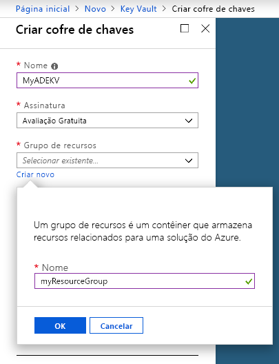
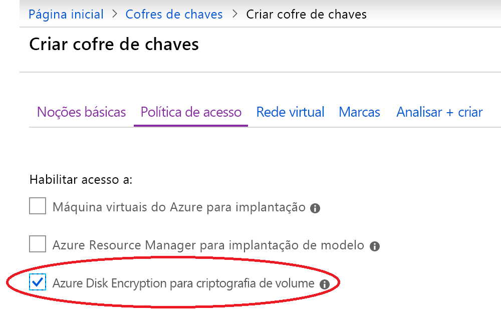
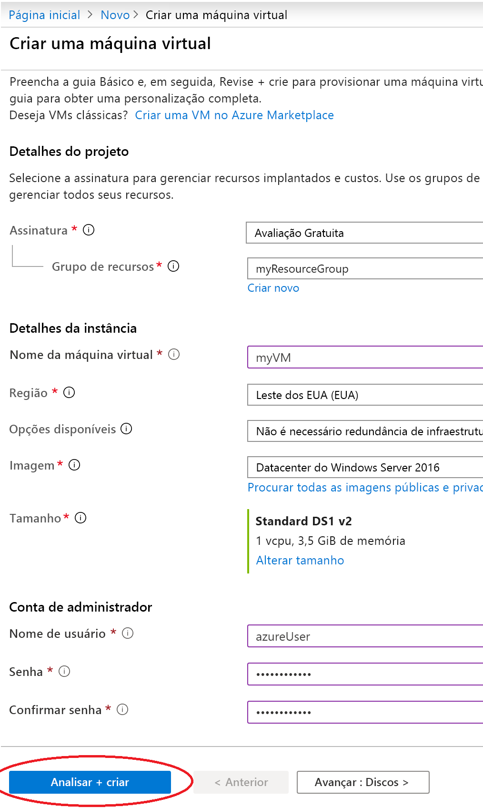
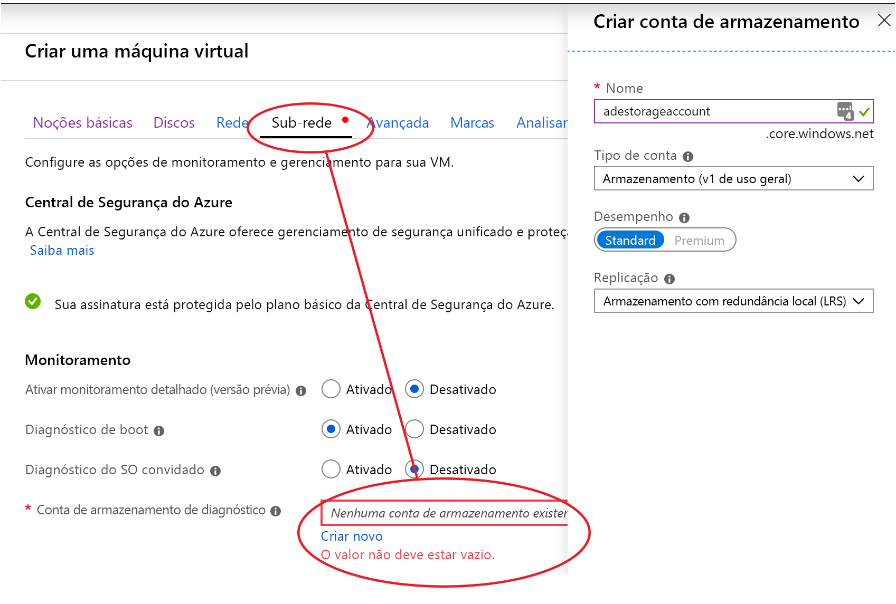
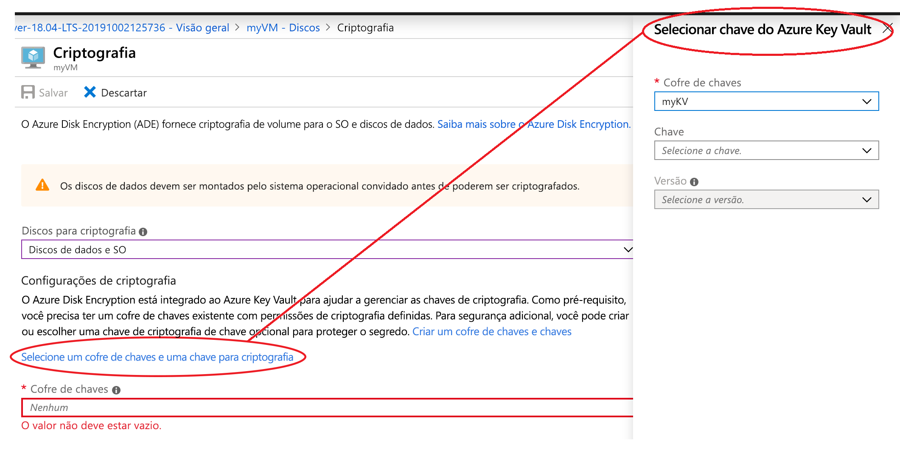

# Início Rápido: Criar e criptografar uma máquina virtual do Windows com o portal do Azure

As máquinas virtuais (VM) do Azure podem ser criadas por meio do Portal do Azure. O portal do Azure é uma interface de usuário baseada em navegador para criar as VMS e seus recursos relacionados. Neste início rápido, você usará o portal do Azure para implantar uma VM (máquina virtual) do Windows executando o Ubuntu 18.04 LTS, criar um cofre de chaves para o armazenamento de chaves de criptografia e criptografar a VM.

Se você não tiver uma assinatura do Azure, crie uma [conta gratuita](https://azure.microsoft.com/free/?WT.mc_id=A261C142F) antes de começar.

## Entrar no Azure

Entre no [Portal do Azure](https://portal.azure.com).

## Criar um cofre de chave

1. Selecione a opção **Criar um recurso** no canto superior esquerdo do portal do Azure
1. Digite **Key Vault** na caixa Pesquisar.
1. Na lista de resultados, selecione **Key Vault**.
1. Na seção Key Vault, selecione **Criar**.
1. Na tela **Criar cofre de chaves**, escolha um nome exclusivo para o novo cofre de chaves.

    > [!Important]
    > Cada Key Vault deve ter um nome exclusivo. O exemplo a seguir cria um Key Vault chamado *myADEKV*, mas você deve colocar um nome diferente.

1. Selecione uma **Assinatura**.
1.  Em **Grupo de recursos**, selecione **Criar**. Na janela pop-up, digite *myResourceGroup* no nome do grupo de recursos e, em seguida, escolha **OK**. 

    

1. No menu suspenso **Localização**, escolha **Leste dos EUA**.
1. Deixe as outras opções em seus padrões.
1. Selecione "Políticas de Acesso", o que levará você para uma nova tela.
1. Selecione a caixa rotulada ao lado de "Habilitar o acesso ao Azure Disk Encryption para a criptografia do volume".

    

1. Na parte inferior da tela Políticas de Acesso, clique em "Examinar + Criar".
1. Após revisar, clique em "Criar".

## Criar uma máquina virtual

1. Escolha **Criar um recurso** no canto superior esquerdo do portal do Azure.

1. Na página Novo, em Popular, selecione **Datacenter do Windows Server 2016**.
1. Na guia **Básico**, em **Detalhes do projeto**, verifique se a assinatura correta está selecionada.
1. Para **Grupo de recursos**, selecione o grupo de recursos que você criou ao criar o cofre de chaves acima (por exemplo, **myResourceGroup**)
1. Para **Nome da máquina virtual**, insira *MyVM* e escolha 
1. Para **Região**, selecione a mesma região que você usou ao criar o cofre de chaves acima (por exemplo, **Leste dos EUA**).
1. Verifique se o **Tamanho** é *Standard D2s v3*.
1. Em **Conta do administrador**, selecione **Senha**. Digite um nome de usuário e uma senha.
    
1. Selecione a guia "Gerenciamento" e verifique se você tem uma Conta de Armazenamento de Diagnóstico. Se você não tiver contas de armazenamento, selecione "Criar", dê um nome à nova conta e selecione "OK" 
1. Clique em "Examinar + Criar".
1. Na página **Criar uma máquina virtual**, você pode ver os detalhes sobre a VM que você está prestes a criar. Quando estiver pronto, selecione **Criar**.

Levará alguns minutos para que sua VM seja implantada. Quando a implantação for concluída, vá para a próxima seção.

## Criptografar a máquina virtual

1. Depois que a implantação da VM estiver concluída, selecione **Ir para o recurso**.
1. No lado esquerdo, selecione **Discos**.
1. Na tela Discos, selecione **Criptografia**. 

    

1. Na tela criptografia, em **Discos para criptografar**, escolha **SO e discos de dados**.
1. Em **Configurações de criptografia**, clique em "Selecionar um cofre de chaves e uma chave para criptografia".
1. Na barra lateral direita, selecione o nome do cofre de chaves que você criou anteriormente como o valor para *Cofre de chaves** e clique em **Selecionar**.

    
1. Na parte superior da tela de criptografia, clique em "Salvar". Um pop-up avisará que a VM será reinicializada. Clique em **Sim**.

## Limpar recursos

Quando o grupo de recursos, a máquina virtual e todos os recursos relacionados não forem mais necessários, exclua-os. Para fazer isso, selecione o grupo de recursos da máquina virtual, selecione Excluir, em seguida, confirme o nome do grupo de recursos a excluir.

## Próximas etapas

Neste guia de início rápido, você criou um Key Vault habilitado para chaves de criptografia, criou uma máquina virtual e habilitou a máquina virtual para criptografia.  

> [!div class="nextstepaction"]
> [Visão geral do Azure Disk Encryption](disk-encryption-overview.md)