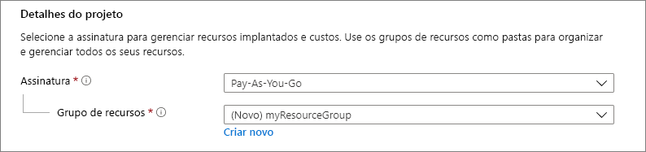
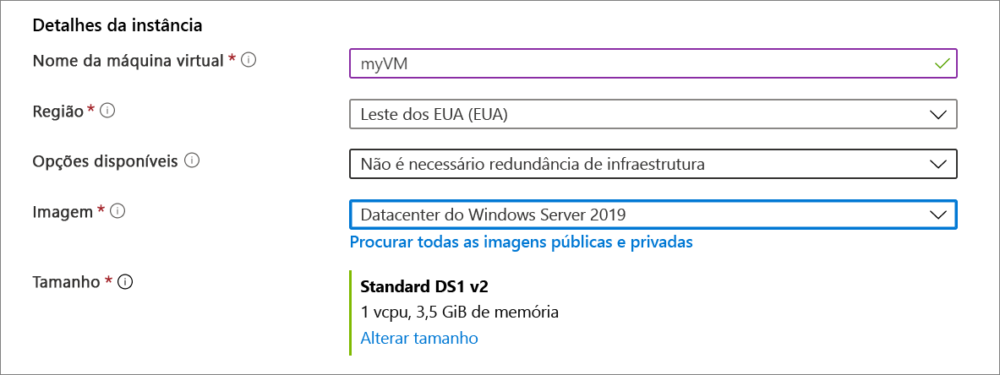
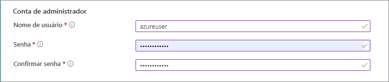
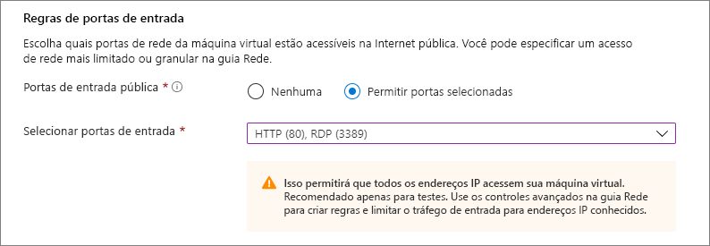
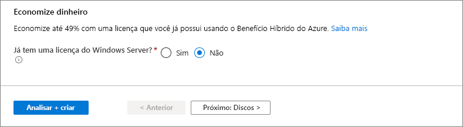
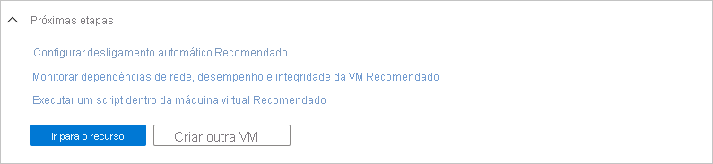
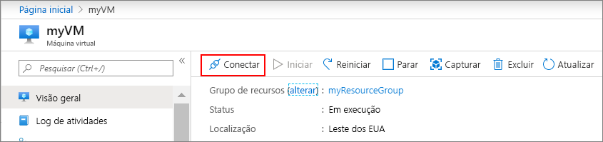

# <a name="quickstart-create-a-windows-virtual-machine-in-the-azure-portal"></a>Início Rápido: Criar uma máquina virtual do Windows no Portal do Azure

As máquinas virtuais (VM) do Azure podem ser criadas por meio do Portal do Azure. Esse método fornece uma interface de usuário baseada em navegador para criar as VMS seus recursos relacionados. Este início rápido mostra como usar portal do Azure para implantar uma VM (máquina virtual) no Azure que executa o Windows Server 2019. Para ver a VM em ação, você habilita o protocolo RDP na VM e instala o servidor Web do IIS.

Se você não tiver uma assinatura do Azure, crie uma [conta gratuita](https://azure.microsoft.com/free/?WT.mc_id=A261C142F) antes de começar.

## <a name="sign-in-to-azure"></a>Entrar no Azure

Entre no Portal do Azure em https://portal.azure.com.

## <a name="create-virtual-machine"></a>Criar máquina virtual

1. Digite **máquinas virtuais** na pesquisa.
1. Em **Serviços**, selecione **Máquinas virtuais**.
1. Na página **Máquinas virtuais**, selecione **Adicionar** e **Máquina virtual**. 
1. Na guia **Básico**, em **Detalhes do projeto**, verifique se a assinatura correta está selecionada e, em seguida, escolha **Criar** grupo de recursos. Digite *myResourceGroup* para o nome. 

    

1. Em **Detalhes da instância**, digite *myVM* para o **Nome da máquina virtual** e escolha *Leste dos EUA* para **Região**. Escolha *Datacenter do Windows Server 2019* como a **Imagem** e *Standard_DS1_v2* como **Tamanho**. Deixe os outros padrões.

    

1. Em **Conta de administrador**, forneça um nome de usuário, como *azureuser* e uma senha. A senha deve ter no mínimo 12 caracteres e atender a [requisitos de complexidade definidos](faq.md#what-are-the-password-requirements-when-creating-a-vm).

    

1. Em **Regras de porta de entrada**, escolha **Permitir portas selecionadas** e, em seguida, selecione **RDP (3389)** e **HTTP (80)** na lista suspensa.

    

1. Deixe os padrões restantes e, em seguida, selecione o botão **Examinar + criar** na parte inferior da página.

    

1. Após a execução da validação, selecione o botão **Criar** na parte inferior da página.

1. Após a conclusão da implantação, selecione **Ir para o recurso**.

    

## <a name="connect-to-virtual-machine"></a>Conectar-se à máquina virtual

Inicie uma conexão da área de trabalho remota para a máquina virtual. Estas instruções ensinam a se conectar aàsua VM de um computador com Windows. Em um Mac, você precisa de um cliente RDP, como este [Cliente de Área de Trabalho Remota](https://apps.apple.com/app/microsoft-remote-desktop/id1295203466?mt=12) da Mac App Store.

1. Na página de visão geral da máquina virtual, selecione o botão **Conectar** e selecione **RDP**. 

    
    
2. Na página **Conectar-se ao RDP**, mantenha as opções padrão para se conectar por endereço IP pela porta 3389 e clique em **Baixar arquivo RDP**.

2. Abra o arquivo RDP baixado e clique em **Conectar** quando solicitado. 

3. Na janela **Segurança do Windows**, selecione **Mais opções** e **Usar uma conta diferente**. Digite o nome de usuário como **localhost**\\*nome de usuário*, insira a senha que você criou para a máquina virtual e clique em **OK**.

4. Você pode receber um aviso do certificado durante o processo de logon. Clique em **Sim** ou em **Continuar** para criar a conexão.

## <a name="install-web-server"></a>Instalar servidor Web

Para ver a VM em ação, instale o servidor Web do IIS. Abra um prompt do PowerShell na VM e execute o seguinte comando:

```powershell
Install-WindowsFeature -name Web-Server -IncludeManagementTools
```

Quando terminar, feche a conexão RDP com a VM.


## <a name="view-the-iis-welcome-page"></a>Exibir a página de boas-vindas do IIS

No portal, selecione a VM e, na visão geral da VM, passe o mouse sobre o endereço IP para mostrar **Copiar para área de transferência**. Copie o endereço IP e cole-o em uma guia do navegador. A página de boas-vinda do IIS padrão será aberta e deve ter esta aparência:


## <a name="clean-up-resources"></a>Limpar os recursos

Quando o grupo de recursos, a máquina virtual e todos os recursos relacionados não forem mais necessários, exclua-os. 

Vá para o grupo de recursos da máquina virtual e selecione **Excluir grupo de recursos**. Confirme o nome do grupo de recursos terminar de excluir os recursos.

## <a name="next-steps"></a>Próximas etapas

Neste início rápido, você implantou uma máquina virtual simples, abriu uma porta de rede para o tráfego da Web e instalou um servidor Web básico. Para saber mais sobre máquinas virtuais do Azure, continue o tutorial para VMs do Windows.

> [!div class="nextstepaction"]
> [Tutoriais de máquina virtual do Windows Azure](./tutorial-manage-vm.md)
