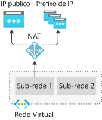
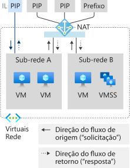
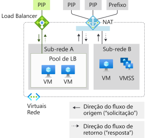
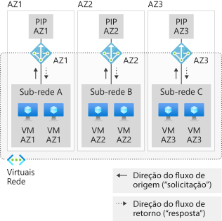
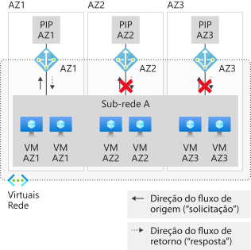
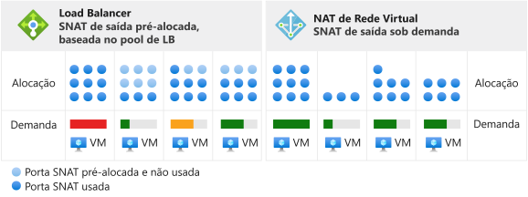
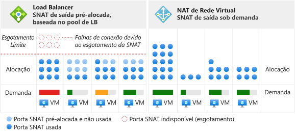

# Criar redes virtuais com recursos de gateway de NAT

Recursos de gateway da NAT são parte da [NAT de Rede Virtual](nat-overview.md) e fornecem conectividade com a Internet de saída para uma ou mais sub-redes de uma rede virtual. A sub-rede da rede virtual declara qual gateway da NAT será usado. A NAT fornece a SNAT (conversão de endereços de rede de origem) para uma sub-rede.  Os recursos do gateway da NAT especificam quais máquinas virtuais de endereço IP estático usar ao criar fluxos de saída. Os endereços IP estáticos são provenientes de recursos de endereço IP público (PIP), recursos de prefixo de IP público ou ambos. Se um recurso de prefixo de IP público for usado, todos os endereços IP de todo o recurso de prefixo de IP público serão consumidos por um recurso de gateway da NAT. Um recurso de gateway da NAT pode usar um total de até 16 endereços IP estáticos, de qualquer desses tipos.

  

*Figura: NAT de Rede Virtual para saída à Internet*

## Como implantar a NAT

Configurar e usar o gateway da NAT é intencionalmente simples:  

Recurso de gateway da NAT:
- crie um recurso de gateway da NAT regional ou zonal (isolado em zona),
- atribua endereços IP,
- Se necessário, modifique o tempo limite de ociosidade de TCP (opcional).  Examine os [temporizadores](#timers) <ins>antes</ins> de alterar o padrão.

Rede virtual:
- Configure a sub-rede da rede virtual para usar um gateway da NAT.

Rotas definidas pelo usuário não são necessárias.

## Recurso

O recurso é projetado para ser simples, conforme você pode ver no exemplo a seguir do Azure Resource Manager, em um formato semelhante ao de um modelo.  Esse formato semelhante ao de um modelo é mostrado aqui para ilustrar os conceitos e a estrutura.  Modifique o exemplo segundo as suas necessidades.  Este documento não é destinado a servir como um tutorial.

O diagrama a seguir mostra as referências graváveis entre os diferentes recursos do Azure Resource Manager.  A seta indica a direção da referência, partindo no local em que ela é gravável. Revisão 

  

*Figura: Modelo de objeto da NAT de Rede Virtual*

A NAT é recomendada para a maioria das cargas de trabalho, a menos que você tenha uma dependência específica de [conectividade de saída do Load Balancer baseada em pool](../load-balancer/load-balancer-outbound-connections.md).  

Você pode migrar de cenários de um Standard Load Balancer, incluindo [regras de saída](../load-balancer/load-balancer-outbound-connections.md#outboundrules), para um gateway da NAT. Para migrar, mova os recursos de prefixo de IP público e prefixo de IP público dos front-ends do balanceador de carga para o gateway da NAT. Não são necessários novos endereços IP para o gateway da NAT. Recursos de endereço IP público Standard e o recurso de prefixo de IP público podem ser reutilizados, desde que o total não exceda 16 endereços IP. Planeje a migração considerando a interrupção do serviço durante a transição.  Automatizando o processo, você pode minimizar a interrupção. Teste a migração primeiro em um ambiente de preparo.  Durante a transição, fluxos originados em entrada não são afetados.

O exemplo a seguir é um trecho de um modelo do Azure Resource Manager.  Este modelo implanta vários recursos, incluindo um gateway de NAT.  O modelo tem os seguintes parâmetros neste exemplo:

- **natgatewayname**– nome do gateway de NAT.
- **location** – região do Azure em que o recurso está localizado.
- **publicipname** – nome do IP público de saída associado ao gateway de NAT.
- **vnetname** – nome da rede virtual.
- **subnetname** – nome da sub-rede associada ao gateway de NAT.

O número total de endereços IP fornecidos por todos os recursos de prefixo e endereço IP não pode exceder 16 endereços IP. Qualquer número de endereços IP entre 1 e 16 é permitido.

:::code language="json" source="~/quickstart-templates/101-nat-gateway-vnet/azuredeploy.json" range="81-96":::

Quando o recurso de gateway da NAT tiver sido criado, ele poderá ser usado em uma ou mais sub-redes de uma rede virtual. Especifique quais sub-redes usam esse recurso de gateway da NAT. Um gateway da NAT não é pode abranger mais de uma rede virtual. Não é necessário atribuir o mesmo gateway da NAT para todas as sub-redes de uma rede virtual. Sub-redes individuais podem ser configuradas com diferentes recursos de gateway da NAT.

Os cenários que não usam zonas de disponibilidade serão regionais (sem que zonas sejam especificadas). Se você estiver usando zonas de disponibilidade, poderá especificar uma zona para isolar a NAT em uma zona específica. O uso de redundância de zona não é compatível. Examine as [zonas de disponibilidade](#availability-zones) da NAT.

:::code language="json" source="~/quickstart-templates/101-nat-gateway-vnet/azuredeploy.json" range="1-146" highlight="81-96":::

Os gateways da NAT são definidos com uma propriedade em uma sub-rede, que por sua vez é parte de uma rede virtual. Fluxos criados por máquinas virtuais na sub-rede **subnetname** da rede virtual **vnetname** usarão o gateway de NAT. Toda a conectividade de saída usará os endereços IP associados com **natgatewayname** como o endereço IP de origem.

Para obter mais informações sobre o modelo do Azure Resource Manager usado neste exemplo, consulte:

- [Início Rápido: Criar um gateway de NAT – modelo do Resource Manager](quickstart-create-nat-gateway-template.md)
- [NAT de Rede Virtual](https://azure.microsoft.com/resources/templates/101-nat-gateway-1-vm/)

## Diretrizes de design

Examine esta seção para familiarizar-se com as considerações pertinentes à criação de redes virtuais com NAT.  

1. [Otimização de custos](#cost-optimization)
1. [Coexistência de entrada e saída](#coexistence-of-inbound-and-outbound)
2. [Gerenciar recursos Básicos](#managing-basic-resources)
3. [Zonas de Disponibilidade](#availability-zones)

### Otimização de custos

[Pontos de extremidade de serviço](virtual-network-service-endpoints-overview.md) e [link privado](../private-link/private-link-overview.md) são opções a considerar para otimizar custos. O NAT não é necessário para esses serviços. O tráfego direcionado a pontos de extremidade de serviço ou a um link privado não é processado pelo NAT da rede virtual.  

Os pontos de extremidade de serviço associam os recursos de serviços do Azure à rede virtual e controlam o acesso aos recursos de serviço do Azure. Por exemplo, quando você acessa o Armazenamento do Azure, use um ponto de extremidade de serviço como armazenamento para evitar encargos da NAT referentes a dados processados. Os pontos de extremidade de serviço são gratuitos.

Um link privado expõe o serviço de PaaS do Azure (ou outros serviços hospedados com um link privado) como um ponto de extremidade privado dentro de uma rede virtual.  Um link privado é cobrado com base na duração e nos dados processados.

Avalie se é uma boa opção adotar ambas ou uma dessas abordagens em seu cenário e use-as conforme necessário.

### Coexistência de entrada e saída

O gateway da NAT é compatível com:

 - Standard Load Balancer
 - IP público Standard
 - Prefixo de IP público Standard

Ao desenvolver uma nova implantação, comece com SKUs padrão.

  

*Figura: NAT de Rede Virtual para saída à Internet*

O cenário de somente saída pela Internet fornecido pelo gateway da NAT pode ser expandido com a funcionalidade de entrada da Internet. Cada recurso está ciente da direção em que um fluxo é originado. Em uma sub-rede em um gateway da NAT, toda a saída para cenários de Internet é substituída pelo gateway da NAT. Cenários de entrada da Internet são fornecidos pelo respectivo recurso.

#### NAT e VM com IP público no nível da instância

  

*Figura: NAT e VM da Rede Virtual com IP público no nível da instância*

| Direção | Recurso |
|:---:|:---:|
| Entrada | VM com IP público no nível da instância |
| Saída | Gateway da NAT |

A VM usará o gateway da NAT para saída.  A entrada originada não é afetada.

#### NAT e VM com Load Balancer público

  

*Figura: NAT e VM da Rede Virtual com Load Balancer público*

| Direção | Recurso |
|:---:|:---:|
| Entrada | Load Balancer público |
| Saída | Gateway da NAT |

Qualquer configuração de saída de uma regra para balanceamento de carga ou regras de saída é substituída pelo gateway da NAT.  A entrada originada não é afetada.

#### NAT e VM com Load Balancer público e IP público no nível da instância

  

*Figura: NAT e VM com IP da Rede Virtual com Load Balancer público e IP público no nível da instância*

| Direção | Recurso |
|:---:|:---:|
| Entrada | VM com Load Balancer público e IP público no nível da instância |
| Saída | Gateway da NAT |

Qualquer configuração de saída de uma regra para balanceamento de carga ou regras de saída é substituída pelo gateway da NAT.  A VM também usará o gateway da NAT para saída.  A entrada originada não é afetada.

### Gerenciar recursos Básicos

O Standard Load Balancer, o IP público e o prefixo de IP público são compatíveis com o gateway da NAT. Gateways da NAT operam no escopo de uma sub-rede. O SKU básico desses serviços precisa ser implantado em uma sub-rede sem um gateway da NAT. Essa separação permite que as duas variantes do SKU coexistam na mesma rede virtual.

Gateways da NAT têm precedência sobre cenários de saída da sub-rede. O IP público ou o Load Balancer Básico (e qualquer serviço gerenciado criado com eles) não pode ser ajustado com as conversões corretas. O gateway da NAT assume o controle do tráfego de saída para a Internet em uma sub-rede. O tráfego de entrada para o Load Balancer Básico e o IP público não está disponível. O tráfego de entrada para o Load Balancer Básico e/ou um IP público configurado em uma VM não estará disponível.

### Zonas de Disponibilidades

#### Isolamento de zona com pilhas zonais

  

*Figura: NAT da Rede Virtual com isolamento de zona criando várias "pilhas zonais"*

Mesmo sem zonas de disponibilidade, a NAT é resiliente e pode resistir a múltiplas falhas de componentes de infraestrutura.  As zonas de disponibilidade se baseiam nessa resiliência com cenários de isolamento de zona para NAT.

As redes virtuais e as respectivas sub-redes são constructos regionais.  As sub-redes não são restritas a uma zona.

Uma promessa zonal para o isolamento de zonas existe quando uma instância de máquina virtual que usa um recurso de Gateway da NAT está na mesma zona do recurso de Gateway da NAT e dos endereços IP públicos. O padrão que você deseja usar para o isolamento de zona é criar uma "pilha zonal" por zona de disponibilidade.  Essa "pilha zonal" consiste em instâncias de máquina virtual, recursos de Gateway da NAT, endereço IP público e/ou recursos de prefixo em uma sub-rede que é considerada como estando atendendo apenas à mesma zona.   As operações do painel de controle e o plano de dados são então alinhados com a zona especificada e ficam restritos a ela. 

Espera-se que uma eventual falha em uma zona diferente daquela em que o seu cenário reside não tenha impacto sobre a NAT. Tráfego de saída de máquinas virtuais na mesma zona resultará em falha, devido ao isolamento de zona.  

#### Como integrar pontos de extremidade de entrada

Se o cenário exigir pontos de extremidade de entrada, você terá duas opções:

| Opção | Padrão | Exemplo | Vantagem | Desvantagem |
|---|---|---|---|---|
| (1) | **Alinhar** os pontos de extremidade de entrada com as respectivas **pilhas zonais** você está criando para a saída. | Criar um Standard Load Balancer com um front-end zonal. | Mesmo modelo de integridade e modo de falha para entrada e saída. Mais simples de ser operado. | Os endereços IP individuais por zona podem precisar ser mascarados por um nome DNS comum. |
| (2) | **Sobrepor** as pilhas zonais com um ponto de extremidade de entrada **entre zonas**. | Criar um Standard Load Balancer com um front-end com redundância de zona. | Endereço IP individual para o ponto de extremidade de entrada. | Modelo de integridade variado e modos de falha para entrada e saída.  Mais complexo de ser operado. |

>[!NOTE]
> Um gateway da NAT isolado em zona requer que os endereços IP correspondam à zona do gateway da NAT. Os recursos de Gateway da NAT com endereços IP de uma zona diferente ou que não estejam em uma zona não são permitidos.

#### Cenários de saída entre zonas sem suporte

  

*Figura: NAT da Rede Virtual não compatível com a sub-rede com abrangência de zona*

Você não pode obter uma promessa zonal com recursos de Gateway da NAT quando as instâncias de máquina virtual são implantadas em várias zonas na mesma sub-rede.   E mesmo que haja vários gateways da NAT zonais anexados a uma sub-rede, a instância de máquina virtual não saberá qual recurso de Gateway da NAT deverá ser selecionado.

Uma promessa zonal does't existe quando a) a zona de uma instância de máquina virtual e a zona de um gateway de NAT zonas não estão alinhadas ou b) um recurso de gateway NAT regional é usado com instâncias de máquina virtual zonal.

Embora o cenário pareça funcionar, o modelo de integridade e o modo de falha são indefinidos do ponto de vista da zona de disponibilidade. Considere a possibilidade de usar pilhas zonais ou todas as regionais.

>[!NOTE]
>A propriedade de zonas de um recurso de Gateway da NAT não é mutável.  Reimplante o recurso de gateway da NAT com a preferência de zona ou regional pretendida.

>[!NOTE] 
>Endereços IP, por si sós, não apresentam redundância de zona se nenhuma zona é especificada.  O front-end de um [Standard Load Balancer apresenta redundância de zona](../load-balancer/load-balancer-standard-availability-zones.md) se um endereço IP não é criado em uma zona específica.  Isso não se aplica à NAT.  Ela dá suporte somente ao isolamento regional ou em zonas.

## Desempenho

Cada recurso de gateway da NAT pode fornecer até 50 Gbps de taxa de transferência. Você pode dividir suas implantações em várias sub-redes e atribuir a cada sub-rede ou grupos de sub-redes um gateway da NAT para escalar horizontalmente.

Cada gateway de NAT pode dar suporte a fluxos de 64.000 para TCP e UDP, respectivamente por endereço IP de saída atribuído.  Examine a seção a seguir sobre a SNAT (conversão de endereços de rede de origem) para obter detalhes, bem como o [artigo de solução de problemas](./troubleshoot-nat.md) para obter diretrizes específicas sobre a resolução de problemas.

## Conversão de endereços de rede de origem

A SNAT (conversão de endereços de rede de origem) reescreve a origem de um fluxo, passando-a para um endereço IP diferente.  Os recursos de gateway da NAT usam uma variante da SNAT, comumente referida como PAT (conversão de endereços de porta). A PAT reescreve o endereço de origem e a porta de origem. Com a SNAT, não há nenhuma relação fixa entre o número de endereços privados e os respectivos endereços públicos convertidos.  

### Conceitos básicos

Vejamos um exemplo de quatro fluxos para explicar o conceito básico.  O gateway NAT está usando o recurso de endereço IP público 65.52.1.1 e a VM está fazendo conexões com 65.52.0.1.

| Flow | Tupla de origem | Tupla de destino |
|:---:|:---:|:---:|
| 1 | 192.168.0.16:4283 | 65.52.0.1:80 |
| 2 | 192.168.0.16:4284 | 65.52.0.1:80 |
| 3 | 192.168.0.17.5768 | 65.52.0.1:80 |

Esses fluxos podem ter aparência semelhante à seguinte após a realização da PAT:

| Flow | Tupla de origem | Dupla de origem em que a SNAT foi realizada | Tupla de destino | 
|:---:|:---:|:---:|:---:|
| 1 | 192.168.0.16:4283 | **65.52.1.1:1234** | 65.52.0.1:80 |
| 2 | 192.168.0.16:4284 | **65.52.1.1:1235** | 65.52.0.1:80 |
| 3 | 192.168.0.17.5768 | **65.52.1.1:1236** | 65.52.0.1:80 |

O destino verá a origem do fluxo como 65.52.0.1 (tupla de origem SNAT) com a porta atribuída mostrada.  A PAT, conforme mostrada na tabela anterior, também é chamada de SNAT mascaradora de portas.  Várias fontes privadas ficam mascaradas por trás de um IP e uma porta.  

#### reutilização de porta (SNAT) de origem

Os gateways NAT reutilizam as portas de origem (SNAT) de modo oportuno.  O seguinte ilustra esse conceito como um fluxo adicional para o conjunto de fluxos anterior.  A VM no exemplo é um fluxo para 65.52.0.2.

| Flow | Tupla de origem | Tupla de destino |
|:---:|:---:|:---:|
| 4 | 192.168.0.16:4285 | 65.52.0.2:80 |

Um gateway NAT provavelmente converterá o fluxo 4 em uma porta que também pode ser usada para outros destinos.  Consulte [dimensionamento](#scaling) para obter mais discussões sobre como dimensionar corretamente seu provisionamento de endereço IP.

| Flow | Tupla de origem | Dupla de origem em que a SNAT foi realizada | Tupla de destino | 
|:---:|:---:|:---:|:---:|
| 4 | 192.168.0.16:4285 | 65.52.1.1:**1234** | 65.52.0.2:80 |

Não faça uma dependência da maneira específica que as portas de origem são atribuídas no exemplo acima.  A ilustração anterior mostra apenas o conceito fundamental.

A SNAT fornecida pela NAT é diferente do [Load Balancer](../load-balancer/load-balancer-outbound-connections.md) em diversos aspectos.

### Sob demanda

A NAT fornece portas de SNAT sob demanda para novos fluxos de tráfego de saída. Todas as portas de SNAT disponíveis no inventário são usadas por qualquer máquina virtual em sub-redes configuradas com NAT. 

  

*Figura: NAT de Rede Virtual/SNAT de saída sob demanda*

Qualquer configuração de IP de uma máquina virtual pode criar fluxos de saída sob demanda conforme necessário.  Antes da alocação, não é necessário um planejamento por instância que inclua sobreprovisionamento por instância para o pior cenário.  

  

*Figura: Diferenças em cenários de esgotamento*

Após a liberação de uma porta de SNAT, ela fica disponível para uso por qualquer máquina virtual em sub-redes configuradas com NAT.  A alocação sob demanda permite que cargas de trabalho dinâmicas e divergentes em sub-redes usem portas de SNAT como precisarem.  Desde que haja inventário de portas de SNAT disponível, os fluxos da SNAT terão êxito. Já os pontos de acesso de portas de SNAT se beneficiam do inventário maior. As portas de SNAT não são deixadas sem uso para máquinas virtuais que não precisem ativamente dessas portas.

### Scaling

O dimensionamento de NAT é, primariamente, uma função de gerenciamento do inventário de portas de SNAT disponíveis e compartilhadas. A NAT precisa de um inventário de portas de SNAT suficiente para os fluxos de saída de pico esperados de todas as sub-redes anexadas a um recurso de Gateway da NAT.  Você pode usar recursos de endereço IP público, recursos de prefixo de IP público ou ambos para criar um inventário de portas SNAT.  

>[!NOTE]
>Se você estiver atribuindo um recurso de prefixo de IP público, o prefixo de IP público inteiro será usado.  Você não pode atribuir um recurso de prefixo de IP público e, em seguida, dividir endereços IP individuais para atribuir a outros recursos.  Se quiser atribuir endereços IP individuais de um prefixo de IP público a vários recursos, você precisará criar endereços IP públicos individuais com base no recurso de prefixo de IP público e atribuí-los conforme necessário em lugar do recurso de prefixo de IP público propriamente dito.

O SNAT mapeia endereços privados para um ou mais endereços IP públicos, reescrevendo o endereço de origem e a porta de origem nos processos. Um recurso de Gateway da NAT usará 64 mil portas (portas SNAT) por endereço IP público configurado para esta conversão. Os recursos de gateway da NAT podem ser aumentados para até 16 endereços IP e um milhão de portas de SNAT. Se um recurso de prefixo de IP público for fornecido, cada endereço IP no prefixo fornecerá o inventário de portas SNAT. Além disso, adicionar mais endereços IP públicos aumenta o inventário de portas de SNAT disponíveis. TCP e UDP são inventários de portas de SNAT separados e não relacionados.

Os recursos de gateway NAT reutilizam as portas de origem (SNAT) de modo oportuno. Como diretrizes de design para fins de dimensionamento, você deve assumir que cada fluxo requer uma nova porta SNAT e dimensionar o número total de endereços IP disponíveis para o tráfego de saída.  Você deve considerar cuidadosamente a escala que está projetando e provisionar as quantidades de endereços IP de acordo.

As portas SNAT para destinos diferentes provavelmente serão reutilizadas quando possível. E como as abordagens de esgotamento de porta SNAT, os fluxos podem não ter sucesso.  

Consulte [conceitos básicos de SNAT](#source-network-address-translation) , por exemplo.

### Protocolos

Os recursos de gateway da NAT interagem com IPs e cabeçalhos de transporte de IPs de fluxos UDP e TCP e independe dos conteúdos das camadas dos aplicativos.  Outros protocolos IP não são compatíveis.

### Temporizadores

>[!IMPORTANT]
>Um temporizador de ociosidade longa pode aumentar desnecessariamente a probabilidade de esgotamento de SNAT. Quanto maior for o temporizador especificado, o NAT mais longo manterá as portas SNAT até que acabem atingindo um tempo limite ocioso. Se os fluxos estiverem ociosos com tempo limite, eles acabarão falhando e desnecessariamente consumirão o inventário de portas SNAT.  Os fluxos que falham em 2 horas terão falhado no padrão de 4 minutos também. O aumento do tempo limite de ociosidade é uma opção de último recurso que deve ser usada com moderação. Se um fluxo nunca ficar ocioso, ele não será afetado pelo temporizador ocioso.

O tempo limite de ociosidade de TCP pode ser ajustado de quatro minutos (padrão) para 120 minutos (duas horas) para todos os fluxos.  Adicionalmente, você pode redefinir o temporizador de ociosidade com o tráfego no fluxo.  Um padrão recomendado para atualizar conexões ociosas por longos períodos e a detecção de atividade de pontos de extremidade é o uso de keepalives TCP.  Os keepalives TCP aparecem como ACKs duplicados para os pontos de extremidade, representam pouca sobrecarga e são invisíveis para a camada do aplicativo.

Os seguintes temporizadores são usados para a liberação de portas de SNAT:

| Timer | Valor |
|---|---|
| TCP FIN | 60 segundos |
| TCP RST | 10 segundos |
| TCP semiaberto | 30 segundos |

Uma porta de SNAT está disponível para reutilização para o mesmo endereço IP de destino e a mesma porta de destino após 5 segundos.

>[!NOTE] 
>Essas configurações de temporizador estão sujeitas a alterações. Os valores são fornecidos para auxiliar a solucionar problemas e você não deverá assumir uma dependência de temporizadores específicos nesse momento.

## Limitações

- A NAT é compatível com recursos de prefixo de IP público, IP público de SKU e balanceador de carga de nível Standard.   Os recursos Básicos (por exemplo, um balanceador de carga básico) e produtos derivados deles não são compatíveis com a NAT.  Os recursos básicos precisam ser colocados em uma sub-rede não configurada com NAT.
- A família de endereços IPv4 é compatível.  A NAT não interage com a família de endereços IPv6.  A NAT não pode ser implantada em uma sub-rede com o prefixo IPv6.
- A NAT não pode abranger várias redes virtuais.
- Não há suporte para a fragmentação de IP.

## Sugestões

Desejamos saber como podemos aprimorar o serviço. Sente falta de alguma funcionalidade? Dê a sua sugestão sobre o que deveríamos criar em seguida no [UserVoice da NAT](https://aka.ms/natuservoice).

## Próximas etapas

* Saiba mais sobre a [NAT da rede virtual](nat-overview.md).
* Saiba mais sobre [métricas e alertas para recursos do Gateway da NAT](nat-metrics.md).
* Saiba mais sobre a [solução de problemas de recursos do Gateway da NAT](troubleshoot-nat.md).
