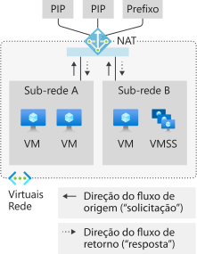

# Métricas da NAT da Rede Virtual do Azure

Os recursos do Gateway da NAT da Rede Virtual do Azure fornecem métricas multidimensionais. Você pode usar essas métricas para observar a operação e para [solução de problemas](troubleshoot-nat.md).  Os alertas podem ser configurados para problemas críticos, como esgotamento de SNAT.

  

*Figura: NAT de Rede Virtual para saída à Internet*

## Métricas

Os recursos do Gateway da NAT fornecem as seguintes métricas multidimensionais no Azure Monitor:

| Métrica | Descrição | Agregação recomendada | Dimensões |
|---|---|---|---|
| Bytes | Bytes processados de entrada e de saída | Somar | Direção (entrada; saída), protocolo (6 TCP; 17 UDP) |
| Pacotes | Pacotes processados de entrada e de saída | Somar | Direção (entrada; saída), protocolo (6 TCP; 17 UDP) |
| Pacotes removidos | Pacotes removidos pelo Gateway da NAT | Somar | / |
| Contagem de Conexões SNAT | Transições de estado por intervalo | Somar | Estado da conexão, protocolo (6 TCP; 17 UDP) |
| Contagem total de conexões SNAT | Conexões SNAT ativas atuais (~ portas SNAT em uso) | Somar | Protocolo (6 TCP; 17 UDP) |

## Alertas

Os alertas das métricas podem ser configurados no Azure Monitor para cada uma das [métricas](#metrics) anteriores.

## Limitações

Não há suporte para o Resource Health.

## Próximas etapas

* Saiba mais sobre a [NAT de Rede Virtual](nat-overview.md)
* Saiba mais sobre o [recurso do Gateway da NAT](nat-gateway-resource.md)
* Saiba mais sobre o [Azure Monitor](../azure-monitor/overview.md)
* Saiba mais sobre a [solução de problemas de recursos do Gateway da NAT](troubleshoot-nat.md).
* [Diga-nos o que criar em seguida para a NAT de Rede Virtual no UserVoice](https://aka.ms/natuservoice).

