# Migrar para a WAN Virtual do Azure
A WAN Virtual do Azure permite que as empresas simplifiquem sua conectividade global e se beneficiem da escala da rede global Microsoft. Este white paper fornece detalhes técnicos para empresas que desejam migrar de uma topologia hub e spoke existente gerenciada pelo cliente para um design que aproveita os hubs de WAN Virtual gerenciados pela Microsoft.

O artigo [Arquitetura de rede de trânsito global e WAN Virtual](virtual-wan-global-transit-network-architecture.md) destaca os benefícios que a WAN Virtual do Azure permite às empresas que adotam uma rede global corporativa moderna centrada na nuvem.

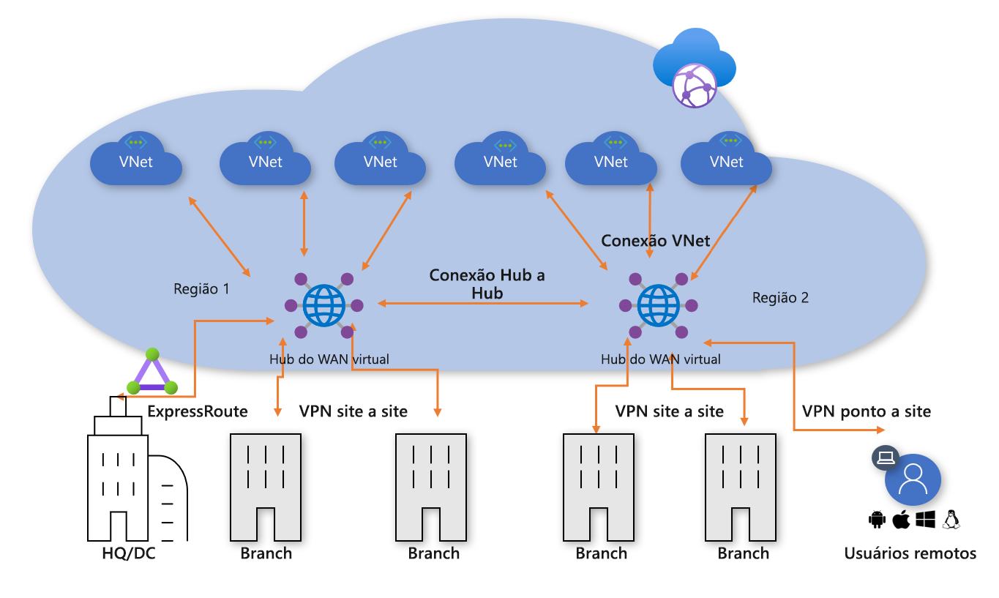
**Figura 1: WAN Virtual do Azure**

O modelo de conectividade hub e spoke do Azure VDC (Virtual Datacenter) foi adotado por milhares de nossos clientes a fim de aproveitar o comportamento de roteamento transitivo padrão da rede do Azure para criar redes de nuvem simples e escalonáveis. A WAN Virtual do Azure baseia-se nesses conceitos e introduz novas funcionalidades que permitem topologias de conectividade global, não apenas entre unidades locais e o Azure, mas também permitindo aos clientes aproveitar a escala da rede Microsoft a fim de ampliar seus redes globais existentes.

Este artigo descreve como migrar um ambiente híbrido existente para a WAN Virtual.

## Cenário

A Contoso é uma organização financeira global com escritórios na Europa e na Ásia. Eles estão planejando migrar seus aplicativos existentes de um data center local para o Azure e criaram um design básico baseado na arquitetura do VDC, incluindo redes virtuais regionais de hub gerenciadas pelo cliente para conectividade híbrida. Como parte da migração para as tecnologias baseadas em nuvem, a equipe de rede ficou encarregada de garantir que a conectividade seja otimizada para os negócios de agora em diante.

A Figura 2 mostra uma exibição de alto nível da rede global existente, incluindo a conectividade a várias regiões do Azure.

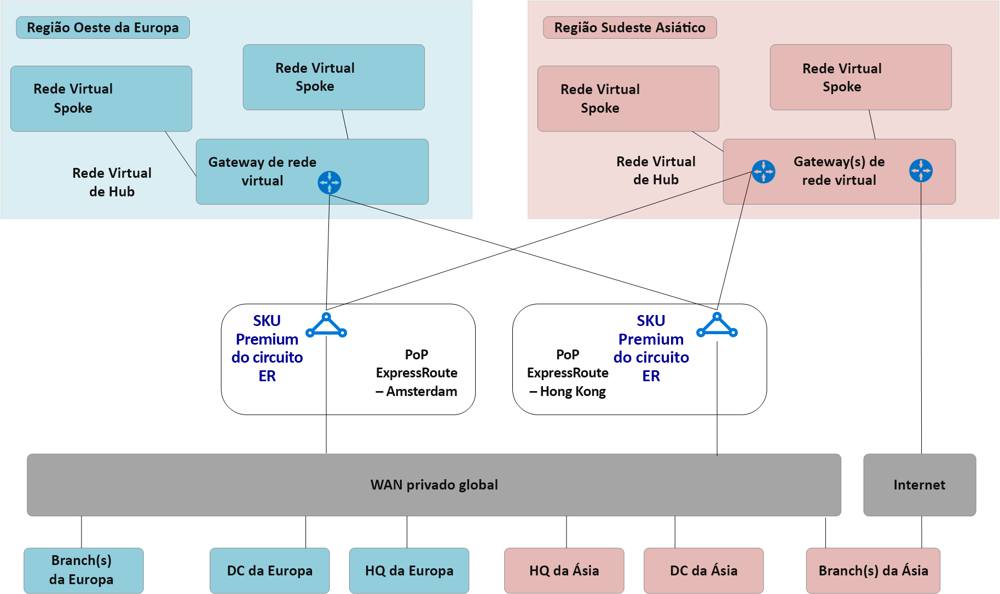
**Figura 2: topologia de rede existente da Contoso**

Os pontos seguintes podem ser compreendidos da topologia de rede existente:
 
- Uma topologia hub e spoke é usada em várias regiões, incluindo circuitos Premium do ExpressRoute para conectividade de volta para uma WAN privada comum.
- Alguns desses sites também têm túneis VPN ligados diretamente ao Azure para alcançar aplicativos hospedados dentro da nuvem Microsoft.

## Requisitos
A equipe de rede ficou encarregada de fornecer um modelo de rede global capaz de dar suporte à migração da Contoso para a nuvem e otimizar as áreas de custo, escala e desempenho. Em resumo, os seguintes requisitos devem ser atendidos:
- Fornecer à sede social (HQ) e às branches um caminho otimizado para aplicativos hospedados na nuvem. 
- Remover a dependência dos DCs (data centers locais) existentes para o término da VPN e ao mesmo tempo manter os seguintes caminhos de conectividade:
    - **Branch –para– VNet**: os escritórios conectados à VPN devem ser capazes de acessar aplicativos migrados para a nuvem na região do Azure local.
    - **Branch –para– hub –para– hub –para– VNet**: os escritórios conectados à VPN devem ser capazes de acessar aplicativos migrados para a nuvem na região do Azure remota. 
    - **Branch –para– branch**: os escritórios regionais conectados à VPN devem ser capazes de se comunicar entre si e com os sites da HQ/DC conectados ao ExpressRoute. 
    - **Branch –para– hub –para– hub –para– branch**: os escritórios separados globalmente conectados à VPN devem ser capazes de se comunicar entre si e com todos os sites da HQ/DC conectados ao ExpressRoute.
    - **Branch –para– Internet**: os sites conectados devem ser capazes de se comunicar com a Internet e esse tráfego deve ser filtrado e registrado.
    - **VNet –para– VNet**: as redes virtuais spoke da mesma região devem ser capazes de se comunicar entre si.
    - **VNet –para– hub –para– hub –para– VNet**: as redes virtuais spoke de diferentes regiões devem ser capazes de se comunicar entre si.
- Forneça aos usuários móveis da Contoso (laptop e telefone) a capacidade de acessar os recursos da empresa mesmo de fora da rede corporativa.

## Arquitetura da WAN Virtual do Azure

A Figura 3 mostra uma exibição de alto nível da topologia de destino atualizada usando a WAN Virtual do Azure para atender aos requisitos detalhados na seção anterior.

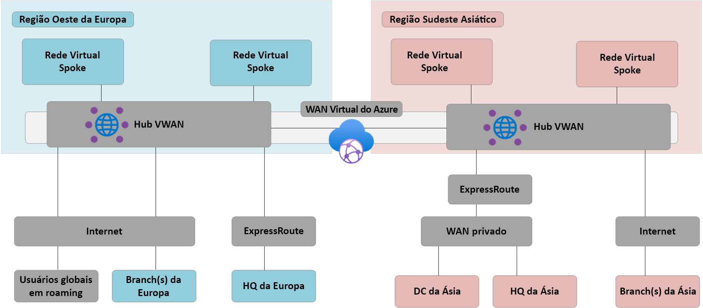
**Figura 3: arquitetura da WAN Virtual do Azure**

Em resumo: 
- a HQ na Europa permanece conectada ao ExpressRoute, os DCs locais da Europa são totalmente migrados ao Azure e agora desativados.
- Os DCs e a HQ da Ásia permanecem conectados à WAN Particular. A WAN Virtual do Azure agora é usada para aumentar a rede da operadora local e fornecer conectividade global 
- Os hubs da WAN Virtual do Azure implantados nas regiões do Azure Oeste da Europa e Sudeste Asiático para fornecer o hub de conectividade aos dispositivos conectados por VPN e pelo ExpressRoute. 
- Os hubs também fornecem a terminação de VPN para usuários móveis em vários tipos de clientes, usando a conectividade OpenVPN com a rede da malha global, permitindo acesso não apenas aos aplicativos migrados para o Azure, mas também a todos os recursos restantes no local. 
- Conectividade com a Internet para recursos dentro de uma rede virtual fornecida pela WAN Virtual do Azure. Conectividade com a Internet para sites remoto também fornecida pela WAN Virtual do Azure. Análise de Internet local com suporte por meio da integração de parceiro para acesso otimizado a serviços SaaS, como o Office 365.

## Migrar para a WAN Virtual do Azure

Essa seção descreve as várias etapas para migrar para a WAN Virtual do Azure.
 
### Região única hub e spoke do VDC

A figura a seguir mostra uma topologia de região única para a Contoso antes da distribuição da WAN Virtual do Azure.

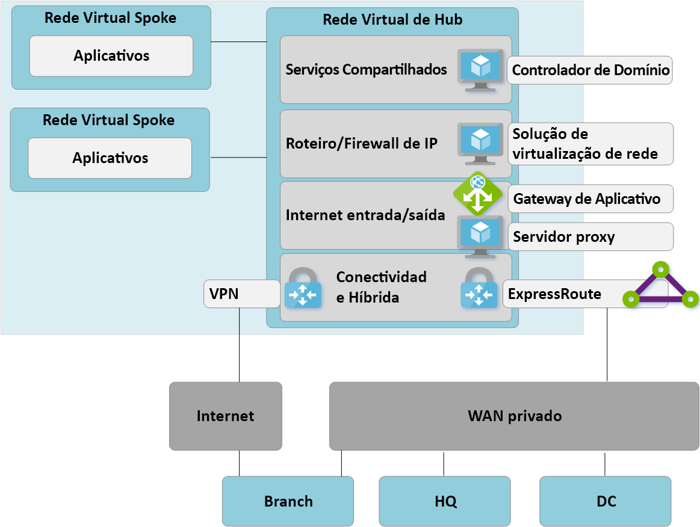

 **Figura 4: região única do hub e spoke do VDC – Etapa 1**

Em linha com a abordagem do VDC (Datacenter Virtual), a rede virtual de hub gerenciada pelo cliente contém vários blocos de função:
- Serviços compartilhados (qualquer função comum exigida por vários spokes), um exemplo que a Contoso usa, são os controladores de domínio IaaS do Windows Server em máquinas virtuais IaaS (infraestrutura como serviço).
- Os serviços de firewall de IP/roteamento são fornecidos por uma solução de virtualização de rede de terceiros que permite o roteamento de IP de camada 3 spoke para spoke. 
- Serviços de entrada/saída da Internet, incluindo o Gateway de Aplicativo do Azure para solicitações HTTPS de entrada e serviços de proxy de terceiros em execução em máquinas virtuais para acesso de saída filtrado aos recursos da Internet.
- Gateway de Rede Virtual de ExpressRoute e VPN para conectividade com redes locais.

### Implantar hubs da WAN Virtual

A primeira etapa é implantar um hub de WAN Virtual em cada região. Configure o hub da WAN Virtual com Gateway de VPN e Express Route Gateway, conforme descrito nos seguintes artigos:  
- [Tutorial: Criar uma conexão site a site usando a WAN Virtual do Azure](virtual-wan-site-to-site-portal.md)
- [Tutorial: Criar uma associação do ExpressRoute usando a WAN Virtual do Azure](virtual-wan-expressroute-portal.md) 

> [!NOTE]
> A WAN Virtual do Azure deve estar usando o SKU Standard para habilitar alguns dos caminhos de tráfego descritos neste artigo.

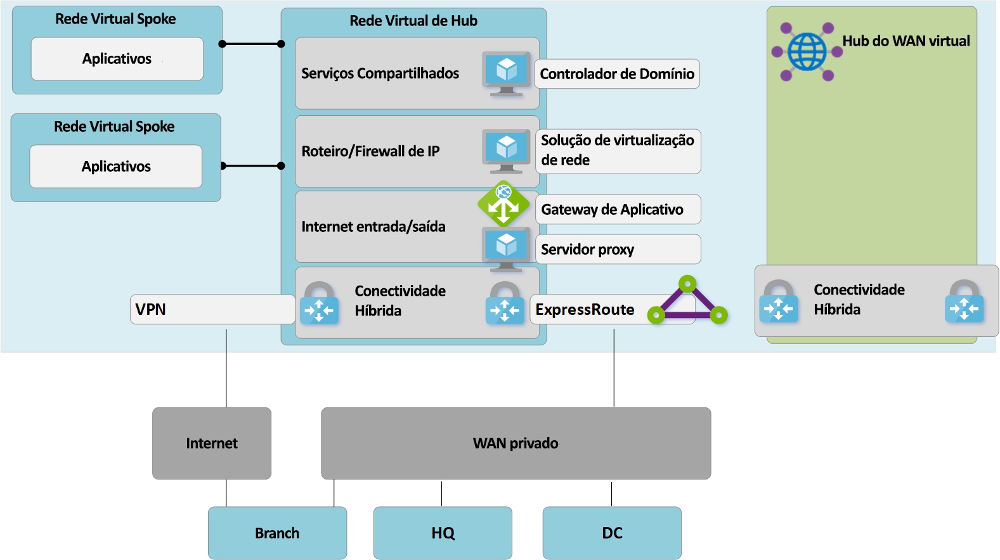
**Figura 5: migração do hub e spoke do VDC para a WAN Virtual – Etapa 2**

### Conectar sites remotos (ExpressRoute e VPN) à WAN Virtual

Agora, conectamos o hub da WAN Virtual aos circuitos do ExpressRoute existentes e configuramos VPNs site a site pela Internet para todas as filiais remotas.

> [!NOTE]
> Os circuitos do ExpressRoute devem ser atualizados para o tipo de SKU Premium para se conectarem ao hub da WAN Virtual.

**Figura 6: migração do hub e spoke do VDC para a WAN Virtual – Etapa 3**

Neste ponto, o equipamento de rede local começará a receber rotas que refletem o espaço de endereços IP atribuído à VNet do hub gerenciado da WAN Virtual. As filiais conectadas à VPN remota nesta fase verão dois caminhos para todos os aplicativos existentes nas redes virtuais spoke. Esses dispositivos devem ser configurados para continuar a usar o túnel para o Hub VDC para garantir o roteamento simétrico durante a fase de transição.

### Testar a conectividade híbrida por meio da WAN Virtual

Antes de utilizar o hub gerenciado da WAN Virtual para conectividade de produção é recomendável configurar uma rede virtual spoke de teste e uma conexão VNet da WAN Virtual. Valide se as conexões com esse ambiente de teste funcionam por meio do ExpressRoute e da VPN site a site antes de continuar com as próximas etapas.

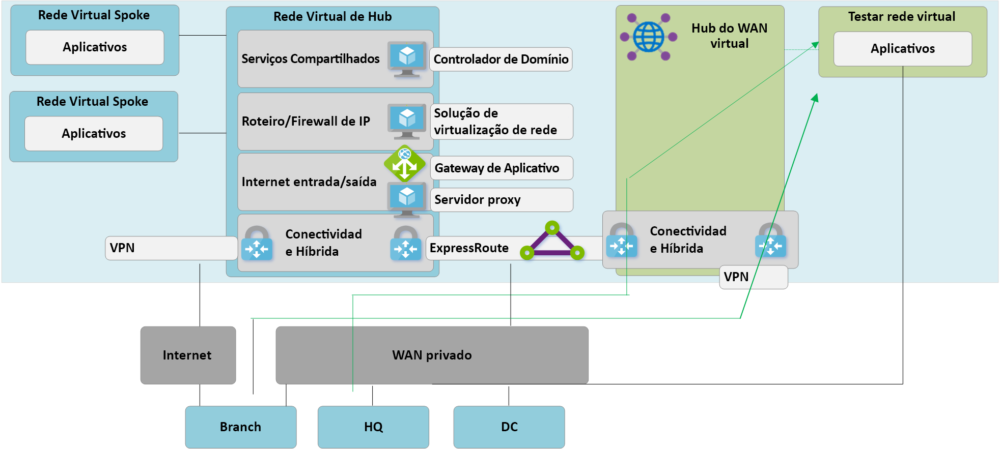
**Figura 7: migração do hub e spoke do VDC para a WAN Virtual – Etapa 4**

### Conectividade de transição para o hub da WAN Virtual

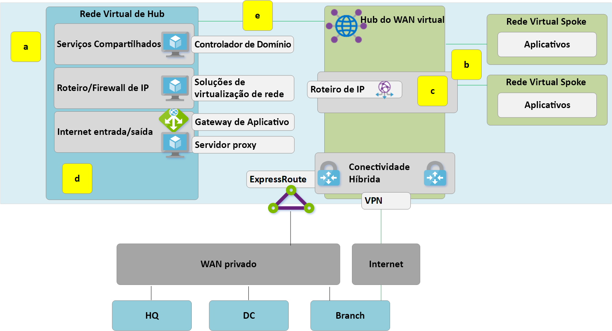
**Figura 8: migração do hub e spoke do VDC para a WAN Virtual – Etapa 5**

**a**. Exclua as conexões de emparelhamento existentes das redes virtuais Spoke para o Hub do VDC antigo. O acesso aos aplicativos nas redes virtuais spoke fica indisponível até que as etapas de a-c sejam concluídas.

**b**. Conecte as redes virtuais spoke ao hub da WAN Virtual por meio de conexões VNet.

**c**. Remova todas as UDR (rotas definidas pelo usuário) usadas anteriormente em redes virtuais spoke para comunicações spoke a spoke. Agora esse caminho está habilitado pelo roteamento dinâmico disponível no hub da WAN Virtual.

**d**. Os Gateways de ExpressRoute e de VPN existentes no hub do VDC agora estão desativados para permitir a próxima etapa (e).

**e**. Conecte o antigo Hub do VDC (hub de rede virtual) ao hub da WAN Virtual por meio de uma nova conexão VNet.

### O Hub antigo se torna o spoke de serviços compartilhados

Agora, reprojetamos nossa rede do Azure para tornar o Hub da WAN Virtual o ponto central em nossa nova topologia.

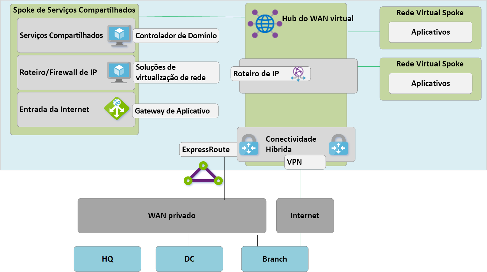
**Figura 9: migração do hub e spoke do VDC para a WAN Virtual – Etapa 6**

Como o Hub da WAN Virtual é uma entidade gerenciada e não permite a implantação de recursos personalizados, como máquinas virtuais, o bloco de serviços compartilhados agora existe como uma rede virtual spoke, hospedando funções como a entrada da Internet por meio do Gateway de Aplicativo do Azure ou do dispositivo virtualizado de rede. O tráfego entre o ambiente de serviços compartilhados e as máquinas virtuais de back-end agora transita o hub gerenciado da WAN Virtual.

### Otimizar a conectividade local para utilizar totalmente a WAN Virtual

Nesta fase, a Contoso já concluiu a maior parte de suas migrações de aplicativos de negócios para dentro do Microsoft Cloud, restando apenas alguns aplicativos herdados dentro do DC local.

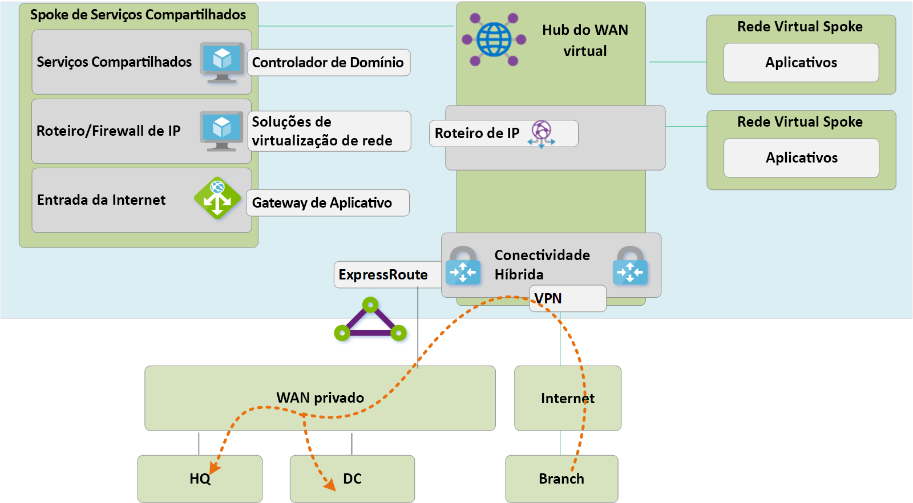
**Figura 10: migração do hub e spoke do VDC para a WAN Virtual – Etapa 7**

 Para aproveitar a funcionalidade completa da WAN Virtual do Azure, a Contoso decide desativar suas conexões VPN local herdadas. Qualquer branch que continuar a acessar as redes da HQ ou do DC será capaz de transitar a rede global da Microsoft usando o roteamento de trânsito interno da WAN Virtual do Azure. 

> [!NOTE]
> O Alcance Global do ExpressRoute é uma opção alternativa para os clientes que desejam aproveitar o backbone Microsoft para complementar suas WANs particulares existentes.

## Arquitetura de estado final e caminhos de tráfego

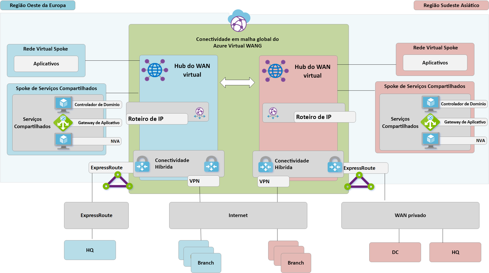
**Figura 11: WAN Virtual de região dupla**

Esta seção fornece um resumo de como essa topologia atende aos requisitos originais examinando alguns fluxos de tráfego de exemplo.

### Caminho 1

O caminho 1 descreve o fluxo de tráfego de uma filial conectada de VPN S2S na Ásia para uma VNet do Azure na região do Sudeste Asiático.

O tráfego é roteado da seguinte maneira:
- a branch da Ásia é conectada por meio de túneis habilitados com BGP S2S dentro do hub da WAN Virtual do Sudeste Asiático.
- O hub da WAN Virtual da Ásia roteia o tráfego localmente para a VNet conectada.

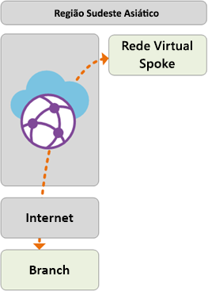

### Caminho 2
O caminho 2 descreve o fluxo de tráfego da matriz europeia conectada do ExpressRoute para a VNet do Azure na região do Sudeste Asiático.

O tráfego é roteado da seguinte maneira:
- a HQ europeia é conectada por meio do circuito premium do ExpressRoute no Hub da WAN Virtual do Oeste da Europa.
- A conectividade global de Hub para Hub da WAN Virtual permite o trânsito de tráfego para a VNet conectada na região remota.

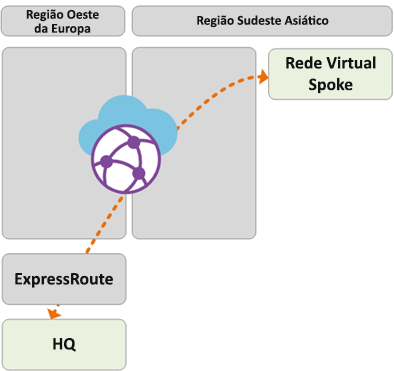

### Caminho 3
O caminho 3 descreve o fluxo de tráfego do DC local da Ásia conectado à WAN Particular para uma filial europeia conectada site a site.

O tráfego é roteado da seguinte maneira:
- o DC da Ásia está conectado à operadora de WAN Particular local.
- O circuito do ExpressRoute é encerrado localmente na WAN Particular e se conecta ao hub da WAN Virtual do Sudeste Asiático.
- A conectividade global hub a Hub da WAN Virtual permite o trânsito do tráfego.

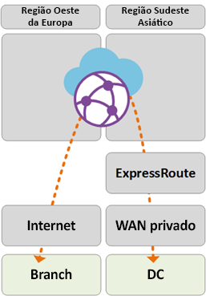

### Caminho 4
O caminho 4 descreve o fluxo de tráfego da VNet do Azure na região do Sudeste Asiático para uma VNet do Azure na região do Oeste da Europa.

O tráfego é roteado da seguinte maneira:
- A conectividade global hub a Hub da WAN Virtual permite o trânsito nativo de todas as VNets do Azure conectadas sem configurações adicionais do usuário.

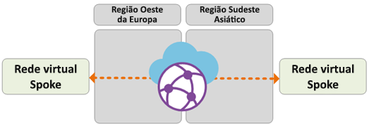

### Caminho 5
O caminho 5 descreve o fluxo de tráfego do usuário móvel da VPN (P2S) para uma VNet do Azure na região do Oeste da Europa.

O tráfego é roteado da seguinte maneira:
- Usuários de laptop e dispositivo móvel usam o cliente OpenVPN para conectividade transparente no gateway de VPN P2S no Oeste da Europa.
- O hub da WAN Virtual do Oeste da Europa roteia o tráfego localmente para a VNet conectada.

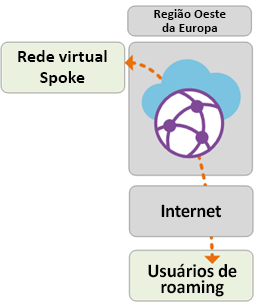

## Controle de segurança e políticas por meio do Firewall do Azure

Agora a Contoso validou a conectividade entre todas as branches e as VNets em alinhamento aos requisitos discutidos anteriormente neste documento. Para atender aos requisitos de controle de segurança e isolamento de rede, eles precisam continuar a separar e registrar o tráfego por meio da rede do Hub – anteriormente, essa função era executada por uma NVA (solução de virtualização de rede). A Contoso também deseja desativar seus serviços de proxy existentes e utilizar os serviços nativos do Azure para a filtragem de saída da Internet. 

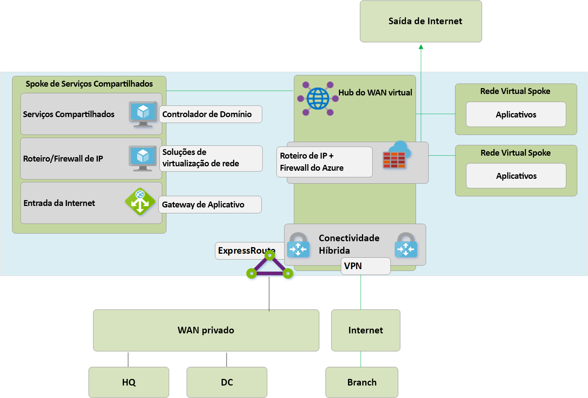
**Figura 12: Firewall do Azure na WAN Virtual (Hub Virtual Seguro)**

As etapas de alto nível a seguir são necessárias para introduzir o Firewall do Azure nos hubs de WAN Virtual para habilitar um ponto unificado de controle de políticas. Esse processo e o conceito de Hubs Virtuais Seguros são explicados com riqueza de detalhes [aqui](https://go.microsoft.com/fwlink/?linkid=2107683).
- Crie uma Política de Firewall do Azure.
- Vincule uma política de firewall ao hub da WAN Virtual do Azure.
- A etapa acima permite que o hub da WAN Virtual existente funcione como um hub virtual seguro e implante os recursos necessários do Firewall do Azure.

> [!NOTE]
> Se o Firewall do Azure for implantado em um hub de WAN Virtual Standard (SKU: Standard): as políticas V2V, B2V, V2I e B2I do FW são impostas somente no tráfego originário das VNets e branches conectadas ao hub específico em que o FW do Azure é implantado (Hub Seguro). O tráfego originado das VNets e branches remotas que estão anexadas a outros hubs na mesma WAN Virtual não será submetido ao Firewall, muito embora essas branches e VNets remotas estejam interconectadas por meio de links hub para hub da WAN Virtual. O suporte à aplicação de firewall entre hubs está no roteiro da WAN Virtual do Azure e do Gerenciador de Firewall.

Os caminhos a seguir descrevem os caminhos de conectividade habilitados utilizando os hubs virtuais seguros do Azure.

### Caminho 6
O caminho 6 descreve o fluxo de tráfego seguro entre VNets na mesma região.

O tráfego é roteado da seguinte maneira:
- as Redes Virtuais conectadas ao mesmo Hub Virtual Seguro agora roteiam o tráfego por meio do Firewall do Azure.
- O Firewall do Azure pode aplicar políticas a esses fluxos.

### Caminho 7
O caminho 7 descreve o fluxo de tráfego da VNet do Azure para a Internet ou um Serviço de Segurança de terceiros.

O tráfego é roteado da seguinte maneira:
- as Redes Virtuais conectadas ao Hub Virtual Seguro podem enviar tráfego para destinos públicos na Internet, usando o Hub Seguro como um ponto central de acesso à Internet.
- Esse tráfego pode ser filtrado localmente usando as regras de FQDN do Firewall do Azure ou enviado a um serviço de segurança de terceiros para inspeção.

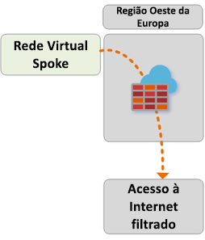

### Caminho 8
O caminho 8 descreve o fluxo de tráfego da branch para a Internet ou um Serviço de Segurança de terceiros.

O tráfego é roteado da seguinte maneira:
- as Branches conectadas ao Hub Virtual Seguro podem enviar tráfego para destinos públicos na Internet, usando o Hub Seguro como um ponto central de acesso à Internet.
- Esse tráfego pode ser filtrado localmente usando as regras de FQDN do Firewall do Azure ou enviado a um serviço de segurança de terceiros para inspeção.

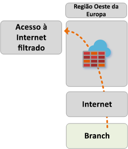 

## Próximas etapas
Saiba mais sobre a [WAN Virtual do Azure](virtual-wan-about.md)
