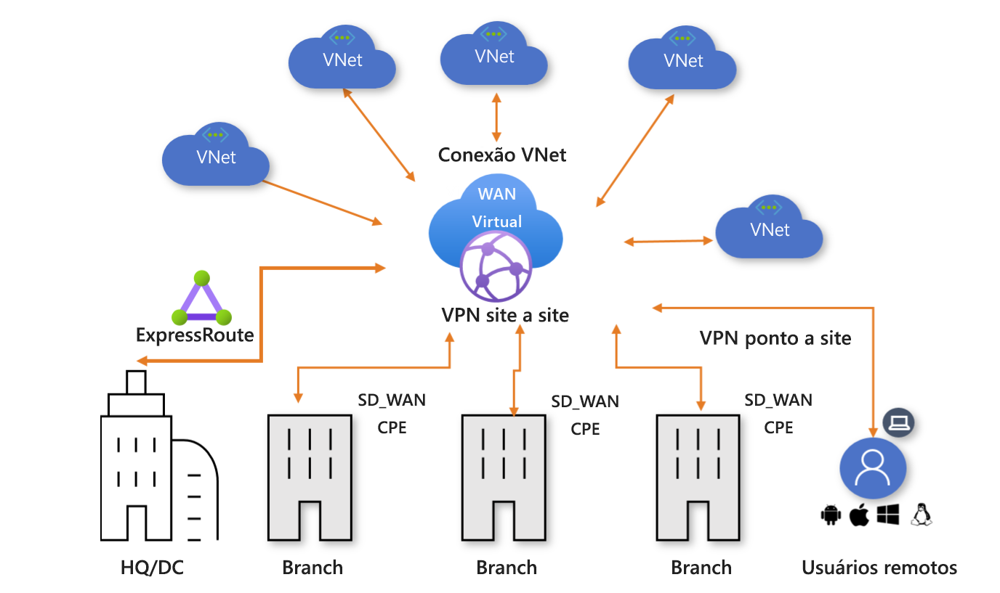

# O que é a WAN Virtual do Azure?

A WAN Virtual do Azure é um serviço de rede que reúne muitas funcionalidades de rede, segurança e roteamento para fornecer uma interface operacional. Essas funcionalidades incluem conectividade de branch (por meio da automação de conectividade de dispositivos de parceiros de WAN Virtual, como SD-WAN ou VPN CPE), conectividade VPN site a site, conectividade VPN de usuário remoto (ponto a site), conectividade privada (ExpressRoute), conectividade de nuvem interna (conectividade transitiva para redes virtuais), interconectividade VPN ExpressRoute, roteamento, Firewall do Azure, criptografia para conectividade privada etc. Você não precisa ter todos esses casos de uso para começar a usar a WAN Virtual. Você pode simplesmente começar com apenas um caso de uso e, depois, ajustar a rede à medida que ela evolui.

A arquitetura da WAN Virtual é uma arquitetura de hub e spoke com dimensionamento e desempenho internos para branches (dispositivos VPN/SD-WAN), usuários (clientes VPN do Azure/OpenVPN/IKEv2), circuitos de ExpressRoute e redes virtuais. Ele permite a [arquitetura de rede de trânsito global](virtual-wan-global-transit-network-architecture.md) em que o “hub” da rede hospedada em nuvem permite a conectividade transitiva entre pontos de extremidade que podem ser distribuídos entre diferentes tipos de “spokes”.

As regiões do Azure servem como hubs para os quais é possível optar por se conectar. Todos os hubs são conectados em malha completa em uma WAN Virtual Padrão, o que facilita para o usuário usar o backbone da Microsoft para conectividade de qualquer um para qualquer um (qualquer spoke). Para a conectividade de spoke com dispositivos SD-WAN/VPN, os usuários podem configurá-la manualmente na WAN Virtual do Azure ou usar a solução do parceiro de CPE da WAN Virtual (SD-WAN/VPN) para configurar a conectividade com o Azure. Temos uma lista de parceiros que dão suporte à automação para conectividade (capacidade de exportar as informações do dispositivo para o Azure, baixar a configuração do Azure e estabelecer a conectividade) com a WAN Virtual do Azure. Para saber mais, veja o artigo [Parceiros e localizações de WAN Virtual](virtual-wan-locations-partners.md).

Este artigo fornece uma visão rápida da conectividade de rede na WAN Virtual do Azure. A WAN Virtual oferece as seguintes vantagens:

* **Soluções de conectividade integradas no hub e spoke:** Automatize a configuração site a site e a conectividade entre sites locais e um hub do Azure.
* **Definição e configuração do spoke automatizado:** Conecte as redes virtuais e cargas de trabalho ao hub do Azure diretamente.
* **Solução de problemas intuitiva:** É possível ver o fluxo de ponta a ponta no Azure e usar essas informações para executar as ações necessárias.

## WANs virtuais básicas e Standard

Há dois tipos de WANs virtuais: Básico e Standard. A tabela a seguir mostra as configurações disponíveis para cada tipo.

[!INCLUDE [Basic and Standard SKUs](../../includes/virtual-wan-standard-basic-include.md)]

Para obter as etapas para atualizar uma WAN virtual, consulte [atualizar uma WAN virtual de básico para Standard](upgrade-virtual-wan.md).

## Arquitetura

Para obter informações sobre a arquitetura da WAN Virtual e como fazer a migração para a WAN Virtual, confira os seguintes artigos:

* [Arquitetura da WAN Virtual](migrate-from-hub-spoke-topology.md)
* [Arquitetura de rede de trânsito global](virtual-wan-global-transit-network-architecture.md)

## Recursos da WAN Virtual

Para configurar uma WAN virtual de ponta a ponta, crie os seguintes recursos:

* **virtualWAN:** O recurso virtualWAN representa uma sobreposição virtual da rede do Azure e é uma coleção de vários recursos. Ele contém links para todos os seus hubs virtuais que você gostaria de ter dentro da WAN Virtual. Os recursos da WAN Virtual ficam isolados uns dos outros e não podem conter um hub comum. Os hubs virtuais na WAN Virtual não se comunicam entre si.

* **Hub:** Um hub virtual é uma rede virtual gerenciada pela Microsoft. O hub contém vários pontos de extremidade de serviço para habilitar a conectividade. De sua rede local (vpnsite), você pode se conectar a um gateway de VPN dentro do hub virtual, conectar circuitos do ExpressRoute a um hub virtual ou até mesmo conectar usuários móveis a um gateway ponto a site no hub virtual. O hub é o núcleo da sua rede em uma região. Pode haver apenas um hub por região do Azure.

  Um gateway de hub não é o mesmo que um gateway de rede virtual que você pode usar para ExpressRoute e Gateway de VPN. Por exemplo, ao usar WAN Virtual, você não cria uma conexão de site a site do site local diretamente para a rede virtual. Em vez disso, você cria uma conexão site a site com o hub. O tráfego sempre passa pelo gateway do hub. Isso significa que suas VNets não precisam de um gateway de rede virtual próprio. A WAN Virtual permite que suas VNets tirem proveito do dimensionamento fácil por meio do hub virtual e do gateway do hub virtual.

* **Conexão de rede virtual do hub:** O recurso de conexão de rede virtual do Hub é usado para conectar o hub à rede virtual.

* **Conexão Hub a Hub:** Os hubs estão todos conectados entre si em uma WAN Virtual. Isso quer dizer que uma ramificação, um usuário ou uma VNet conectada a um hub local pode se comunicar com outro branch ou VNet usando a arquitetura de malha completa dos hubs conectados. Você também pode conectar VNets em um hub que passa pelo hub virtual, bem como VNets ao longo do hub, usando a estrutura conectada de hub para hub.

* **Tabela de rotas de hub:**  Você pode criar uma rota de hub virtual e aplicar a rota à tabela de rotas do hub virtual. Você pode aplicar várias rotas à tabela de rotas do hub virtual.

**Recursos adicionais de WAN Virtual**

* **Site:** Esse recurso é usado apenas para conexões site a site. O recurso do site é **vpnsite**. Ele representa o dispositivo VPN local e as respectivas configurações. Ao trabalhar com um parceiro de WAN Virtual, você terá uma solução interna para exportar automaticamente essas informações para o Azure.

## Tipos de conectividade

A WAN Virtual permite os dois tipos de conectividade a seguir: VPN Site a Site, VPN do usuário (Ponto a Site) e ExpressRoute.

### Conexões VPN site a site

Você pode se conectar aos seus recursos no Azure por meio de uma conexão IPsec/IKE (IKEv2) site a site. Para obter mais informações, consulte [Criar uma conexão site a site usando WAN Virtual](virtual-wan-site-to-site-portal.md). 

Esse tipo de conexão requer um dispositivo VPN ou um dispositivo de parceiro de WAN Virtual. Os parceiros de WAN Virtual fornecem automação para conectividade, que é a capacidade de exportar as informações do dispositivo para o Azure, baixar a configuração do Azure e estabelecer a conectividade com o hub da WAN Virtual do Azure. Para obter uma lista dos parceiros e localizações disponíveis, consulte o artigo [Parceiros e localizações de WAN Virtual](virtual-wan-locations-partners.md). Se o provedor de dispositivo VPN/SD-WAN não estiver listado no link mencionado, você poderá simplificar o uso da instrução passo a passo [Criar uma conexão site a site usando a WAN Virtual](virtual-wan-site-to-site-portal.md) para configurar a conexão.

### Conexões (ponto a site) de VPN do usuário

Você pode conectar seus recursos no Azure por meio de uma conexão de IPsec/IKE (IKEv2) ou OpenVPN. Esse tipo de conexão exige que um cliente VPN seja configurado no computador cliente. Para obter mais informações, consulte [Criar uma conexão ponto a site](virtual-wan-point-to-site-portal.md).

### Conexões do ExpressRoute
O ExpressRoute permite conectar a rede local ao Azure em uma conexão privada. Para criar a conexão, consulte [Criar uma conexão ExpressRoute usando WAN Virtual](virtual-wan-expressroute-portal.md).

### Conexões de Hub para VNet

Você pode conectar uma rede virtual do Azure a um hub virtual. Para obter mais informações, confira [Conectar sua VNet a um hub](virtual-wan-site-to-site-portal.md#vnet).

### Conectividade de trânsito

#### Conectividade de trânsito entre VNets

A WAN Virtual permite a conectividade de trânsito entre VNets. As VNets conectam-se a um hub virtual por meio de uma conexão de rede virtual. A conectividade de trânsito entre VNets na **WAN Virtual Padrão** está habilitada devido à presença de um roteador em cada hub virtual. Esse roteador é instanciado quando o hub virtual é criado inicialmente.

O roteador pode ter quatro status de roteamento: Provisionado, Provisionando, Falha ou Nenhum. O **Status de roteamento** está localizado no portal do Azure navegando até a página Hub Virtual.

* Um status **Nenhum** indica que o hub virtual não provisionou o roteador. Isso poderá acontecer se a WAN Virtual for do tipo *Básico* ou se o hub virtual tiver sido implantado antes de o serviço ser disponibilizado.
* Um status de **Falha** indica falha durante a instanciação. Para criar uma instância ou redefinir o roteador, você pode localizar a opção **Redefinir** do roteador navegando até a página Visão geral do hub virtual no portal do Azure.

Cada roteador do hub virtual dá suporte a uma taxa de transferência agregada de até 50 Gbps. A conectividade entre as conexões de rede virtual assume uma carga de trabalho total de 2 mil VMs em todas as VNets conectadas a um só hub virtual.

#### Conectividade de trânsito entre VPN e ExpressRoute

A WAN Virtual permite a conectividade de trânsito entre VPN e ExpressRoute. Isso implica que sites conectados à VPN ou usuários remotos podem se comunicar com sites conectados ao ExpressRoute. Também há uma suposição implícita de que o **sinalizador de branch a branch** está habilitado e de que o BGP tem suporte nas conexões de VPN e ExpressRoute. Esse sinalizador pode estar localizado nas configurações de WAN Virtual do Azure no portal do Azure. Todo o gerenciamento de rota é fornecido pelo roteador do hub virtual, que também permite a conectividade de trânsito entre redes virtuais.

### Roteamento personalizado

A WAN Virtual fornece aprimoramentos de roteamento avançados. Capacidade de configurar tabelas de rotas personalizadas, otimizar o roteamento de rede virtual com associação e propagação de rota, agrupar logicamente tabelas de rotas com rótulos e simplificar vários cenários de roteamento de serviços compartilhados ou de NVA (solução de virtualização de rede).

### Emparelhamento VNET global

O Emparelhamento VNET global fornece um mecanismo para conectar duas VNets em regiões diferentes. Na WAN Virtual, as conexões de rede virtual conectam as VNets a hubs virtuais. O usuário não precisa configurar o Emparelhamento VNET global explicitamente. As VNets conectadas ao hub virtual na mesma região geram encargos de Emparelhamento VNET. VNets conectadas ao hub virtual em uma região diferente geram encargos de Emparelhamento VNET global.

### Criptografia de tráfego do ExpressRoute

A WAN Virtual do Azure fornece a capacidade de criptografar o tráfego do ExpressRoute. A técnica fornece um trânsito criptografado entre as redes locais e as redes virtuais do Azure no ExpressRoute sem passar pela Internet pública nem usar endereços IP públicos. Para obter mais informações, confira [IPsec sobre ExpressRoute para WAN Virtual](vpn-over-expressroute.md).

## Localizações

Para obter informações de localização, consulte o artigo [Parceiros e localizações de WAN Virtual](virtual-wan-locations-partners.md).

## Tabelas de rotas para WANs virtuais Básicas e Standard

As tabelas de rotas agora têm recursos para associação e propagação. Uma tabela de rotas preexistente é uma tabela de rotas que não tem esses recursos. Se você tiver rotas preexistentes no roteamento de hub e quiser usar as novas funcionalidades, considere o seguinte:

* **Clientes de WAN Virtual Standard com rotas preexistentes no hub virtual**: Se você tiver rotas pré-existentes da seção Roteamento para o hub no portal do Azure, precisará primeiro excluí-las e depois tentar criar tabelas de rotas (disponíveis na seção Tabelas de Rotas do hub no portal do Azure). É altamente recomendável executar a etapa de exclusão para todos os hubs em uma WAN Virtual.

* **Clientes de WAN Virtual Básica com rotas preexistentes no hub virtual**: Se você tiver rotas pré-existentes da seção Roteamento para o hub no portal do Azure, precisará primeiro excluí-las e depois **atualizar** sua WAN Virtual Básica para a WAN Virtual Standard. Confira [Atualizar uma WAN Virtual de Básica para Standard](upgrade-virtual-wan.md). É altamente recomendável executar a etapa de exclusão para todos os hubs em uma WAN Virtual.

## Perguntas frequentes

[!INCLUDE [Virtual WAN FAQ](../../includes/virtual-wan-faq-include.md)]

## Novidades

Assine o RSS feed e veja as atualizações mais recentes dos recursos de WAN Virtual na página [Atualizações do Azure](https://azure.microsoft.com/updates/?category=networking&query=VIRTUAL%20WAN).

## Próximas etapas

[Criar uma conexão site a site usando WAN Virtual](virtual-wan-site-to-site-portal.md)
