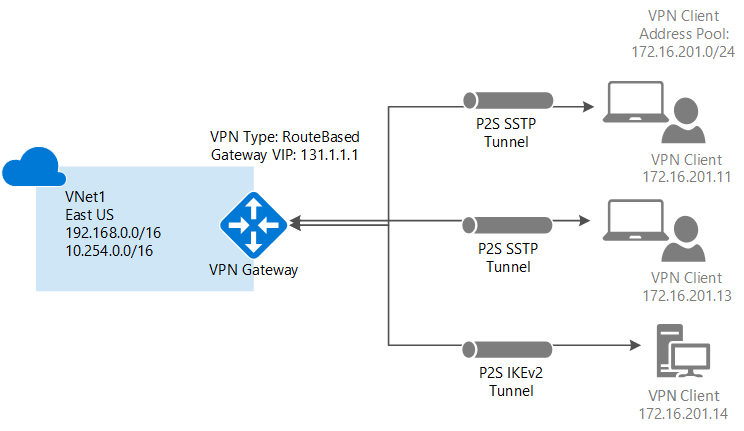
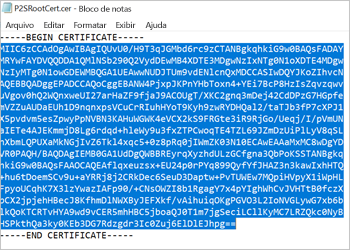
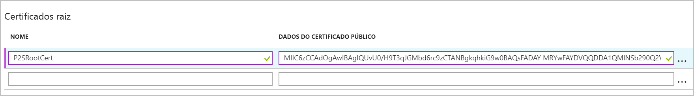
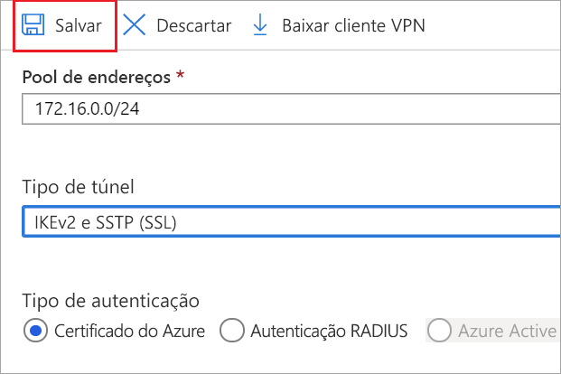
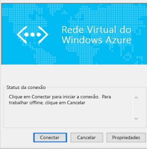
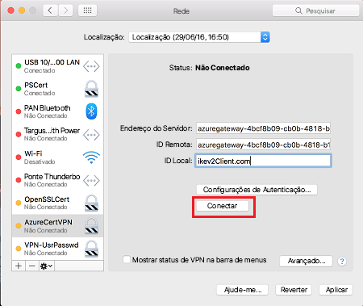

# <a name="configure-a-point-to-site-vpn-connection-to-a-vnet-using-native-azure-certificate-authentication-azure-portal"></a>Configurar uma conexão VPN ponto a site para uma VNet usando a autenticação de certificado nativa do Azure: portal do Azure

Este artigo ajuda você a conectar com segurança clientes individuais que executam Windows, Linux ou Mac OS X a uma VNet do Azure. As conexões VPN ponto a site são úteis quando você deseja se conectar à sua rede virtual de um local remoto, como quando você está intercomutando de casa ou de uma conferência. Você também pode usar o P2S em vez de uma VPN site a site quando tiver apenas alguns clientes que precisam se conectar a uma VNet. As conexões ponto a site não exigem um dispositivo VPN ou um endereço IP voltado para o público. O P2S cria a conexão VPN por meio do SSTP (protocolo de encapsulamento de soquete seguro) ou IKEv2. Para obter mais informações sobre VPN ponto a site, consulte [sobre VPN ponto a site](point-to-site-about.md).



## <a name="architecture"></a>Arquitetura

As conexões nativas de autenticação de certificado do Azure ponto a site usam os seguintes itens, que você configura neste exercício:

* Um gateway de VPN RouteBased.
* A chave pública (arquivo. cer) para um certificado raiz, que é carregado no Azure. Depois que o certificado é carregado, ele é considerado um certificado confiável e é usado para autenticação.
* Um certificado de cliente que é gerado a partir do certificado raiz. O certificado do cliente instalado em cada computador cliente que se conectará à VNet. Esse certificado é usado para autenticação de cliente.
* Uma configuração de cliente VPN. Os arquivos de configuração de cliente VPN contêm as informações necessárias para que o cliente se conecte à VNet. Os arquivos configuram o cliente VPN existente que é nativo para o sistema operacional. Cada cliente que se conecta deve ser configurado usando as configurações nos arquivos de configuração.

#### <a name="example"></a>Valores de exemplo

Você pode usar os seguintes valores para criar um ambiente de teste ou consultar esses valores para entender melhor os exemplos neste artigo:

* **Nome da VNet:** VNet1
* **Espaço de endereço:** 192.168.0.0/16<br>Para este exemplo, usamos apenas um espaço de endereço. Você pode ter mais de um espaço de endereço para sua VNet.
* **Nome da sub-rede:** Front-end
* **Intervalo de endereços da sub-rede:** 192.168.1.0/24
* **Assinatura:** Se você tiver mais de uma assinatura, verifique se está usando a correta.
* **Grupo de recursos:** TestRG
* **Local:** Leste dos EUA
* **GatewaySubnet:** 192.168.200.0/24<br>
* **Nome do gateway de rede virtual:** VNet1GW
* **Tipo de gateway:** VPNS
* **Tipo de VPN:** Baseado em rota
* **Nome do endereço IP público:** VNet1GWpip
* **Tipo de conexão:** Ponto a site
* **Pool de endereços do cliente:** 172.16.201.0/24<br>Clientes VPN que se conectam à VNet usando essa conexão ponto a site recebem um endereço IP do pool de endereços do cliente.

## <a name="createvnet"></a>1. criar uma rede virtual

Antes de começar, verifique se você tem uma assinatura do Azure. Se ainda não tiver uma assinatura do Azure, você poderá ativar os [Benefícios do assinante do MSDN](https://azure.microsoft.com/pricing/member-offers/msdn-benefits-details) ou inscrever-se para obter uma [conta gratuita](https://azure.microsoft.com/pricing/free-trial).
[!INCLUDE [Basic Point-to-Site VNet](../../includes/vpn-gateway-basic-p2s-vnet-rm-portal-include.md)]

## <a name="creategw"></a>2. criar um gateway de rede virtual

Nesta etapa, você cria o gateway de rede virtual para sua rede virtual. A criação de um gateway geralmente pode levar de 45 minutos ou mais, dependendo do SKU de gateway selecionado.

[!INCLUDE [About gateway subnets](../../includes/vpn-gateway-about-gwsubnet-portal-include.md)]

[!INCLUDE [create-gateway](../../includes/vpn-gateway-add-gw-p2s-rm-portal-include.md)]

>[!NOTE]
>O SKU do gateway básico não oferece suporte à autenticação IKEv2 ou RADIUS. Se você planeja ter clientes Mac conectados à sua rede virtual, não use a SKU básica.
>

## <a name="generatecert"></a>3. gerar certificados

Os certificados são usados pelo Azure para autenticar clientes que se conectam a uma VNet por meio de uma conexão VPN ponto a site. Depois de obter um certificado raiz, você [carrega](#uploadfile) as informações de chave pública no Azure. O certificado raiz é considerado "confiável" pelo Azure para conexão em P2S para a rede virtual. Você também gera certificados de cliente do certificado raiz confiável e, em seguida, os instala em cada computador cliente. O certificado do cliente é usado para autenticar o cliente quando ele inicia uma conexão com a VNet. 

### <a name="getcer"></a>1. Obtenha o arquivo. cer para o certificado raiz

[!INCLUDE [root-certificate](../../includes/vpn-gateway-p2s-rootcert-include.md)]

### <a name="generateclientcert"></a>2. gerar um certificado de cliente

[!INCLUDE [generate-client-cert](../../includes/vpn-gateway-p2s-clientcert-include.md)]

## <a name="addresspool"></a>4. Adicionar o pool de endereços do cliente

O pool de endereços do cliente é um intervalo de endereços IP privados que você especifica. Os clientes que se conectam por meio de uma VPN ponto a site recebem dinamicamente um endereço IP desse intervalo. Use um intervalo de endereços IP privado que não se sobreponha ao local do qual você se conecta ou à VNet à qual você deseja se conectar. Se você configurar vários protocolos e o SSTP for um dos protocolos, o pool de endereços configurado será dividido entre os protocolos configurados igualmente.

1. Depois que o gateway de rede virtual tiver sido criado, navegue até a seção **configurações** da página gateway de rede virtual. Na seção **configurações** , clique em **configuração ponto a site**.

    
2. Clique em **Configurar agora** para abrir a página de configuração.

   
3. Na página configuração **ponto a site** , na caixa **pool de endereços** , adicione o intervalo de endereços IP privado que você deseja usar. Os clientes VPN recebem dinamicamente um endereço IP do intervalo que você especificar. A máscara de sub-rede mínima é 29 bits para ativo/passivo e 28 bits para configuração ativa/ativa. Clique em **salvar** para validar e salvar a configuração.

   

   >[!NOTE]
   >Se você não vir o tipo de túnel ou tipo de autenticação no portal nesta página, seu gateway estará usando o SKU básico. O SKU básico não oferece suporte à autenticação IKEv2 ou RADIUS.
   >

## <a name="tunneltype"></a>5. configurar o tipo de túnel

Você pode selecionar o tipo de túnel. As opções de túnel são OpenVPN, SSTP e IKEv2. O cliente do strongSwan no Android e no Linux e o cliente VPN IKEv2 nativo no iOS e no OSX usarão somente o túnel IKEv2 para se conectar. Os clientes Windows tentam IKEv2 primeiro e se não se conectam, eles retornam ao SSTP. Você pode usar o cliente OpenVPN para se conectar ao tipo de túnel OpenVPN.


## <a name="authenticationtype"></a>6. configurar o tipo de autenticação

Selecione **certificado do Azure**.

  

## <a name="uploadfile"></a>7. Carregue os dados do certificado público do certificado raiz

Você pode carregar certificados raiz confiáveis adicionais até um total de 20. Depois que os dados do certificado público são carregados, o Azure pode usá-lo para autenticar clientes que instalaram um certificado de cliente gerado a partir do certificado raiz confiável. Carregue as informações de chave pública para o certificado raiz no Azure.

1. Os certificados são adicionados na página **configuração ponto a site** na seção **certificado raiz** .
2. Certifique-se de que você exportou o certificado raiz como um arquivo X. 509 (. cer) codificado em base-64. Você precisa exportar o certificado nesse formato para poder abrir o certificado com o editor de texto.
3. Abra o certificado com um editor de texto, como o bloco de notas. Ao copiar os dados do certificado, certifique-se de copiar o texto como uma linha contínua sem retornos de carro ou feeds de linha. Talvez seja necessário modificar o modo de exibição no editor de texto para ' Mostrar símbolo/mostrar todos os caracteres ' para ver os retornos de carro e os feeds de linha. Copie apenas a seguinte seção como uma linha contínua:

   
4. Cole os dados do certificado no campo de **dados do certificado público** . **Nomeie** o certificado e clique em **salvar**. Pode adicionar até 20 certificados raiz.

   
5. Clique em **salvar** na parte superior da página para salvar todas as definições de configuração.

   

## <a name="installclientcert"></a>8. instalar um certificado de cliente exportado

Se você quiser criar uma conexão P2S de um computador cliente diferente daquele usada para gerar os certificados do cliente, instale um certificado do cliente. Ao instalar um certificado de cliente, você precisará da senha que foi criada quando o certificado do cliente foi exportado.

Verifique se o certificado do cliente foi exportado como um. pfx junto com toda a cadeia de certificados (que é o padrão). Caso contrário, as informações do certificado raiz não estarão presentes no computador cliente e o cliente não poderá ser autenticado corretamente.

Para as etapas de instalação, consulte [instalar um certificado de cliente](point-to-site-how-to-vpn-client-install-azure-cert.md).

## <a name="clientconfig"></a>9. gerar e instalar o pacote de configuração de cliente VPN

Os arquivos de configuração de cliente VPN contêm configurações para configurar dispositivos para se conectar a uma VNet em uma conexão P2S. Para obter instruções para gerar e instalar arquivos de configuração de cliente VPN, consulte [criar e instalar arquivos de configuração de cliente VPN para configurações de P2S de autenticação de certificado do Azure nativo](point-to-site-vpn-client-configuration-azure-cert.md).

## <a name="connect"></a>10. conectar-se ao Azure

### <a name="to-connect-from-a-windows-vpn-client"></a>Para se conectar de um cliente VPN do Windows

>[!NOTE]
>Você deve ter direitos de administrador no computador cliente do Windows do qual você está se conectando.
>
>

1. Para se conectar à sua VNet, no computador cliente, navegue até conexões VPN e localize a conexão VPN que você criou. Ele tem o mesmo nome que a sua rede virtual. Clique em **Conectar**. Pode aparecer uma mensagem pop-up que se refere ao uso do certificado. Clique em **continuar** para usar privilégios elevados.

2. Na página status da **conexão** , clique em **conectar** para iniciar a conexão. Se você vir uma tela **Selecionar certificado** , verifique se o certificado do cliente exibido é aquele que você deseja usar para se conectar. Se não for, use a seta suspensa para selecionar o certificado correto e clique em **OK**.

   
3. Sua conexão foi estabelecida.

   

#### <a name="troubleshoot-windows-p2s-connections"></a>Solucionar problemas de conexões P2S do Windows

[!INCLUDE [verifies client certificates](../../includes/vpn-gateway-certificates-verify-client-cert-include.md)]

### <a name="to-connect-from-a-mac-vpn-client"></a>Para se conectar de um cliente Mac VPN

Na caixa de diálogo rede, localize o perfil do cliente que você deseja usar, especifique as configurações do [VpnSettings. xml](point-to-site-vpn-client-configuration-azure-cert.md#installmac)e clique em **conectar**.

Verifique [install-Mac (os X)](https://docs.microsoft.com/azure/vpn-gateway/point-to-site-vpn-client-configuration-azure-cert#installmac) para obter instruções detalhadas. Se você estiver tendo problemas para se conectar, verifique se o gateway de rede virtual não está usando um SKU básico. O SKU básico não tem suporte para clientes Mac.

  

## <a name="verify"></a>Para verificar sua conexão

Essas instruções se aplicam a clientes Windows.

1. Para verificar se a conexão VPN está ativa, abra um prompt de comandos com privilégios elevados e execute *ipconfig/all*.
2. Exiba os resultados. Observe que o endereço IP que você recebeu é um dos endereços dentro do pool de endereços do cliente VPN ponto a site que você especificou em sua configuração. Os resultados são semelhantes a este exemplo:

   ```
   PPP adapter VNet1:
      Connection-specific DNS Suffix .:
      Description.....................: VNet1
      Physical Address................:
      DHCP Enabled....................: No
      Autoconfiguration Enabled.......: Yes
      IPv4 Address....................: 172.16.201.3(Preferred)
      Subnet Mask.....................: 255.255.255.255
      Default Gateway.................:
      NetBIOS over Tcpip..............: Enabled
   ```

## <a name="connectVM"></a>Para se conectar a uma máquina virtual

Essas instruções se aplicam a clientes Windows.

[!INCLUDE [Connect to a VM](../../includes/vpn-gateway-connect-vm-p2s-include.md)]

## <a name="add"></a>Para adicionar ou remover certificados raiz confiáveis

Você pode adicionar e remover certificados raiz confiáveis do Azure. Quando você remove um certificado raiz, os clientes que têm um certificado gerado dessa raiz não poderão ser autenticados e, portanto, não poderão se conectar. Se você quiser que um cliente se autentique e se conecte, será necessário instalar um novo certificado de cliente gerado de um certificado raiz que seja confiável (carregado) no Azure.

### <a name="to-add-a-trusted-root-certificate"></a>Para adicionar um certificado raiz confiável

Você pode adicionar até 20 arquivos. cer de certificado raiz confiável para o Azure. Para obter instruções, consulte a seção [carregar um certificado raiz confiável](#uploadfile) neste artigo.

### <a name="to-remove-a-trusted-root-certificate"></a>Para remover um certificado raiz confiável

1. Para remover um certificado raiz confiável, navegue até a página de **configuração ponto a site** para o gateway de rede virtual.
2. Na seção **certificado raiz** da página, localize o certificado que você deseja remover.
3. Clique nas reticências ao lado do certificado e, em seguida, clique em ' remover '.

## <a name="revokeclient"></a>Para revogar um certificado de cliente

É possível revogar certificados de cliente. A lista de certificados revogados permite que você negue seletivamente a conectividade ponto a site com base em certificados de cliente individuais. Isso é diferente de remover um certificado raiz confiável. Se você remover um certificado de raiz confiável. cer do Azure, ele revogará o acesso de todos os certificados de cliente gerados/assinados pelo certificado raiz revogado. A revogação de um certificado de cliente, em vez do certificado raiz, permite que os outros certificados gerados a partir do certificado raiz continuem a ser usados para autenticação.

A prática comum é usar o certificado raiz para gerenciar o acesso nos níveis da equipe ou da organização, ao usar certificados de cliente revogados para controle de acesso refinado em usuários individuais.

### <a name="revoke-a-client-certificate"></a>Revogar um certificado de cliente

Você pode revogar um certificado de cliente adicionando a impressão digital à lista de revogação.

1. Recupere a impressão digital do certificado do cliente. Para obter mais informações, consulte [como recuperar a impressão digital de um certificado](https://msdn.microsoft.com/library/ms734695.aspx).
2. Copie as informações para um editor de texto e remova todos os espaços para que ele seja uma cadeia de caracteres contínua.
3. Navegue até a página de **configuração ponto a site** do gateway de rede virtual. Essa é a mesma página que você usou para [carregar um certificado raiz confiável](#uploadfile).
4. Na seção **certificados revogados** , insira um nome amigável para o certificado (ele não precisa ser o CN do certificado).
5. Copie e cole a cadeia de caracteres de impressão digital no campo **impressão digital** .
6. A impressão digital é validada e adicionada automaticamente à lista de revogação. Uma mensagem é exibida na tela que a lista está atualizando. 
7. Após a conclusão da atualização, o certificado não poderá mais ser usado para se conectar. Os clientes que tentam se conectar usando esse certificado recebem uma mensagem dizendo que o certificado não é mais válido.

## <a name="faq"></a>Perguntas frequentes sobre ponto a site

[!INCLUDE [Point-to-Site FAQ](../../includes/vpn-gateway-faq-p2s-azurecert-include.md)]

## <a name="next-steps"></a>Próximos passos
Quando a conexão for concluída, você poderá adicionar máquinas virtuais às suas redes virtuais. Para saber mais, veja [Máquinas virtuais](https://docs.microsoft.com/azure/). Para saber mais sobre redes e máquinas virtuais, confira [visão geral da rede de VM do Linux e do Azure](../virtual-machines/linux/azure-vm-network-overview.md).

Para obter informações de solução de problemas do P2S, [solução de problemas de conexões ponto a site do Azure](vpn-gateway-troubleshoot-vpn-point-to-site-connection-problems.md).
