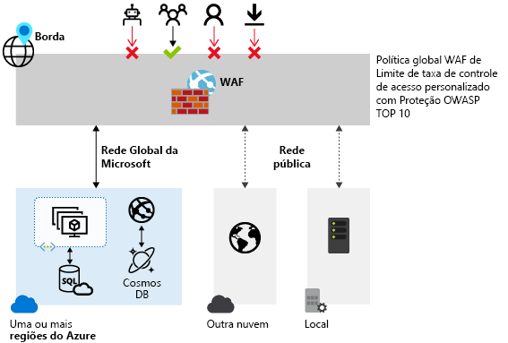
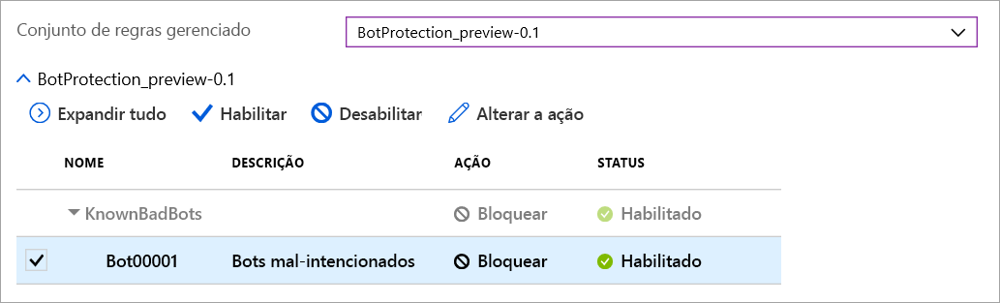

# Firewall do Aplicativo Web do Azure no Azure Front Door

O WAF (Firewall do aplicativo Web) do Azure no Azure Front Door fornece proteção centralizada para seus aplicativos Web. O WAF defende seus serviços Web contra explorações e vulnerabilidades comuns. Ele mantém seu serviço altamente disponível para seus usuários e ajuda você a atender aos requisitos de conformidade.

O WAF no Front Door é uma solução global e centralizada. Ele é implantado em localizações de borda da rede do Azure em todo o mundo. Os aplicativos Web habilitados para WAF inspecionam todas as solicitações de entrada entregues pelo Front Door na borda da rede. 

O WAF impede ataques mal-intencionados próximos às fontes de ataque, antes que eles entrem em sua rede virtual. Você obtém proteção global em escala sem sacrificar o desempenho. Uma política WAF vincula-se facilmente a qualquer perfil do Front Door em sua assinatura. Novas regras podem ser implantadas em minutos. Portanto, você pode responder rapidamente a padrões de ameaça em constante mudança.

O Azure Front Door introduz [dois novos SKUs na versão prévia](../../frontdoor/standard-premium/overview.md): os SKUs do Front Door Standard e do Front Door Premium. O WAF é integrado nativamente ao SKU do Front Door Premium com recursos completos. Para o SKU do Front Door Standard, há suporte apenas para [regras personalizadas](#custom-authored-rules).

## Política e regras do WAF

Você pode configurar uma [política de WAF](waf-front-door-create-portal.md) e associá-la a um ou mais front-ends do Front Door para proteção. Uma política do WAF consiste em dois tipos de regras de segurança:

- regras personalizadas criadas pelo cliente.

- conjuntos de regras gerenciadas que são uma coleção do conjunto de regras pré-configurado gerenciado pelo Azure.

Quando ambas estiverem presentes, as regras personalizadas serão processadas antes das regras em um conjunto de regras gerenciado. Uma regra é composta por uma condição de correspondência, uma prioridade e uma ação. Os tipos de ação com suporte são: PERMITIR, BLOQUEAR, REGISTRAR e REDIRECIONAR. Você pode criar uma política totalmente personalizada que atenda aos seus requisitos de proteção de aplicativo específicos combinando regras gerenciadas e personalizadas.

As regras em uma política são processadas em uma ordem de prioridade. A prioridade é um inteiro exclusivo que define a ordem de regras a serem processadas. Um valor inteiro menor denota uma prioridade maior. Essas regras são avaliadas antes daquelas com um valor inteiro mais alto. Quando há correspondência de uma regra, a ação relevante definida na regra é aplicada à solicitação. Depois de essa correspondência ser processada, as regras com prioridades menores não serão mais processadas.

Um aplicativo Web entregue pelo Front Door pode ter apenas uma política WAF associada por vez. No entanto, você pode ter uma configuração de Front Door sem nenhuma política de WAF associada. Se uma política WAF estiver presente, ela será replicada para todas as localizações de borda para garantir a consistência em políticas de segurança em todo o mundo.

## Modos de WAF

A política de WAF pode ser configurada para ser executada nos dois modos a seguir:

- **Modo de detecção:** Quando executado no modo de detecção, o WAF não executa outras ações além de monitores e registra a solicitação e sua regra WAF correspondente nos logs do WAF. Você pode ativar o diagnóstico de log para o Front Door. Ao usar o portal, vá para a seção **Diagnóstico**.

- **Modo de prevenção:** No modo de prevenção, o WAF executará a ação especificada se uma solicitação corresponder a uma regra. Se uma correspondência for encontrada, nenhuma regra adicional com prioridade mais baixa será avaliada. Qualquer solicitação correspondente também é registrada nos logs do WAF.

## Ações de WAF

Os clientes do WAF podem optar por executar uma das ações quando uma solicitação corresponde às condições de uma regra:

- **Permitir:**  a solicitação passa pelo WAF e é encaminhada para o back-end. Nenhuma outra regra de prioridade mais baixa pode bloquear essa solicitação.
- **Bloquear:** a solicitação é bloqueada e o WAF envia uma resposta ao cliente sem encaminhar a solicitação ao back-end.
- **Registrar em log:**  a solicitação é registrada nos logs do WAF e o WAF continua avaliando as regras de prioridade mais baixa.
- **Redirecionar:** o WAF redireciona a solicitação para o URI especificado. O URI especificado é uma configuração em nível de política. Depois de configuradas, todas as solicitações que correspondem à ação **Redirecionar** são enviadas para esse URI.

## Regras de WAF

Uma política do WAF pode consistir em dois tipos de regras de segurança: regras personalizadas, criadas pelo cliente, e conjuntos de regras gerenciados, um conjunto de regras pré-configurado gerenciado pelo Azure.

### Regras criadas personalizadas

Você pode configurar regras personalizadas WAF da seguinte maneira:

- **Lista de contatos bloqueados e lista de permissões de IP:** você pode controlar o acesso a aplicativos Web com base em uma lista de endereços IP ou intervalos de endereço IP do cliente. Há suporte para os tipos de endereço IPv4 e IPv6. Essa lista pode ser configurada para bloquear ou permitir as solicitações em que o IP de origem corresponde a um IP na lista.

- **Controle de acesso baseado em região geográfica:** você pode controlar o acesso a seus aplicativos Web com base no código do país associado ao endereço IP de um cliente.

- **Controle de acesso baseado em parâmetros HTTP:** Você pode basear regras em correspondências de cadeia de caracteres em parâmetros de solicitação HTTP/HTTPS.  Por exemplo, cadeias de caracteres de consulta, argumentos POST, URI de Solicitação, Cabeçalho de Solicitação e Corpo da Solicitação.

- **Solicitar controle de acesso baseado em método:** As regras baseadas no método de solicitação HTTP da solicitação. Por exemplo, GET, PUT ou HEAD.

- **Restrição de tamanho:** você pode basear regras nos comprimentos de partes específicas de uma solicitação, como cadeia de consulta, URI ou corpo da solicitação.

- **Regras de limitação de taxa:** Uma regra de controle de taxa tem a finalidade de limitar tráfego anormalmente alto proveniente de qualquer IP de cliente. Você pode configurar um número limite de solicitações Web permitidas de um IP de cliente no intervalo de um minuto. Essa regra é diferente de uma regra personalizada de permitir/bloquear baseada em lista de IPs que permite ou bloqueia todas as solicitações de um IP do cliente. Os limites de taxa podem ser combinados com condições de correspondência adicionais, como correspondências de parâmetros HTTP(S) para controle de taxa granular.

### Conjuntos de regras gerenciados pelo Azure

Os conjuntos de regras gerenciados pelo Azure oferecem uma maneira fácil de implantar a proteção contra um conjunto comum de ameaças de segurança. Como esses conjuntos de regras são gerenciados pelo Azure, as regras são atualizadas conforme necessário para proteção contra novas assinaturas de ataque. O Conjunto de Regras Padrão gerenciado pelo Azure inclui regras contra as seguintes categorias de ameaça:

- Script entre sites
- Ataques de Java
- Inclusão de arquivo local
- Ataque de injeção de PHP
- Execução de comando remoto
- Inclusão de arquivo remoto
- Fixação da sessão
- Proteção contra injeção de SQL
- Invasores de protocolo

O número de versão do Conjunto de Regras Padrão será incrementado quando novas assinaturas de ataque forem adicionadas ao conjunto de regras.
O Conjunto de Regras Padrão é habilitado por padrão no modo de detecção em suas políticas de WAF. Você pode desabilitar ou habilitar regras individuais dentro do Conjunto de Regras Padrão para atender aos requisitos do aplicativo. Você também pode definir ações específicas (PERMITIR/BLOQUEAR/REDIRECIONAR/REGISTRAR EM LOG) por regra.

Às vezes, você pode omitir certos atributos de solicitação de uma avaliação do WAF. Um exemplo comum são os tokens inseridos pelo Active Directory que são usados para autenticação. Você pode configurar uma lista de exclusões para uma regra gerenciada, para um grupo de regras ou para todo o conjunto de regras.  

A ação padrão é BLOQUEAR. Além disso, as regras personalizadas poderão ser configuradas na mesma política WAF se você desejar ignorar qualquer uma das regras pré-configuradas no Conjunto de Regras Padrão.

As regras personalizadas sempre são aplicadas antes de as regras no conjunto de regras padrão serem avaliadas. Se uma solicitação corresponder a uma regra personalizada, a ação de regra correspondente será aplicada. A solicitação é bloqueada ou passada pelo back-end. Nenhuma outra regra personalizada ou as regras no Conjunto de Regras Padrão são processadas. Você também pode remover o Conjunto de Regras Padrão de suas políticas WAF.

### Conjunto de regras de proteção contra bots (versão prévia)

Você pode habilitar um conjunto de regras de proteção contra bots gerenciado para execute ações personalizadas em solicitações de categorias de bots conhecidas. 

Há três categorias de bot compatíveis: Bom, Ruim e Desconhecido. As assinaturas de bot são gerenciadas e atualizadas dinamicamente pela plataforma WAF.

Bots ruins incluem bots de endereços IP mal-intencionados e bots que falsificaram as identidades deles. Os endereços IP mal-intencionados são originados do feed de Inteligência contra Ameaças da Microsoft e atualizados a cada hora. O [Grafo de Segurança Inteligente](https://www.microsoft.com/security/operations/intelligence) potencializa a Inteligência contra Ameaças da Microsoft e é usado por vários serviços, incluindo a Central de Segurança do Azure.

Os bots bons incluem mecanismos de pesquisa validados. As categorias desconhecidas incluem grupos de bot adicionais que se identificaram como bots. Por exemplo, analisador de mercado, buscadores de feeds e agentes de coleta de dados. 

Os bots desconhecidos são classificados por meio de agentes de usuário publicados sem validação adicional. Você pode definir ações personalizadas para bloquear, permitir, registrar em log ou redirecionar para diferentes tipos de bots.

> [!IMPORTANT]
> O conjunto de regras de proteção contra bots está atualmente em versão prévia pública e é fornecido com um contrato de nível de serviço de versão prévia pública. Alguns recursos podem não ter suporte ou podem ter restrição de recursos.  Veja os [Termos de Uso Adicionais para Visualizações do Microsoft Azure](https://azure.microsoft.com/support/legal/preview-supplemental-terms/) para obter detalhes.

Se a proteção contra bots estiver habilitada, as solicitações de entrada que corresponderem a regras de bots serão registradas no log FrontdoorWebApplicationFirewallLog. Você pode acessar os logs do WAF de uma conta de armazenamento, hub de eventos ou análise de logs.

## Configuração

Você pode configurar e implantar todos os tipos de regras WAF que usam o portal do Azure, as APIs REST, os modelos do Azure Resource Manager e o Azure PowerShell.

## Monitoramento

O monitoramento para WAF no Front Door é integrado ao Azure Monitor para acompanhar alertas e monitorar facilmente as tendências de tráfego.

## Próximas etapas

- Aprenda sobre o [Firewall de Aplicativo Web no Gateway de Aplicativo do Azure](../ag/ag-overview.md)