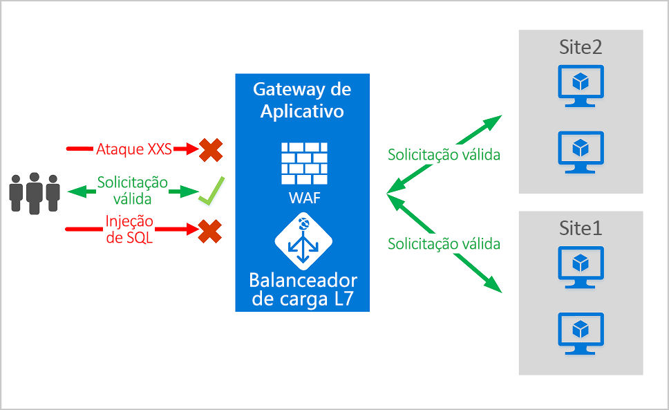
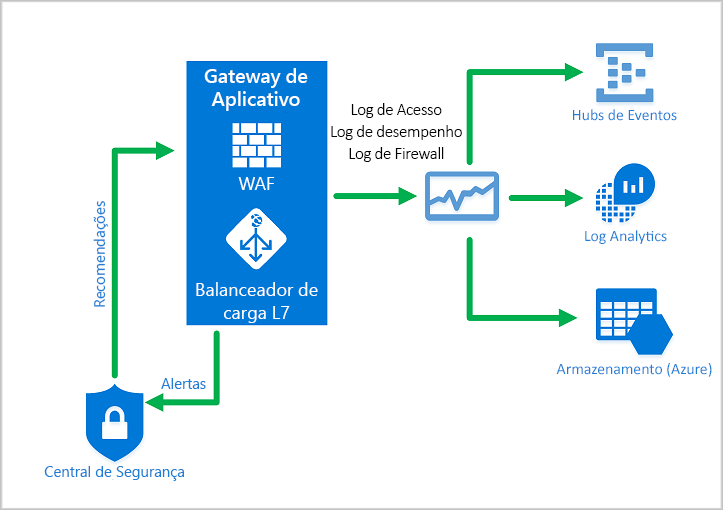
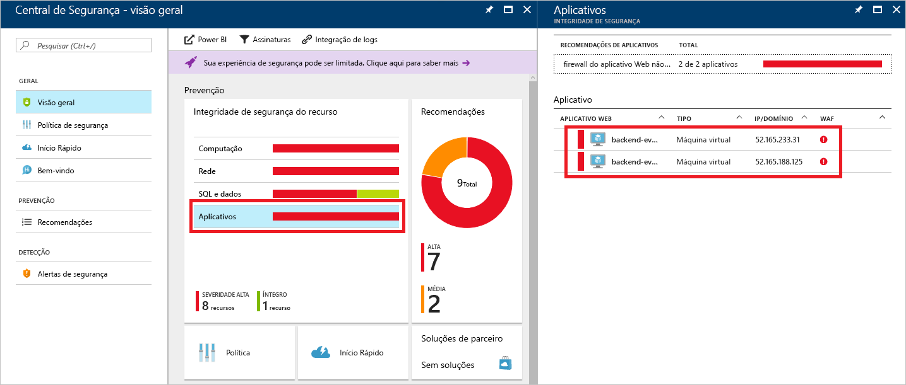
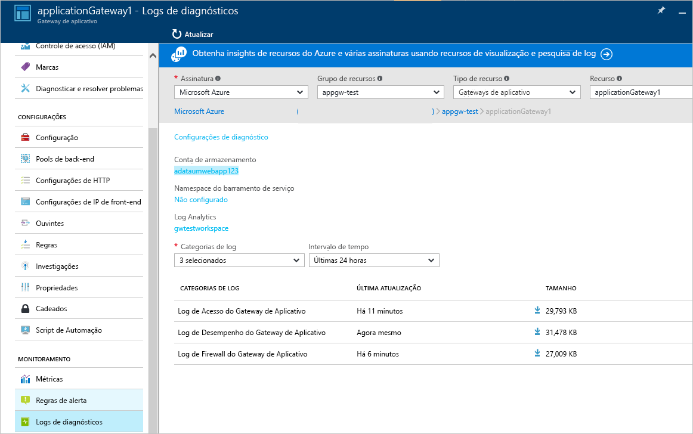

# <a name="what-is-azure-web-application-firewall-on-azure-application-gateway"></a>O que é o Firewall do aplicativo Web do Azure no Gateway de Aplicativo do Azure?

O Firewall do aplicativo Web (WAF) no Gateway de Aplicativo Azure fornece proteção centralizada de seus aplicativos Web contra vulnerabilidades e explorações comuns. Os aplicativos Web cada vez mais são alvos de ataques mal-intencionados que exploram vulnerabilidades conhecidas comuns. A injeção de SQL e o script entre sites estão entre os ataques mais comuns.

O WAF no Gateway de Aplicativo é baseado [Conjunto de Regras Principais](https://owasp.org/www-project-modsecurity-core-rule-set/) 3.1, 3.0 ou 2.2.9 do OWASP (Open Web Application Security Project). O WAF é atualizado automaticamente para incluir proteção contra novas vulnerabilidades, sem necessidade de configuração adicional. 

Todos os recursos de WAF listados abaixo existem dentro de uma política de WAF. Você poderá criar várias políticas e elas poderão ser associadas a um Gateway de Aplicativo, a ouvintes individuais ou a regras de roteamento baseadas em caminhos em um Gateway de Aplicativo. Dessa forma, você pode ter políticas separadas para cada site por trás do seu Gateway de Aplicativo, se necessário. Para obter mais informações sobre políticas de WAF, consulte [Criar uma política de WAF](create-waf-policy-ag.md).



O Gateway de Aplicativo opera como um controlador de entrega de aplicativos (ADC). Ele oferece o protocolo TLS, anteriormente conhecido como protocolo SSL, o encerramento, a afinidade de sessão baseada em cookies, a distribuição de carga round robin, o roteamento baseado em conteúdo, a capacidade de hospedar vários sites e os aprimoramentos de segurança.

Os aprimoramentos de segurança do Gateway de Aplicativo incluem o gerenciamento de políticas TLS e o suporte ao TLS de ponta a ponta. A segurança do aplicativo é reforçada pela integração do WAF ao Gateway de Aplicativo. A combinação protege seus aplicativos Web contra vulnerabilidades comuns. E fornece um local central fácil de configurar para gerenciá-lo.

## <a name="benefits"></a>Benefícios

Esta seção descreve os principais benefícios oferecidos pelo WAF no Gateway de Aplicativo.

### <a name="protection"></a>Proteção

* Protege seus aplicativos Web de vulnerabilidades e ataques da Web sem modificar o código de back-end.

* Protege vários aplicativos Web ao mesmo tempo. Uma instância do Gateway de Aplicativo pode hospedar até 40 sites que são protegidos por um firewall do aplicativo Web.

* Criar políticas do WAF personalizadas para diferentes sites por trás do mesmo WAF 

* Proteja seus aplicativos Web contra bots mal-intencionados com o conjunto de regras de Reputação de IP (versão prévia)

### <a name="monitoring"></a>Monitoramento

* Monitore ataques contra seu aplicativo Web usando um log de WAF em tempo real. O log é integrado ao [Azure Monitor](../../azure-monitor/overview.md) a fim de acompanhar os alertas de WAF e monitorar facilmente as tendências.

* O Gateway de Aplicativo WAF é integrado à Central de Segurança do Azure. A Central de Segurança permite uma exibição central do estado da segurança de todos os seus recursos do Azure.

### <a name="customization"></a>Personalização

* Personalize as regras e os grupos de regras de WAF a fim de atender as necessidades do seu aplicativo e eliminar falsos positivos.

* Associar uma política de WAF para cada site por trás do seu WAF a fim de permitir uma configuração específica do site

* Criar regras personalizadas para atender às necessidades do seu aplicativo

## <a name="features"></a>Recursos

- Proteção contra injeção de SQL.
- Proteção contra script entre site.
- Proteção contra ataques comuns na Web, como injeção de comandos, solicitações HTTP indesejadas, divisão de resposta HTTP e inclusão de arquivo remoto.
- Proteção contra violações de protocolo HTTP.
- Proteção contra anomalias de protocolo HTTP, como ausência de cabeçalhos de agente de usuário do host e de aceitação.
- Proteção contra rastreadores e scanners.
- Detecção de configurações incorretas de aplicativos comuns (por exemplo, Apache e IIS).
- Limites de tamanho de solicitação configuráveis com limites inferiores e superiores.
- As listas de exclusões permitem a você omitir certos atributos de solicitação de uma avaliação do WAF. Um exemplo comum são os tokens inseridos do Active Directory que são usados para autenticação ou campos de senha.
- Crie regras personalizadas para atender às necessidades específicas dos seus aplicativos.
- Filtre o tráfego pela geografia para permitir ou impedir que determinados países/regiões tenham acesso a seus aplicativos. (versão prévia)
- Proteja seus aplicativos de bots com o conjunto de regras de mitigação de bots. (versão prévia)
- Inspecionar JSON e XML no corpo da solicitação

## <a name="waf-policy-and-rules"></a>Política e regras do WAF

Para habilitar um Firewall de Aplicativo Web em um Gateway de Aplicativo, crie uma política de WAF. Essa política é o local em que se encontram todas as regras gerenciadas, as regras personalizadas, as exclusões e outras personalizações, como o limite de upload de arquivos.

Você pode configurar uma política de WAF e associá-la a um ou mais gateways de aplicativo para proteção. Uma política do WAF consiste em dois tipos de regras de segurança:

- Regras personalizadas criadas por você

- Conjuntos de regras gerenciados que são uma coleção do conjunto de regras pré-configurado gerenciado pelo Azure

Quando ambas estiverem presentes, as regras personalizadas serão processadas antes das regras em um conjunto de regras gerenciado. Uma regra é composta por uma condição de correspondência, uma prioridade e uma ação. Os tipos de ação com suporte são: ALLOW, BLOCK e LOG. Você pode criar uma política totalmente personalizada que atenda aos seus requisitos de proteção de aplicativo específicos combinando regras gerenciadas e personalizadas.

As regras em uma política são processadas em uma ordem de prioridade. A prioridade é um inteiro exclusivo que define a ordem de regras a serem processadas. Um valor inteiro menor denota uma prioridade maior. Essas regras são avaliadas antes daquelas com um valor inteiro mais alto. Quando há correspondência de uma regra, a ação relevante definida na regra é aplicada à solicitação. Depois de essa correspondência ser processada, as regras com prioridades menores não serão mais processadas.

Um aplicativo Web entregue pelo Gateway de Aplicativo pode ter uma política de WAF associada no nível global, em um nível por site ou em um nível por URI.

### <a name="core-rule-sets"></a>Conjuntos de regras principais

O Gateway de Aplicativo do Azure dá suporte a três conjunto de regras: CRS 3.1, CRS 3.0 e CRS 2.2.9. Essas regras protegem seus aplicativos Web contra atividade mal-intencionadas.

Para obter mais informações, consulte [Regras e grupos de regras CRS do firewall do aplicativo Web](application-gateway-crs-rulegroups-rules.md).

### <a name="custom-rules"></a>Regras personalizadas

O Gateway de Aplicativo também é compatível com regras personalizadas. Com as regras personalizadas, você pode criar suas próprias regras, que são avaliadas para cada solicitação que passa pelo WAF. Essas regras têm uma prioridade mais alta do que o restante das regras nos conjuntos de regras gerenciadas. Se um conjunto de condições for atendido, será executada uma ação para permitir ou bloquear. 

O operador geomatch agora está disponível em versão prévia pública para regras personalizadas. Confira [regras personalizadas geocombinadas](custom-waf-rules-overview.md#geomatch-custom-rules-preview) para obter mais informações.

> [!NOTE]
> O operador geomatch para regras personalizadas está atualmente em versão prévia pública e é fornecido com um contrato de nível de serviço de versão prévia. Alguns recursos podem não ter suporte ou podem ter restrição de recursos. Veja os [Termos de Uso Adicionais para Visualizações do Microsoft Azure](https://azure.microsoft.com/support/legal/preview-supplemental-terms/) para obter detalhes.

Para obter mais informações sobre regras personalizadas, confira [Regras personalizadas para Gateway de Aplicativo](custom-waf-rules-overview.md).

### <a name="bot-mitigation-preview"></a>Mitigação de bot (visualização)

Um conjunto de regras de proteção contra bots gerenciado pode ser habilitado para que seu WAF bloqueie ou registre solicitações de endereços IP mal-intencionados conhecidos, juntamente com o conjunto de regras gerenciado. Os endereços IP e os domínios são originados do feed de inteligência de ameaças da Microsoft. O Gráfico de Segurança Inteligente potencializa a inteligência contra ameaças da Microsoft e é usado por vários serviços, incluindo a Central de Segurança do Azure.

> [!NOTE]
> O conjunto de regras de proteção contra bots está atualmente em versão prévia pública e é fornecido com um contrato de nível de serviço de versão prévia pública. Alguns recursos podem não ter suporte ou podem ter restrição de recursos. Veja os [Termos de Uso Adicionais para Visualizações do Microsoft Azure](https://azure.microsoft.com/support/legal/preview-supplemental-terms/) para obter detalhes.

Se a proteção contra bots estiver habilitada, as solicitações de entrada que corresponderem aos IPs de cliente do bot mal-intencionado serão registradas no log do firewall, consulte mais informações abaixo. Você pode acessar os logs do WAF da conta de armazenamento, Hub de eventos ou análise de logs. 

### <a name="waf-modes"></a>Modos de WAF

O WAF do Gateway de Aplicativo pode ser configurado para ser executado nestes dois modos:

* **Modo de detecção**: Monitora e registra todos os alertas de ameaça. Você ativa o log de diagnóstico para o Gateway de Aplicativo na seção **Diagnóstico**. Você também precisa garantir que o log do WAF esteja selecionado e ativado. O firewall do aplicativo Web no modo de detecção não bloqueia solicitações de entrada quando está operando no modelo de Detecção.
* **Modo de prevenção**: Bloqueia invasões e ataques detectados pelas regras. O invasor recebe uma exceção "403 acesso não autorizado" e a conexão é encerrada. O modo de Prevenção registra tais ataques nos logs do WAF.

> [!NOTE]
> É recomendável que você execute um WAF implantado recentemente no modo de detecção por um curto período de tempo em um ambiente de produção. Isso fornece a oportunidade de obter [logs de firewall](../../application-gateway/application-gateway-diagnostics.md#firewall-log) e atualizar quaisquer exceções ou [regras personalizadas](./custom-waf-rules-overview.md) antes da transição para o modo de prevenção. Isso pode ajudar a reduzir a ocorrência de tráfego bloqueado inesperado.

### <a name="anomaly-scoring-mode"></a>Modo de pontuação de anomalias

OWASP tem dois modos para decidir se deve bloquear o tráfego: Modo de pontuação de anomalias e modo tradicional.

No modo tradicional, o tráfego que corresponde a qualquer regra é considerado independentemente de qualquer outra correspondência de regra. Esse modo é fácil de entender. Mas a falta de informações sobre quantas regras correspondem a uma solicitação específica é uma limitação. Portanto, o modo de Pontuação de anomalias foi introduzido. É o padrão para OWASP 3.*x*.

No modo de Pontuação de anomalias, o tráfego que corresponde a qualquer regra não é bloqueado imediatamente quando o firewall está no modo de prevenção. As regras têm uma determinada gravidade: *Crítico*, *Erro*, *Aviso* ou *Informativo*. Essa gravidade afeta um valor numérico para a solicitação, que é chamado de Pontuação de anomalias. Por exemplo, uma correspondência de regra de *Aviso* contribui com 3 para a pontuação. Uma correspondência da regra *crítica* contribui com 5.

|Severity  |Valor  |
|---------|---------|
|Crítico     |5|
|Erro        |4|
|Aviso      |3|
|Informativo       |2|

Há um limite de 5 para a pontuação de anomalias bloquear o tráfego. Portanto, uma única correspondência de regra *Crítica* é suficiente para que o WAF do Gateway de Aplicativo bloqueie uma solicitação, mesmo no modo de Prevenção. Mas uma correspondência de regra de *Aviso* aumenta apenas a pontuação de anomalias em 3, o que não é suficiente para bloquear o tráfego.

> [!NOTE]
> A mensagem registrada quando uma regra WAF corresponde ao tráfego inclui o valor de ação "Bloqueado". Mas o tráfego é, na verdade, bloqueado apenas para uma pontuação de anomalias de 5 ou mais. Para obter mais informações, confira [Solucionar problemas de WAF (Firewall de Aplicativo Web) no Gateway de Aplicativo do Azure](web-application-firewall-troubleshoot.md#understanding-waf-logs). 

### <a name="waf-monitoring"></a>Monitoramento de WAF

É importante monitorar a integridade de seu gateway de aplicativo. O monitoramento da integridade de seu WAF e dos aplicativos que ele protege são suportados pela integração com a Central de Segurança do Azure, o Azure Monitor e os logs do Azure Monitor.



#### <a name="azure-monitor"></a>Azure Monitor

Os logs do Gateway de Aplicativo são integrados ao [Azure Monitor](../../azure-monitor/overview.md). Isso permite o controle das informações de diagnóstico, incluindo logs e alertas de WAF. Você pode acessar esse recurso na guia **Diagnóstico** do recurso do Gateway de Aplicativo no portal ou diretamente no Azure Monitor. Para saber mais sobre como habilitar logs, consulte [ diagnóstico do Gateway de Aplicativo](../../application-gateway/application-gateway-diagnostics.md).

#### <a name="azure-security-center"></a>Central de Segurança do Azure

A [Central de Segurança](../../security-center/security-center-introduction.md) ajuda você a evitar, detectar e responder a ameaças. Ela proporciona a você maior visibilidade e controle da segurança de seus recursos do Azure. O Gateway de Aplicativo é [integrado à Central de Segurança](../../security-center/security-center-partner-integration.md#integrated-azure-security-solutions). A Central de Segurança verifica seu ambiente para detectar aplicativos Web desprotegidos. Ela pode recomendar o WAF de Gateway de Aplicativo para proteger esses recursos vulneráveis. Você cria os firewalls diretamente na Central de Segurança. Essas instâncias do WAF estão integradas à Central de Segurança. Elas enviam informações de alertas e de integridade para a Central de Segurança com a finalidade de geração de relatórios.



#### <a name="azure-sentinel"></a>Azure Sentinel

O Microsoft Azure Sentinel é uma solução escalonável e nativa da nuvem que oferece SIEM (Gerenciamento de Eventos de Informações de Segurança) e SOAR (Resposta Automatizada para Orquestração de Segurança). O Azure Sentinel oferece análise inteligente de segurança e inteligência contra ameaças em toda a empresa, fornecendo uma única solução para detecção de alertas, visibilidade de ameaças, procura proativa e resposta a ameaças.

Com a pasta de trabalho interna de eventos de firewall WAF do Azure, você poderá obter uma visão geral dos eventos de segurança em seu WAF. Isso inclui eventos, regras de correspondentes e bloqueadas e todo o resto que é registrado nos logs do firewall. Confira mais sobre o registro em log abaixo. 


#### <a name="azure-monitor-workbook-for-waf"></a>Pasta de trabalho do Azure Monitor para o WAF

Esta pasta de trabalho permite a visualização personalizada de eventos do WAF relevantes para a segurança em vários painéis filtráveis. Ela funciona com todos os tipos de WAF, incluindo o Gateway de Aplicativo, o Front Door e a CDN, podendo ser filtrada com base no tipo de WAF ou em uma instância de WAF específica. Faça a importação por meio de um modelo do ARM ou um modelo da Galeria. Para implantar essa pasta de trabalho, confira [Pasta de trabalho do WAF](https://aka.ms/AzWAFworkbook).

#### <a name="logging"></a>Registro em log

O WAF do Gateway de Aplicativo fornece relatórios detalhados sobre cada ameaça que ele detecta. O registro em log é integrado a logs de Diagnóstico do Azure. Os alertas são registrados no formato .json. Esses logs podem ser integrados aos [logs do Azure Monitor](../../azure-monitor/insights/azure-networking-analytics.md).



```json
{
  "resourceId": "/SUBSCRIPTIONS/{subscriptionId}/RESOURCEGROUPS/{resourceGroupId}/PROVIDERS/MICROSOFT.NETWORK/APPLICATIONGATEWAYS/{appGatewayName}",
  "operationName": "ApplicationGatewayFirewall",
  "time": "2017-03-20T15:52:09.1494499Z",
  "category": "ApplicationGatewayFirewallLog",
  "properties": {
    {
      "instanceId": "ApplicationGatewayRole_IN_0",
      "clientIp": "52.161.109.145",
      "clientPort": "0",
      "requestUri": "/",
      "ruleSetType": "OWASP",
      "ruleSetVersion": "3.0",
      "ruleId": "920350",
      "ruleGroup": "920-PROTOCOL-ENFORCEMENT",
      "message": "Host header is a numeric IP address",
      "action": "Matched",
      "site": "Global",
      "details": {
        "message": "Warning. Pattern match \"^[\\\\d.:]+$\" at REQUEST_HEADERS:Host ....",
        "data": "127.0.0.1",
        "file": "rules/REQUEST-920-PROTOCOL-ENFORCEMENT.conf",
        "line": "791"
      },
      "hostname": "127.0.0.1",
      "transactionId": "16861477007022634343"
      "policyId": "/subscriptions/1496a758-b2ff-43ef-b738-8e9eb5161a86/resourceGroups/drewRG/providers/Microsoft.Network/ApplicationGatewayWebApplicationFirewallPolicies/globalWafPolicy",
      "policyScope": "Global",
      "policyScopeName": " Global "
    }
  }
} 

```

## <a name="application-gateway-waf-sku-pricing"></a>Preços da SKU do WAF do Gateway de Aplicativo

Os modelos de preços são diferentes para as SKUs de WAF_v1 e WAF_v2. Consulte a página de [preços do Gateway de Aplicativo](https://azure.microsoft.com/pricing/details/application-gateway/) para saber mais. 

## <a name="whats-new"></a>Novidades

Para conhecer as novidades do Firewall do aplicativo Web do Azure, confira [Atualizações do Azure](https://azure.microsoft.com/updates/?category=networking&query=Web%20Application%20Firewall).

## <a name="next-steps"></a>Próximas etapas

- Saiba mais sobre as [Regras gerenciadas de WAF](application-gateway-crs-rulegroups-rules.md)
- Saiba mais sobre as [Regras personalizadas](custom-waf-rules-overview.md)
- Saiba mais sobre o [Firewall do Aplicativo Web no Azure Front Door](../afds/afds-overview.md)
