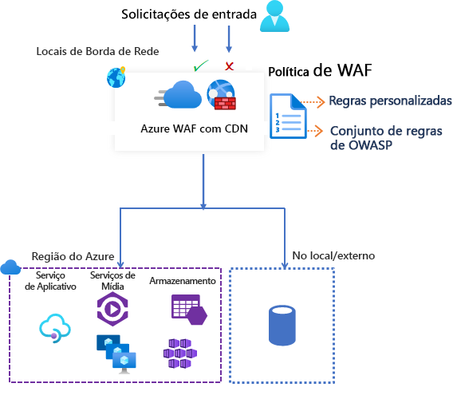

# Firewall de Aplicativo Web do Azure na Rede de Distribuição de Conteúdo do Azure da Microsoft

O WAF (firewall do aplicativo Web) do Azure na CDN (rede de distribuição de conteúdo) do Azure da Microsoft fornece proteção centralizada para seu conteúdo da Web. O WAF defende seus serviços Web contra explorações e vulnerabilidades comuns. Ele mantém seu serviço altamente disponível para seus usuários e ajuda você a atender aos requisitos de conformidade.

> [!IMPORTANT]
> O WAF na CDN do Azure da Microsoft está atualmente em versão prévia pública e é fornecido com um contrato de nível de serviço de versão prévia. Alguns recursos podem não ter suporte ou podem ter restrição de recursos.  Veja os [Termos de Uso Adicionais para Visualizações do Microsoft Azure](https://azure.microsoft.com/support/legal/preview-supplemental-terms/) para obter detalhes.

O WAF na CDN do Azure é uma solução global e centralizada. Ele é implantado em localizações de borda da rede do Azure em todo o mundo. O WAF impede ataques mal-intencionados próximos às fontes de ataque, antes que eles cheguem à sua origem. Você obtém proteção global em escala sem sacrificar o desempenho. 

Uma política WAF é facilmente vinculada a qualquer ponto de extremidade de CDN em sua assinatura. Novas regras podem ser implantadas em minutos. Portanto, você pode responder rapidamente a padrões de ameaça em constante mudança.

## Política e regras do WAF

Você pode configurar uma política do WAF e associá-la a um ou mais pontos de extremidade da CDN para proteção. Uma política do WAF consiste em dois tipos de regras de segurança:

- regras personalizadas que você pode criar.

- conjuntos de regras gerenciadas que são uma coleção de regras pré-configuradas gerenciadas pelo Azure.

Quando ambas estiverem presentes, as regras personalizadas serão processadas antes das regras em um conjunto de regras gerenciado. Uma regra é composta por uma condição de correspondência, uma prioridade e uma ação. Os tipos de ação com suporte são: *PERMITIR*, *BLOQUEAR*, *REGISTRAR* e *REDIRECIONAR*. Você pode criar uma política totalmente personalizada que atenda aos seus requisitos de proteção de aplicativo específicos combinando regras gerenciadas e personalizadas.

As regras em uma política são processadas em uma ordem de prioridade. A prioridade é um número exclusivo que define a ordem de regras a serem processadas. Números menores são uma prioridade mais alta e essas regras são avaliadas antes das regras com um valor maior. Quando há correspondência de uma regra, a ação relevante definida na regra é aplicada à solicitação. Depois de essa correspondência ser processada, as regras com prioridades menores não serão mais processadas.

Um aplicativo Web hospedado na CDN do Azure pode ter apenas uma política WAF associada por vez. No entanto, você pode ter um ponto de extremidade de CDN sem nenhuma política de WAF associada. Se uma política WAF estiver presente, ela será replicada para todas as localizações de borda para garantir a consistência em políticas de segurança em todo o mundo.

## Modos de WAF

A política de WAF pode ser configurada para ser executada nos dois modos a seguir:

- *Modo de detecção*: Quando executado no modo de detecção, o WAF não executa outras ações além de monitores e registra a solicitação e sua regra WAF correspondente nos logs do WAF. Você pode ativar o diagnóstico de log para o CDN. Ao usar o portal, vá para a seção **Diagnóstico**.

- *Modo de prevenção*: No modo de prevenção, o WAF executará a ação especificada se uma solicitação corresponder a uma regra. Se uma correspondência for encontrada, nenhuma regra adicional com uma prioridade mais baixa será avaliada. Qualquer solicitação correspondente também é registrada nos logs do WAF.

## Ações de WAF

Você pode escolher uma das seguintes ações quando uma solicitação corresponder às condições de uma regra:

- *Permitir*: a solicitação passa pelo WAF e é encaminhada para o back-end. Nenhuma outra regra de prioridade mais baixa pode bloquear essa solicitação.
- *Bloquear*: a solicitação é bloqueada e o WAF envia uma resposta ao cliente sem encaminhar a solicitação ao back-end.
- *Log*:  a solicitação é registrada nos logs do WAF e o WAF continua avaliando as regras de prioridade mais baixa.
- *Redirecionar*: o WAF redireciona a solicitação para o URI especificado. O URI especificado é uma configuração em nível de política. Depois de configuradas, todas as solicitações que correspondem à ação *Redirecionar* são enviadas para esse URI.

## Regras de WAF

Uma política de WAF pode ter dois tipos de regras de segurança:

- *regras personalizadas*: regras que você cria por conta própria 
- *conjunto de regras gerenciadas*: Conjunto de regras pré-configuradas gerenciadas pelo Azure

### Regras personalizadas

As regras personalizadas podem ter regras de correspondência e regras de controle de taxa.

Você pode configurar as seguintes regras de correspondência personalizadas:

- *Lista de permissões de IP e lista de bloqueios*: você pode controlar o acesso a aplicativos Web com base em uma lista de endereços IP ou intervalos de endereço IP do cliente. Há suporte para os tipos de endereço IPv4 e IPv6. Essa lista pode ser configurada para bloquear ou permitir as solicitações em que o IP de origem corresponde a um IP na lista.

- *Controle de acesso baseado em região geográfica*: você pode controlar o acesso a seus aplicativos Web com base no código do país associado ao endereço IP de um cliente.

- *Controle de acesso baseado em parâmetros HTTP*: Você pode basear regras em correspondências de cadeia de caracteres em parâmetros de solicitação HTTP/HTTPS.  Por exemplo, cadeias de caracteres de consulta, argumentos POST, URI de Solicitação, Cabeçalho de Solicitação e Corpo da Solicitação.

- *Controle de acesso baseado em método de solicitação*: As regras são baseadas no método de solicitação HTTP da solicitação. Por exemplo, GET, PUT ou HEAD.

- *Restrição de tamanho*: você pode basear regras nos comprimentos de partes específicas de uma solicitação, como cadeia de consulta, URI ou corpo da solicitação.

Uma regra de controle de taxa limita o tráfego anormalmente alto proveniente de qualquer endereço IP de cliente.

- *Regras de limitação de taxa*: Você pode configurar um limite no número de solicitações Web permitidas de um endereço IP de cliente no intervalo de um minuto. Essa regra é diferente de uma regra personalizada de permitir/bloquear baseada em lista de IPs que permite ou bloqueia todas as solicitações de um endereço IP do cliente. Os limites de taxa podem ser combinados com condições de correspondência adicionais, como correspondências de parâmetros HTTP(S) para controle de taxa granular.

### Conjuntos de regras gerenciados pelo Azure

Os conjuntos de regras gerenciados pelo Azure oferecem uma maneira fácil de implantar a proteção contra um conjunto comum de ameaças de segurança. Como esses conjuntos de regras são gerenciados pelo Azure, as regras são atualizadas conforme necessário para proteção contra novas assinaturas de ataque. O Conjunto de Regras Padrão gerenciado pelo Azure inclui regras contra as seguintes categorias de ameaça:

- Script entre sites
- Ataques de Java
- Inclusão de arquivo local
- Ataque de injeção de PHP
- Execução de comando remoto
- Inclusão de arquivo remoto
- Fixação da sessão
- Proteção contra injeção de SQL
- Invasores de protocolo

O número de versão do Conjunto de Regras Padrão será incrementado quando novas assinaturas de ataque forem adicionadas ao conjunto de regras.
O Conjunto de Regras Padrão é habilitado por padrão no modo de *Detecção* em suas políticas de WAF. Você pode desabilitar ou habilitar regras individuais dentro do Conjunto de Regras Padrão para atender aos requisitos do aplicativo. Você também pode definir ações específicas (PERMITIR/BLOQUEAR/REDIRECIONAR/REGISTRAR EM LOG) por regra. A ação padrão para o Conjunto de Regras Padrão gerenciado é *Bloquear*.

As regras personalizadas sempre são aplicadas antes de as regras no conjunto de regras padrão serem avaliadas. Se uma solicitação corresponder a uma regra personalizada, a ação de regra correspondente será aplicada. A solicitação é bloqueada ou passada pelo back-end. Nenhuma outra regra personalizada ou as regras no Conjunto de Regras Padrão são processadas. Você também pode remover o Conjunto de Regras Padrão de suas políticas WAF.

## Configuração

Você pode configurar e implantar todos os tipos de regras WAF que usam o portal do Azure, as APIs REST, os modelos do Azure Resource Manager e o Azure PowerShell.

## Monitoramento

O monitoramento para WAF com a CDN é integrado ao Azure Monitor para acompanhar alertas e monitorar facilmente as tendências de tráfego.

## Próximas etapas

- [Tutorial: Criar uma política de WAF com a CDN do Azure usando o portal do Azure](waf-cdn-create-portal.md)
