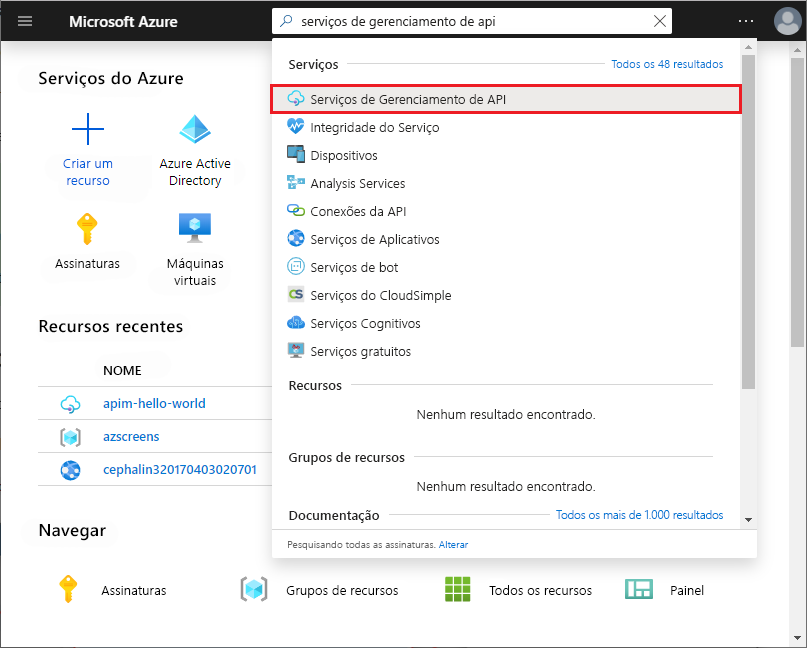
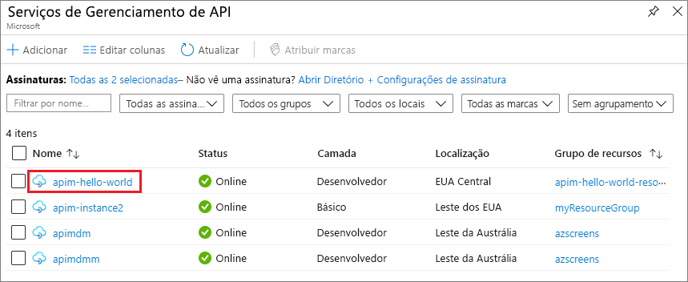

## Navegar até a instância de Gerenciamento de API

1. No portal do Azure, pesquise e selecione **Serviços de Gerenciamento de API**.

   

1. Na página **Serviços de Gerenciamento de API**, selecione a sua instância de Gerenciamento de API.

   

