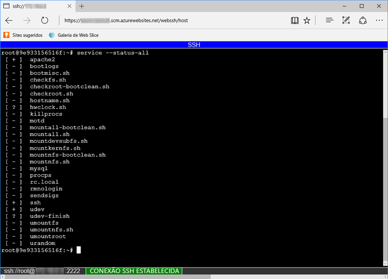

Para abrir uma sessão SSH direta com seu contêiner, seu aplicativo deve estar em execução.

Cole a seguinte URL no seu navegador e substitua `<app-name>` pelo nome do aplicativo:

```
https://<app-name>.scm.azurewebsites.net/webssh/host
```

Se você ainda não estiver autenticado, será necessário autenticar com sua assinatura do Azure para se conectar. Uma vez autenticado, consulte um shell no navegador, onde você pode executar comandos dentro de seu contêiner.


