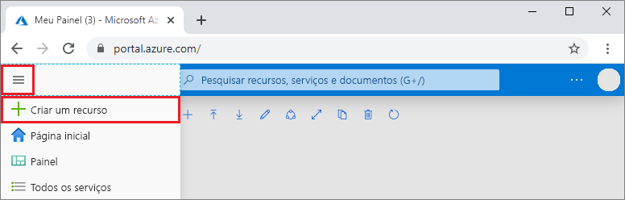
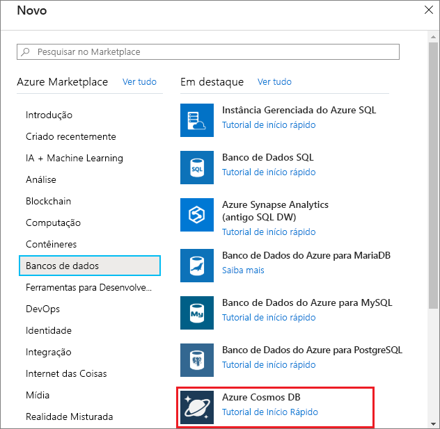
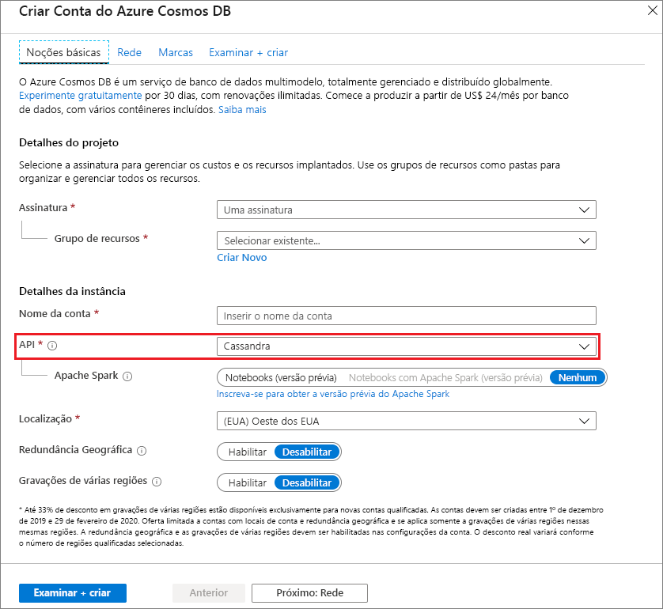

1. Em uma nova janela do navegador, entre no [Portal do Azure](https://portal.azure.com/).

2. No menu esquerdo, selecione **Criar um recurso**.
   
   
   
3. Na página **Novo**, selecione **Bancos de dados** > **Azure Cosmos DB**.
   
   
   
3. Na página **Criar Conta do Azure Cosmos DB**, insira as configurações da nova conta do Azure Cosmos DB. 
 
    Configuração|Valor|Descrição
    ---|---|---
    Subscription|Sua assinatura|Selecione a assinatura do Azure que você deseja usar para essa conta do Azure Cosmos DB. 
    Grupo de recursos|Criar Novo  Em seguida, digite o mesmo nome que o Nome da Conta|Selecione **Criar novo**. Em seguida, insira um novo nome de grupo de recursos para a conta. Para simplificar, use o mesmo nome que o Nome da Conta do Azure Cosmos. 
    Nome da Conta|Insira um nome exclusivo|Insira um nome exclusivo para identificar a conta do Azure Cosmos DB. O URI da sua conta será *cassandra.cosmos.azure.com* acrescentado ao nome da conta exclusivo.  O nome da conta pode usar apenas letras minúsculas, números e hifens (-) e deve ter de 3 a 31 caracteres.
    API|Cassandra|A API determina o tipo de conta a ser criada. O Azure Cosmos DB fornece cinco APIs: Core (SQL) para bancos de dados de documentos, Gremlin para bancos de dados de grafos, MongoDB para bancos de dados de documentos, Tabela do Azure e Cassandra. Você deve criar uma conta separada para cada API.   Selecione **Cassandra**, porque neste guia de início rápido você está criando uma tabela que funciona com a API do Cassandra.   [Saiba mais sobre a API do Cassandra](../articles/cosmos-db/cassandra-introduction.md).|
    Location|Selecione a região mais próxima de seus usuários|Selecione uma localização geográfica para hospedar a sua conta do Azure Cosmos DB. Use o local mais próximo dos usuários para fornecer a eles acesso mais rápido aos dados.
    Modo de capacidade|Taxa de transferência provisionada ou sem servidor|Selecione **Taxa de transferência provisionada** para criar uma conta no modo [taxa de transferência provisionada](../articles/cosmos-db/set-throughput.md). Selecione **Sem servidor** para criar uma conta no modo [sem servidor](../articles/cosmos-db/serverless.md).

    Selecione **Revisar + Criar**. Ignore as seções **Rede**, **Backup**, **Criptografia** e **Marcas**. 

    

4. A criação da conta leva alguns minutos. Aguarde até que o portal exiba a narração de página **Parabéns! Sua conta do Azure Cosmos DB foi criada**.

