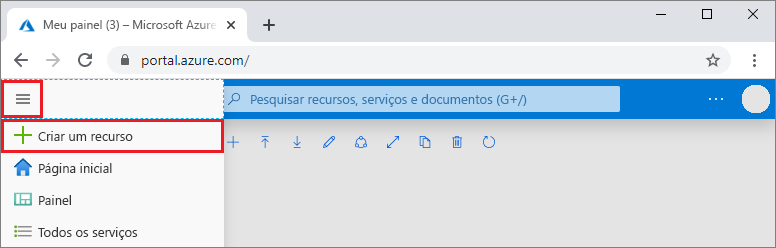
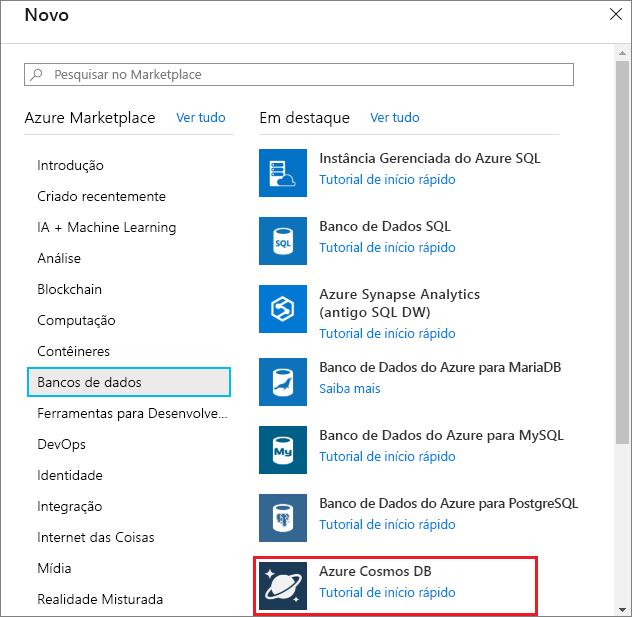
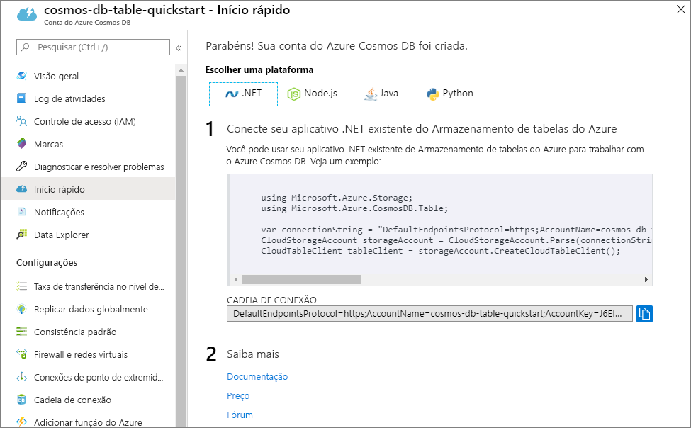

1. Em uma nova janela do navegador, entre no [Portal do Azure](https://portal.azure.com/).

2. No menu esquerdo, selecione **Criar um recurso**.
   
   
   
3. Na página **Novo**, selecione **Bancos de dados** > **Azure Cosmos DB**.
   
   
   
3. Na página **Criar Conta do Azure Cosmos DB**, insira as configurações da nova conta do Azure Cosmos DB. 
 
    Configuração|Valor|Descrição
    ---|---|---
    Subscription|Sua assinatura|Selecione a assinatura do Azure que você deseja usar para essa conta do Azure Cosmos DB. 
    Grupo de recursos|**Criar** e, em seguida, Nome da Conta|Selecione **Criar novo**. Em seguida, insira um novo nome de grupo de recursos para a conta. Para simplificar, use o mesmo nome que o Nome da Conta do Azure Cosmos DB. 
    Nome da Conta|Um nome exclusivo|Insira um nome exclusivo para identificar a conta do Azure Cosmos DB.  O nome da conta pode usar apenas letras minúsculas, números e hifens (-) e deve ter de 3 a 31 caracteres.
    API|Tabela|A API determina o tipo de conta a ser criada. O Azure Cosmos DB fornece cinco APIs: Core (SQL) para bancos de dados de documentos, Gremlin para bancos de dados de grafos, MongoDB para bancos de dados de documentos, Tabela do Azure e Cassandra. É necessário criar uma conta separada para cada API.   Selecione **Tabela do Azure**, porque neste início rápido você criará uma tabela que funciona com a API de Tabela.   [Saiba mais sobre a API de Tabela](../articles/cosmos-db/table-introduction.md).|
    Location|A região mais próxima dos usuários|Selecione uma localização geográfica para hospedar a sua conta do Azure Cosmos DB. Use o local mais próximo dos usuários para fornecer a eles acesso mais rápido aos dados.

    Mantenha as opções **Redundância Geográfica** e **Gravações em Várias Regiões** como **Desabilitar** para evitar preços adicionais e ignore as seções **Rede** e **Marcas**.

5. Selecione **Revisar + Criar**. Após a concluir a validação, selecione **Criar** para criar a conta. 
 
   

6. São necessários alguns minutos para criar a conta. Um mensagem informando **A implantação está em andamento** será exibida. Aguarde a conclusão da implantação e, em seguida, selecione **Ir para o recurso**.

    

