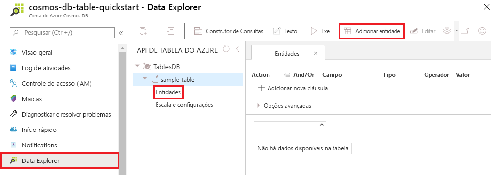
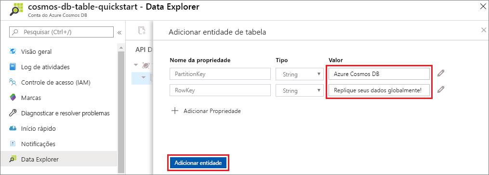

Agora é possível adicionar dados à sua nova tabela usando o Data Explorer.

1. No Data Explorer, expanda **sample-table**, selecione **Entidades** e selecione **Adicionar Entidade**.

   

2. Agora, adicione dados às caixas de valor PartitionKey e RowKey e selecione **Adicionar Entidade**.

   
  
    Agora, é possível adicionar mais entidades à tabela, editar as entidades ou consultar os dados no Data Explorer. Por meio do Data Explorer, também é possível dimensionar a taxa de transferência e adicionar procedimentos armazenados, funções definidas pelo usuário e gatilhos à tabela.