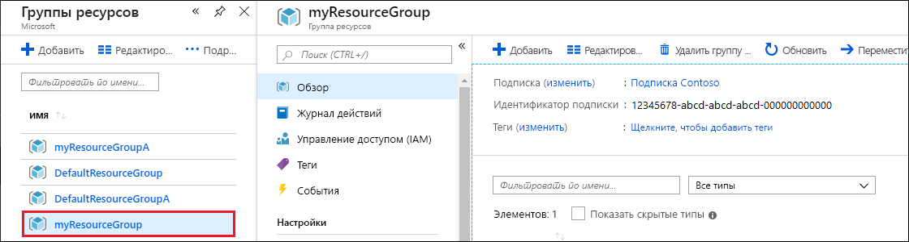

Quando o aplicativo e a conta do Azure Cosmos DB estiverem prontos, você poderá excluir os recursos do Azure criados para não incorrer em mais cobranças. Para excluir os recursos:

1. Na barra de pesquisa do portal do Azure, procure e selecione **Grupos de recursos**.

2. Na lista, selecione o grupo de recursos criado neste início rápido.  

   

2. Na página **Visão geral** do grupo de recursos, selecione **Excluir grupo de recursos**.

      

3. Na próxima janela, insira o nome do grupo de recursos a ser excluído e selecione **Excluir**.

