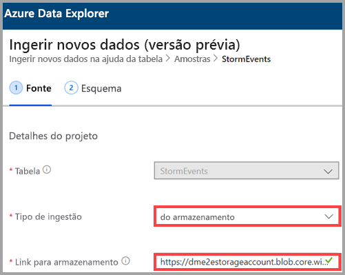
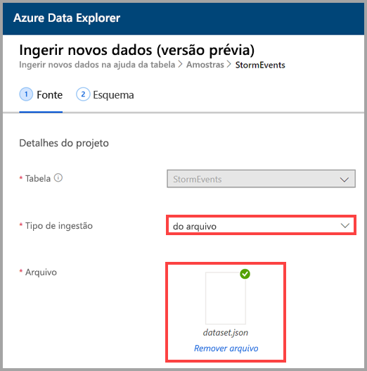
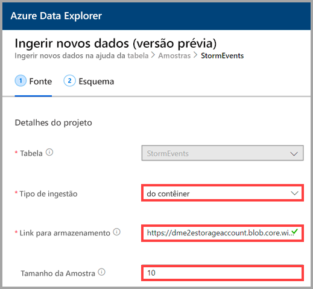
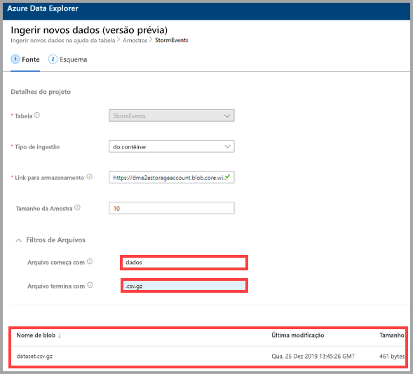

## Selecionar um tipo de ingestão

Em **Tipo de ingestão**, selecione uma das seguintes opções:
   * **do armazenamento**: no campo **Link para armazenamento**, adicione a URL da conta de armazenamento. Use [URL de SAS do blob](/azurevs-azure-tools-storage-explorer-blobs#get-the-sas-for-a-blob-container) para as contas de armazenamento particulares.
   
      

    * **de arquivo**: selecione **Procurar** para localizar o arquivo ou arraste o arquivo para o campo.
  
      

    * **de contêiner**: no campo **Link para armazenamento**, adicione a URL de [SAS](/azure/vs-azure-tools-storage-explorer-blobs#get-the-sas-for-a-blob-container) do contêiner e, opcionalmente, insira o tamanho da amostra.

      

  Uma amostra dos dados é exibida. Se desejar, você poderá filtrá-lo para mostrar apenas os arquivos que começam e terminam com caracteres específicos. Quando você ajusta os filtros, a visualização é atualizada automaticamente.
  
  Por exemplo, você pode filtrar todos os arquivos que começam com a palavra *dados* e terminam com uma extensão *.csv.gz*.

  
