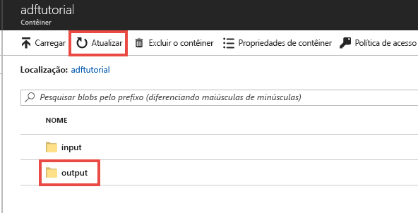
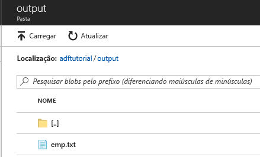

## <a name="review-deployed-resources"></a>Examinar os recursos implantados

O pipeline cria automaticamente a pasta de saída no contêiner de blob adftutorial. Em seguida, ele copia o arquivo emp.txt da pasta de entrada para a pasta de saída. 

1. No portal do Azure, na página do contêiner **adftutorial**, selecione **Atualizar** para ver a pasta de saída. 
    
    

2. Selecione **saída** na lista de pastas. 

3. Confirme que **emp.txt** tenha sido copiado para a pasta de saída. 

    

## <a name="clean-up-resources"></a>Limpar os recursos

Limpe os recursos criados no Guia de início rápido de duas maneiras. Você pode excluir o [grupo de recursos do Azure](../articles/azure-resource-manager/management/overview.md), que inclui todos os recursos no grupo de recursos. Se desejar manter os outros recursos intactos, exclua apenas o data factory que você criou neste tutorial.

Ao excluir um grupo de recursos, todos os recursos são excluídos, incluindo os data factories nele. Execute o comando a seguir para excluir o grupo de recursos inteiro: 

```powershell
Remove-AzResourceGroup -ResourceGroupName $resourcegroupname
```

> [!Note]
> A remoção de um grupo de recursos poderá levar algum tempo. Seja paciente com o processo

Se deseja excluir apenas o data factory e não o grupo de recursos inteiro, execute o seguinte comando: 

```powershell
Remove-AzDataFactoryV2 -Name $dataFactoryName -ResourceGroupName $resourceGroupName
```