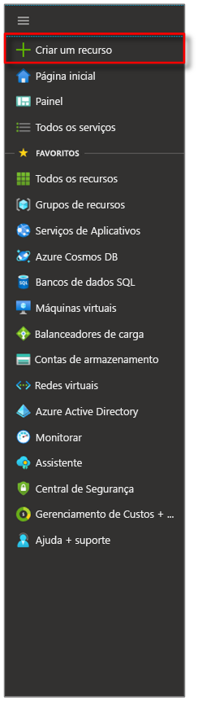
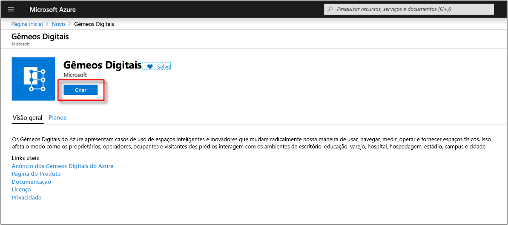
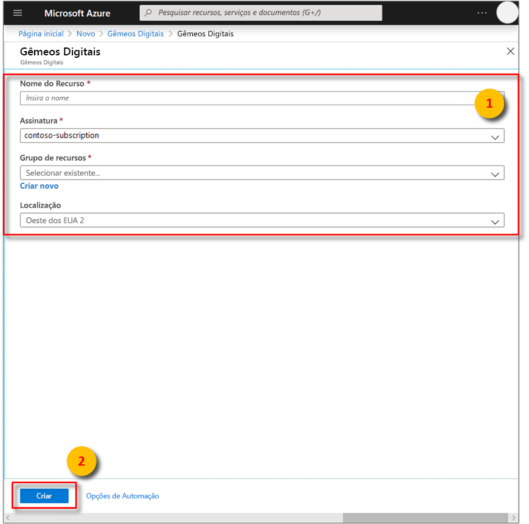
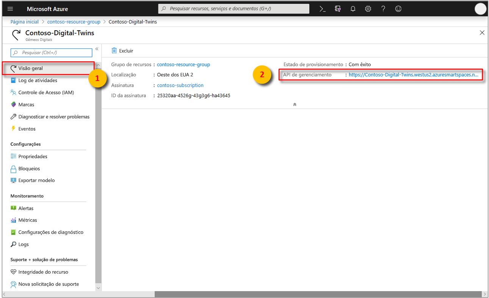

1. Entre no [Portal do Azure](https://portal.azure.com).

1. Selecione a barra lateral inicial e, em seguida, **+ Criar um recurso**. 

   [](./media/create-digital-twins-portal/create-a-resource.png#lightbox)

1. Pesquise por **Gêmeos Digitais** e selecione **Gêmeos Digitais**. 

   [](./media/create-digital-twins-portal/create-digital-twins.png#lightbox)

   Como alternativa, selecione **Internet das Coisas** e selecione **Gêmeos Digitais (versão prévia)** .

1. Selecione **Criar** para iniciar o processo de implantação.

   [](./media/create-digital-twins-portal/create-and-confirm-resource.png#lightbox)

1. No painel **Gêmeos Digitais**, insira as seguintes informações:
   * **Nome do Recurso**: Criar um nome exclusivo para sua instância de Gêmeos Digitais.
   * **Assinatura**: Escolha a assinatura que deseja usar para criar essa instância de Gêmeos Digitais. 
   * **Grupo de recursos**: Selecione ou crie um [grupo de recursos](https://docs.microsoft.com/azure/azure-resource-manager/resource-group-overview#resource-groups) para a instância de Gêmeos Digitais.
   * **Localização**: selecione a localização mais próxima de seus dispositivos.

     [](./media/create-digital-twins-portal/create-digital-twins-param.png#lightbox)

1. Examine as informações de Gêmeos Digitais e, em seguida, selecione **Criar**. Sua instância de Gêmeos Digitais pode levar alguns minutos para ser criada. Você pode monitorar o progresso no painel **Notificações**.

1. Abra o painel **Visão geral** da sua instância de Gêmeos Digitais. Observe o link em **API de Gerenciamento**. A URL da **API de Gerenciamento** é formatada como: 
   
   ```URL
   https://yourDigitalTwinsName.yourLocation.azuresmartspaces.net/management/swagger
   ```
   
   Esta URL leva você até a documentação da API REST de Gêmeos Digitais do Azure que se aplica à sua instância. Leia [Como usar o Swagger dos Gêmeos Digitais do Azure](../articles/digital-twins/how-to-use-swagger.md) para aprender a ler e usar essa documentação da API. Copie e modifique a URL da **API de Gerenciamento** para este formato: 
    
   ```URL
   https://yourDigitalTwinsName.yourLocation.azuresmartspaces.net/management/api/v1.0/
   ```
    
   Seu aplicativo usará a URL modificada como a URL base para acessar a instância. Copie esta URL modificada para um arquivo temporário. Você precisará disso nas próximas seções.

   [](./media/create-digital-twins-portal/digital-twins-management-api.png#lightbox)