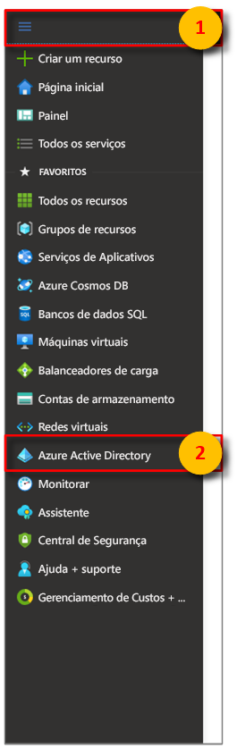
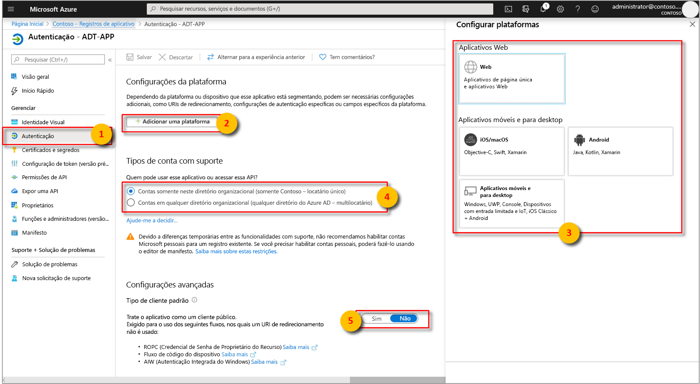

>[!NOTE]
>Esta seção fornece instruções para o [registro de aplicativo do Azure AD](https://docs.microsoft.com/azure/active-directory/develop/quickstart-register-app).

1. No [portal do Azure](https://portal.azure.com), abra **Azure Active Directory** no painel esquerdo expansível e, em seguida, abra o painel **Registros de aplicativo**. 

    

1. Selecione o botão **+ Novo registro**.

    

1. Dê um nome amigável para esse registro de aplicativo na caixa **Nome**. Na seção **URI de Redirecionamento (opcional)** , selecione **Cliente público/nativo (móvel e de área de trabalho)** no menu suspenso à esquerda e insira `https://microsoft.com` na caixa de texto à direita. Selecione **Registrar**.

    

1. Para certificar-se de que [o aplicativo está registrado como um **cliente público**](https://docs.microsoft.com/azure/active-directory/develop/scenario-desktop-app-registration), abra o painel **Autenticação** do registro do aplicativo e role para baixo nesse painel. Na seção **Tipo de cliente padrão**, escolha **Sim** para **Tratar o aplicativo como um cliente público** e pressione **Salvar**.

    Marque **Tokens de acesso** para habilitar a configuração de **oauth2AllowImplicitFlow** em seu Manifest.json.

    

1.  Abra o painel **Visão geral** do seu aplicativo registrado e copie os valores das entidades a seguir para um arquivo temporário. Você usará esses valores para configurar seu aplicativo de exemplo nas seções a seguir.

    - **ID do Aplicativo (cliente)**
    - **ID do Diretório (locatário)**

    

1. Abra o painel **Permissões de API** para o registro do aplicativo. Selecione o botão **+ Adicionar uma permissão**. No painel **Solicitar permissões de API**, selecione a guia **APIs que a minha organização usa** e pesquise pelo seguinte:
    
    1. `Azure Digital Twins`. Selecione a **API de Gêmeos Digitais do Azure**.

        

    1. Como alternativa, pesquise `Azure Smart Spaces Service`. Selecione a API **Azure Smart Spaces Service**.

        

    > [!IMPORTANT]
    > A ID e o nome da API do Azure AD que serão exibidos dependerão do locatário:
    > * As contas de locatário e cliente de teste devem pesquisar `Azure Digital Twins`.
    > * Outras contas Microsoft devem pesquisar `Azure Smart Spaces Service`.

1. Qualquer uma das APIs, uma vez selecionada, será exibida como **Gêmeos Digitais do Azure**, no mesmo painel **Solicitar permissões de API**. Selecione a opção suspensa **Leitura** e marque a caixa de seleção **Leitura.Gravação**. Selecione o botão **Adicionar permissões**.

    

1. Dependendo das configurações da sua organização, talvez você precise seguir etapas adicionais para conceder acesso de administrador a essa API. Entre em contato com seu administrador para obter mais informações. Assim que o acesso de administrador for aprovado, a coluna **Consentimento do Administrador Necessário** no painel de **Permissões da API** exibirá suas permissões. 

    

    Verifique se **Gêmeos Digitais do Azure** aparece.
