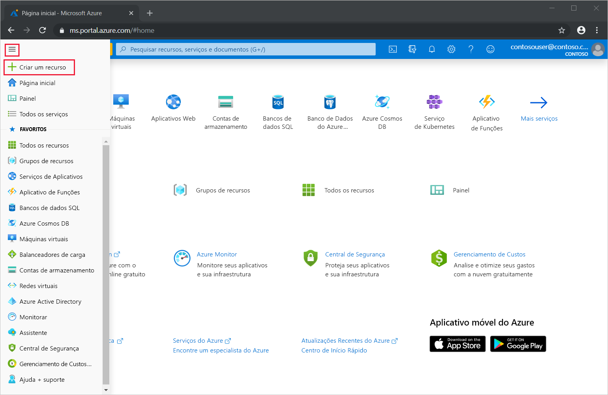
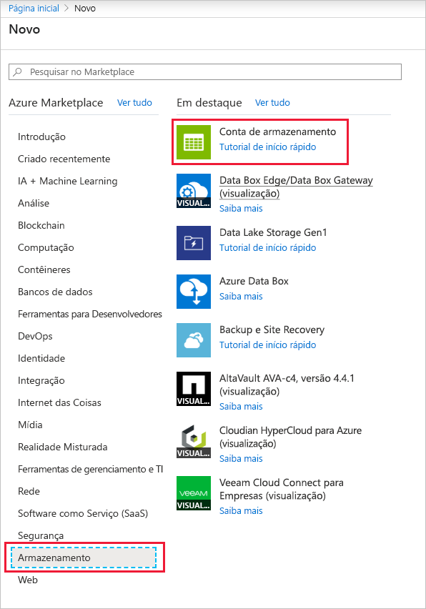
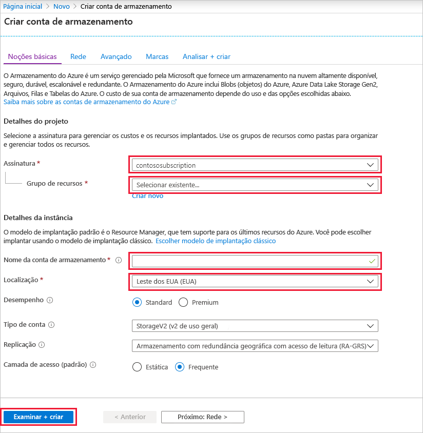
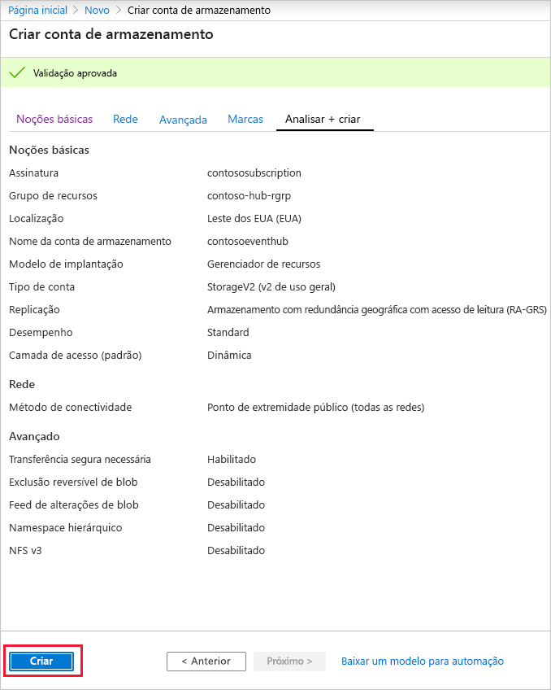
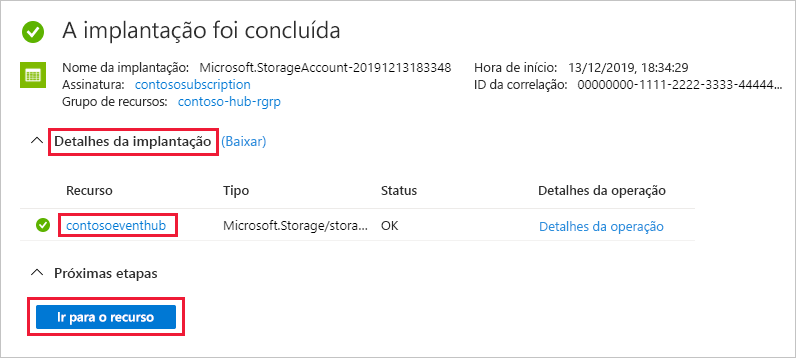
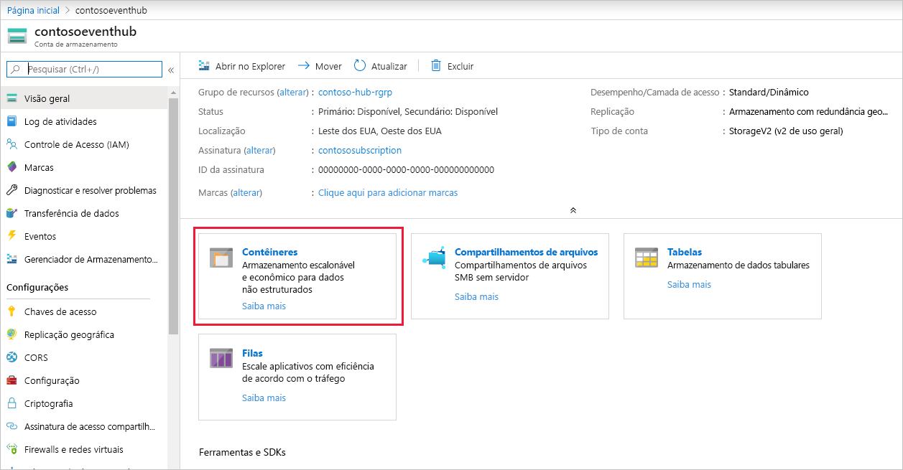
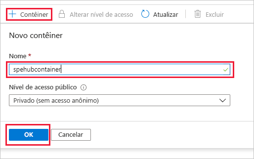

### Criar uma conta de armazenamento para o Host do Processador de Eventos
O Host do Processador de Eventos é um agente inteligente que simplifica o recebimento de eventos de hubs de eventos ao gerenciar pontos de verificação persistentes e recebimentos paralelos. Para o ponto de verificação, o Host do Processador de Eventos requer uma conta de armazenamento. O exemplo a seguir mostra como criar uma conta de armazenamento e como obter suas chaves de acesso:

1. No menu do portal do Azure, selecione **Criar um recurso**.

    

2. Selecione **Armazenamento** > **Conta de armazenamento**.
   
    

3. Na página **Criar conta de armazenamento**, execute as etapas a seguir: 

   1. Insira o **Nome da conta de armazenamento**.
   2. Escolha uma **Assinatura** do Azure que contém o hub de eventos.
   3. Escolha ou crie o **Grupo de recursos** que tem o hub de eventos.
   4. Selecione um **Local** no qual criar o recurso. 
   5. Selecione **Examinar + criar**.
   
        

4. Na página **Revisar + criar**, revise os valores e selecione **Criar**. 

    
5. Depois de ver a mensagem **Implantações concluídas com sucesso** em suas notificações, selecione **Ir para recurso** para abrir a página da Conta de armazenamento. Como alternativa, você poderá expandir **Detalhes da implantação** e, em seguida, selecionar seu novo recurso na lista de recursos.  

     
6. Selecione **Contêineres**.

    
7. Selecione **+ Contêiner** na parte superior, insira um **Nome** para o contêiner e selecione **OK**. 

    
8. Escolha **Chaves de acesso** no menu de página da **Conta de armazenamento** e copie o valor de **key1**.

    Salve esses valores no Bloco de notas ou em outro local temporário.
    - Nome da conta de armazenamento
    - Chave de acesso da conta de armazenamento
    - Nome do contêiner
