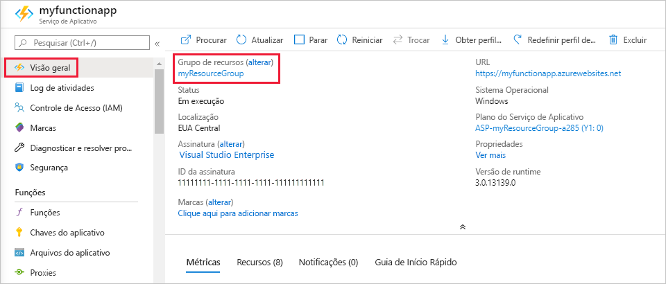

1. No Visual Studio Code, pressione F1 para abrir a paleta de comandos. Na paleta de comandos, pesquise e selecione `Azure Functions: Open in portal`.

1. Escolha seu aplicativo de funções e pressione Enter. A página do aplicativo de funções é aberta no [portal do Azure](https://portal.azure.com).

1. Na guia **Visão geral**, selecione o link nomeado em **Grupo de Recursos**.

    

1. Na página **Grupo de recursos**, examine a lista de recursos incluídos e verifique se eles são aqueles que deseja excluir.
 
1. Selecione **Excluir grupo de recursos** e siga as instruções.

   A exclusão poderá levar alguns minutos. Ao ser concluída, uma notificação será exibida por alguns segundos. Também é possível selecionar o ícone de sino na parte superior da página para exibir a notificação.