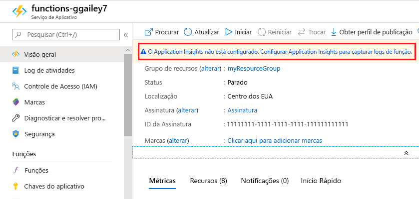
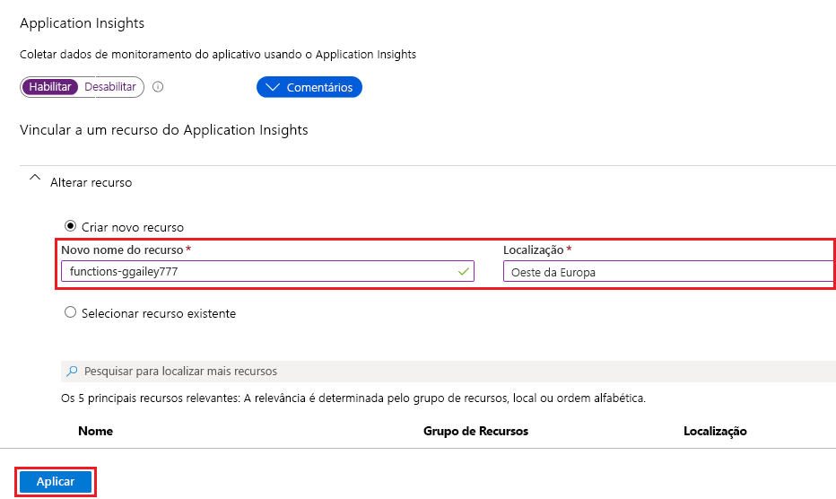

As funções facilitam a adição da integração do Application Insights a um aplicativo de funções do [portal do Azure].

1. No portal do [portal][do Azure], `Function Apps` digite na barra de pesquisa na parte superior da página, escolha seu aplicativo de funções e, em seguida, selecione a faixa **Application insights não está configurada** na parte superior da janela. Se você não vir essa faixa, seu aplicativo já terá Application Insights habilitado.

    

1. Crie um recurso do Application Insights usando as configurações especificadas na tabela abaixo da imagem.

   

    | Configuração      | Valor sugerido  | Descrição                                        |
    | ------------ |  ------- | -------------------------------------------------- |
    | **Nome** | Nome de aplicativo exclusivo | É mais fácil usar o mesmo nome que seu aplicativo de funções, que deve ser exclusivo em sua assinatura. | 
    | **Local** | Europa Ocidental | Se possível, use a mesma [região](https://azure.microsoft.com/regions/) que seu aplicativo de funções ou uma região próxima dela. |

1. Selecione **OK**. O recurso do Application Insights é criado no mesmo grupo de recursos e assinatura que seu aplicativo de funções. Depois que o recurso for criado, feche a janela do Application Insights.

1. No aplicativo de funções, selecione **Configurações do aplicativo** e role para baixo até **Configurações do aplicativo**. Se você vir uma configuração chamada `APPINSIGHTS_INSTRUMENTATIONKEY`, isso significa que a integração do Application Insights está habilitada para seu aplicativo de funções em execução no Azure.

[Portal do Azure]: https://portal.azure.com
